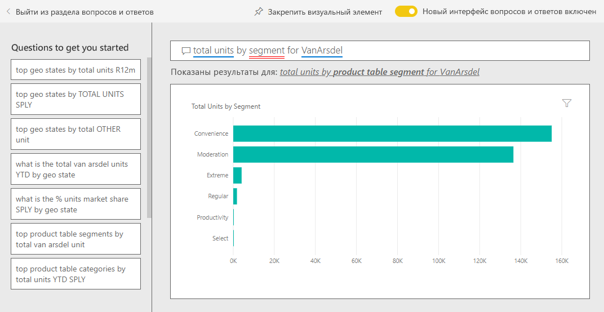
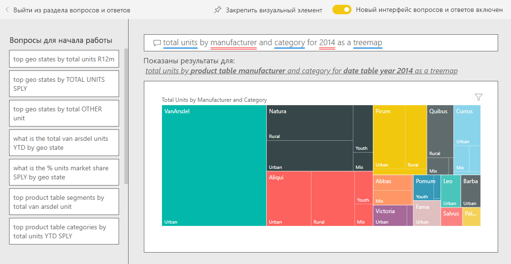
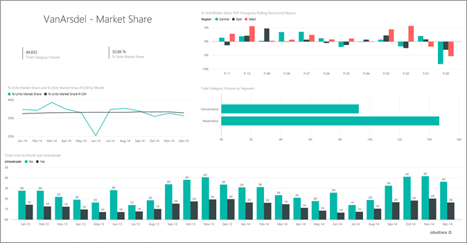
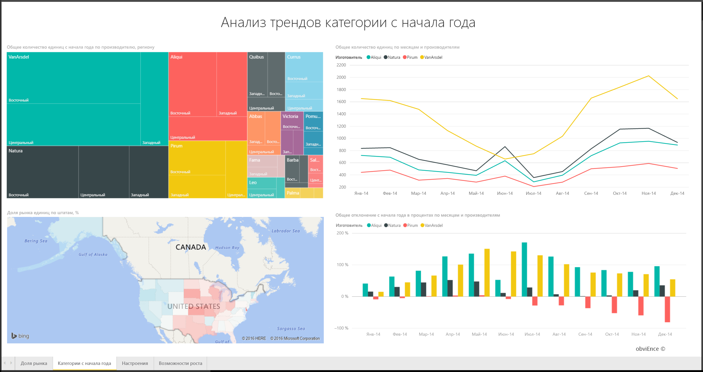
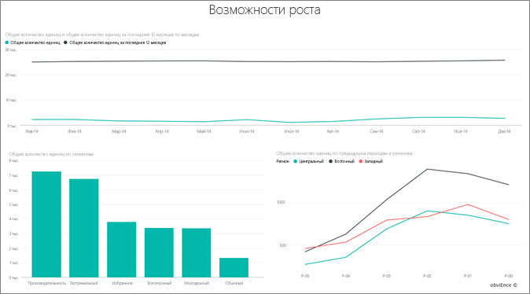

# Пример "Продажи и маркетинг" для Power BI: Узнайте о возможностях

Пример "Продажи и маркетинг" содержит панель мониторинга и отчет для вымышленной производственной компании VanArsdel Ltd. Эта панель мониторинга была создана руководителем отдела маркетинга VanArsdel (CMO) для отслеживания доли рынка, объема продукции, продаж и потребительских мнений.

У VanArsdel много конкурентов, однако компания является лидером рынка в отрасли. Руководитель отдела маркетинга хочет увеличить долю рынка и найти новые возможности для получения прибыли. Но по неизвестным причинам рыночная доля компании начала уменьшаться, существенно сократившись в июне.

Этот пример входит в серию, демонстрирующую, как использовать Power BI с бизнес-данными, отчетами и панелями мониторинга. Он создан на основе реальных данных [obviEnce](http://www.obvience.com/), которые были анонимизированы. Данные доступны в нескольких форматах: пакет содержимого, PBIX-файл Power BI Desktop или книга Excel. См. сведения в статье [Примеры данных, доступные для использования в службе Power BI](sample-datasets.md). 

В этом руководстве описано, как использовать пакет содержимого "Продажи и маркетинг — пример" в службе Power BI. Так как в Power BI Desktop и службе возможности работы с отчетами практически не отличаются, этот же пример PBIX-файла можно использовать и в Power BI Desktop. 

Вам не требуется лицензия Power BI для просмотра примеров в Power BI Desktop. Если у вас нет лицензии Power BI Pro, можно сохранить пример в личную рабочую область в службе Power BI. 

## Получение примера

Прежде чем использовать пример, необходимо скачать его как [пакет содержимого](#get-the-content-pack-for-this-sample), [PBIX-файл](#get-the-pbix-file-for-this-sample) или [книгу Excel](#get-the-excel-workbook-for-this-sample).

### Получение пакета содержимого для этого примера

1. Откройте службу Power BI (app.powerbi.com), войдите в систему и откройте рабочую область, где хотите сохранить пример.

   Если у вас нет лицензии Power BI Pro, можно сохранить пример в личной рабочей области.

2. В левом нижнем углу выберите **Получить данные**.
   
   
3. На странице **Получение данных** выберите **Примеры**.
   
4. Выберите **Продажи и маркетинг — пример**, затем выберите **Подключиться**.   
  
   
   
5. Power BI импортирует пакет содержимого и добавляет новую панель мониторинга, отчет и набор данных в текущую рабочую область.
   
   
  
### Получение PBIX-файла для этого примера

Также вы можете скачать "Продажи и маркетинг — пример" в виде [PBIX-файла](https://download.microsoft.com/download/9/7/6/9767913A-29DB-40CF-8944-9AC2BC940C53/Sales%20and%20Marketing%20Sample%20PBIX.pbix), который предназначен для работы с Power BI Desktop.

### Получение книги Excel для этого примера

Если вы хотите просмотреть источник данных для этого примера, он также доступен в виде [книги Excel](https://go.microsoft.com/fwlink/?LinkId=529785). Книга содержит листы Power View, которые можно просматривать и изменять. Чтобы просмотреть необработанные данные, включите надстройки анализа данных и выберите **Power Pivot > Управление**. Чтобы включить надстройки Power View и Power Pivot, перейдите к разделу [Просмотр примеров Excel непосредственно из Excel](sample-datasets.md#explore-excel-samples-inside-excel).

## Какие данные отображаются на информационной панели?
Начнем обзор с информационной панели и посмотрим на плитки, закрепленные руководителем. Мы видим сведения о доле на рынке, продажах и мнениях. Данные разбиты по региону, времени и конкуренции.

* Цифры на плитках в левом столбце демонстрируют объем продаж в отрасли за прошлый год (50 000), долю на рынке (32,86 %), объем продаж (16 000), показатель мнений (68), спад мнений (4) и общее число проданных единиц (1 млн).
* На верхнем графике (**доля рынка единиц в процентах против доли рынка единиц в процентах за скользящий год**) показано изменение доли рынка с течением времени. Обратите внимание на большой спад в июне. Начинает останавливаться незначительный рост нашей доли рынка за скользящий год (R12M).
* Как видно в среднем столбце диаграммы, самым крупным конкурентом компании является Aliqui (**Общее отклонение с начала года в %** ).
* Большая часть бизнеса ведется в восточном и центральном регионах.
* График в нижней части (**Всего единиц в 2014**) показывает, что снижение в июне не является сезонным, так как подобная тенденция не наблюдается ни у одного из конкурентов.
* На плитках **Всего единиц** и **Общее количество единиц с начала года** отображается количество проданного товара по сегменту и региону или производителю. Самыми крупными отраслевыми сегментами рынка являются **Производительность** и **Удобства**.

## Использование вопросов и ответов для более подробного изучения ситуации

С помощью функции вопросов и ответов вы можете получить дополнительные сведения из данных.

### Какие сегменты способствуют увеличению продаж? Соответствуют ли они отраслевой тенденции?
1. Выберите плитку **Общее количество единиц по сегментам**, после чего откроется поле вопросов и ответов, где указан запрос *общее количество единиц по сегментам*.
2. В конце существующего запроса добавьте *для VanArsdel*. Вопрос будет интерпретирован и будет отображена диаграмма, обновленная согласно ответу. Обратите внимание, что источниками основного объема продукции являются категории **Удобство** и **Умеренность**.

   
3. Доля в категориях **Умеренность** и **Удобство** высока — это сегменты, в которых мы конкурируем.
4. Вернитесь на панель мониторинга, выбрав пример **Продажи и маркетинг — пример** в области навигации сверху.

### Что собой представляет доля общего количества единиц на рынке для категории (по сравнению с регионом)?
1. Посмотрите на плитку **Общее количество единиц с начала года по производителю, региону**. Какова доля общего числа единиц на рынке по категории?

   
2. В поле вопроса вверху панели мониторинга введите запрос на вывод *общего числа единиц по производителю и категории в 2014 году в виде диаграммы "дерево"* . Обратите внимание на обновление визуализации по мере ввода вопроса.

   
3. Чтобы сравнить результаты, закрепите диаграмму на информационной панели. Обратите внимание на этот интересный факт: в 2014 году компания VanArsdel продавала только продукцию в категории **Городской стиль**.
4. Вернитесь на панель мониторинга.

## Отчет "Продажи и маркетинг — пример"

Панели мониторинга также являются точками входа в отчеты. Если плитка была создана из базового отчета, после ее выбора открывается отчет.

На нашей панели мониторинга в строке **доли рынка единиц в процентах за скользящий год** диаграммы с **долей рынка единиц в процентах против доли рынка единиц в процентах за скользящий год** указано, что доля рынка больше не увеличивается с течением времени. Она даже немного снижается. С чем связано значительное сокращение доли рынка в июне? 

Отчет "Продажи и маркетинг — пример" содержит четыре страницы.
 
### Страница "VanArsdel — доля рынка"
На первой странице отчета анализируется рыночная доля VanArsdel.

1. На панели мониторинга выберите диаграмму с **долей рынка единиц в процентах против доли рынка единиц в процентах за скользящий год**, чтобы открыть страницу **VanArsdel — доля рынка** отчета "Продажи и маркетинг — пример".

   

2. Взгляните на гистограмму **Общее количество число единиц по месяцу и isVanArsdel** в нижней части отчета. Столбец черного цвета отображает продукты VanArsdel (наши продукты), а зеленого — продукты конкурентов. Снижение в июне 2014 года, которое произошло для VanArsdel, не наблюдалось у конкурентов.

3. Справа находится линейчатая диаграмма **Общий объем категории по сегменту**, которая отфильтрована для отображения двух основных сегментов VanArsdel. Рассмотрим, как был создан этот фильтр.  

   а. Выберите диаграмму **Общий объем категории по сегменту**.

   б. Выберите панель **Фильтры** справа, чтобы развернуть ее.  

   в. Обратите внимание, что **Сегмент** в группе **Фильтры уровня визуальных элементов** отфильтрован так, чтобы включать только сегменты **Удобства** и **Умеренность**.  

   г. Измените фильтр, выбрав **Сегмент**, чтобы развернуть этот раздел, а затем выберите **Производительность** для добавления этого сегмента.  

4. В условных обозначениях диаграммы **Общее количество число единиц по месяцу и isVanArsdel** выберите **Да**, чтобы выполнить перекрестную фильтрацию страницы по VanArsdel. На диаграмме **Общий объем категории по сегменту** видно, что конкуренция в сегменте **Производительность** отсутствует.

5. Еще раз выберите **Да** в условных обозначениях, чтобы удалить фильтр.

6. Просмотрите график **доли рынка единиц в процентах и доли рынка единиц в процентах за скользящий год по месяцам**. На нем отображается ежемесячная доля на рынке и доли за скользящий год. Показатели за скользящий год сглаживают ежемесячные колебания и демонстрируют долгосрочные тенденции. На линейчатой диаграмме **Общий объем категории по сегменту** выберите **Удобство** и затем **Умеренность**, чтобы увидеть колебания доли на рынке по каждому сегменту. Обратите внимание, что в сегменте **Умеренность** гораздо больше колебаний доли на рынке.

Нам по-прежнему нужно выяснить причину сокращения рыночной доли в июне. А теперь давайте проверим страницу отчета **Анализ тональности**.

### Страница "Анализ тональности"
На третьей странице отчета рассматриваются мнения потребителей.

Твиты, сообщения в Facebook, блоги и статьи оказывают влияние на формирование мнений у потребителей, как показано на двух графиках в левой части страницы. На графике **Настроения в компании VanArsdel по месяцам** в левом верхнем углу видно, что мнения по нашим продуктам были в основном нейтральными вплоть до февраля. С февраля началось значительное снижение, которое длилось до июня. Что послужило причиной спада положительных отзывов? 

Давайте обратимся к внешним источникам. В феврале появилось несколько статей и записей блогов, в которых качество обслуживания клиентов в VanArsdel характеризовалось как худшее в отрасли. Эти негативные отзывы в прессе были напрямую связаны с мнениями клиентов и объемом продаж. Компания VanArsdel приложила максимум усилий, чтобы улучшить обслуживание клиентов, и отрасль учла это. В июле количество положительных отзывов стало расти и достигло рекордно высокого уровня в 60. Этот всплеск отражен на диаграммах **Общее количество единиц по месяцам** на первой и второй страницах отчета. Возможно, это частично объясняет сокращение доли на рынке в июне?

Следующим направлением для изучения будет разрыв или спад во мнениях. В каких районах наблюдается наибольший спад, каким образом из этого можно извлечь выгоду и как воспроизвести это в других районах?

### Страница "Анализ трендов категории с начала года"
Вторая страница отчета посвящена тенденции по категории с начала года.

Обратите внимание на следующие сведения:
* VanArsdel является самой крупной из всех компаний в этой категории. Ее основными конкурентами выступают Natura, Aliqui и Pirium. Рассмотрим их подробнее.
* Компания Aliqui увеличивает рост прибыли, но показатель объема продуктов по сравнению с нашим по-прежнему остается низким.
* На диаграмме-дереве компания VanArsdel показана зеленым цветом. В восточном регионе клиенты предпочитают наших конкурентов, а вот в центральном регионе дела у нас идут хорошо. В восточном регионе наша доля минимальна.
* География оказывает влияние на количество проданных единиц. Восточный регион является основным для большинства производителей, и VanArsdel также прочно присутствует в центральном регионе.
* На диаграмме **Общее отклонение с начала года в процентах по месяцам и производителям** в правой нижней части присутствует положительное отклонение, и это хороший знак. В этом году дела идут лучше, чем в прошлом, однако то же самое можно сказать и о нашем конкуренте Aliqui

### Страница "Возможности роста"
Четвертая страница отчета посвящена конкурентному анализу продуктов.

Обратите внимание на следующие сведения:
* В левой нижней части на диаграмме **Общее количество единиц по сегментам** показаны все сегменты категории, за исключением двух самых сильных сегментов VanArsdel. По очереди выберите каждый из сегментов, чтобы определить потенциальные направления расширения для VanArsdel. 
* Обратите внимание, что сегменты **Экстремальный стиль** и **Производительность** растут быстрее других. Но мы не конкурируем в этих сегментах. Чтобы охватить их, с помощью имеющихся данных можно узнать, какие сегменты популярны в определенных регионах. Мы можем продолжить изучение вопросов, касающихся самого быстро развивающегося региона и основного конкурента в этом сегменте.
* Помните сокращение доли рынка в июне? Июнь является значимым месяцем для сегмента **Производительность**, в котором мы не конкурируем. Это может объяснить сокращение доли рынка в июне.

С помощью фильтрации визуализаций по VanArsdel, по сегменту, по месяцу и по региону можно выяснить возможности роста для VanArsdel.

## Дальнейшие действия: Подключение к данным
В этой среде можно свободно экспериментировать, так как сохранять изменения не требуется. Однако если изменения сохраняются, всегда можно выбрать функцию **Получить данные** для получения новой копии этого примера.

Мы надеемся, что в этом обзоре вы узнали, каким образом с помощью панелей мониторинга, вопросов и ответов и отчетов можно получить представление о данных по персоналу. Теперь ваша очередь — выполните подключение к собственным данным. С помощью Power BI можно подключаться ко многим типам источников данных. Дополнительные сведения см. в руководстве по [началу работы со службой Power BI](../fundamentals/service-get-started.md).
