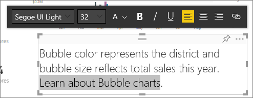
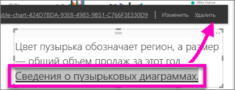

# Добавление гиперссылки в текстовое поле в отчете
В Power BI Desktop или службу Power BI можно добавить текстовое поле в отчет. Можно закрепить текстовое поле из отчета на панели мониторинга или добавить его непосредственно на панель мониторинга. Если есть текстовое поле, вы всегда можете добавить к нему гиперссылку. В этой статье описывается добавление гиперссылки в текстовое поле в отчете. 

Смотрите, как Уилл Томсон создает текстовое поле и добавляет в него гиперссылку. 

<iframe width="560" height="315" src="https://www.youtube.com/embed/_3q6VEBhGew#t=0m55s" frameborder="0" allowfullscreen></iframe>

Сведения о гиперссылках в таблицах и матрицах Power BI см. в статье [Добавление гиперссылок в таблицу](power-bi-hyperlinks-in-tables.md). Сведения о добавлении текстовых полей на панель мониторинга см. в статье [Добавление изображений, видео и другого содержимого на панель мониторинга](service-dashboard-add-widget.md). 

## Добавление гиперссылки в текстовое поле
1. Откройте отчет, [создайте текстовое поле](power-bi-reports-add-text-and-shapes.md) и добавьте текст. 
2. Выделите существующий текст или добавьте новый текст для использования в качестве гиперссылки. 

   Откроется меню текстового поля.
   
   
3. Выберите значок гиперссылки  в меню текстового поля.

   Поле гиперссылки появится в меню текстового поля.

4. Введите или вставьте URL-адрес в поле гиперссылки и нажмите кнопку **Готово**.
   
   
5. Проверьте ссылку:  

   а) Поместите курсор в любом месте в новой гиперссылке в текстовом поле, чтобы отобразить URL-адрес в поле гиперссылки.  
     
      
   
      

   б) Выберите URL-адрес в поле гиперссылки, чтобы открыть страницу в новом окне браузера.

## Удаление гиперссылки
1. В текстовом поле выберите гиперссылку, чтобы выделить ее.
   
     
2. В меню текстового поля выберите **Удалить**. 

   Power BI Desktop удаляет гиперссылку, но оставляет текст.

## Дальнейшие действия
[Текстовые поля и фигуры в отчетах Power BI](power-bi-reports-add-text-and-shapes.md)

У вас имеются и другие вопросы? [Ответы на них см. в сообществе Power BI](https://community.powerbi.com/).

