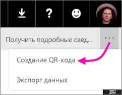
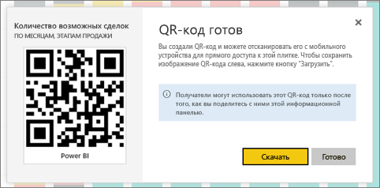

# Создание QR-кода для плитки в Power BI для использования в мобильных приложениях
QR-коды в Power BI могут связывать любой физический предмет с соответствующей информацией BI &#151; навигация или поиск не требуются.

QR-код можно создавать в службе Power BI для плиток на любой панели мониторинга, даже недоступной для редактирования. Созданный QR-код необходимо поместить в ключевое расположение. Например, его можно вставить в сообщение электронной почты либо распечатать и вставить в определенное место. 

Коллеги, которым вы предоставили доступ к панели мониторинга, могут [просканировать QR-код и получить доступ к соответствующей плитке прямо с мобильного устройства](../consumer/mobile/mobile-apps-qr-code.md). Для этого можно использовать сканер QR-кодов в приложении Power BI или любой другой установленный на устройстве QR-сканер.

## Создание QR-кода для плитки
1. Откройте панель мониторинга в службе Power BI.
2. Щелкните **Дополнительные параметры** (...) в правом верхнем углу плитки и выберите **Режим фокусировки** .
3. Щелкните **Дополнительные параметры** (...) в правом верхнем углу и выберите команду **Создать QR-код**. 
   
    
4. Откроется диалоговое окно с QR-кодом. 
   
    
5. Здесь можно отсканировать QR-код либо загрузить его, сохранить, а затем: 
   
   * вставить в сообщение электронной почты или другой документ; либо 
   * распечатать и поместить в определенное место. 

## Печать QR-кода
Power BI создает QR-код в виде JPG-файла, готового к печати. 

1. Выберите **Загрузить**, а затем откройте JPG-файл на компьютере, подключенном к принтеру.  
   
   > [!TIP]
   > Имя JPG-файла совпадает с именем плитки. например "Opportunity Count - by Month, Sales Stage.jpg".
   > 
   > 
2. Распечатайте файл в 100%-ном, или фактическом, размере.  
3. Вырежьте QR-код и приклейте его в соответствующее плитке место. 

## Дальнейшие действия
* [Подключение к данным Power BI из реального мира](../consumer/mobile/mobile-apps-data-in-real-world-context.md) с помощью мобильных приложений
* [Сканирование QR-кода Power BI из iPhone](../consumer/mobile/mobile-apps-qr-code.md)
* [Создание QR-кода для отчета в Power BI](service-create-qr-code-for-report.md)
* У вас появились вопросы? [Попробуйте задать вопрос в сообществе Power BI.](https://community.powerbi.com/)
