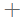

# <a name="add-images-videos-and-more-to-your-dashboard"></a>Добавление изображений, видео и другого содержимого на панель мониторинга

Добавив плитку на панель мониторинга, можно поместить изображение, текстовое поле, видео, потоковую передачу данных или веб-код на панель мониторинга. 

Смотрите, как Аманда добавляет плитки на панель мониторинга.

   
<iframe width="560" height="315" src="https://www.youtube.com/embed/e2PD8m1Q0vU" frameborder="0" allowfullscreen></iframe>


## <a name="add-an-image-video-or-other-tile"></a>Добавление изображения, видео или другой плитки
Вы можете напрямую добавлять изображение, текстовое поле, видео, потоковую передачу данных или веб-код на панель мониторинга.

1. В верхней части строки меню на панели мониторинга выберите **Добавить плитку**. В связи с ограниченным пространством вы можете увидеть только знак "плюс" .
   
    
2. Выберите добавляемую плитку: 

    **[Веб-содержимое](#add-web-content)**

    **[Изображение](#add-an-image)**

    **[Текстовое поле](#add-a-text-box-or-dashboard-heading)**

    **[Видео](#add-a-video)**

    **[Пользовательские данные потоковой передачи](#add-streaming-data)**
   
    

## <a name="add-an-image"></a>Добавление изображения
Если вы хотите добавить логотип компании или другие изображение на панель мониторинга, сохраните файл изображения в сети и привяжите его. Убедитесь, что для доступа к файлу изображения не нужны специальные учетные данные. Например, для OneDrive и SharePoint требуется проверка подлинности, поэтому изображения, хранящиеся в этих службах, нельзя добавить на панель мониторинга таким способом.  

1. В окне **Добавить плитку** выберите **Изображение** > **Далее**.

2. В окне **Добавить плитку изображения** добавьте сведения об изображении:   
   
   а) Чтобы отобразить заголовок над изображением, выберите **Показать заголовок и подзаголовок** и введите **заголовок** и **подзаголовок** (необязательно).

   б) Введите **URL-адрес** изображения.

   c. Чтобы сделать плитку гиперссылкой, выберите **Задать пользовательскую связь** и введите **URL-адрес**. 

      Когда коллеги щелкнут это изображение или заголовок, они будут перенаправлены на этот URL-адрес.

   г) Нажмите кнопку **Применить**. 

      

3. На информационной панели измените размер изображения или переместите его (если необходимо).
     
     

## <a name="add-a-text-box-or-dashboard-heading"></a>Добавление текстового поля или заголовка панели мониторинга

Чтобы добавить заголовок панели мониторинга, введите его в текстовом поле и увеличьте шрифт.

1. В окне **Добавить плитку** выберите **Текстовое поле** > **Далее**.

2. Форматирование текстового поля.
   
   а) Чтобы отобразить заголовок над текстовым полем, выберите **Показать заголовок и подзаголовок** и введите **заголовок** и **подзаголовок** (необязательно).

   б) Введите и отформатируйте **содержимое** текстового поля.  

   c. При необходимости задайте настраиваемую ссылку для заголовка. Настраиваемая ссылка может указывать на внешний сайт, панель мониторинга или отчет в рабочей области. Но в этом примере мы добавили гиперссылки в самом текстовом поле, поэтому флажок **Задать настраиваемую ссылку** не будет установлен.

   г) Нажмите кнопку **Применить**. 

     
   
3. На информационной панели измените размер текстового поля или переместите его (если необходимо).
   
   

## <a name="add-a-video"></a>Добавление видео
Плитка с видео YouTube или Vimeo, добавленная на панель мониторинга, воспроизводится прямо на ней.

1. В окне **Добавить плитку** выберите **Видео** > **Далее**.
2. Добавьте сведения о видео в окно **Добавить плитку для видео**:   
   
   а) Чтобы отобразить заголовок и подзаголовок над плиткой с видео, выберите **Показать заголовок и подзаголовок** и введите **заголовок** и **подзаголовок** (необязательно). В этом примере мы добавим **подзаголовок**, а затем преобразуем его в гиперссылку на весь список воспроизведения на YouTube.

   б) Введите **URL-адрес видео**.

   c. Добавьте гиперссылку для **заголовка** и **подзаголовка**, чтобы ваши коллеги могли просматривать весь список воспроизведения на YouTube после просмотра внедренного видео. Для этого в разделе **Функции** выберите **Задать пользовательскую ссылку**, а затем введите **URL-адрес** списка воспроизведения.

   г) Нажмите кнопку **Применить**.  

   

3. На информационной панели измените размер видео или переместите его (если необходимо).
     
   
4. Выберите плитку с видео для воспроизведения видеоролика.
5. Выберите подзаголовок для переключение на список воспроизведения на YouTube.

## <a name="add-streaming-data"></a>Добавление данных потоковой передачи
PubNub можно использовать для добавления потоковых данных, таких как каналы Twitter или данные датчика, на плитку на панели мониторинга. Служба Power BI создала интеграцию для получения данных из PubNub. Здесь Уилл объясняет, как это работает.
   

<iframe width="560" height="315" src="https://www.youtube.com/embed/kOuINwgkEkQ" frameborder="0" allowfullscreen></iframe>

1. В окне **Добавить плитку** выберите **Пользовательские данные потоковой передачи** > **Далее**.
2. Выберите **Добавить набор данных потоковой передачи**.
3. Создайте **новый набор данных потоковой передачи** с помощью API Power BI или PubNub.
4. Заполните поля **Имя набора данных**, **Ключ подписки** и **Имя канала**. Если это безопасное подключение, оно также имеет ключ авторизации. Вы можете использовать примеры значений из PubNub, чтобы испытать их.
5. Нажмите кнопку **Далее**.
    Вы увидите поля, доступные в наборе данных, с типами данных и форматом JSON.
6. Выберите команду **Создать**.
    Вы создали набор данных потоковой передачи.
7. Вернитесь на панель мониторинга и снова выберите **Добавить плитку** > **Пользовательские данные потоковой передачи** > **Далее**.
8. Выберите созданный набор данных датчика и нажмите **Далее**.
9. Выберите нужный шаблон визуализации. Зачастую для этих данных хорошо подходит график.
10. Выберите **Ось**, **Легенда** и **Значения**.
11. Определите период времени, который требуется отобразить, в секундах, минутах или часах.
12. Нажмите кнопку **Далее**.
13. Укажите **Заголовок** и **Подзаголовок**, если хотите.
14. Закрепите на панели мониторинга.


1. В окне **Добавить плитку** выберите **Пользовательские данные потоковой передачи** > **Далее**.

2. Выберите **Добавить набор данных потоковой передачи**.

3. Создайте **новый набор данных потоковой передачи** с помощью API Power BI или PubNub.

4. Заполните поля **Имя набора данных**, **Ключ подписки** и **Имя канала**. Если это безопасное подключение, оно также имеет ключ авторизации. Вы можете использовать примеры значений из PubNub, чтобы испытать их.

5. Нажмите кнопку **Далее**.

   Вы увидите поля, доступные в наборе данных, с типами данных и форматом JSON.

6. Выберите команду **Создать**.

   Вы создали набор данных потоковой передачи.

7. Вернитесь на панель мониторинга и снова выберите **Добавить плитку** > **Пользовательские данные потоковой передачи** > **Далее**.

8. Выберите созданный набор данных датчика и нажмите **Далее**.

9. Выберите нужный шаблон визуализации. Зачастую для этих данных хорошо подходит график.

10. Выберите **Ось**, **Легенда** и **Значения**.

11. Определите период времени, который требуется отобразить, в секундах, минутах или часах.

12. Нажмите кнопку **Далее**.

13. При желании укажите **Заголовок** и **Подзаголовок**.

14. Закрепите на панели мониторинга.

## <a name="add-web-content"></a>Добавление веб-содержимого
Вы можете вставить или ввести любое HTML-содержимое как плитку в отчет или панель мониторинга. Введите код внедрения вручную или скопируйте его с сайтов, таких как Twitter, YouTube, embed.ly и многих других.

1. В окне **Добавить плитку** выберите **Веб-содержимое** > **Далее**.

2. Добавьте данные в окне **Добавить плитку веб-содержимого**:
   
   а) Чтобы отобразить заголовок над плиткой, выберите **Показать заголовок и подзаголовок** и введите **заголовок** и **подзаголовок** (необязательно).

   б) Введите код внедрения. В этом примере мы копируем канал Twitter.

   c. Нажмите кнопку **Применить**.

   
   

3. На информационной панели измените размер плитки с веб-содержимым или переместите ее (если необходимо).
     
   

### <a name="tips-for-embedding-web-content"></a>Советы по внедрению веб-содержимого
* Для элементов IFrame используйте безопасный источник. Если при вводе кода внедрения элемента IFrame вы получаете пустую плитку, проверьте, не используется ли для источника IFrame протокол *http*. Если это так, измените его на *https*.
  
  ```html
  <iframe src="https://xyz.com">
  ```
* Измените ширину и высоту. Этот код внедрения внедряет видео и устанавливает размер видеопроигрывателя 560 x 315 пикселей. Этот размер останется прежним при изменении размеров плитки.
  
  ```html
  <iframe width="560" height="315"
  src="https://www.youtube.com/embed/Cle_rKBpZ28" frameborder="0"
   allowfullscreen></iframe>
  ```
  
  Если вы хотите, чтобы проигрыватель масштабировался в соответствии с размером плитки, задайте ширину и высоту равными 100 %.
  
  ```html
  <iframe width="100%" height="100%"
  src="https://www.youtube.com/embed/Cle_rKBpZ28" frameborder="0"
   allowfullscreen></iframe>
  ```
* Этот код внедряет твит и сохраняет, в виде отдельных ссылок на панели мониторинга, ссылки на подкаст AFK, страницу \@GuyInACube в Twitter, "Подписаться", #analytics, "Ответить", "Ретвитнуть" и "Нравится".  При выборе плитки открывается подкаст в Twitter.
  
  ```html
  <blockquote class="twitter-tweet" data-partner="tweetdeck">
  <p lang="en" dir="ltr">Listen to
  <a href="https://twitter.com/GuyInACube">@GuyInACube</a> talk to
  us about making videos about Microsoft Business Intelligence
  platform
  <a href="https://t.co/TmRgalz7tv">https://t.co/TmRgalz7tv </a>
  <a href="https://twitter.com/hashtag/analytics?src=hash">
  #analytics</a></p>&mdash; AFTK Podcast (@aftkpodcast) <a
  href="https://twitter.com/aftkpodcast/status/693465456531771392">
  January 30, 2016</a></blockquote> <script async src="//platform.twitter.com/widgets.js" charset="utf-8"></script>
  ```

## <a name="edit-a-tile"></a>Изменение плитки
Чтобы внести изменения в существующую плитку, выполните следующие действия:

1. Наведите указатель на правый верхний угол плитки и щелкните **Дополнительные параметры** (...).
   
    
2. Выберите **Изменить сведения**, чтобы отобразить окно **Сведения о плитке**, и внесите изменения.
   
    

## <a name="considerations-and-troubleshooting"></a>Рекомендации и устранение неполадок
* Чтобы упростить перемещение плитки на панели мониторинга, добавьте заголовок и подзаголовок по желанию.
* Если вы хотите внедрить содержимое с веб-сайта, однако этот сайт не предоставляет код внедрения, который можно было бы скопировать, обратитесь к embed.ly для создания кода внедрения.

## <a name="next-steps"></a>Дальнейшие действия
[Общие сведения о плитках панели мониторинга для разработчиков Power BI](service-dashboard-tiles.md)

У вас имеются и другие вопросы? [Ответы на них см. в сообществе Power BI](https://community.powerbi.com/).

