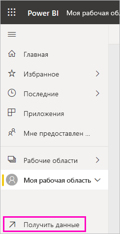
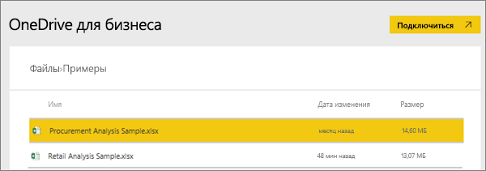
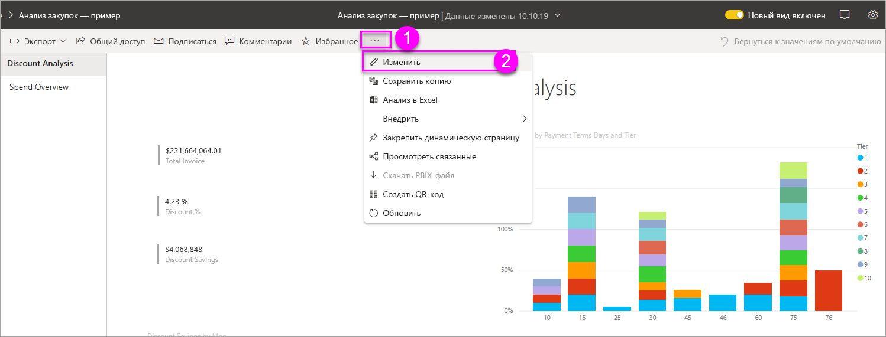
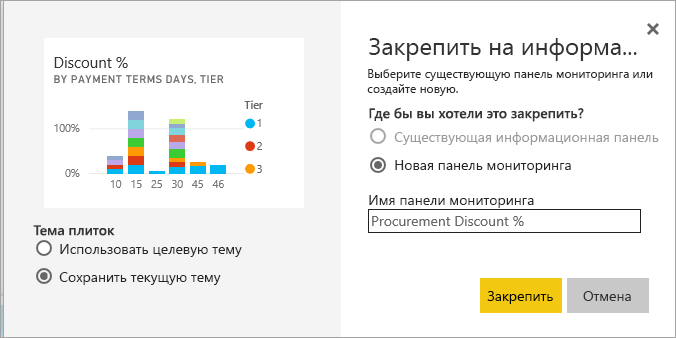
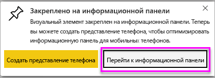
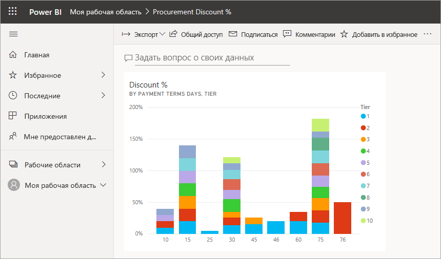
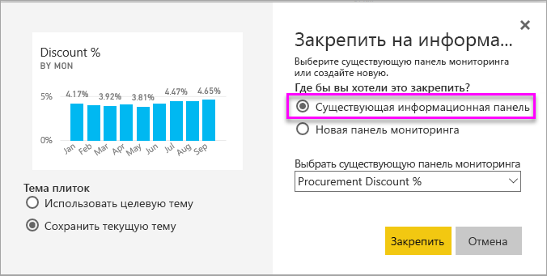
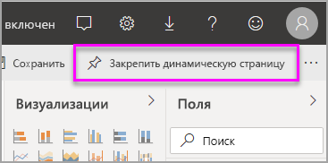
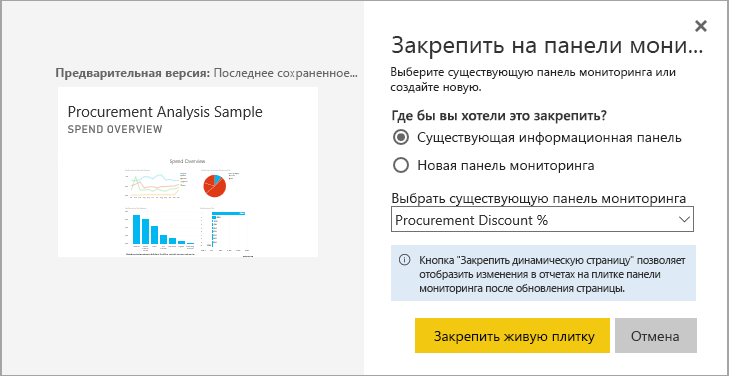
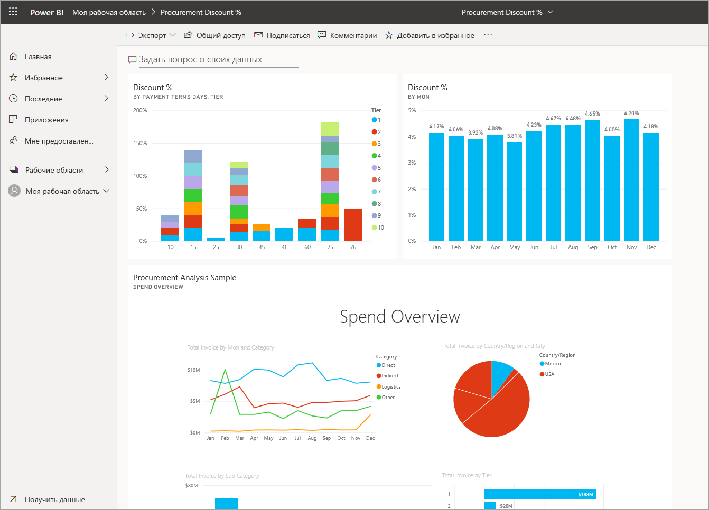

# Создание панели мониторинга Power BI из отчета
Вы прочитали раздел [Общие сведения о панелях мониторинга в Power BI](service-dashboards.md) и хотите попробовать свои силы в их создании. Существует много различных способов создания информационной панели. Например, вы можете создавать панели мониторинга на основе отчета, с нуля, из набора данных, с помощью дублирования существующей панели мониторинга и другими способами.  

Мы начнем с простого и быстрого создания панели мониторинга путем закрепления визуализаций из готового отчета. 

В рамках этой статьи вы изучите следующие вопросы.
- Связь между панелями мониторинга и отчетами
- Открытие представления редактирования в редакторе отчетов
- Закрепление плиток 
- Переход между панелью мониторинга и отчетом 
 

> [!NOTE] 
> Панели мониторинга — это компонент службы Power BI, а не Power BI Desktop. Нельзя создавать панели мониторинга в мобильных приложениях Power BI, однако [их можно просматривать и предоставлять к ним доступ](../consumer/mobile/mobile-apps-view-dashboard.md) в таких приложениях.
>
> 

## Видео. Создание панели мониторинга путем закрепления визуальных элементов и изображений из отчета
Посмотрите, как Аманда создает новую панель мониторинга с помощью закрепления визуализаций из отчета. Затем попробуйте сделать это самостоятельно, выполнив инструкции из следующего раздела, [Импорт набора данных с помощью отчета](#import-a-dataset-with-a-report), с использованием образца "Анализ закупок".
    

<iframe width="560" height="315" src="https://www.youtube.com/embed/lJKgWnvl6bQ" frameborder="0" allowfullscreen></iframe>

## Импорт набора данных с помощью отчета
В этом пошаговом руководстве мы импортируем один из примеров наборов данных Power BI и будем использовать его для создания панели мониторинга. Пример, который мы будем использовать, — это книга Excel с двумя листами PowerView. При импорте книги Power BI добавит в рабочую область набор данных, а также отчет. Отчет автоматически создается из листов PowerView.

1. Скачайте [образец файла Excel "Анализ закупок"](https://go.microsoft.com/fwlink/?LinkId=529784). Рекомендуется сохранить его в приложении OneDrive для бизнеса.
2. Откройте службу Power BI в браузере (app.powerbi.com).
3. В области навигации выберите **Моя рабочая область** и затем **Получить данные**.

    
5. В разделе **Файлы** выберите **Получить**.

   
6. Перейдите к расположению, в котором вы сохранили файл Excel с примером анализа закупок. Выберите файл и щелкните **Подключить**.

   
7. Для этого упражнения выберите **Импорт**.

    
8. Когда появится сообщение об успешном выполнении, щелкните **x**, чтобы закрыть его.

   

> [!TIP]
> Знаете ли вы? Вы можете уменьшить область навигации. Для этого щелкните значок с тремя линиями в верхней области навигации . Это даст больше места для самого отчета.

### Открытие отчета и закрепление плиток на панели мониторинга
1. В той же рабочей области перейдите на вкладку **Отчеты** и выберите **образец "Анализ закупок"** , чтобы открыть отчет.

     Отчет открывается в режиме чтения. Слева в отчете расположены две вкладки: **Discount Analysis** (Анализ скидок) и **Spend Overview** (Обзор затрат). Каждая вкладка представляет страницу отчета.

2. Выберите **Дополнительные параметры (...)**  > **Изменить отчет**, чтобы открыть свой отчет в режиме редактирования.

    
3. Наведите указатель мыши на визуализацию, чтобы отобразить доступные параметры. Чтобы добавить визуализацию на панель мониторинга, щелкните значок булавки. .

    
4. Так как мы создаем новую панель, выберите параметр **Новая панель мониторинга** и присвойте панели имя.

    
5. Когда вы выберете параметр **Закрепить**, Power BI создаст панель мониторинга в текущей рабочей области. Когда появится сообщение **Закрепление на панели мониторинга**, выберите **Перейти к панели мониторинга**. Если будет предложено сохранить отчет, выберите **Сохранить**.

    

    В Power BI откроется новая панель мониторинга. На ней будет представлена одна плитка (только что закрепленная визуализация).

   
7. Чтобы вернуться к отчету, щелкните плитку. Закрепите еще несколько плиток на новой панели мониторинга. Когда отобразится окно **Закрепление на панели мониторинга**, выберите вариант **Существующая панель мониторинга**.  

   

## Закрепление целой страницы отчета на панели мониторинга
Чтобы не закреплять по одному визуальному элементу, вы можете [закрепить целую страницу отчета в виде *живой плитки*](service-dashboard-pin-live-tile-from-report.md). Попробуем.

1. В редакторе отчетов выберите вкладку **Spend Overview** (Обзор затрат), чтобы открыть вторую страницу отчета.

   

2. Нам необходимо добавить на панель мониторинга все визуальные элементы в отчете. В правом верхнем углу строки меню выберите **Закрепление живой плитки**. На панели мониторинга динамические плитки страниц будут обновляться каждый раз при обновлении страницы.

   

3. Когда отобразится окно **Закрепление на панели мониторинга**, выберите вариант **Существующая панель мониторинга**.

   

4. Когда появится сообщение об успешном выполнении, щелкните **Перейти к панели мониторинга**. Вы увидите плитки, закрепленные из отчета. В приведенном ниже примере мы закрепили две плитки с первой страницы отчета и одну живую плитку, которая представляет собой вторую страницу отчета.

   

## Дальнейшие действия
Поздравляем с созданием первой панели мониторинга! Теперь, когда у вас есть панель мониторинга, вы можете выполнять разные операции. Ознакомьтесь с приведенными ниже статьями или изучите эти возможности самостоятельно: 

* [Изменение размеров и перемещение плиток](service-dashboard-edit-tile.md)
* [Все о плитках панелей мониторинга](service-dashboard-tiles.md)
* [Создание и распространение приложения в Power BI](../collaborate-share/service-create-workspaces.md)
* [Power BI — основные понятия](../fundamentals/service-basic-concepts.md)
* [Советы по созданию эффективной панели мониторинга Power BI](service-dashboards-design-tips.md)

Появились дополнительные вопросы? [Ответы на них см. в сообществе Power BI](https://community.powerbi.com/).
