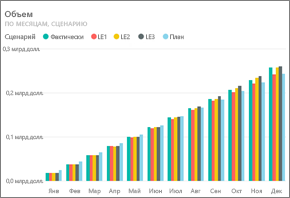
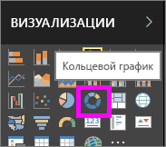
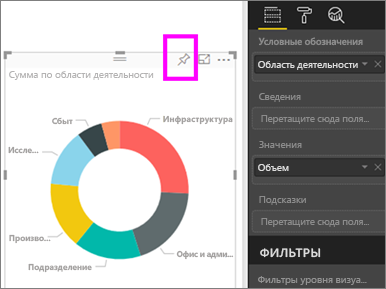
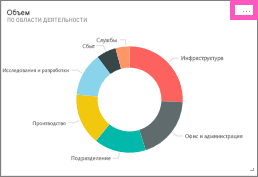
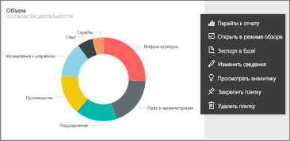
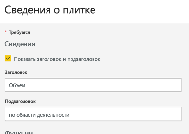
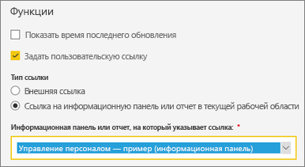
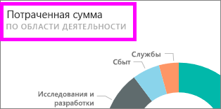
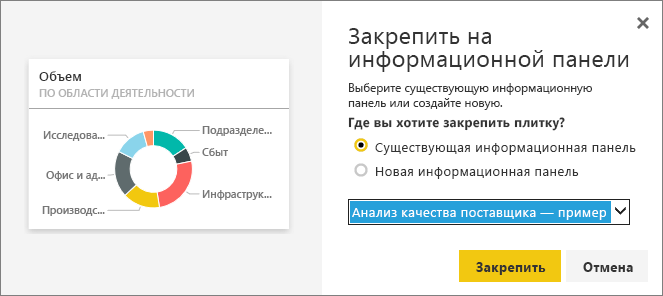

# Изменение и удаление плитки на информационной панели

## *Владельцы* и *потребители* панелей мониторинга
Создатель или владелец панели мониторинга может разными способами изменять внешний вид и стандартное поведение плиток на этой панели мониторинга. Описанные ниже параметры и стратегии позволяют настроить *использование* панели мониторинга для ваших коллег.  Что будет открывать ваша плитка: базовый отчет, пользовательский URL-адрес или другую панель мониторинга? Может быть, вы хотите [добавить плитку для видеоролика или потоковой передачи](service-dashboard-add-widget.md)? У вас даже есть возможность [создать плитку с интерактивными срезами](service-dashboard-pin-live-tile-from-report.md). *Создатель* может использовать разные варианты. 

<iframe width="560" height="315" src="https://www.youtube.com/embed/lJKgWnvl6bQ" frameborder="0" allowfullscreen></iframe>

В этой статье рассматриваются следующие темы.

* [Создание визуализации и закрепление ее на панели мониторинга](#create)
* [Перемещение плитки](#move)
* [Изменение размера плитки](#resize)
* [Переименование плитки](#rename)
* [Добавление гиперссылки в плитку](#hyperlink)
* [Закрепление плитки на другой информационной панели](#different)
* [Удаление плитки](#delete)
  
  > [!TIP]
  > Чтобы изменить визуализацию на самой плитке, удалите ее и добавьте новую [плитку панели мониторинга](../consumer/end-user-tiles.md).

  
## Технические условия
Чтобы перейти к выполнению руководства, откройте службу Power BI (не Power BI Desktop) и [скачайте пример "Анализ расходов на ИТ"](sample-it-spend.md). Когда появится сообщение об успешном выполнении, щелкните **Перейти к панели мониторинга**.

- - -

## Создание визуализации и закрепление ее на панели мониторинга
1. На панели мониторинга "Анализ расходов на ИТ" выберите плитку "Сумма", чтобы открыть отчет.

    

2. Перейдите в режиме редактирования отчета, выбрав пункт **Изменить отчет** в строке меню сверху.

3. Добавьте новую страницу отчета, выбрав значок "+" (плюс) в нижней части отчета.

    

4. На панели "Поля" выберите **Факт > Сумма** и **Область деятельности > Область деятельности**.
 
5. На панели "Визуализации" выберите значок кольцевой диаграммы, чтобы преобразовать визуализацию в кольцевую диаграмму.

    

5. Выберите значок булавки и закрепите кольцевую диаграмму на примере панели мониторинга "Анализ расходов на ИТ".

   

6. Когда появится сообщение об успешном выполнении, щелкните **Перейти к панели мониторинга**. Вам будет предложено сохранить изменения. Щелкните **Сохранить**.

- - -

## Перемещение плитки
Найдите новую плитку на панели мониторинга. Выберите и удерживайте плитку, чтобы перетащить ее на новое место в области информационной панели.

- - -

## Изменение размера плитки
Плитки могут быть самых разных размеров — от 1x1 единиц для 5x5. Щелкните и перетащите маркер (в правом нижнем углу), чтобы изменить размер плитки.

- - -
## Меню **Дополнительные параметры**

1. Щелкните **Дополнительные параметры** (...) в правом верхнем углу плитки. 
   
   

2. Наведите указатель мыши на плитку "Учетная запись" и щелкните многоточие, чтобы отобразить варианты действий. Доступные возможности зависят от типа плитки.  Например, варианты для активной плитки отличаются от тех, что доступны для стандартной плитки визуализации. Если панель мониторинга предоставлена вам другим лицом (то есть вы не являетесь владельцем), вариантов будет меньше.

   

3. Выберите **Изменить сведения**, чтобы открыть окно "Сведения о плитке". 

    Измените заголовок плитки и поведение по умолчанию.  Например, можно сделать так, чтобы при выборе плитки *потребитель* попадал не в отчет, для которого была создана эта плитка, а на новую панель мониторинга.  
   

### Переименование плитки
В верхней части окна "Сведения о плитке"в поле **Заголовок** введите **Потраченная сумма**.

### Изменение гиперссылки по умолчанию
Чаще всего используется режим по умолчанию, то есть при выборе плитки открывается отчет, в котором была создана плитка, или раздел вопросов и ответов (если плитка была создана в нем). Чтобы связать плитку с веб-страницей, другой панелью мониторинга или отчетом (в той же рабочей области), отчетом служб SSRS или другим содержимым в сети, добавьте настраиваемую ссылку.

1. В разделе "Функции" выберите действие **Задать пользовательскую связь**.

2. Щелкните **Установить ссылку на панель мониторинга или отчет в текущей рабочей области**, а затем выберите нужный вариант в раскрывающемся меню.  В этом примере выбран пример панели мониторинга "Управление персоналом". Если у вас еще нет этого примера в рабочей области, добавьте его и вернитесь к этому шагу позже, или же просто выберите здесь другую панель мониторинга. 

    

3. Нажмите кнопку **Применить**.

4. Для плитки отобразится новый заголовок.  И теперь, когда вы выбираете эту плитку, Power BI открывает панель мониторинга "Управление персоналом". 

    

### Закрепление плитки на другой информационной панели
1. В меню, которое открывается при нажатии многоточия, выберите действие **Закрепить плитку** .
2. Вы можете выбрать, где закрепить копию выбранной плитку: на существующей или на новой панели мониторинга. 
   
   
3. Выберите **Закрепить**.

### Удаление плитки
1. Чтобы полностью удалить плитку из панели мониторинга, выберите действие **Удалить плитку**  в раскрывающемся меню с многоточием. 

2. При удалении плитки базовая визуализация не удаляется. Откройте базовый отчет, щелкнув плитку "Сумма". Откройте последнюю страницу отчета, чтобы убедиться, что базовая визуализация сохранилась в отчете. 

- - -
## Дальнейшие действия
[Плитки панели мониторинга в Power BI](../consumer/end-user-tiles.md)

[Панели мониторинга в Power BI](../consumer/end-user-dashboards.md)

[Основные понятия для разработчиков в службе Power BI](../fundamentals/service-basic-concepts.md)

У вас имеются и другие вопросы? [Ответы на них см. в сообществе Power BI.](https://community.powerbi.com/)
