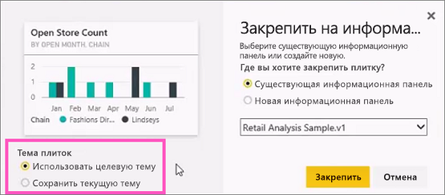
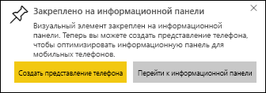

# Закрепление плитки на панели мониторинга Power BI из отчета

[Плитку панели мониторинга](../consumer/end-user-tiles.md) можно добавить, в том числе, из [отчета Power BI](../consumer/end-user-reports.md). Если выбрать одну из этих плиток, она откроется в отчете.

Можно закрепить на панели мониторинга всю страницу отчета (закрепить *живую* плитку). Таким образом, вы сможете взаимодействовать с этой плиткой на панели мониторинга. В отличие от отдельных плиток визуализации, выполняемые в отчете изменения будут автоматически синхронизироваться с панелью мониторинга. Дополнительные сведения см. в статье [Закрепление целой страницы отчета](#pin-an-entire-report-page).

Нельзя закреплять плитки из отчетов, к которым вам предоставили общий доступ, или из Power BI Desktop. 

> [!TIP]
> Поскольку в некоторых визуализациях используются фоновые изображения, закрепление может не работать при слишком большом размере такого изображения. Попробуйте уменьшить размер изображения или сжать его.  
> 
> 

## Закрепление плитки из отчета
Посмотрите, как Аманда создает панель мониторинга, закрепляя на ней визуальные элементы и изображения из отчета Power BI.
    

<iframe width="560" height="315" src="https://www.youtube.com/embed/lJKgWnvl6bQ" frameborder="0" allowfullscreen></iframe>

Теперь вы можете создать свою собственную панель мониторинга, используя для примера один из отчетов Power BI.

1. В отчете наведите указатель мыши на визуализацию, которую требуется закрепить, и выберите значок булавки. . Power BI открывает экран **Закрепить на информационной панели** .
   
     
2. Укажите, требуется ли закрепить плитку на существующей или новой панели мониторинга.
   
   * **Существующая панель мониторинга**: выберите имя панели в раскрывающемся списке. Панели мониторинга, к которым был предоставлен доступ, не появятся в раскрывающемся списке.
   * **Новая панель мониторинга**: введите имя новой панели мониторинга.
3. В некоторых случаях к закрепляемому элементу может быть применена *тема*. Это можно сказать, например, о визуальных элементах, закрепленных из книги Excel. В этом случае выберите тему для применения к плитке.
4. Выберите **Закрепить**.
   
   Сообщение об успешном выполнении (рядом с правым верхним углом экрана) означает, что визуализация была добавлена на панель мониторинга в качестве плитки.
   
   
5. В области навигации выберите панель мониторинга с новой плиткой. [Измените оформление и поведение плитки](service-dashboard-edit-tile.md) или выберите плитку, чтобы вернуться в отчет.

## Закрепление целой страницы отчета
Также на панели мониторинга можно закрепить страницу отчета целиком, что позволяет одновременно закреплять несколько визуализаций. При закреплении страницы целиком вы получаете *живые* плитки. Это значит, что вы можете взаимодействовать с такими плитками на панели мониторинга. Изменения, вносимые в любую из визуализаций в редакторе отчетов, например добавление фильтра или изменение полей, используемых в диаграмме, также отражаются на плитке панели мониторинга.  

Дополнительные сведения см. в статье [Закрепление целой страницы отчета](service-dashboard-pin-live-tile-from-report.md).

> [!NOTE]
> Некоторые параметры форматирования не применяются к визуальным элементам, когда они закреплены на панели мониторинга. Параметры границы, тени и фона будут игнорироваться в закрепленной плитке. На панелях мониторинга для указания значений в визуальных элементах карточки всегда используется шрифт семейства DIN. 
> 
>

## Дальнейшие действия
- [Панели мониторинга с точки зрения потребителей службы Power BI](../consumer/end-user-dashboards.md)
- [Плитки панели мониторинга в Power BI](../consumer/end-user-tiles.md)
- [Отчеты в Power BI](../consumer/end-user-reports.md)
- [Data refresh in Power BI](../connect-data/refresh-data.md) (Обновление данных в Power BI)
- [Основные понятия для разработчиков в службе Power BI](../fundamentals/service-basic-concepts.md)

Остались вопросы? [Ответы на них см. в сообществе Power BI.](https://community.powerbi.com/)
