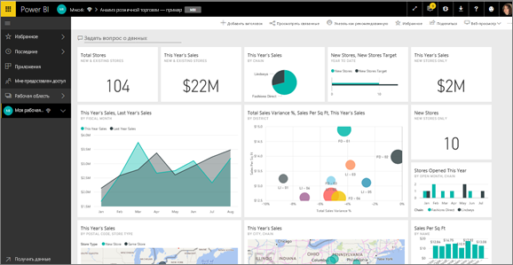
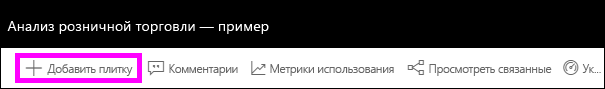
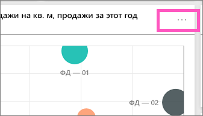
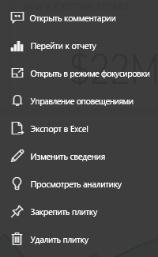

# Общие сведения о плитках панели мониторинга для разработчиков Power BI

Плитка представляет собой моментальный снимок данных, закрепленный на панели мониторинга. Плитку можно создать на основе отчета, набора данных, панели мониторинга, поля вопросов и ответов, Excel, а также отчетов SQL Server Reporting Services (SSRS) и многого другого.  На предыдущем снимке экрана показано множество различных плиток, закрепленных на информационной панели.

Информационные панели и плитки информационной панели — это компоненты службы Power BI, а не Power BI Desktop. Нельзя создавать панели мониторинга на мобильных устройствах, однако их можно на них [просматривать и предоставлять к ним доступ](../consumer/mobile/mobile-apps-view-dashboard.md).

Помимо закрепления плиток, можно создавать автономные плитки непосредственно на панели мониторинга с помощью элемента управления [Добавить плитку](service-dashboard-add-widget.md). Автономные плитки содержат следующие данные: текстовые поля, изображения, видео, потоковую передачу данных и веб-содержимое.

Нужна помощь со стандартными блоками Power BI? См. раздел [Основные понятия для разработчиков в службе Power BI](../fundamentals/service-basic-concepts.md).

> [!NOTE]
> Если исходная визуализация, использованная для создания плитки, изменяется, сама плитка не изменяется.  Например, если вы закрепили график из отчета, а затем изменили график на гистограмму, график будет по-прежнему отображаться на плитке информационной панели. Данные обновляются, а тип визуализации — нет.
> 
> 

## Закрепление плитки
Существует много различных способов добавления (закрепления) плитки на информационной панели. Вы можете закрепить плитки из следующих расположений:

* [Функция "Вопросы и ответы" Power BI](service-dashboard-pin-tile-from-q-and-a.md)
* [Отчет](service-dashboard-pin-tile-from-report.md)
* [Другая панель мониторинга](service-pin-tile-to-another-dashboard.md)
* [Книга Excel в OneDrive для бизнеса](service-dashboard-pin-tile-from-excel.md)
* [Quick Insights (Краткая аналитика)](service-insights.md)
* [Локальный отчет с разбивкой на страницы на сервере отчетов Power BI или в SQL Server Reporting Services](/sql/reporting-services/pin-reporting-services-items-to-power-bi-dashboards)

Автономные плитки для изображений, текстовых полей, видео, потоковой передачи данных и веб-содержимого можно создать непосредственно на панели мониторинга с помощью элемента управления [Добавить плитку](service-dashboard-add-widget.md).

  

## Взаимодействие с плитками на панели мониторинга
После добавления плитки на панель мониторинга можно перемещать ее и изменять ее размер, а также изменять ее внешний вид и поведение.

### Перемещение и изменение размеров плитки
Захватите плитку и [переместите ее на информационной панели](service-dashboard-edit-tile.md). Наведите указатель мыши на маркер  и выберите его для изменения размеров плитки.

### Изменение ее внешнего вида и поведения плитки
1. Наведите указатель на плитку, чтобы отобразить многоточие.
   
    
2. Выберите многоточие, чтобы открыть меню действий плитки.
   
    
   
    Здесь можно выполнять следующие действия:
   
     * [добавить комментарии на панель мониторинга](../consumer/end-user-comment.md);
     * [открыть отчет, который использовался для создания этой плитки](../consumer/end-user-reports.md);  
     * [просматривать плитку в режиме фокусировки](../consumer/end-user-focus.md);   
     * [экспортировать данные, используемые на плитке](../visuals/power-bi-visualization-export-data.md);
     * [изменить заголовок и подзаголовок и добавить гиперссылку](service-dashboard-edit-tile.md); 
     * [выполнять анализ](service-insights.md); 
     * [закреплять плитку на другой панели мониторинга](service-pin-tile-to-another-dashboard.md);
     * [удалить плитку](service-dashboard-edit-tile.md).

3. Чтобы закрыть меню действий, выберите пустую область на панели мониторинга.

### Выбор плитки
То, что происходит при выборе плитки, зависит от того, как плитка была создана. В противном случае при выборе плитки открываются отчет, книга Excel Online, локальный отчет SQL Server Reporting Services или вопрос функции "Вопросы и ответы", которые использовались для создания плитки. Либо, если присутствует [пользовательская ссылка](service-dashboard-edit-tile.md), при выборе плитки осуществляется переход по этой ссылке.

> [!NOTE]
> Исключением из этого являются плитки видео, созданные непосредственно на панели мониторинга с помощью команды **Добавить плитку**. При выборе такой плитки видео воспроизводится прямо на панели мониторинга.   
> 
> 

## Рекомендации и устранение неполадок

* Если отчет, который использовался для создания визуализации, не был сохранен, при выборе плитки никакие действия не выполняются.
* Если плитка была создана из книги в Excel Online, требуется по крайней мере разрешение на чтение для этой книги. В противном случае при выборе плитки книга не будет открываться в Excel Online.
* Например, вы создаете плитку непосредственно на панели мониторинга с помощью команды **Добавить плитку** и задаете для нее пользовательскую гиперссылку. В этом случае при выборе заголовка, подзаголовка или плитки открывается этот URL-адрес. В противном случае по умолчанию при выборе одной из плиток, созданных непосредственно на панели мониторинга для изображения, веб-кода или текстового поля, ничего не происходит.
* Плитки можно создавать из локальных отчетов с разбивкой на страницы на сервере отчетов Power BI или в SQL Server Reporting Services. Если у вас нет разрешения на доступ к локальному отчету, при выборе этой плитки открывается страница с сообщением, что у вас нет доступа (rsAccessDenied).
* Предположим, что вы выбрали плитку, созданную из локального отчета с разбивкой на страницы на сервере отчетов Power BI или в SQL Server Reporting Services. Если у вас нет доступа к сети, в которой находится сервер отчетов, то при выборе этой плитки отображается страница с сообщением о том, что не удалось найти сервер (HTTP 404). Для просмотра отчета ваше устройство должно иметь сетевой доступ к серверу отчетов.
* Если исходная визуализация, использованная для создания плитки, изменяется, сама плитка не изменяется. Например, если вы закрепили график из отчета, а затем изменили график на гистограмму, плитка панели мониторинга продолжает отображать график. Данные обновляются, а тип визуализации — нет.

## Дальнейшие действия
- [Создание карточки (крупной плитки с числом) для панели мониторинга](../visuals/power-bi-visualization-card.md)
- [Общие сведения о панелях мониторинга для разработчиков Power BI](service-dashboards.md)  
- [Обновление данных в Power BI](../connect-data/refresh-data.md)
- [Основные понятия для разработчиков в службе Power BI](../fundamentals/service-basic-concepts.md)
- [Интеграция плиток Power BI с документами Office](https://powerbi.microsoft.com/blog/integrating-power-bi-tiles-into-office-documents/)
- [Закрепление элементов Reporting Services на панелях мониторинга в Power BI](/sql/reporting-services/pin-reporting-services-items-to-power-bi-dashboards)

Появились дополнительные вопросы? [Ответы на них см. в сообществе Power BI](https://community.powerbi.com/).