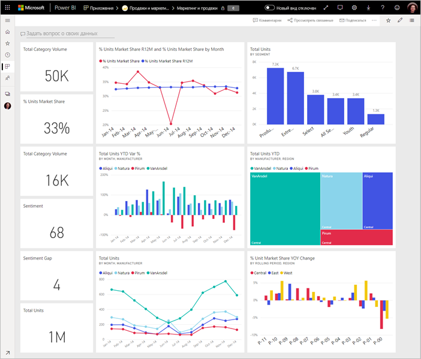
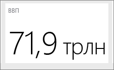

# Советы по созданию эффективной панели мониторинга Power BI
Создав панель мониторинга и добавив некоторые плитки, подумаем о том, как сделать панель мониторинга не просто привлекательной, но и функциональной. Как правило, это означает вывод наиболее важных сведений на передний план в четком и лаконичном представлении.

> [!TIP]
> Понравилась эта панель мониторинга? Вы можете скачать ее и соответствующие отчеты из AppSource. Выберите **Получить данные** > **Службы**. Найдите **Пример Майкрософт — продажи и маркетинг** > **Получить**.

Вот несколько советов для панелей мониторинга.

## Видео с рекомендациями по проектированию панели мониторинга

Просмотрите это видео с [рекомендациями по проектированию панелей мониторинга в Power BI](https://www.youtube.com/watch?v=-tdkUYrzrio) от Марко Руссо (Marco Russo) из команды SQLBI.com.

## Учитывайте аудиторию.
Какие показатели будут наиболее важными для принятия решений? Как будет использоваться панель мониторинга? Какие допущения, основанные на опыте или культурных особенностях, могут повлиять на выбор оформления? Какие сведения нужны аудитории, чтобы добиться успеха?

Помните о том, что панель мониторинга представляет собой общую схему, одно место для отслеживания текущего состояния данных. Панель мониторинга основана на соответствующих отчетах и наборах данных, которые часто содержат огромные объемы информации. Читатели могут детализировать отчеты из панели мониторинга. Поэтому не следует размещать на панели мониторинга подробные сведения, если только ваши читатели не нуждаются именно в них.

Где будет отображаться панель мониторинга? Если на большом мониторе, в нее можно включить дополнительное содержимое. Но если читатели будут просматривать ее на планшетах, удобнее будет панель мониторинга с меньшим числом плиток.

## Все необходимое на одном экране
Поскольку панели мониторинга предназначены для лаконичного отображения важной информации, лучше всего, если все плитки будут находиться на одном экране. Можно ли отказаться от полос прокрутки на панели мониторинга?

Не слишком ли запутана панель мониторинга?  Удалите все, кроме важных сведений, которые удобно читать и интерпретировать.

## Использование полноэкранного режима
Представляя панель мониторинга, ее следует отображать в [полноэкранном режиме](../consumer/end-user-focus.md) без отвлекающих моментов.

## Акцент на наиболее важных сведениях
Если весь текст и визуализации на панели мониторинга имеют один и тот же размер, читателям будет сложно определить, что является самым важным. Например, визуализация карточки — это отличный способ отображения важных чисел:  

Но не забудьте предоставить контекст.  

Почитайте о [создании плитки, содержащей только число](../visuals/power-bi-visualization-card.md).

## Расположение наиболее важных сведений
Большинство людей читают сверху вниз. Поэтому рекомендуется помещать обобщенные сведения в верхнем левом углу, а более подробные — в нижней части страницы, учитывая направление чтения (слева направо или справа налево).

## Используйте правильную визуализацию для данных.
Старайтесь не использовать разные визуализации просто для разнообразия.  Визуализации должны формировать общую картину; их должно быть удобно "читать" и интерпретировать.  Для некоторых данных и визуализаций достаточно простого графического представления. Однако другие данные могут требовать более сложных визуализаций: обязательно используйте заголовки, подписи и другие настройки, чтобы помочь пользователям.  

* Будьте внимательны при использовании визуальных элементов, которые привлекательно выглядят, но сложны для восприятия, например трехмерных диаграмм. 
* К сожалению, круговые диаграммы, кольцевые графики и шкалы и другие графики круглого типа — это не лучший способ визуализации данных. Круговые диаграммы наиболее эффективны, когда в них меньше восьми категорий. Поскольку на круговой диаграмме нет возможности сравнивать значения рядом друг с другом, для сравнения данных лучше использовать линейчатую диаграмму или гистограмму. Круговые диаграммы могут быть удобны для просмотра отношения частей к целому, а не для сравнения частей. Индикаторные диаграммы хорошо подходят для отображения текущего состояния в контексте цели.
* Будьте последовательны при выборе шкал на осях диаграммы, порядка размеров диаграммы, а также цветов, используемых для размерных значений в диаграммах.
* Помните о правильном кодировании числовых данных. При отображении цифр их число не должно превышать три-четыре. Число цифр после десятичной запятой или разделителя тысяч или миллионов не должно превышать одну или две, т. е. 3,4 млн, а не 3 400 000.
* Не смешивайте уровни точности и времени. Убедитесь, что временные рамки хорошо понятны. Не размещайте одну диаграмму с последним месяцем рядом с диаграммами, отфильтрованными по определенному месяцу года.
* Не смешивайте мелкие и крупные показатели на одной шкале, например на графике или гистограмме. Например, один показатель может быть указан в миллионах, а другой — в тысячах. С таким большим масштабом будет трудно увидеть различия в показателях, указанных в тысячах. Если смешанные данные необходимы, выберите визуализацию, которая допускает использование второй оси.
* Не загромождайте диаграммы метками данных, которые не являются необходимыми. Значения на гистограммах обычно хорошо понятны без отображения фактических цифр.
* Обратите внимание на то, как [сортируются диаграммы](../consumer/end-user-change-sort.md). Чтобы привлечь внимание к самым высоким или самым низким значениям, выполните сортировку по показателю. Чтобы помочь пользователям быстро находить определенную категорию среди многих других категорий, выполните сортировку по оси.  

Дополнительные рекомендации, относящиеся к визуализациям, см. в разделе [Типы визуализации в Power BI](../visuals/power-bi-visualization-types-for-reports-and-q-and-a.md).  

## Дополнительные сведения по созданию панелей мониторинга
Чтобы добиться максимальной эффективности при создании панелей мониторинга, ознакомьтесь с основными принципами целостного визуального восприятия (гештальт), а также с принципами четкого представления актуальной информации в контексте. К счастью, имеется множество широко доступных ресурсов, которые рассматриваются и в наших блогах. Некоторые из наших любимых книг включают:

* *Information Dashboard Design* (Проектирование панели мониторинга данных), автор Стивен Фью (Stephen Few)  
* *Show Me the Numbers* (Покажите мне числа), автор Стивен Фью  
* *Now You See It* (Теперь все понятно), автор Стивен Фью  
* *Envisioning Information* (Визуальное представление данных), автор Эдвард Тафт (Edward Tufte)  
* *Advanced Presentations by Design* (Создание расширенных презентаций), автор Эндрю Абела (Andrew Abela)   

## Дальнейшие действия
[Создание панели мониторинга из отчета](service-dashboard-create.md)  
[Основные понятия для разработчиков в службе Power BI](../fundamentals/service-basic-concepts.md)  
У вас имеются и другие вопросы? [Ответы на них см. в сообществе Power BI.](https://community.powerbi.com/)
