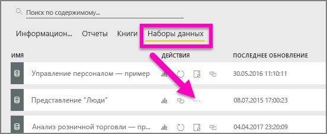
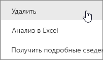
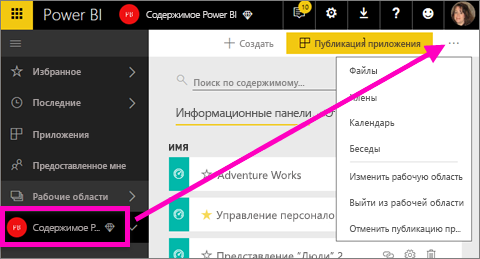
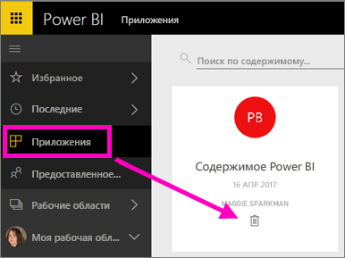

# Удаление содержимого в службе Power BI
В этой статье показано, как удалять панели мониторинга, отчеты, книги, наборы данных, приложения, визуализации и рабочие области в службе Power BI.

## Удаление панели мониторинга
Панели мониторинга можно удалять. При удалении панели мониторинга базовый набор данных и отчеты, связанные с этой панелью, не удаляются.

* Если вы являетесь владельцем панели мониторинга, вы можете удалить их. Если вы предоставили доступ к панели мониторинга коллегам, при удалении эта панель будет удалена и из их рабочих областей Power BI.
* Если доступ к информационной панели предоставлен вам и вы больше не хотите работать с ней, удалите панель.  Удаление информационной панели не приводит к ее удалению из рабочих областей Power BI других пользователей.
* Если панель мониторинга является частью [пакета содержимого организации](../collaborate-share/service-organizational-content-pack-disconnect.md), единственным способом ее удаления является удаление связанного набора данных.

### Удаление информационной панели
1. В рабочей области перейдите на вкладку **Информационные панели**.
2. Найдите информационную панель, которую необходимо удалить, и щелкните значок удаления .

    

## Удаление отчета
При удалении отчета не происходит удаление набора данных, являющегося его основой.  Все визуализации, закрепленные из отчета, не затрагиваются — они остаются на информационной панели до тех пор, пока не вы не удалите их по отдельности.

### Удаление отчета
1. В рабочей области перейдите на вкладку **Отчеты**.
2. Найдите отчет, который необходимо удалить, и щелкните значок удаления   .   

    
3. Подтвердите удаление.

   

   > [!NOTE]
   > Если отчет является частью [пакета содержимого](../collaborate-share/service-organizational-content-pack-introduction.md), его нельзя удалить с помощью этого способа.  Дополнительные сведения см. в статье [Удаление подключения к пакету содержимого организации в Power BI](../collaborate-share/service-organizational-content-pack-disconnect.md).
   >
   >

## Удаление книги
Книги можно удалять. Но при удалении книги также удаляются все плитки отчетов и информационных панелей, содержащие данные из этой книги.

Если книга хранится в OneDrive для бизнеса, после ее удаления из Power BI она по прежнему остается в OneDrive.

### Удаление книги
1. В рабочей области перейдите на вкладку **Книги**.
2. Найдите книгу, которую необходимо удалить, и щелкните значок удаления  .

    
3. Подтвердите удаление.

   

## Удаление набора данных
Наборы данных можно удалить. Но при удалении набора данных также удаляются все плитки отчетов и панелей мониторинга, содержащие данные из этого набора данных.

Если набор данных входит в состав одного или нескольких [пакетов содержимого организации](../collaborate-share/service-organizational-content-pack-disconnect.md), единственный способ удалить его из этих пакетов — дождаться завершения его обработки, а потом еще раз попытаться удалить.

### Удаление набора данных
1. В рабочей области перейдите на вкладку **Наборы данных**.
2. Найдите набор данных, который необходимо удалить, и щелкните **Дополнительные параметры** (...).  

    
3. В раскрывающемся списке выберите **Удалить**.

   
4. Подтвердите удаление.

   

## Удаление рабочей области
> [!WARNING]
> При создании рабочей области создается группа Microsoft 365. При удалении рабочей области группа Microsoft 365 также удаляется. Это значит, что группы будут удалены и из других продуктов Microsoft 365, таких как SharePoint и Microsoft Teams.
>
>

Создатель рабочей области может удалить ее. При удалении рабочей области приложения удаляется также связанное приложение всех участников группы. Если вы опубликовали приложение для всей организации, оно также удаляется из AppSource. Удаление рабочей области отличается от выхода из нее.

### Удаление рабочей области (администратор)
1. В области навигации выберите **Рабочие области**.

2. Щелкните **Дополнительные параметры** (...) справа от рабочей области, которую необходимо удалить, и выберите команду **Изменить рабочую область**.

    

3. В окне **Edit workspace** (Изменить рабочую область) выберите **Удалить рабочую область** > **Удалить**.

    

### Удаление рабочей области из списка
Если вы больше не хотите входить в рабочую область, из нее можно ***выйти***, после чего она будет удалена из списка. Выход из рабочей области не влияет на других ее участников.  

> [!IMPORTANT]
> Если вы единственный администратор рабочей области, служба Power BI не позволит вам выйти из состава рабочей области.
>
>

1. Войдите в рабочую область, которую нужно удалить.

2. В правом верхнем углу щелкните **Дополнительные параметры** (...) и выберите команды **Выйти из рабочей области** > **Выйти**.

      

   > [!NOTE]
   > Параметры, доступные в раскрывающемся списке, зависят от того, являетесь ли вы администратором или участником рабочей области.
   >
   >

## Удаление информационной панели
Приложения можно легко удалить из страницы со списком приложений. Но только администратор может полностью удалить приложение.

### Удаление приложения из страницы со списком приложений
Удаление приложения из страницы со списком приложений не влияет на остальных участников.

1. В области навигации выберите **Приложения**, чтобы открыть страницу со списком приложений.
2. Наведите указатель мыши на название приложения, которое необходимо удалить, и щелкните значок удаления   .

   

   Если вы случайно удалили приложение, его можно восстановить несколькими способами.  Например, вы можете попросить автора приложения повторно отправить его вам, найти письмо со ссылкой на это приложение, проверить наличие уведомления для приложения в [центре уведомлений](../consumer/end-user-notification-center.md) или проверить [AppSource организации](../consumer/end-user-apps.md).

## Рекомендации и устранение неполадок
В этой статье описаны способы удаления стандартных блоков службы Power BI. Но в Power BI можно удалить и другие элементы:  

* [Удаление основной информационной панели](../consumer/end-user-featured.md)
* [Удаление информационной панели из избранного](../consumer/end-user-favorite.md)
* [Удаление страницы из отчета Power BI](service-delete.md)
* [Изменение и удаление плитки на информационной панели](service-dashboard-edit-tile.md)
* [Удаление визуализации в Power BI](service-delete.md)

Появились дополнительные вопросы? [Ответы на них см. в сообществе Power BI.](https://community.powerbi.com/)
