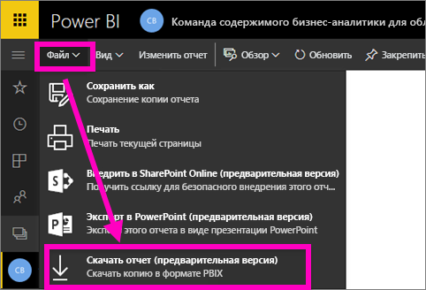
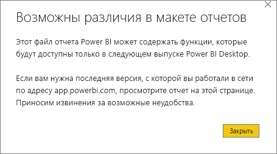
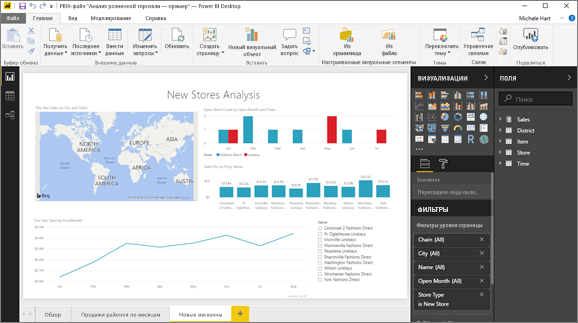

# Скачивание отчета из службы Power BI в Power BI Desktop (предварительная версия)
      
В Power BI Desktop можно опубликовать отчет (*PBIX*-файл) с локального компьютера в службе Power BI. Отчеты Power BI также могут передаваться и в другом направлении: Вы можете скачать отчет из службы Power BI в Power BI Desktop. В любом случае отчет Power BI имеет расширение PBIX.

Существует ряд ограничений, которые мы рассмотрим далее в разделе [Рекомендации и устранение неполадок](#considerations-and-troubleshooting).

## Скачивание отчета в виде PBIX-файла

Скачать можно только отчеты, [созданные в Power BI Desktop](/learn/modules/publish-share-power-bi/2-publish-reports) после 23 ноября 2016 г. и обновленные позже этого дня. В противном случае команда **Скачать отчет** в меню службы Power BI будет неактивна.

Чтобы скачать PBIX-файл, сделайте следующее:

1. В службе Power BI откройте отчет, который нужно скачать, в [режиме правки](./service-interact-with-a-report-in-editing-view.md).

2. В области навигации сверху щелкните **Файл > Скачать отчет**.
   
3. Во время скачивания отчета отображается баннер состояния, показывающий ход выполнения. Когда PBIX-файл будет готов, вам будет предложено указать место для его сохранения. Имя файла по умолчанию соответствует названию отчета.
   
4. [Установите Power BI Desktop](../fundamentals/desktop-get-the-desktop.md), если вы это еще не сделали, а затем откройте там PBIX-файл.
   
    Когда вы откроете отчет в приложении Power BI Desktop, возможно, отобразится сообщение с предупреждением, что некоторые функции отчета, доступные в службе Power BI, могут быть недоступны в Power BI Desktop.
   
    

5. Редактор отчетов в Power BI Desktop похож на редактор отчетов в службе Power BI.  
   
    

## Рекомендации и устранение неполадок

Существует несколько важных рекомендаций и ограничений, которые следует учитывать при скачивании PBIX-файла из службы Power BI.

* Чтобы скачать файл, нужно обладать правами на редактирование отчета.
* Отчет должен быть создан в Power BI Desktop и *опубликован* в службе Power BI, либо PBIX-файл должен быть *отправлен* в службу Power BI.
* Отчеты должны быть опубликованы или изменены после 23 ноября 2016 г. Отчеты, опубликованные до этой даты, невозможно скачать.
* Эта функция не будет работать с отчетами и пакетами содержимого, которые изначально были созданы в службе Power BI.
* Скачанные файлы всегда нужно открывать в последней версии Power BI Desktop. Скачанные PBIX-файлы могут не открываться в неактуальных версиях Power BI Desktop.
* Если администратор отключил возможность скачивания данных, эта функция будет недоступна в службе Power BI.
* Наборы данных с добавочным обновлением невозможно скачать в PBIX-файл.
* Наборы данных, включенные для [больших моделей](../admin/service-premium-large-models.md), невозможно скачать в PBIX-файл.
* Наборы данных, измененные с помощью [конечной точки XMLA](../admin/service-premium-connect-tools.md), невозможно скачать в PBIX-файл.
* Если вы создаете отчет Power BI на основе набора данных из одной рабочей области, а публикуете его в другой рабочей области, вы и ваши пользователи не сможете скачать его. В этом случае возможность скачивания пока недоступна.

## Дальнейшие действия

Просмотрите короткий видеоролик от **Guy in a Cube** об этой функции.

<iframe width="560" height="315" src="https://www.youtube.com/embed/ymWqU5jiUl0" frameborder="0" allowfullscreen></iframe>

Ниже приведен ряд дополнительных статей, информация из которых поможет вам научиться использовать службу Power BI:

* [Отчеты в Power BI](../consumer/end-user-reports.md)
* [Основные понятия для разработчиков в службе Power BI](../fundamentals/service-basic-concepts.md)

После установки Power BI Desktop ознакомьтесь со следующей статьей, которая поможет вам быстро приступить к работе:

* [Начало работы с Power BI Desktop](../fundamentals/desktop-getting-started.md)

Появились дополнительные вопросы? [Ответы на них см. в сообществе Power BI](https://community.powerbi.com/).