# Руководство. Превращение книги Excel в отчет службе Power BI для Microsoft Teams
Ваш руководитель требует отчет по последним показателям продаж и прибыли к концу дня. При этом последние данные хранятся в различных сторонних системах и в файлах на вашем ноутбуке. Раньше создание визуальных элементов и форматирование отчета занимало несколько часов и заставляло понервничать.

Не волнуйтесь. С Power BI можно быстро создать привлекательный отчет и поделиться им в Microsoft Teams!

:::image type="content" source="media/service-from-excel-to-stunning-report/power-bi-financial-report-service.png" alt-text="Снимок экрана: готовый отчет с примером финансовых данных":::

В этом руководстве мы отправим файл Excel, создадим отчет и предоставим к нему доступ коллегам в Microsoft Teams — и все это в Power BI. Вы узнаете, как:

> [!div class="checklist"]
> * подготовить свои данные в Excel;
> * скачать пример данных;
> * Создать отчет в службе Power BI;
> * закрепить визуальные элементы отчета на панели мониторинга;
> * добавить ссылку на панель мониторинга.
> * Предоставление общего доступа к панели мониторинга в Microsoft Teams

## Подготовка данных в Excel
Для примера возьмем простой файл Excel. 

1. Прежде чем отправлять файл Excel в Power BI, необходимо упорядочить данные в виде таблицы с одноуровневой адресацией. В плоской таблице каждый столбец содержит данные одного типа: текст, даты, цифры, валюты и т. д. Таблица должна содержать строку заголовков, но не должна включать столбцы или строки с итогами.

   

2. Теперь отформатируем данные в виде таблицы. В группе **Стили** на вкладке **Главная** в Excel выберите **Форматирование таблицы**. 

3. Выберите стиль таблицы, который нужно применить к листу. 

   Теперь лист Excel готов к отправке в Power BI.

   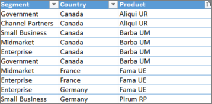

## Отправка файла Excel в службу Power BI
Служба Power BI подключается к нескольким источникам данных, включая файлы Excel на вашем компьютере. 

 > [!NOTE] 
 > Чтобы продолжить работу с руководством, скачайте [книгу с примером финансовых данных](https://go.microsoft.com/fwlink/?LinkID=521962).

1. Чтобы начать работу, войдите в службу Power BI. Если вы еще не зарегистрировались, [это можно сделать бесплатно](https://powerbi.com).
1. В разделе **Моя рабочая область** выберите **Создать** > **Отправить файл**.

    :::image type="content" source="media/service-from-excel-to-stunning-report/power-bi-new-upload.png" alt-text="Снимок экрана: параметр Отправить файл.":::

1. Выберите **Локальный файл**, перейдите к месту, где сохранен файл Excel с примером финансовых данных, и выберите **Открыть**.
7. На странице **Локальный файл** выберите **Импорт**.

    Теперь у вас есть пример набора финансовых данных. Power BI также автоматически создать пустую панель мониторинга. Если панель мониторинга не отображается, обновите браузер.

    :::image type="content" source="media/service-from-excel-to-stunning-report/power-bi-financial-dataset.png" alt-text="Снимок экрана: Моя рабочая область с примером набора финансовых данных.":::

2. Необходимо создать отчет. В разделе **Моя рабочая область** выберите **Создать** > **Отчет**.

   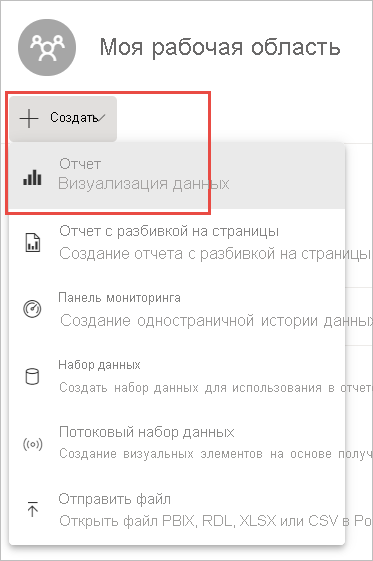

3. В диалоговом окне **Выбор набора данных для создания отчета** выберите набор данных **Пример финансовых данных** > **Создать**.

   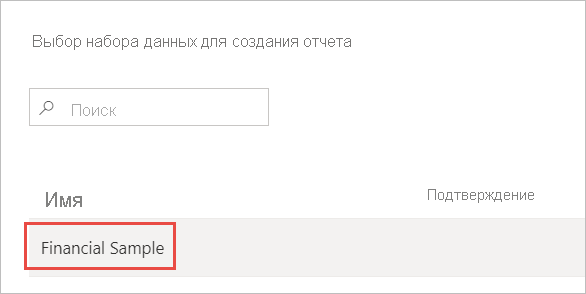

## Создание отчета
 
Отчет откроется в режиме редактирования и отобразится пустой холст отчета. Справа находятся панели **Визуализации**, **Фильтры** и **Поля**. Данные из таблицы Excel отображаются на панели **Поля**. Вверху находится имя таблицы, **Финансы**. Заголовки столбцов перечисляются под названием таблицы в Power BI как отдельные поля.

Отображаются ли в списке полей символы сигмы? Служба Power BI обнаружила, что эти поля являются числовыми. Power BI также обозначает географическое поле с помощью символа земного шара.

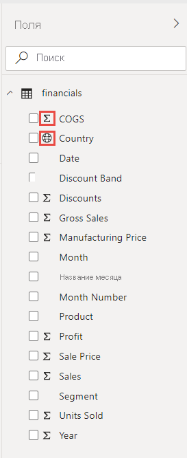

1. Чтобы освободить место для холста отчета, выберите **Свернуть панель навигации**и сверните панель **Фильтры**.

    :::image type="content" source="media/service-from-excel-to-stunning-report/power-bi-hide-nav-pane.png" alt-text="Снимок экрана: свертывание панели навигации."::: 

1. Теперь можно приступать к созданию визуализации. Предположим, ваш руководитель хочет увидеть прибыли за определенный период. Перетащите поле **Прибыль** с панели **Поля** на холст отчета. 

   По умолчанию в Power BI отображается гистограмма с одним столбцом. 

    :::image type="content" source="media/service-from-excel-to-stunning-report/power-bi-profit-column.png" alt-text="Снимок экрана: гистограмма с одним столбцом.":::

3. Перетащите на холст отчета поле **Дата**. 

   Power BI обновит гистограмму и покажет прибыль по датам.

   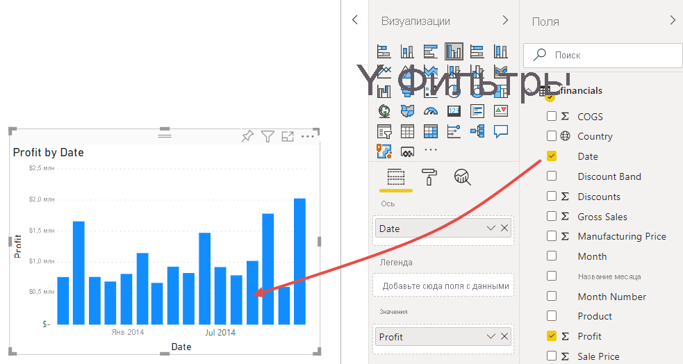

    Самым прибыльным месяцем был декабрь 2014 года.
   
    > [!TIP]
    > Если диаграмма выглядит не так, как вы ожидали, проверьте агрегированные значения. Например, в области **Значения** выберите только что добавленное поле **Прибыль** и убедитесь, что вычисление данных выполняется надлежащим образом. В нашем примере используется **суммирование**.
    > 

### Создание карты

Ваш руководитель хочет знать, какие страны оказались наиболее прибыльными. Произведите на него впечатление, добавив визуализацию карты. 

1. Выберите пустую область на холсте отчета. 

2. В области **Поля** перетащите поле **Страна** на холст отчета, а затем перетащите поле **Прибыль** на карту.

   Power BI создаст визуализацию карты с пузырьками, представляющими относительную прибыль в каждом регионе.

   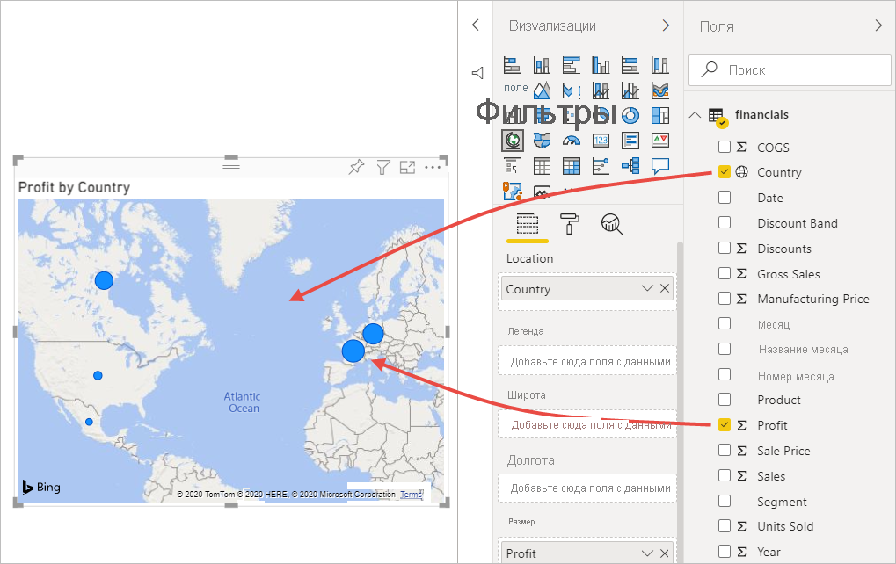

    Похоже, что прибыль в европейских странах больше, чем в Северной Америке.

### Создание визуального элемента, отображающего продажи

А что насчет визуального представления продаж по продуктам и сегментам рынка? Это легко. 

1. Выберите пустой холст.

1. На панели **Поля** выберите поля **Продажи**, **Продукт** и **Сегмент**. 
   
   Power BI создаст гистограмму с группировкой. 

2. Измените тип диаграммы, выбрав один из значков в меню **Визуализации**. Например, вы можете преобразовать ее в **гистограмму с накоплением**. 

   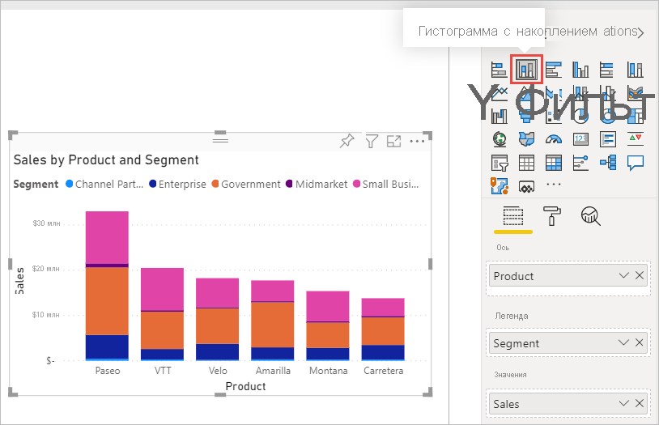

3. Чтобы отсортировать данные на диаграмме, щелкните **Дополнительные параметры** (...) и выберите **Сортировка**.

### Изменение визуальных элементов

Внесите следующие изменения на вкладке **Формат** в области "Визуализации".

:::image type="content" source="media/desktop-excel-stunning-report/power-bi-format-tab-visualizations.png" alt-text="Снимок экрана: вкладка Формат в области Визуализации.":::

1. Выберите гистограмму **Прибыль по дате**. В разделе **Заголовок** измените значение параметра **Размер текста** на **16 пт**. Установите переключатель **Тень** в положение **Вкл.** . 

1. Выберите гистограмму с накоплением **Продажи по продукту и сегменту**. В разделе **Заголовок** измените значение параметра **Размер текста** на **16 пт**. Установите переключатель **Тень** в положение **Вкл.** .

1. Выберите **Прибыль по странам**. В разделе **Стили карт** измените значение параметра **Тема** на **Оттенки серого**. В разделе **Заголовок** измените значение параметра **Размер текста** на **16 пт**. Установите переключатель **Тень** в положение **Вкл.** .

## Закрепление на панели мониторинга

Теперь вы можете закрепить все визуальные элементы на пустой панели мониторинга, которая создана службой Power BI по умолчанию. 

1. Наведите указатель мыши на визуальный элемент и выберите **Закрепить визуальный элемент**.

   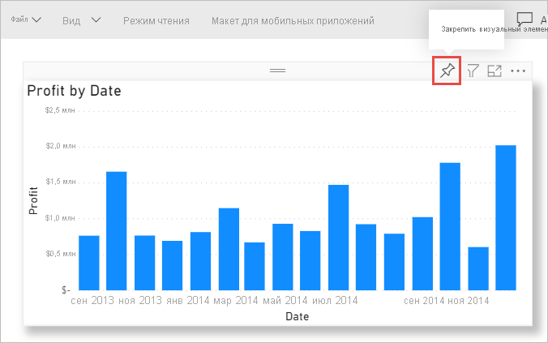

1. Чтобы закрепить визуальный элемент на панели мониторинга, необходимо сохранить отчет. Введите имя отчета и нажмите кнопку **Сохранить**.
1. Закрепите каждый визуальный элемент на панели мониторинга, **Пример финансовых данных.xlsx**.
1. Закрепите последний визуальный элемент, выберите **Перейти на панель мониторинга**.
1. Power BI автоматически добавит на панель мониторинга плитку с заполнителем "Пример финансовых данных.xlsx". Выберите **Дополнительные параметры (...)**  > **Удалить плитку**.

    :::image type="content" source="media/service-from-excel-to-stunning-report/power-bi-tile-more-options.png" alt-text="Снимок экрана: меню дополнительных параметров для плитки":::

1. Переупорядочите плитки и измените их размер любым нужным образом.

Панель мониторинга и отчет готовы.

## Предоставление ссылки на панель мониторинга

Теперь необходимо предоставить доступ к панели мониторинга своему руководителю. Доступ к панели мониторинга и соответствующему отчету можно предоставить коллегам, у которых есть учетная запись Power BI. Они смогут работать с отчетом, но не смогут сохранять изменения в нем. Если вы разрешите это, они смогут предоставить доступ другим пользователям или создать новый отчет на основе базового набора данных.

1. Чтобы предоставить доступ к отчету, в верхней части панели мониторинга выберите элемент **Поделиться**.

   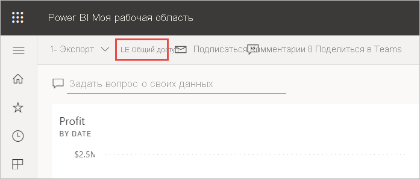

2. На странице **Общий доступ к панели мониторинга** введите адреса электронной почты получателей в поле **Введите адреса электронной почты**и добавьте сообщение в поле ниже. 

3. Выберите нужные параметры, если таковые имеются:

    - **Позволить получателям делиться информационной панелью**. 
    - **Разрешить получателям создавать содержимое из базовых наборов данных**.
    - **Отправлять получателям уведомления по электронной почте**.

   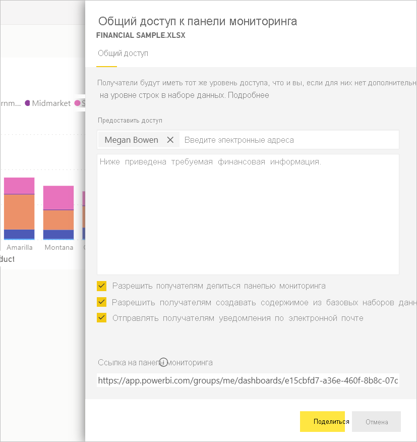

1. Выберите **Общий доступ**.

## Предоставление общего доступа в Microsoft Teams

Вы также можете делится отчетами и панелями мониторинга с коллегами непосредственно в Microsoft Teams.

1. Чтобы предоставить доступ в Teams, в верхней части панели мониторинга выберите элемент **Поделиться в Teams**.

   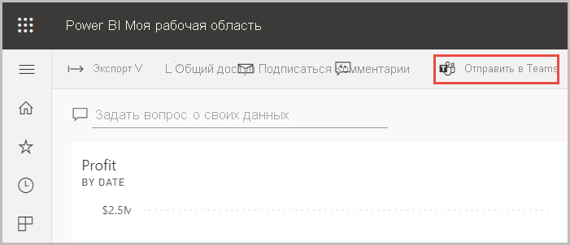

2. В Power BI откроется диалоговое окно **Поделиться в Teams**. Введите имя пользователя, группы или канала и выберите **Поделиться**. 
   
    :::image type="content" source="media/service-from-excel-to-stunning-report/power-bi-share-teams-dialog.png" alt-text="Снимок экрана: диалоговое окно Поделиться в Teams":::

3. Ссылка отобразится в разделе **Записи** для этого пользователя, группы или канала.

   

## Дальнейшие действия

* Теперь, когда вы создали простейший отчет в службе Power BI, возможно, вы захотите создать отчет в Power BI Desktop. Ознакомьтесь с учебником [Превращение книги Excel в привлекательный отчет в Power BI Desktop](desktop-excel-stunning-report.md).

Появились дополнительные вопросы? [Ответы на них см. в сообществе Power BI](https://community.powerbi.com/).
