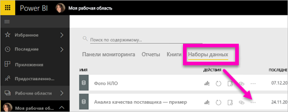
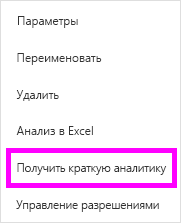
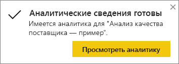
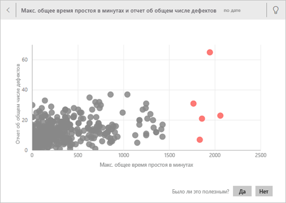
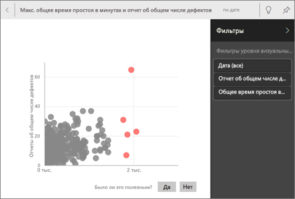
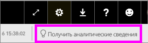
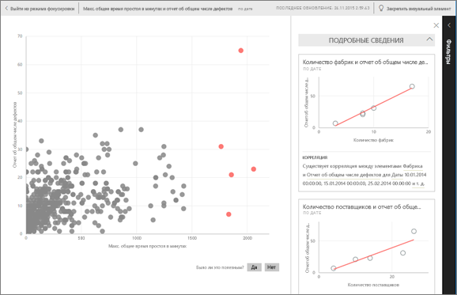

# Автоматическое создание аналитических данных из набора данных с помощью Power BI
Вы получили новый набор данных и не знаете, с чего начать?  Вам нужно быстро создать панель мониторинга?  Хотите найти полезные данные, которые вы могли пропустить?

Краткая аналитика позволяет получить интересные визуализации на основе имеющихся данных. Здесь объясняется, как быстро проанализировать весь набор данных (быстрый анализ данных). Можно также запустить [быстрый анализ на определенному фрагменту панели мониторинга](../consumer/end-user-insights.md) (аналитика по области). Вы даже можете анализировать полученные результаты.

> [!NOTE]
> Аналитика не работает с DirectQuery — только с данными, отправленными в Power BI.
> 

Мы создали функцию создания аналитических сведений не используя [набор современных аналитических алгоритмов](../consumer/end-user-insight-types.md), разработанных в Microsoft Research. Мы продолжаем использовать эти алгоритмы, чтобы помочь большему количеству людей получить аналитические сведения из их данных, используя новые и интуитивно понятные способы. Вас также может заинтересовать то, как [оптимизировать данные для быстрого анализа](service-insights-optimize.md).

## Запуск краткой аналитики для набора данных
Просмотрите, как Аманда запускает быстрый анализ набора данных, и откройте представление в режиме фокусировки. Аманда закрепляет представление данных в виде фрагмента на панели мониторинга, а затем получает аналитические сведения для фрагмента панели мониторинга.

<iframe width="560" height="315" src="https://www.youtube.com/embed/et_MLSL2sA8" frameborder="0" allowfullscreen></iframe>

Теперь ваша очередь. Узнайте, как работает аналитика данных, на примере [Анализ качества поставщика](sample-supplier-quality.md).

1. На вкладке **Наборы данных** щелкните **Дополнительные параметры** (…) и выберите **Получить краткую аналитику** .
   
    
   
    
2. Для поиска тенденций в наборе данных Power BI использует [различные алгоритмы](../consumer/end-user-insight-types.md).
   
    
3. Анализ занимает несколько секунд.  Нажмите кнопку **Просмотреть аналитику** , чтобы отобразить визуализации.
   
    
   
    > [!NOTE]
    > Для некоторых данных аналитические сведения не формируются, так как информация не является статистически значимой.  Дополнительные сведения см. в статье [Оптимизация данных для быстрого анализа данных в Power BI](service-insights-optimize.md).
    > 
    
4. Визуализация отображается на специальном холсте **краткой аналитики** , который может вмещать до 32 отдельных карт анализа. Каждая карта имеет диаграмму или график, а также краткое описание.
   
    

## Работа с карточками аналитики

1. Наведите указатель мыши на карту и выберите значок булавки, чтобы добавить визуализацию на панель мониторинга.

2. Наведите указатель мыши на карточку, щелкните **Дополнительные параметры** (…) и выберите команду **Просмотреть аналитику** . 

    Экран аналитики открывается в режиме фокусировки.
   
    
3. В режиме фокусировки можно выполнять следующие задачи.
   
   * Фильтровать визуализации. Если панель **Фильтры** еще не открыта, разверните ее, выбрав стрелку в правой части окна.

       
   * Закрепите карточку аналитических сведений на панели мониторинга, выбрав **Закрепить визуальный элемент** .
   * Запустите аналитику для самой карточки, что часто называют *аналитикой с заданной областью* . В правом верхнем углу щелкните значок лампочки  или нажмите **Получить аналитику** .
     
       
     
     Аналитические сведения отображаются слева. Новые карточки, зависящие исключительно от данных в таком отдельном представлении аналитических сведений, отображаются справа.
     
       
4. Чтобы вернуться к первоначальному холсту аналитики, щелкните в верхнем левом углу **Выйти из режима фокусировки** .

## Дальнейшие действия
- Если у вас есть набор данных, [оптимизируйте его для краткой аналитики](service-insights-optimize.md).
- См. дополнительные сведения о [доступных типах краткой аналитики](../consumer/end-user-insight-types.md).

Появились дополнительные вопросы? [Ответы на них см. в сообществе Power BI](https://community.powerbi.com/).
