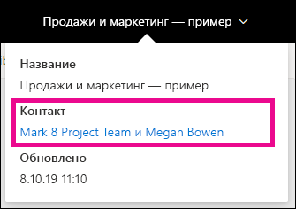
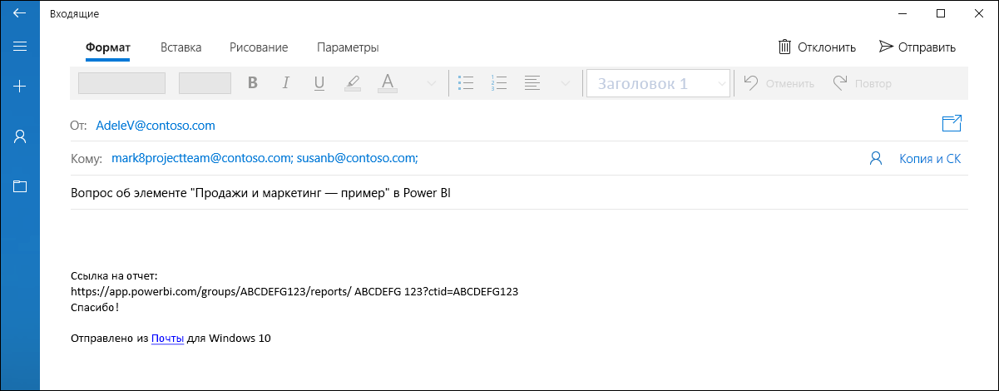
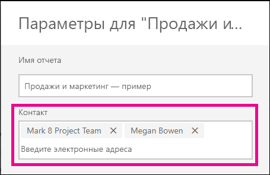
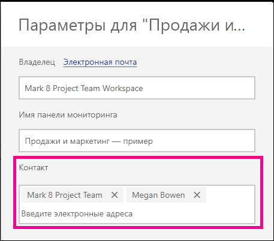

# Задание контактной информации для отчетов и панелей мониторинга в службе Power BI
В этой статье описывается, как задать контактные данные для панели мониторинга или отчета в службе Power BI.

> [!NOTE]
> Контактные данные можно задать для элементов в классической или новой рабочей области. Вы не можете задать контактную информацию для элементов в области "Моя рабочая область". Информационная карточка отображается при просмотре отчета или панели мониторинга в [новом представлении](../consumer/service-new-look.md).

К контакту для элемента можно добавить несколько пользователей или групп. Это может быть:
* человек;
* группа Microsoft 365;
* группа безопасности с включенной электронной почтой;
* список рассылки.

По умолчанию лицо, которое создает новый отчет или панель мониторинга, становится в них контактным лицом. Если задать значение, оно переопределит значение по умолчанию. Вы можете удалить всех пользователей или группы из списка контактов. При этом для классических рабочих областей будет отображаться группа Microsoft 365 рабочей области. Для новых рабочих областей будет использоваться список контактов [рабочей области](../collaborate-share/service-create-the-new-workspaces.md#create-a-contact-list). Если список контактов рабочей области не задан, отображаются администраторы рабочей области.

Контактные данные отображаются для пользователей, просматривающих элемент. 

 

Если щелкнуть список контактов, будет создано сообщение электронной почты, в котором можно задать вопросы или получить справку. 

 
 
Сведения о списке контактов также используются в других местах. Например, он отображается в некоторых сценариях ошибок в диалоговом окне ошибки. Автоматические сообщения электронной почты, связанные с элементом, например запросы на доступ, отправляются в список контактов. 

> [!NOTE]
> При публикации приложения в контактных данных отдельных элементов указываются сведения пользователя, который опубликовал или обновил приложение. Вы можете задать URL-адрес поддержки приложений, чтобы пользователи приложения могли получить необходимую помощь.

## Задание контактной информации для отчета
1. В рабочей области перейдите на вкладку **Отчеты**.
2. Перейдите к нужному отчету и выберите значок **Параметры**.
3. Выберите поле ввода **Контакт** и задайте значение.

     

## Задание контактной информации для панелей мониторинга
1. В рабочей области перейдите на вкладку **Информационные панели**.
2. Перейдите на нужную панель мониторинга и выберите значок **Параметры**.
3. Выберите поле ввода **Контакт** и задайте значение.

     

## Рекомендации и ограничения
* Контакт автоматически задается для новых элементов, созданных в службе Power BI. Существующие элементы будут показывать значение по умолчанию для рабочей области.
* Вы можете задать любого пользователя или группу в списке контактов, но им не будет автоматически предоставлено разрешение на доступ к элементу. Используйте общий доступ или предоставьте пользователю доступ к рабочей области через роль. 
* Список контактов уровня элемента не помещается в приложения при их публикации. Новый интерфейс навигации по приложению предоставляет URL-адрес поддержки, настраиваемый для помощи в управлении отзывами от большого числа пользователей приложения.

## Дальнейшие действия

Появились дополнительные вопросы? [Ответы на них см. в сообществе Power BI.](https://community.powerbi.com/)
