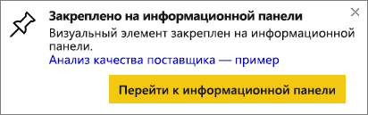

# Закрепление плитки с одной панели мониторинга на другой
Один из способов добавления новой [плитки панели мониторинга](../consumer/end-user-tiles.md) заключается в ее копировании с другой панели мониторинга. При щелчке каждая из этих плиток превращается в ссылку на исходное расположение — вопросы и ответы либо отчет. 

> [!NOTE]
> Вы не можете закрепить плитки с общей панели мониторинга.

## Закрепление плитки на другой информационной панели
1. [Получите данные](../connect-data/service-get-data.md). Здесь используется пример [Анализ расходов ИТ-отдела](sample-it-spend.md).
2. Откройте [панель мониторинга](../consumer/end-user-dashboards.md).
3. Наведите указатель мыши на плитку, которую требуется закрепить, щелкните **Дополнительные параметры** (...) и выберите команду **Закрепить плитку**.  
   
   
4. Закрепите плитку на существующей или новой панели мониторинга. 
   
   * **Существующая панель мониторинга**: выберите имя панели мониторинга в раскрывающемся списке.
   * **Новая панель мониторинга**: введите имя новой панели мониторинга.
   
   
5. Выберите **Закрепить**.
   Сообщение об успешном выполнении (рядом с правым верхним углом экрана) позволяет узнать, что визуализация была добавлена на выбранную панель мониторинга в качестве плитки.
   
   
6. Выберите **Перейти на информационную панель**, чтобы просмотреть закрепленную плитку. Здесь можно [переименовать, изменить размер, связать и переместить](service-dashboard-edit-tile.md) закрепленную визуализацию.

## Дальнейшие действия
[Плитки панели мониторинга в Power BI](../consumer/end-user-tiles.md)  
[Панели мониторинга в Power BI](../consumer/end-user-dashboards.md)  
У вас имеются и другие вопросы? [Ответы на них см. в сообществе Power BI.](https://community.powerbi.com/)
