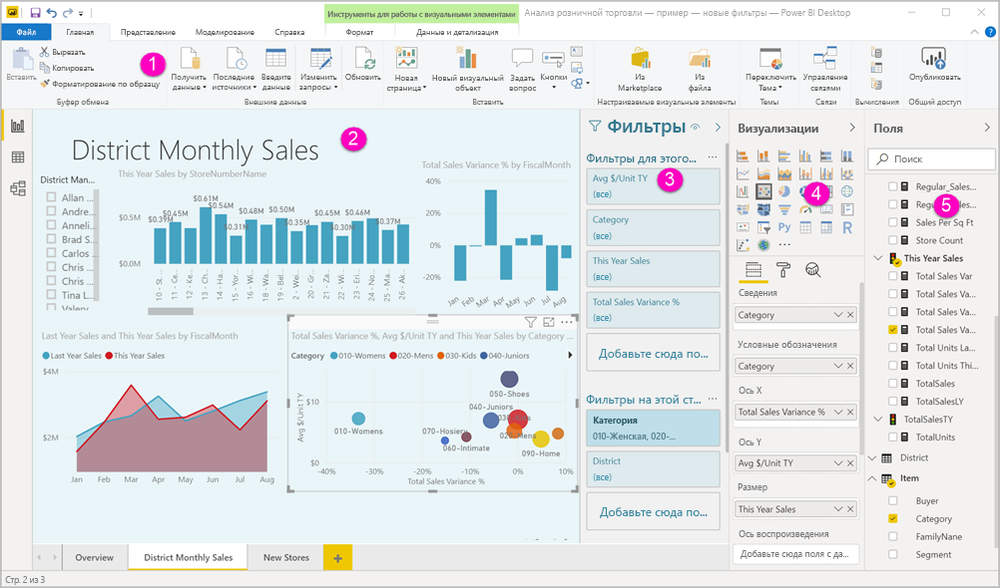

# Обзор редактора отчетов в Power BI

*Редактор отчетов* в Power BI Desktop и службе Power BI предназначен для создания отчетов, просматриваемых конечными пользователями, с диаграммами, таблицами, картами и другими визуальными элементами. Он аналогичен в двух этих средах. Обычно вы начинаете работу с создания отчета в Power BI Desktop. Затем вы публикуете его в службе Power BI, где можно продолжить его редактировать. В службе Power BI вы также можете создавать панели мониторинга на основе отчетов.

Созданные панели мониторинга и отчеты вы можете распространять между пользователями отчетов. В зависимости от того, какие права на доступ предоставляются пользователям, эти ресурсы могут использоваться в службе Power BI в режиме чтения, но не редактирования. См. дополнительные сведения о [возможностях работы с отчетами в службе Power BI](../consumer/end-user-reading-view.md). 

В этом видео демонстрируется редактор отчетов в Power BI Desktop. В этой статье также описан редактор отчетов в Power BI Desktop. 

<iframe width="560" height="315" src="https://www.youtube.com/embed/IkJda4O7oGs" frameborder="0" allowfullscreen></iframe>

В службе Power BI редактор отчетов доступен только в режиме правки. Чтобы открыть отчет в режиме правки, нужно быть его владельцем или автором либо участником рабочей области, в которой размещен отчет.

Редактор отчетов Power BI состоит из нескольких основных разделов:  

1. Панель навигации сверху
1. Холст отчетов
1. Панель "Фильтры"
1. Панель визуализаций
1. Панель "Поля"

## 1. Панель навигации сверху
С помощью панели навигации сверху можно выполнять самые разные действия, и их набор постоянно расширяется. Сведения о том или ином действии см. в оглавлении к документации Power BI (кроме того, вы можете воспользоваться полем поиска).

## 2. Холст отчетов
Холст отчетов — это среда для отображения работы. При использовании панелей "Поля", "Фильтры" и "Визуализации" для создания визуальных элементов они создаются и отображаются на холсте отчетов. Каждая вкладка в нижней части холста представляет страницу отчета. Выберите вкладку, чтобы открыть эту страницу. 

## Панели редактора отчетов

При первом открытии отчета отображаются три области: "Фильтры", "Визуализации" и "Поля". Две первые панели в левой части — "Фильтры" и "Визуализации" — позволяют настроить внешний вид визуализаций, включая их тип, цвет, фильтрацию и форматирование. Последняя панель "Поля" справа позволяет управлять базовыми данными, используемыми в визуализациях. Содержимое, отображаемое в редакторе отчетов, зависит от параметров, выбранных на холсте отчетов. 

Например, при выборе отдельного визуального элемента, такого как эта гистограмма:

**Панель "Фильтры"** содержит все фильтры в визуальном элементе на странице или всех страницах. В этом случае имеются фильтры на уровне страницы, но нет фильтров на уровне визуального элемента.

**Верхняя часть панели визуализации** определяет тип используемого визуального элемента. В данном примере это гистограмма с группировкой. 

**В нижней части панели визуализации** находятся три вкладки:

 **Поля** отображает поля в визуальном элементе. Возможно, для просмотра всех сведений потребуется прокрутить вниз. Эта диаграмма использует показатели StoreNumberName и продаж за этот год.

 **Формат** Чтобы отобразить панель форматирования для выбранной визуализации, щелкните значок с изображением валика.

 **Аналитика** Чтобы отобразить панель аналитики, щелкните значок лупы.

**Панель "Поля"** содержит все доступные таблицы в модели данных. При развертывании таблицы отображаются поля в ней. Желтый флажок означает, что в визуализации используется по крайней мере одно поле из таблицы.

Чтобы получить дополнительные сведения о каждой панели, продолжите чтение.

## 3. Панель "Фильтры"
Используйте панель "Фильтры", чтобы просматривать, создавать и настраивать сохраняемые фильтры в отчетах на уровне страницы, отчета, подробных сведений и визуального элемента. Вы также можете применять специальную фильтрацию к страницам отчетов и визуализациям путем выбора элементов визуализации или с помощью срезов. Преимуществом фильтрации на панели "Фильтры" является сохранение состояния фильтров в отчете. 

На панели "Фильтры" есть другая эффективная функция — фильтрация по полю, *которое не используется ни в одном визуальном элементе в отчете*. Я объясню. Когда вы создаете визуализацию, Power BI автоматически добавляет все поля из нее в область фильтров визуальных элементов на панели "Фильтры". Если нужно создать фильтр визуального элемента, страницы, детализации или отчета с помощью поля, которое сейчас не используется в визуализации, просто перетащите его в один из контейнеров фильтров.

Новый интерфейс фильтров повышает гибкость работы. Например, можно отформатировать фильтры, чтобы они соответствовали отчету. Кроме того, вы можете заблокировать фильтры или скрыть их для пользователей отчета. 

См. дополнительные сведения о [новых функциях фильтров](power-bi-report-filter.md).

## 4. Область визуализаций

Панель "Визуализации" содержит четыре раздела. Мы начнем сверху этой панели.

Здесь указывается тип визуализации. Маленькие значки показывают различные типы визуализаций, которые можно создать. На приведенном выше рисунке выбрана пузырьковая диаграмма. Если вы начинаете создавать визуализацию и выбираете поля, не выбрав предварительно тип визуализации, Power BI выбирает этот тип за вас. Вы можете сохранить выбор Power BI или изменить тип, выбрав другой значок.

Вы можете скачать пользовательские визуализации в Power BI Desktop. Их значки также отображаются на этой панели. 

### Управление полями в визуализации

Контейнеры (их иногда называют *категориями*) на этой панели изменяются в зависимости от типа выбранной визуализации.  Например, если выбрана линейчатая диаграмма, вы увидите контейнеры для оси, условных обозначений и значений. Когда вы выбираете поле или перетаскиваете его на холст, Power BI добавляет это поле в один из контейнеров.  Вы также можете перетаскивать поля из списка "Поля" непосредственно в контейнеры.  Некоторые контейнеры подходят только для определенных типов данных.  Например, контейнер **Значения** не принимает нечисловые поля. Таким образом, если перетащить поле **Категория** в контейнер **Значения**, Power BI изменяет его на **Count of Category** (Число категории).

Дополнительные сведения см. в разделе [Добавление визуализаций в отчет Power BI](../visuals/power-bi-report-add-visualizations-i.md).

Эта часть панели также содержит параметры для управления поведением [детализации](desktop-drillthrough.md) и фильтрации.

### Форматирование визуальных элементов
Отобразите область форматирования, щелкнув значок валика. Доступные параметры зависят от типа выбранной визуализации.

Возможности форматирования крайне обширны.  Чтобы узнать больше об этих возможностях и самостоятельно их изучить, ознакомьтесь с этими статьями:

* [Настройка заголовка, фона и условных обозначений визуализации](../visuals/power-bi-visualization-customize-title-background-and-legend.md)
* [Форматирование цветом](../visuals/service-getting-started-with-color-formatting-and-axis-properties.md)
* [Настройка свойств осей X и Y](../visuals/power-bi-visualization-customize-x-axis-and-y-axis.md)

### Добавление аналитики в визуализации
Чтобы отобразить панель "Аналитика", щелкните значок лупы. Доступные параметры зависят от типа выбранной визуализации.

Панель аналитики в службе Power BI позволяет добавлять динамические строки ссылок в визуализации, чтобы обратить внимание на важные тенденции или полезные сведения. Дополнительные сведения см. в статье [Панель "Аналитика" в Power BI Desktop](../transform-model/desktop-analytics-pane.md).

## 5. Панель "Поля"
На панели "Поля" отображаются таблицы, папки и поля в ваших данных, которые можно использовать для создания визуализаций.

|  |  |
| --- | --- |
|  |<ul><li>Перетащите поле на страницу, чтобы начать новую визуализацию.  Вы также можете перетащить поле на имеющуюся визуализацию, чтобы добавить его в эту визуализацию.  </li> <li>При установке флажка рядом с полем Power BI добавляет поле в активную (или новую) визуализацию, а также определяет, в какой контейнер поместить это поле.  Например, следует ли использовать поле для легенды, оси или значения? Power BI делает самый оптимальный выбор. Вы можете переместить его из этого контейнера в другой при необходимости.   </li><li>В любом случае все выбранные поля добавляются в панель "Визуализации" в редакторе отчетов.</li></ul> |

В Power BI Desktop вам также доступны команды для отображения и скрытия полей, добавления вычислений и т. д.

## Значки полей

Power BI использует несколько различных значков для указания типов полей в отчете. Познакомившись с ними, вы сможете лучше понять, как они работают в разных визуальных элементах. Ниже приведены наиболее типичные из них.

|Значок  |Значение  |
|---------|---------|
|  | Папка в списке "Поля" |
| | Числовое поле. Числовые поля — это статистические выражения, которые можно, например, суммировать или усреднять. Статистические выражения импортируются вместе с данными и определяются в модели данных, на которой основан отчет. Дополнительные сведения см. в разделе [Статистические выражения в отчетах Power BI](service-aggregates.md). |
| | Вычисляемый столбец с данными нечислового типа. Новые нечисловой столбец, создаваемый с помощью формулы на языке DAX, которая определяет значения столбца. Дополнительные сведения о [вычисляемых столбцах](../transform-model/desktop-calculated-columns.md). |
|     |   Числовой вычисляемый столбец. Новый столбец, создаваемый с помощью формулы на языке DAX, которая определяет значения столбца. Дополнительные сведения о [вычисляемых столбцах](../transform-model/desktop-calculated-columns.md). |
| |  Мера. Мера имеет собственную жестко заданную формулу. Это вычисление нельзя изменить: например, если это сумма, то нельзя получить ничего, кроме суммы. Значения не хранятся в столбце. Они рассчитываются оперативно, в зависимости от своего расположения в визуальном элементе. Дополнительные сведения см. в разделе [Основные сведения о мерах](../transform-model/desktop-measures.md). |
|     | Группа мер  |
| |      КПЭ. Наглядный индикатор, который позволяет оценить достижение определенной измеримой цели. Дополнительные сведения об визуальных элементах [ключевого показателя эффективности (КПЭ)](../visuals/power-bi-visualization-kpi.md) |
|     |  Иерархия полей. Чтобы увидеть поля, из которых состоит иерархия, щелкните стрелку.  Просмотрите на YouTube это видео по Power BI о [создании иерархий и работе с ними](https://www.youtube.com/watch?v=q8WDUAiTGeU) для получения дополнительных сведений. |
|     | Геоданные. Эти поля расположения можно использовать для создания визуализаций карты. |
|      | Поле удостоверения. Поля с этим значком являются *уникальными* и настроены для отображения всех значений, даже если они имеют дубликаты. Например, в ваших данных могут присутствовать записи для двух разных людей с именем "Николай Новиков", при этом каждая из них будет считаться уникальной. Суммироваться они не будут.   |
|   | Параметр. Задайте параметры, чтобы части ваших отчетов и моделей данных (такие как фильтр запроса, ссылка на источник данных, определение меры и т. п.) зависели от одного или нескольких значений параметров. Дополнительные сведения см. в записи блога Power BI о [параметрах запроса](https://powerbi.microsoft.com/blog/deep-dive-into-query-parameters-and-power-bi-templates/). |
|  | Поле календарной даты со встроенной таблицей дат |

## Дальнейшие действия
[Создание отчета](service-report-create-new.md)

Дополнительные сведения об отчетах в [службе Power BI](service-report-create-new.md), [Power BI Desktop](desktop-report-view.md) и [мобильных приложениях Power BI](../consumer/mobile/mobile-apps-view-phone-report.md).

[Основные понятия для разработчиков Power BI](../fundamentals/service-basic-concepts.md)

Появились дополнительные вопросы? [Ответы на них см. в сообществе Power BI.](https://community.powerbi.com/)
