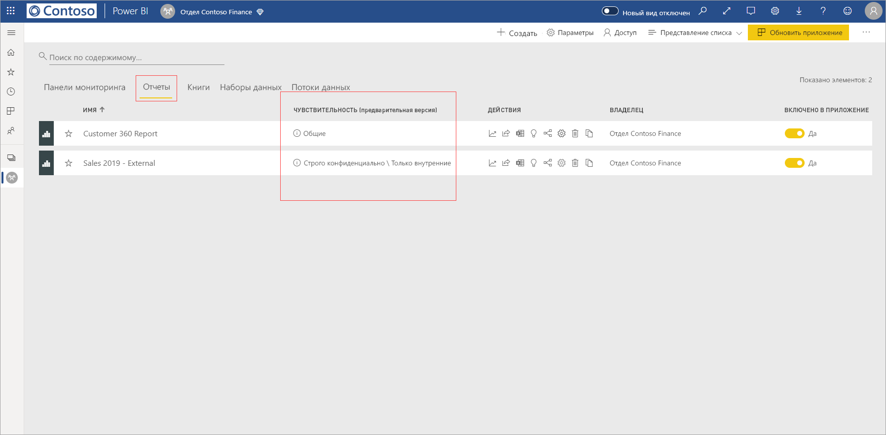
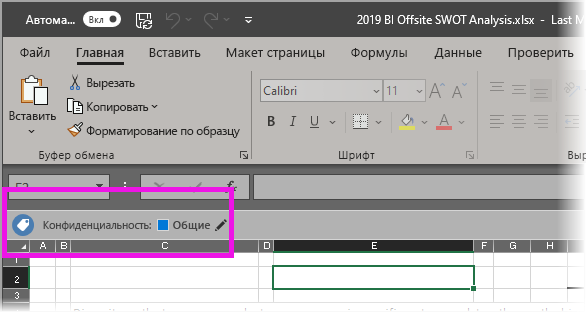

# Применение меток конфиденциальности данных в Power BI (предварительная версия)

Применяя метки конфиденциальности в службе Power BI, вы можете защитить панели мониторинга, отчеты, наборы и потоки данных от несанкционированного доступа и утечки. Используя соответствующие метки конфиденциальности, вы гарантируете, что доступ к данным будут получать только лица с соответствующими разрешениями.

Если включена защита данных, метки конфиденциальности отображаются в столбце "Конфиденциальность" в представлении списка для панелей мониторинга, отчетов, наборов и потоков данных.

> [!NOTE]
> Чтобы применять метки к панелям мониторинга, отчетам, наборам и потокам данных Power BI, вам потребуются определенные лицензии и разрешения. Дополнительные сведения см. в разделе [Применение меток конфиденциальности](#applying-sensitivity-labels).

## Применение меток конфиденциальности

Чтобы применять метки конфиденциальности в Power BI, вам и вашей организации потребуются следующие разрешения:

* В вашей организации должны быть определены метки конфиденциальности в [центре безопасности Microsoft 365](https://security.microsoft.com/) или в [центре соответствия требованиям Microsoft 365](https://compliance.microsoft.com/).
* Вы должны входить в группу безопасности, которой назначены разрешения на применение меток конфиденциальности данных, как описывается в статье [Активация меток конфиденциальности данных в Power BI (предварительная версия)](../admin/service-security-enable-data-sensitivity-labels.md#enable-data-sensitivity-labels).
* У вас должны быть лицензия Power BI Pro и разрешения на редактирование для ресурсов, к которым требуется добавлять метки. 
* У вас должна быть лицензия Azure Information Protection Premium P1 или Premium P2. Средство Microsoft Azure Information Protection можно приобрести как отдельно, так и в составе одного из наборов лицензирования Майкрософт. Дополнительные сведения см. в статье [Цены на Azure Information Protection](https://azure.microsoft.com/pricing/details/information-protection/).

Чтобы применить метку конфиденциальности к отчету или изменить ее, щелкните значок "Параметры отчета" в элементе списка рабочей области, а затем выберите раздел "Конфиденциальность данных" в боковой области "Параметры". Выберите соответствующую метку конфиденциальности и сохраните параметры.

Обновленная метка конфиденциальности отображается в столбце "Конфиденциальность". 

Применение и изменение меток конфиденциальности для панелей мониторинга осуществляется так же, как и для отчетов. 

Кроме того, вы можете задавать метки конфиденциальности для наборов и потоков данных. На следующем рисунке показано, как задать метку конфиденциальности для набора данных. Для потоков данных применяется аналогичный процесс.

Чтобы задать метку конфиденциальности для набора данных, откройте вкладку "Наборы данных", нажмите кнопку с многоточием для набора данных, к которому нужно применить метку, после чего щелкните **Параметры**.

На странице параметров набора данных откройте раздел "Метка конфиденциальности", выберите нужную метку и нажмите кнопку **Применить**.

Применение и изменение меток конфиденциальности для потоков данных осуществляется так же, как и для наборов данных.

## Удаление меток конфиденциальности
Чтобы удалить метку конфиденциальности из отчета, панели мониторинга, набора данных или потока данных, выполните [процедуру, используемую для применения меток](#applying-sensitivity-labels), но выберите **(Нет)** при появлении запроса на классификацию конфиденциальности данных. 

## Защита данных в экспортируемых файлах

Если вы [экспортируете из отчета данные](https://docs.microsoft.com/power-bi/consumer/end-user-export), к которым применена метка конфиденциальности, эта метка включается в создаваемый файл в формате Excel, PowerPoint или PDF (формат CSV не поддерживается). Метка конфиденциальности будет отображаться в файле. Доступ к такому файлу смогут получать только пользователи с достаточными разрешениями.

## Рекомендации и ограничения

При использовании меток конфиденциальности данных необходимо учитывать следующие ограничения:

* Для применения и просмотра меток конфиденциальности Microsoft Information Protection в Power BI пользователям требуется лицензия Azure Information Protection Premium P1 или Premium P2. Средство Microsoft Azure Information Protection можно приобрести как отдельно, так и в составе одного из наборов лицензирования Майкрософт. Дополнительные сведения см. в статье [Цены на Azure Information Protection](https://azure.microsoft.com/pricing/details/information-protection/).
* Метки конфиденциальности можно применять только к панелям мониторинга, отчетам, наборам и потокам данных.
* При экспорте метки и элементы управления защитой поддерживаются только для файлов в формате Excel, PowerPoint и PDF. Метки и элементы управления защитой не применяются при экспорте данных в CSV-файлы, оформлении подписки на электронную почту, внедрении визуальных элементов и печати.
* Пользователь, экспортирующий файл из Power BI, должен иметь разрешения на доступ к соответствующему файлу и его редактирование в соответствии с параметрами метки конфиденциальности. Пользователь, экспортирующий данные, не получает разрешения владельца файла. 
* На данный момент не поддерживаются метки конфиденциальности для [отчетов с разбивкой на страницы]( https://docs.microsoft.com/power-bi/paginated-reports-report-builder-power-bi) и рабочих книг. 
* Метки конфиденциальности ресурсов Power BI отображаются только в представлениях списка рабочей области и происхождения. На данный момент метки не видны в представлениях "Избранное", "Мне предоставлен доступ", "Недавние" и "Приложения". Тем не менее, следует помнить, что примененная к ресурсу Power BI метка, даже если она не отображается, всегда сохраняется вместе с данными, экспортируемыми в файлы формата Excel, PowerPoint и PDF.
* Параметр *шифрования файла* для метки конфиденциальности, настраиваемый в [центре безопасности Microsoft 365](https://security.microsoft.com/) или в [центре соответствия требованиям Microsoft 365](https://compliance.microsoft.com/), применяется только к файлам *экспортируемым из* Power BI, и не действует *в среде* Power BI.
* Для меток, примененных в Power BI, не поддерживается защита с использованием [функции хранения собственных ключей (HYOK)](https://docs.microsoft.com/azure/information-protection/configure-adrms-restrictions).
* Для просмотра и применения меток в приложениях Office [требуются соответствующие лицензии](https://docs.microsoft.com/microsoft-365/compliance/get-started-with-sensitivity-labels#subscription-and-licensing-requirements-for-sensitivity-labels).
* Метки конфиденциальности поддерживаются только для клиентов в глобальном (общедоступном) облаке. Метки конфиденциальности не поддерживаются для клиентов в облаках других видов.
* Метки конфиденциальности не поддерживаются для [внешних пользователей (гостевых пользователей Azure Active Directory B2B)](../service-admin-azure-ad-b2b.md). Это означает, что внешние пользователи не могут просматривать метки и экспортировать данные в файлы Excel, PDF и PPTX. [Удалите метку](#removing-sensitivity-labels), чтобы разрешить внешним пользователям экспортировать данные в эти типы файлов.

## Дальнейшие действия

В этой статье приводятся сведения о применении меток конфиденциальности данных в Power BI. В следующих статьях вы найдете дополнительные сведения о защите данных в Power BI. 

* [Общие сведения о защите данных в Power BI](../admin/service-security-data-protection-overview.md)
* [Активация меток конфиденциальности данных в Power BI](../admin/service-security-enable-data-sensitivity-labels.md)
* [Использование элементов управления Microsoft Cloud App Security в Power BI](../admin/service-security-using-microsoft-cloud-app-security-controls.md)