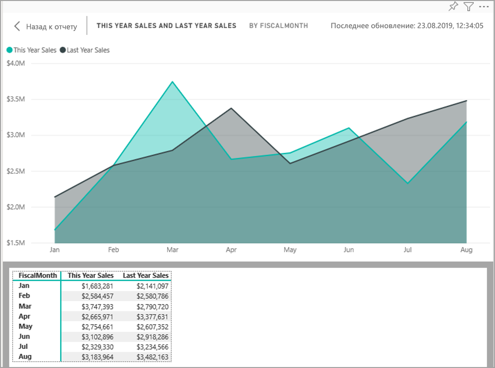
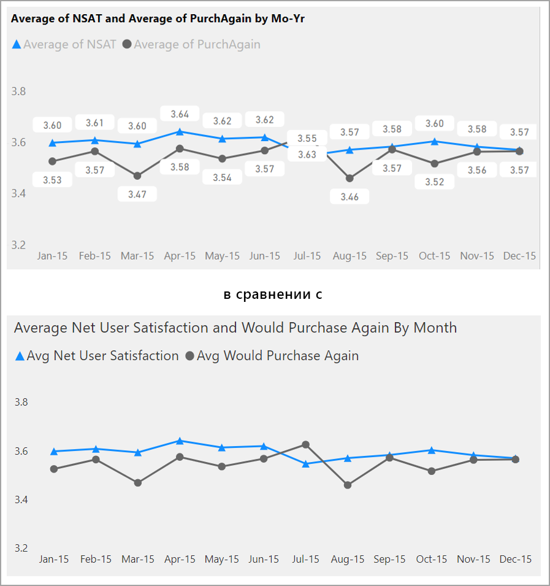
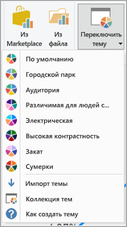

# Создание отчетов со специальными возможностями Power BI
Вы можете проектировать и создавать привлекательные отчеты, в которых также предусмотрена поддержка специальных возможностей. При создании отчета для любой аудитории нужно сделать так, чтобы с ним могло работать как можно больше пользователей без необходимости адаптации.

В этой статье описываются специальные возможности и средства для создания отчетов в Power BI.

В общем случае при использовании Power BI с программой чтения с экрана рекомендуется отключить режим сканирования или режим просмотра.

Чтобы улучшить процесс создания отчетов с помощью средств чтения с экрана, предоставляется контекстное меню. Оно позволяет перемещать поля вверх или вниз в списке **Поля**, а также перемещать поле в другие ячейки, такие как **Условные обозначения**, **Значение** и другие.

## Типы специальных возможностей

Power BI позволяет создавать отчеты с поддержкой специальных возможностей, но за их реализацию отвечает автор отчета. В этой статье описываются специальные возможности трех категорий:

* встроенные специальные возможности (настройка не требуется);
* встроенные специальные возможности (настройка требуется);
* иные советы и рекомендации.

Мы рассмотрим каждую из этих категорий в следующих разделах.

## Встроенные специальные возможности

В Power BI есть встроенные специальные возможности, которые не требуют никакой настройки автором отчета. К ним относятся:

* навигация с помощью клавиатуры;
* совместимость со средствами чтения с экрана;
* режим высокой контрастности;
* Режим фокусировки
* отображение таблицы данных.

Существуют также функции, помогающие в работе с отчетами. Статьи с их описанием можно найти в разделе [Дальнейшие действия](#next-steps) в конце этой статьи.

Давайте поочередно рассмотрим каждую из этих встроенных специальных возможностей. 

### Навигация с помощью клавиатуры

Автору отчета не нужно беспокоиться о том, смогут ли пользователи перемещаться по отчету с помощью клавиатуры. Все визуальные элементы Power BI поддерживают навигацию с помощью клавиатуры. Пользователь отчета сможет переходить по точкам данных в визуальных элементах, переключаться между вкладками страниц и пользоваться интерактивными возможностями, включая перекрестное выделение, фильтрацию и срезы.

Текущее место, где находится пользователь в отчете, отмечается фокусом. В зависимости от используемого браузера фокус может отображаться по-разному.

Для доступа к наиболее часто используемым сочетаниям клавиш можно нажать *?* , откроется диалоговое окно с описанием часто используемых сочетаний клавиш. Дополнительные сведения см. в статьях, посвященных работе с отчетами с использованием специальных возможностей, в разделе [Дальнейшие действия](#next-steps) в конце этой статьи.

### Совместимость со средствами чтения с экрана

Как правило, каждый объект в Power BI, поддерживающий навигацию с помощью клавиатуры, также совместим со средствами чтения с экрана. Когда пользователь отчета переходит к визуальному элементу, средство чтения с экрана произносит заголовок, тип визуального элемента и замещающий текст, если он задан.

### Режим высокой контрастности

Отчеты Power BI поддерживают высокую контрастность. Если в Windows используется режим высокой контрастности, Power BI Desktop автоматически определяет используемую в Windows высококонтрастную тему и применяет соответствующие параметры к отчетам. Контрастные цвета сохраняются в отчете при его публикации в службе Power BI или другом месте.

Служба Power BI также пытается определить параметры высокой контрастности, выбранные в Windows, однако эффективность и точность их определения зависит от браузера, в котором используется служба Power BI. Чтобы настроить тему в службе Power BI вручную, в правом верхнем углу можно выбрать **Вид > Цвета с высокой контрастностью**, а затем тему, которую нужно применить к отчету.

### Режим фокусировки
Если пользователь отчета просматривает визуальный элемент на панели мониторинга, он может развернуть его, чтобы тот занимал большую часть экрана. Для этого нужно выбрать в контекстном меню визуального элемента пункт **Открыть в режиме фокусировки**.

### Отображение таблицы данных
Пользователи отчета также могут просмотреть данные визуального элемента в табличном формате, нажав клавиши **ALT+SHIFT+F11**. Эта таблица похожа на ту, которая отображается при выборе пункта **Показать данные** в контекстном меню визуального элемента, но адаптирована для средств чтения с экрана.

## Встроенные специальные возможности, требующие настройки

В Power BI есть встроенные специальные возможности, которые требуют настройки автором отчета.  К ним относятся:

* Альтернативный текст
* Порядок вкладок
* заголовки и метки;
* маркеры;
* Темы отчетов

## Альтернативный текст

Замещающий текст (альтернативные текстовые описания) служит для описания внешнего вида и назначения визуальных элементов и изображений на странице отчета для пользователей средства чтения с экрана. Авторы отчетов должны добавлять замещающий текст для каждого объекта в отчете, содержащего осмысленные сведения. Таким образом, пользователи отчета поймут, что представляет собой визуальный элемент (изображение, форма или текстовое поле), даже если они его не видят. Вы можете указать замещающий текст для любого объекта в отчете Power BI Desktop. Выберите объект (например, визуальный элемент, фигуру и т. д.) и на панели **Визуализации** в разделе **Формат** разверните **Общие**, а затем прокрутите вниз и заполните текстовое поле **Замещающий текст**. Длина **замещающего текста** не может превышать 250 символов.

Замещающий текст должен сообщать, какую информацию пользователь отчета может получить из визуального элемента. Так как средство чтения с экрана произносит заголовок и тип визуального элемента, необходимо ввести только описание. Например, для следующего визуального элемента замещающий текст может быть таким: *Итоговая удовлетворенность пользователей по цветам проданных товаров с дальнейшей разбивкой по классу товаров.*

Имейте в виду, что включать аналитические сведения или конкретные точки данных в статический замещающий текст может быть не совсем правильно, так как данные в Power BI являются динамическими. Если вы хотите использовать динамический замещающий текст, см. следующий раздел, в котором описывается условное форматирование для замещающего текста.

### Условное форматирование для замещающего текста

Одна из особенностей, выгодно отличающих Power BI, заключается в динамическом характере данных. Для создания динамического замещающего текста можно использовать меры DAX и условное форматирование. После этого средства чтения с экрана смогут произносить значения, относящиеся к данным, которые просматривает пользователь отчета.

### Порядок вкладок
Установив последовательность табуляции, вы поможете пользователям, использующим клавиатуру, перемещаться по отчету в том же порядке, в котором визуальные элементы отчета обычно воспринимаются визуально. Если в отчете есть декоративные фигуры и изображения, их следует исключить из последовательности табуляции. 

Чтобы задать последовательность табуляции, выберите на ленте вкладку **Просмотр** и установите флажок **Область выделения**, чтобы отобразить область "Выбор".

Если в области **Выбор** выбрать **Последовательность табуляции**, отобразится текущая последовательность табуляции в отчете. Вы можете выбрать объект, а затем с помощью кнопок со стрелками вверх и вниз переместить его в иерархии, или можно выбрать объект с помощью мыши и перетащить его в нужное положение в списке. Если щелкнуть номер рядом с объектом, он будет скрыт в последовательности табуляции.

### Заголовки и метки
Заголовки визуальных элементов и страниц отчетов — это важные специальные возможности, помогающие пользователям ориентироваться в отчетах. Старайтесь не использовать в заголовках отчетов сокращения и профессиональный жаргон. Если доступ к отчету будет предоставлен новому сотруднику вашей организации или внешнему пользователю, он может не понять, что означает заголовок. На рисунке ниже показан визуальный элемент с сокращением в заголовке (слева) и более понятным заголовком (справа).

В визуальном элементе все заголовки, метки осей, значения условных обозначений и метки данных должны быть удобочитаемы и понятны. Сравните приведенные ниже изображения, на первом из которых мало числовых значений и описаний данных, а на втором много.

Метки данных можно также включать или отключать для каждого ряда в визуальном элементе или размещать их над или под рядом. Хотя Power BI пытается оптимально расположить метки данных над или под линией, иногда результат выглядит не лучшим образом. В представленном ниже визуальном элементе метки данных перепутаны, и разобраться в них сложно.

Размещение меток данных выше или ниже ряда может помочь решить эту проблему, особенно если вы используете график с несколькими линиями. Теперь, после того как было внесено несколько изменений, метки данных выглядят гораздо лучше.

### Маркеры

Использовать цвета (включая условное форматирование компонентов) в качестве единственного способа передачи информации не рекомендуется. Для обозначения разных рядов можно также использовать маркеры.

Для визуальных элементов "График", "Диаграмма с областями", "Комбинированная диаграмма", а также "Точечная диаграмма" и "Пузырьковая диаграмма" можно включить маркеры и использовать различные формы маркера для каждой линии.

Чтобы включить маркеры, в области "Визуализации" выберите раздел "Формат", разверните раздел **Фигуры**, а затем прокрутите вниз, чтобы найти переключатель **Показать маркеры**, и установите его в положение **Вкл.** , как показано на рисунке ниже. 

Вы также можете использовать переключатель **Настроить серию**, чтобы выбрать имя каждой линии (или области, если используете диаграмму с областями) в раскрывающемся списке в разделе "Фигуры". Под раскрывающимся списком можно настроить многие аспекты метки, используемой для выбранной линии, включая ее форму, цвет и размер.

Хотя мы рекомендуем авторам отчетов включать метки данных и маркеры, их включение для каждого визуального элемента может отвлекать внимание и делать отчеты менее удобными для работы. На рисунке ниже можно сравнить визуальный элемент с включенными метками данных и маркерами с более понятной версией с отключенными метками данных.

Если вы не уверены, перегружен ли визуальный элемент или отчет деталями, проведите [тест на размытие](https://chrome.google.com/webstore/detail/the-squint-test/gppnipfbappicilfniaimcnagbpfflpg).  Если взгляд в первую очередь притягивается к меткам данных, а не к точкам данных, отключите метки.

### Темы, контраст и цвета, различимые для людей с цветовой слепотой

Текст отчета и фоновые цвета должны быть достаточно контрастны. Согласно критерию успеха 1.4.3 руководства WCAG 2.1 контрастность между цветами текста и фона должна составлять не менее 4,5:1. Существует ряд средств, таких как [анализатор контрастности цвета](https://developer.paciellogroup.com/resources/contrastanalyser/), [WebAIM](https://webaim.org/resources/contrastchecker/) и [Accessible Colors](https://accessible-colors.com/), позволяющих проверить цвета в отчете.

Также следует учитывать, что некоторые пользователи отчетов могут иметь недостатки цветового зрения. С помощью таких средств, как [Coblis](https://www.color-blindness.com/coblis-color-blindness-simulator/) и [Vischeck](https://www.vischeck.com/vischeck/vischeckImage.php), можно сымитировать, что будут видеть пользователи с различными недостатками цветового зрения.  Используя меньшее число цветов или монохромную палитру, можно сделать отчет доступным большему числу пользователей.

Некоторые сочетания цветов особенно сложны для различения пользователями с недостатками цветового зрения. К ним относятся следующие: 

* зеленый и красный;
* зеленый и коричневый;
* синий и сиреневый;
* зеленый и синий;
* светло-зеленый и желтый;
* синий и серый;
* зеленый и серый;
* зеленый и черный.

Избегайте использования этих цветов в одной диаграмме или на одной странице отчета. В Power BI есть встроенные темы, помогающие сделать отчет более доступным, однако рекомендуется проверить отчет с помощью дополнительных средств, предлагаемых в этой статье.

## Советы и рекомендации
В этом разделе приводится ряд указаний, советов и рекомендаций, которые следует учитывать при создании отчетов со специальными возможностями.

### Учет пожеланий аудитории

Создание отчета — это итеративный процесс. Прежде чем приступать к размещению визуальных элементов на странице, поговорите с будущими пользователями отчета, чтобы лучше понять, какие сведения они хотят получить из отчета и в какой форме.  

Реализация специальных возможностей должна быть частью этого процесса. Может оказаться, что ваше представление отличается от желаний пользователей. Подготовив черновой вариант отчета, покажите его пользователю, чтобы получить отзыв. Сбор отзывов автором отчета может помочь избежать в будущем большого количества запросов изменений от недовольных пользователей.

### Простота и единообразность

Отчет должен быть как можно более простым. Часто авторы пытаются вместить как можно больше в один визуальный элемент. Зачастую его разбиение на несколько визуальных элементов упрощает восприятие. Рассмотрите возможность использования нескольких визуальных элементов, если они представляют разные аспекты данных, и используйте фильтры или визуальные взаимодействия для расширения возможностей. В то же время следует свести количество визуальных элементов на странице к минимуму. Старайтесь избегать избыточности и не перегружайте страницу деталями. Два визуальных элемента для представления одной и той же информации будут лишними. Пользователи отчета могут быть перегружены информацией из слишком большого количества визуальных элементов, и им будет трудно сосредоточиться на нужных сведениях. Большое количество визуальных элементов на странице не только затрудняет работу с отчетом, но и может снизить производительность.

Обеспечьте единообразие, используя одинаковый цвет фона и стиль для всех визуальных элементов в отчете. Используйте один и тот же размер шрифта для заголовков всех визуальных элементов, а также для меток данных и заголовков осей. Если срезы используются на нескольких страницах отчета, их следует размещать в одном и том же месте на каждой странице.

### Тест на восприятие людьми со слабым зрением

Чтобы быстро проверить, как будет выглядеть отчет для пользователей со слабым зрением, можно уменьшить яркость экрана компьютера или мобильного устройства.  Существуют надстройки для браузеров, позволяющие выполнить тест на размытие.

## Контрольный список специальных возможностей для работы с отчетами

Помимо имеющихся в Power BI специальных возможностей, при создании отчетов можно использовать приведенный ниже контрольный список. Он поможет обеспечить доступность отчетов для самой широкой аудитории перед публикацией. 

### Все визуальные элементы

* Контрастность между цветами текста заголовков, меток осей и меток данных с одной стороны и цветом фона с другой должна быть не менее 4,5:1.
* Старайтесь не использовать цвета в качестве единственного способа передачи информации. Используйте текст или значки в дополнение к цвету или вместо него.
* Не используйте жаргон или сокращения.
* Добавьте **замещающий текст** ко всем недекоративным визуальным элементам на странице.
* Проверьте, хорошо ли различима страница отчета для пользователей с недостатками цветового зрения.

### Срезы
* Если на страницах отчета имеется набор из нескольких срезов, их оформление должно быть одинаковым на всех страницах. По возможности используйте одинаковые шрифт, цвета и расположение.

### Текстовое поле
* Контрастность между цветами шрифта и фона должна быть не менее 4,5:1.
* Не забудьте добавить в поле **Замещающий текст** текстовое содержимое, которое будет произноситься средствами чтения с экрана.

### Взаимодействие визуальных элементов
* Доступны ли важные сведения только посредством взаимодействия? Если это так, измените визуальные элементы так, чтобы они были предварительно отфильтрованы. Это позволит пользователям быстрее делать выводы.
* Используются ли закладки для навигации? Попробуйте перейти по элементам отчета с помощью клавиатуры, чтобы убедиться в том, что навигация достаточна удобна для людей, использующих только клавиатуру.

### порядок сортировки;
* Настроили ли вы порядок сортировки для каждого визуального элемента на странице? В таблице, отображаемой при выборе команды **Показать данные**, данные приводятся в порядке сортировки, заданном для визуального элемента.

### Подсказки
* Не используйте подсказки для передачи важной информации. Пользователи с нарушениями двигательных функций и пользователи, не использующие мышь, будут иметь трудности с доступом к ней.
* Добавьте подсказки к диаграммам для передачи вспомогательной информации. Она включается в таблицу, отображаемую при выборе команды **Показать данные**, для каждого визуального элемента.

### Видеотехника
* Избегайте автоматического запуска видео при отображении страницы.
* Убедитесь в том, что в видео есть субтитры, или предоставьте произносимый текст.

### Аудио
* Избегайте автоматического запуска воспроизведения звука при отображении страницы.
* Предоставьте произносимый текст для любой звуковой записи.

### Фигуры
* Декоративные фигуры должны быть помечены как скрытые в последовательности табуляции, чтобы средство чтения с экрана пропускало их.
* Не используйте слишком много декоративных фигур, чтобы не отвлекать внимание.
* При использовании фигур, связанных с точками данных, укажите **замещающий текст** с пояснениями.

### Образы
* При использовании изображений, связанных с точками данных, укажите **замещающий текст** с пояснениями.
* Декоративные изображения должны быть помечены как скрытые в последовательности табуляции, чтобы средство чтения с экрана пропускало их.
* Не используйте слишком много декоративных изображений, чтобы не отвлекать внимание.

### Визуальные элементы Power BI
* Проверьте таблицу, отображаемую при выборе команды **Показать данные**, для каждого визуального элемента Power BI. Если представленных сведений недостаточно, выберите другой визуальный элемент.
* Пользовательский визуальный элемент *Ось воспроизведения* не должен воспроизводиться автоматически. Явно укажите, что пользователь должен нажать кнопку воспроизведения или приостановки, чтобы запустить или остановить воспроизведение.

### Набор визуальных элементов на странице
* Установите последовательность табуляции и пометьте все декоративные элементы как скрытые.

## Рекомендации и ограничения
Существует несколько известных проблем и ограничений при настройке специальных возможностей. Они указаны в следующем списке:

* Для наилучшего взаимодействия с **Power BI Desktop** откройте выбранное средство чтения с экрана перед тем, как открывать какие-либо файлы в **Power BI Desktop**.

## Дальнейшие действия

Ниже перечислены статьи, посвященные специальным возможностям в Power BI:

* [Обзор специальных возможностей в Power BI](desktop-accessibility-overview.md) 
* [Специальные возможности для работы с отчетами Power BI](desktop-accessibility-consuming-tools.md)
* [Специальные возможности для создания отчетов Power BI](desktop-accessibility-creating-tools.md)
* [Сочетания клавиш для специальных возможностей в отчетах Power BI](desktop-accessibility-keyboard-shortcuts.md)
* [Контрольный список специальных возможностей для работы с отчетами](#report-accessibility-checklist)
