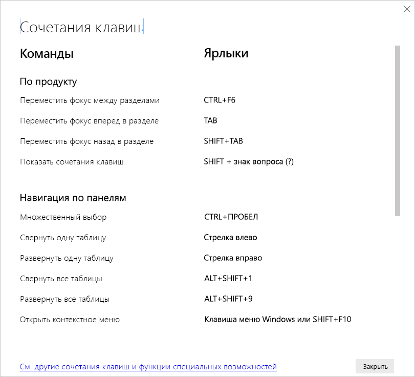

# Сочетания клавиш в Power BI Desktop

Сочетания клавиш используются для навигации по отчетам Power BI с помощью клавиатуры. В этой статье приводятся таблицы, в которых описываются сочетания клавиш, доступные для работы с отчетами Power BI. 

При работе с Power BI Desktop можно нажать клавиши **SHIFT+?** для вывода справки по сочетаниям клавиш, как показано на следующем рисунке.

Эти сочетания применимы не только в **Power BI Desktop** — их также можно использовать со следующими компонентами:

* диалоговое окно **обозревателя вопросов и ответов**;
* диалоговое окно **начала работы**;
* меню **Файл** и диалоговое окно **О программе**;
* панель **предупреждений**;
* диалоговое окно **восстановления файлов**;
* диалоговое окно **нахмуренных смайликов**.

Мы непрерывно работаем над улучшениями специальных возможностей, и представленный список функций также поддерживает параметры высокой контрастности и средства чтения с экран.

## Часто используемые сочетания клавиш
| Требуемое действие           | Нажать                |
| :------------------- | :------------------- |
| Переместить фокус между разделами  | **CTRL+F6** |
| Переместить фокус вперед в разделе | **TAB**         |
| Переместить фокус назад в разделе | **SHIFT+TAB** |
| Выбор объекта или отмена его выбора | **ВВОД** или **ПРОБЕЛ** |
| Выбор нескольких объектов | **CTRL+ПРОБЕЛ** |

## На визуальном элементе
| Требуемое действие           | Нажать                |
| :------------------- | :------------------- |
| Переместить фокус на меню визуального элемента | **ALT+SHIFT+F10** |
| Показать данные | **ALT+SHIFT+F11**  |
| Войти в визуальный элемент | **CTRL+СТРЕЛКА ВПРАВО** |
| Войти в слой | **ВВОД** |
| Выйти из слоя или визуального элемента | **ESC** |
| Выбор точки данных или отмена ее выбора | **ВВОД** или **ПРОБЕЛ** |
| Множественный выбор | **CTRL+ВВОД** или **CTRL+ПРОБЕЛ** |
| Щелчок правой кнопкой мыши | <ul><li>Клавиатура Windows: **клавиша контекстного меню Windows+F10**. Клавиша контекстного меню Windows находится между клавишей ALT слева и клавишей СТРЕЛКА ВЛЕВО</li><li>Другая клавиатура: **SHIFT+F10**</li></ul> |
| Очистить выделение | **CTRL+SHIFT+C** |
| Показать или скрыть подсказку | **CTRL+H** |

## Навигация по матрице и таблице
| Требуемое действие          | Нажать                |
| :------------------- | :------------------- |
| Перемещение фокуса на одну ячейку вверх или вниз (по всем ячейкам во всех областях)  | **СТРЕЛКА ВВЕРХ** / **СТРЕЛКА ВНИЗ** |
| Перемещение фокуса на одну ячейку вправо или влево (по всем ячейкам во всех областях)  | **СТРЕЛКА ВЛЕВО** / **СТРЕЛКА ВПРАВО** |

## Навигация по панелям
| Требуемое действие           | Нажать                |
| :------------------- | :------------------- |
| Множественный выбор | **CTRL+ПРОБЕЛ** |
| Свернуть одну таблицу | **СТРЕЛКА ВЛЕВО** |
| Развернуть одну таблицу | **СТРЕЛКА ВПРАВО** |
| Свернуть все таблицы | **ALT+SHIFT+1** |
| Развернуть все таблицы | **ALT+SHIFT+9** |
| Открыть контекстное меню | <ul><li>Клавиатура Windows: **клавиша контекстного меню Windows+F10**.  Клавиша контекстного меню Windows находится между клавишей ALT слева и клавишей СТРЕЛКА ВЛЕВО</li><li>Другая клавиатура: **SHIFT+F10**</li></ul> |

## Срез
| Требуемое действие         | Нажать                |
| :------------------- | :------------------- |
| Взаимодействовать со срезом | **CTRL+СТРЕЛКА ВПРАВО** |

## Область выделения
| Требуемое действие           | Нажать                |
| :------------------- | :------------------- |
| Открыть панель выбора | **F6** |
| Переместить объект на слой выше | **CTRL+SHIFT+F** |
| Переместить объект на слой ниже | **CTRL+SHIFT+B** |
| Показать или скрыть объект | **CTRL+SHIFT+S** |

## Редактор DAX
| Требуемое действие          | Нажать                |
| :------------------- | :------------------- |
| Переместить строку вверх или вниз | **ALT+СТРЕЛКА ВВЕРХ** / **СТРЕЛКА ВНИЗ** |
| Копировать строку вверх или вниз | **SHIFT+ALT+СТРЕЛКА ВВЕРХ** / **СТРЕЛКА ВНИЗ** |
| Добавление строки ниже курсора | **CTRL+ВВОД** |
| Добавление строки выше курсора | **CTRL+SHIFT+ВВОД** |
| Переход к парной скобке | **CTRL+SHIFT+**  \ |
| Отступ строки или расширение строки на поле | **CTRL+]**  /  **[** |
| Вставка курсора | **ALT+щелчок** |
| Выделение текущей строки | **CTRL+I** |
| Выбор всех вхождений текущего выделения | **CTRL+SHIFT+L** |
| Выбор всех вхождений текущего слова | **CTRL+F2** |

## Ввод данных
| Требуемое действие           | Нажать                |
| :------------------- | :------------------- |
| Выход из редактируемой сетки: | **CTRL+TAB** |

## Рекомендации и ограничения
Существует несколько известных проблем и ограничений при настройке специальных возможностей. Они указаны в следующем списке:

* Для наилучшего взаимодействия с **Power BI Desktop** откройте выбранное средство чтения с экрана перед тем, как открывать какие-либо файлы в **Power BI Desktop**.
* Если вы используете экранный диктор, существуют некоторые ограничения при навигации по окну **Отображение данных** как по таблице HTML.

## Дальнейшие действия

Ниже перечислены статьи, посвященные специальным возможностям в Power BI:

* [Обзор специальных возможностей в Power BI](desktop-accessibility-overview.md) 
* [Создание отчетов Power BI со специальными возможностями](desktop-accessibility-creating-reports.md) 
* [Специальные возможности для работы с отчетами Power BI](desktop-accessibility-consuming-tools.md)
* [Специальные возможности для создания отчетов Power BI](desktop-accessibility-creating-tools.md)
* [Контрольный список специальных возможностей для работы с отчетами](desktop-accessibility-creating-reports.md#report-accessibility-checklist)

Рекомендуем также ознакомиться со следующими статьями:

* [Использование тем отчетов в Power BI Desktop](desktop-report-themes.md)

