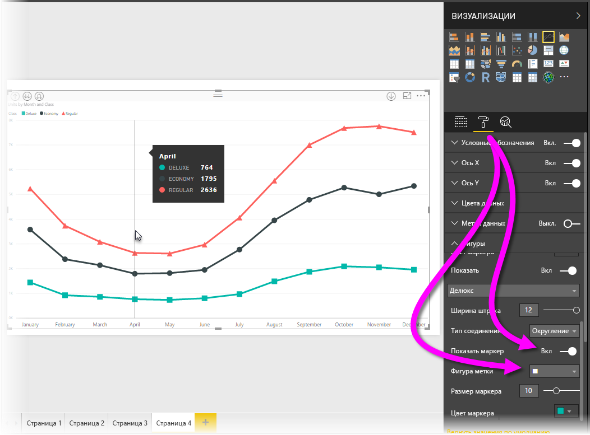
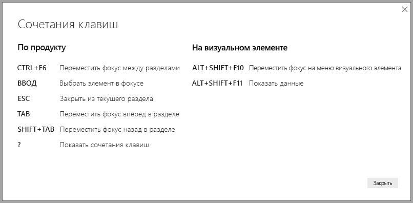
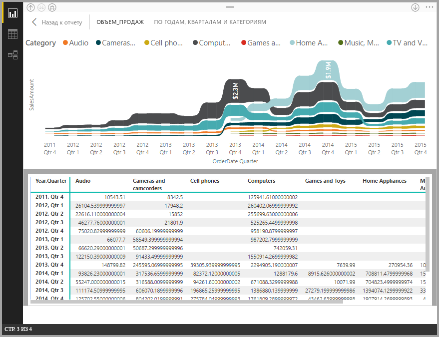
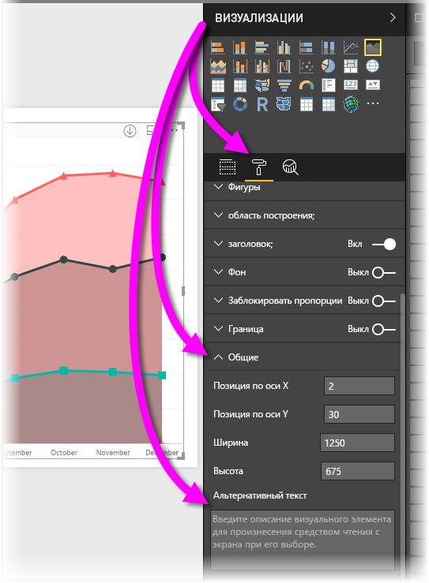
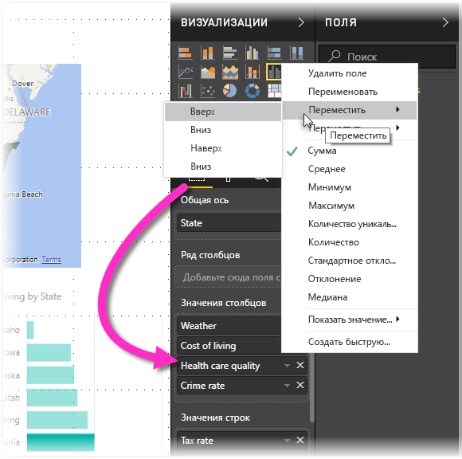

# Специальные возможности в отчетах Power BI Desktop
В Power BI есть функции, упрощающие использование отчетов Power BI и работу с ними для людей с ограниченными возможностями. Эти функции включают возможность работать с отчетом, используя клавиатуру или средство чтения с экрана, фокусироваться на различных объектах на странице с помощью клавиши TAB и разумное использование меток в визуализации.

## Работа с отчетами Power BI Desktop с помощью клавиатуры или средства чтения с экрана
Начиная с выпуска **Power BI Desktop** за сентябрь 2017 г. вы можете нажимать клавишу **?**, чтобы отобразить окно с описанием специальных сочетаний клавиш, используемых в **Power BI Desktop**.

Благодаря улучшенным специальным возможностям вы можете работать с отчетом Power BI с помощью клавиатуры или средства чтения с экрана, используя следующие методы.

Как правило, при просмотре отчета режим сканирования должен быть отключен.

Вы можете переключать фокус между вкладками страницы отчета или объектами на открытой странице отчета с помощью клавиш **CTRL+F6**.

* Когда фокус находится на *вкладках страницы отчета*, используйте клавишу *TAB* или *клавиши со стрелками* для перемещения фокуса с одной страницы отчета на другую. Средство чтения с экрана читает вслух заголовок страницы отчета, если он в этот момент выбран. Чтобы загрузить страницу отчета, находящуюся в фокусе, используйте клавишу *ВВОД* или *ПРОБЕЛ*.
* Когда фокус находится на загруженной *странице отчета*, используйте клавишу *TAB*, чтобы смещать фокус на объекты на странице, в частности на текстовые поля, изображения, фигуры и диаграммы. Средство чтения с экрана считывает тип объекта, его название (если оно есть) и описание (если автор отчета добавил его). 

При навигации по визуальным элементам нажмите клавиши **ALT+SHIFT+F10**. Фокус переместится на заголовок визуального элемента, для которого доступны разные функции: сортировка, экспорт данных за пределы диаграммы и режим фокусировки. 

Вы можете нажать клавиши **ALT + SHIFT + F11** для вывода доступной версии окна *Отображение данных*. Это позволит просматривать данные в визуальном элементе таблицы HTML с помощью тех же клавиш, которые обычно используются в средстве чтения с экрана. 

> [!NOTE]
> Функция "Отображение данных" доступна в средстве чтения с экрана только при нажатии этих клавиш. Если вы откроете функцию "Отображение данных" через заголовок визуального элемента, она не будет доступна в средстве чтения с экрана. При использовании функции "Отображение данных" включите режим сканирования, чтобы использовать все сочетания клавиш вашего средства чтения с экрана.

Начиная с выпуска версии **Power BI Desktop** в июле 2018 г. срезы также содержат встроенные специальные возможности. При выборе среза, чтобы отрегулировать его значение, пользуйтесь сочетанием клавиш CTRL + стрелка вправо для перемещения между различными элементами управления внутри среза. Например, если изначально нажать CTRL+СТРЕЛКА ВПРАВО, фокус окажется на ластике, после чего нажатие клавиши ПРОБЕЛ будет равнозначно нажатию кнопки с ластиком, которая стирает все значения в срезе. 

Перемещаться между элементами управления в срезе можно с помощью клавиши TAB. Если нажать клавишу TAB во время работы с ластиком, фокус переместится на кнопку раскрывающегося списка. Следующее нажатие клавиши TAB переместит фокус на первое значение среза (при наличии в срезе нескольких значений, например диапазона). 

Новые специальные сочетания клавиш добавлены, чтобы пользователи могли полноценно работать с отчетами Power BI при помощи средства чтения с экрана и навигации с помощью клавиатуры.

## Советы по созданию доступных отчетов
Следующие советы помогут вам в создании более доступных отчетов **Power BI Desktop**.

### Общие рекомендации по созданию доступных отчетов

* Для визуальных элементов **График**, **Диаграмма с областями**, **Комбинированная диаграмма**, а также **Точечная диаграмма** и **Пузырьковая диаграмма** включите маркеры и используйте различные *формы маркера* для каждой линии.
  
  * Для включения *меток* на панели **Визуализации** щелкните раздел **Формат**, разверните раздел **Фигуры**, а затем прокрутите вниз, чтобы найти переключатель **Метки**, и установите его в значение *Вкл.*
  * Затем выберите имена каждой линии (или области, если используете **диаграмму с областями**) в раскрывающемся списке в разделе **Фигуры**. Под раскрывающимся списком можно настроить многие аспекты метки, используемой для выбранной линии, включая ее форму, цвет и размер.
  
  
  
  * Благодаря использованию различных *форм меток* для каждой линии пользователям отчетов легче различать линии (или области).
* В дополнение к предыдущему пункту: не используйте цвет для передачи информации. Помимо фигур на графиках и точечных диаграммах, не используйте условное форматирование для отражения аналитических сведений в таблицах и матрицах. 
* Выберите специальный порядок сортировки для каждого визуального элемента в отчете. При навигации пользователи средства чтения с экрана будут перемещаться по данным на графике в том порядке сортировки, который указан для визуального элемента.
* Выберите из коллекции *тему* с высокой контрастностью, удобную для людей, не различающих цвета, и импортируйте ее с помощью [функции предварительного просмотра **Theming**](desktop-report-themes.md) (Настройка темы).
* Для каждого объекта в отчете укажите *замещающий текст*. Таким образом пользователи отчета поймут, что представляет собой визуальный элемент (изображение, форма или текстовое поле), даже если они его не видят. Вы можете указать *замещающий текст* для любого объекта в отчете **Power BI Desktop**. Выберите объект (например, визуальный элемент, фигуру и т. д.) и на панели **Визуализации** в разделе **Формат** разверните **Общие**, а затем прокрутите вниз и заполните текстовое поле **Замещающий текст**.
  
  
* Убедитесь, что текст отчета и фоновые цвета достаточно контрастны. Существует ряд средств, таких как [анализатор контрастности цвета](https://developer.paciellogroup.com/resources/contrastanalyser/), позволяющих проверить цвета в отчете. 
* Используйте легко читаемые размер текста и шрифта. Небольшой размер текста или шрифта, которые могут доставить трудности при чтении, бесполезны для обеспечения специальных возможностей.
* Включите заголовок, метки оси и данных во все визуальные элементы.
* Используйте осмысленные заголовки для всех страниц отчета.
* По возможности избегайте декоративных фигур и изображений в отчете, так как они участвуют в последовательности табуляции отчета. Если вам нужно включить декоративные объекты в отчет, измените замещающий текст, чтобы пользователи средства чтения с экрана знали, что это украшение.

### Упорядочение элементов в группах полей
Начиная с выпуска **Power BI Desktop** за октябрь 2018 г., поиск в списке **Поля** также может осуществляться с помощью клавиатуры и средств чтения с экрана. 

Чтобы улучшить процесс создания отчетов с помощью средств чтения с экрана, предоставляется контекстное меню, позволяющее перемещать поля вверх или вниз в списке **Поля** или перемещать поле в другие ячейки, такие как **Условные обозначения**, **Значение** и др.

## Поддержка высокой контрастности в отчетах

При использовании режимов высокой контрастности в Windows эти параметры и выбранная палитра также применяются к отчетам в **Power BI Desktop**. 

**Power BI Desktop** автоматически определяет используемую в Windows высококонтрастную тему и применяет соответствующие параметры к отчетам. Контрастные цвета сохраняются в отчете при его публикации в службе Power BI или другом месте.

Служба Power BI также пытается определить параметры высокой контрастности, выбранные в Windows, однако эффективность и точность их определения зависит от браузера, в котором используется служба Power BI. Чтобы настроить тему в службе Power BI вручную, можно выбрать **Вид > Цвета с высокой контрастностью**, а затем тему, которую нужно применить к отчету.

В приложении **Power BI Desktop** обратите внимание на то, что в некоторых областях, например полях **Визуализации** и **Поля**, не действуют цветовые схемы высокой контрастности, выбранные в Windows.

## Рекомендации и ограничения
В списке ниже описано несколько известных проблем и ограничений при настройке специальных возможностей.

* Для наилучшего взаимодействия с **Power BI Desktop** откройте выбранное средство чтения с экрана перед тем, как открывать какие-либо файлы в Power BI Desktop.
* Если вы используете экранный диктор, существуют некоторые ограничения при навигации по окну "Отображение данных" как по таблице HTML.

## Сочетания клавиш
Сочетания клавиш используются для навигации по отчетам Power BI с помощью клавиатуры. В следующих таблицах описаны сочетания клавиш, доступные для использования в отчетах Power BI. Эти сочетания применимы не только в Power BI Desktop — их также можно использовать со следующими компонентами:

* диалоговое окно вопросов и ответов в Explorer;
* диалоговое окно начала работы;
* меню "Файл" и диалоговое окно сведений;
* панель предупреждений;
* диалоговое окно восстановления файлов;
* диалоговое окно нахмуренных смайликов.

Мы непрерывно работаем над улучшениями специальных возможностей, и представленный список функций также поддерживает параметры высокой контрастности и средства чтения с экран.

### Часто используемые сочетания клавиш
| Задача           | Нажать                |
| :------------------- | :------------------- |
| Переместить фокус между разделами  | CTRL+F6 |
| Переместить фокус вперед в разделе | TAB         |
| Переместить фокус назад в разделе | SHIFT+TAB |
| Выбор объекта или отмена его выбора | ВВОД или ПРОБЕЛ |
| Выбор нескольких объектов | CTRL+ПРОБЕЛ |

### На визуальном элементе
| Задача           | Нажать                |
| :------------------- | :------------------- |
| Переместить фокус на меню визуального элемента | ALT+SHIFT+F10 |
| Показать данные | ALT+SHIFT+F11  |

### Навигация по панелям
| Задача           | Нажать                |
| :------------------- | :------------------- |
| Множественный выбор | CTRL+ПРОБЕЛ |
| Свернуть одну таблицу | Клавиша СТРЕЛКА ВЛЕВО |
| Развернуть одну таблицу | Клавиша СТРЕЛКА ВПРАВО |
| Свернуть все таблицы | ALT+SHIFT+1 |
| Развернуть все таблицы | ALT+SHIFT+9 |
| Открыть контекстное меню | <ul><li>Клавиатура Windows: клавиша контекстного меню Windows + F10.  Клавиша контекстного меню Windows находится между клавишей ALT слева и клавишей СТРЕЛКА ВЛЕВО</li><li>Другая клавиатура: SHIFT+F10</li></ul> |

### Срез
| Задача           | Нажать                |
| :------------------- | :------------------- |
| Взаимодействовать со срезом | CTRL+СТРЕЛКА ВПРАВО |

### Область выделения
| Задача           | Нажать                |
| :------------------- | :------------------- |
| Открыть панель выбора | F6 |
| Переместить объект на слой выше | CTRL+SHIFT+F |
| Переместить объект на слой ниже | CTRL+SHIFT+B |
| Показать или скрыть объект | CTRL+SHIFT+S |

### Редактор DAX
| Задача           | Нажать                |
| :------------------- | :------------------- |
| Переместить строку вверх или вниз | ALT+СТРЕЛКА ВВЕРХ/СТРЕЛКА ВНИЗ |
| Копировать строку вверх или вниз | SHIFT+ALT+СТРЕЛКА ВВЕРХ/СТРЕЛКА ВНИЗ |
| Добавление строки ниже курсора | CTRL+ВВОД |
| Добавление строки выше курсора | CTRL+SHIFT+ВВОД |
| Переход к парной скобке | CTRL+SHIFT+\ |
| Отступ или выступ строки | CTRL+] или [ |
| Вставка курсора | ALT+щелчок |
| Выделение текущей строки | CTRL+I |
| Выбор всех вхождений текущего выделения | CTRL+SHIFT+L |
| Выбор всех вхождений текущего слова | CTRL+F2 |

### Ввод данных
| Задача           | Нажать                |
| :------------------- | :------------------- |
| Выход из редактируемой сетки: | CTRL+TAB |

## Дальнейшие действия
* [Использование тем отчетов в Power BI Desktop (предварительная версия)](desktop-report-themes.md)

