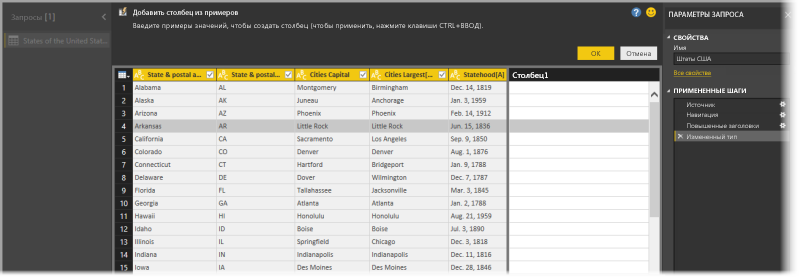
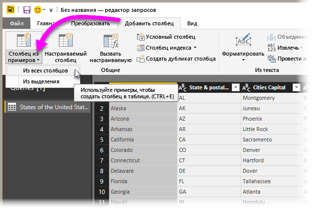
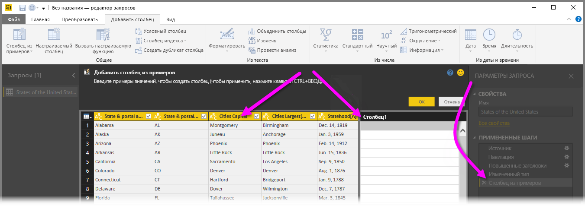
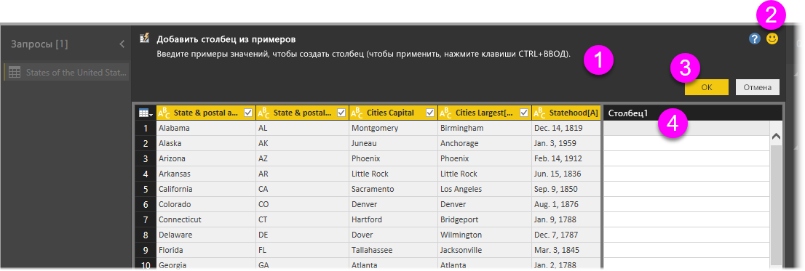
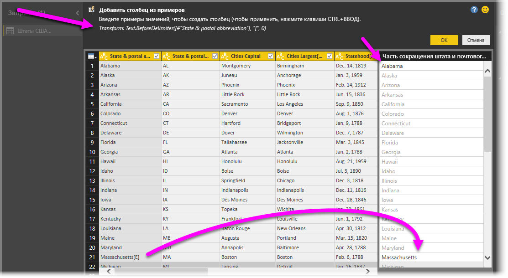

# Добавление столбца из примера в Power BI Desktop
Начиная с выпуска **Power BI Desktop**, вышедшего в апреле 2017 г., вы можете добавлять в свою модель новые столбцы данных с помощью **редактора запросов**. Вам нужно просто задать для нового столбца один или несколько примеров значений. Можно создать пример нового столбца, указав используемый столбец или входные данные на основе всех (или только выделенных) столбцов в конкретной таблице.

Такой подход позволяет быстро и просто создавать столбцы; он очень удобен в следующих ситуациях.

* Вам известно, каким должен быть результат данных в новом столбце, но вы не уверены, какое преобразование (или набор преобразований) необходимо применить.
* Вам известно, какие преобразования нужно применить, но вы не знаете, какой элемент пользовательского интерфейса выбрать, чтобы сделать это.
* Вы знаете все о необходимых преобразованиях благодаря выражению *Custom Column* в языке **M**, но одно (или несколько) таких выражений недоступно для выбора или добавления в пользовательском интерфейсе.

Функция **добавления столбца на основе примера** очень проста в использовании. В следующих разделах мы расскажем о ней.

## Использование редактора запросов для добавления нового столбца из примеров
Чтобы создать столбец из примера, запустите **редактор запросов**. Для этого можно щелкнуть элемент **Изменить запросы** на вкладке ленты **Главная** в **Power BI Desktop**.

В этой статье используются данные следующей статьи Википедии (это ссылка, и вы можете щелкнуть ее, чтобы самостоятельно получить данные для дальнейшего использования):

* [**List of states and territories of the United States**](https://wikipedia.org/wiki/List_of_states_and_territories_of_the_United_States) (Список штатов и территорий США)

Когда **редактор запросов** будет запущен и вы загрузите некоторые данные, можно начать добавление столбца из примеров. Чтобы добавить новый столбец, в **редакторе запросов** откройте на ленте вкладку **Добавить столбец** и выберите **Столбец из примеров**. В раскрывающемся списке можно выбрать вариант **Из всех столбцов** (параметр по умолчанию, который применяется, если нажать кнопку вместо раскрывающегося списка) или вариант **Из выделения**. В этой статье мы рассмотрим вариант **Из всех столбцов**.

## Область "Добавление столбца из примеров"
Когда вы выберете вариант добавления нового столбца из примеров, отобразится новая область, в которой будут показаны столбцы в текущей таблице (чтобы увидеть их все, может потребоваться прокрутить область вниз). Новый столбец **Column1** также отображается справа. Это столбец, который будет создан службой **Power BI Desktop** на основе ваших примеров. Под новым заголовком **Column1** расположены пустые ячейки: в них можно ввести ваши примеры, которые Power BI использует для создания правил и преобразований для сопоставления с примером.

Также обратите внимание, что это — **примененное действие** в области **Параметры запроса**. **Редактор запросов**, как всегда, запишет ваш набор преобразований и применит их к запросу в той же последовательности.

Эта область называется **Добавление столбца из примеров**. Она состоит из четырех основных частей.

1. **Панель ввода команд**, которая содержит краткое описание функции или преобразования.
2. Параметр **Отправить отзыв** для улучшения этой функции Power BI.
3. Кнопки **ОК** и **Отмена**, с помощью которых можно отменить или зафиксировать ваши преобразования и добавить столбец.
4. Область нового столбца, в которой можно вводить примеры значений в любой из строк (чтобы указать ваш пример для Power BI), связанных с другими столбцами в этой строке.

По мере того, как вы вводите пример в новом столбце, Power BI отображает создаваемый столбец на основе обнаруживаемых преобразований. Например, мы вводим *Алабама* в первой строке, что соответствует значению *Алабама* в первом столбце таблицы. Мы нажимаем клавишу *Ввод*, и Power BI заполняет столбец на основе этого значения.

Затем мы переходим к строке, содержащей значение *Массачусетс[E]*, и удаляем окончание *[E]* (нам оно не нужно). Служба Power BI обнаруживает изменение и использует этот пример для создания преобразования. Обратите внимание на объяснение преобразования в верхней части средней области.

По мере того, как вы продолжаете вводить примеры, **редактор запросов** добавляет преобразования. Если результат вас устраивает, нажмите кнопку **ОК**, чтобы зафиксировать изменения.

## Пример того, как работает область "Добавление столбца из примеров"
Хотите посмотреть, как это работает? В следующем видео показано, как использовать эту функцию с помощью источника данных, упомянутого ранее в этом примере. Просмотрите это видео и затем попробуйте сами!

<iframe width="560" height="315" src="https://www.youtube.com/embed/-ykbVW9wQfw" frameborder="0" allowfullscreen></iframe>

## Рекомендации и ограничения
Для использования с областью **Добавление столбца из примеров** доступно множество преобразований, но не все они поддерживаются. В приведенном ниже списке перечислены все преобразования, которые *поддерживаются*.

* **Ссылка**
  
  * Ссылка на определенный столбец (включая преобразования, предусматривающие усечение, очистку и изменение регистра)

* **Преобразования текста**
  
  * Объединить (поддерживает сочетание строковых литералов и значений всего столбца)
  * Заменить
  * Длина
  * Извлечение   
    * Первые символы
    * Последние символы
    * Диапазон
    * Текст перед разделителем
    * Текст после разделителя
    * Текст между разделителями
    * Длина

* Ниже перечислены поддерживаемые **преобразования текста**, которые доступны начиная с выпуска **Power BI Desktop** в ноябре 2017 г.
    
  * Удалить символы
  * Сохранить символы

> [!NOTE]
> Во всех преобразованиях *текста* учтена потенциальная необходимость усечения значения столбца, очистки или изменения регистра.
> 
> 

* **Преобразования даты**
  
  * День
  * День недели
  * Название дня недели
  * День года
  * Месяц
  * Название месяца
  * Квартал года
  * Неделя месяца
  * Неделя года
  * Year (Год)
  * Возраст
  * Начало года
  * Конец года
  * Начало месяца
  * Конец месяца
  * Начало квартала
  * Дней в месяце
  * Конец квартала
  * Начало недели
  * Конец недели
  * День месяца
  * Начало дня
  * Конец дня

* **Преобразования времени**
  
  * Час
  * Минута
  * Секунда  
  * На местное время

> [!NOTE]
> Все преобразования *даты* и *времени* учитывают потенциальную необходимость преобразования значений столбцов в значения *Date*, *Time* или *DateTime*.
> 
> 

* **Преобразования чисел** 

  * Абсолютное значение
  * Арккосинус
  * Арксинус
  * Арктангенс
  * Преобразовать в число
  * Косинус
  * Куб
  * Разделить
  * Показатель степени
  * Факториал
  * Целочисленное деление
  * Четное
  * Нечетное
  * Натуральный логарифм
  * Десятичный логарифм
  * Остаток от деления
  * Умножить
  * Округление с уменьшением
  * Округление с увеличением
  * Знак
  * Синус
  * Квадратный корень
  * Квадрат
  * Вычитание
  * Сумма
  * Тангенс

* Ниже перечислены поддерживаемые **преобразования чисел**, которые доступны начиная с выпуска **Power BI Desktop** в ноябре 2017 г.

  * Создание контейнеров и диапазоны

* **Общие сведения**
  
  * Условные столбцы