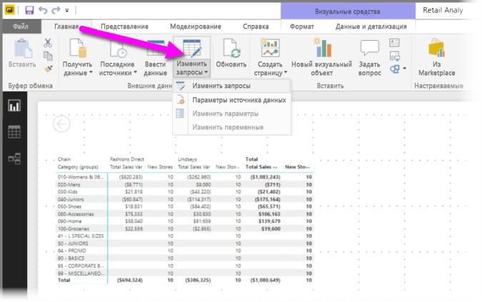
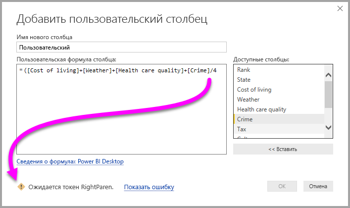
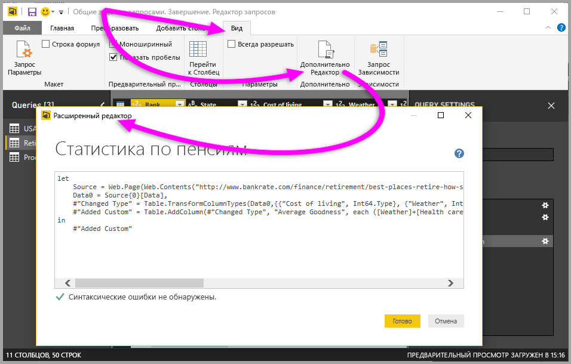

# Добавление пользовательского столбца в Power BI Desktop
Вы можете легко добавить новый пользовательский столбец данных в модель с помощью **редактора запросов** в **Power BI Desktop**. Вы можете создать и переименовать пользовательский столбец с помощью кнопок для создания [формул M](https://msdn.microsoft.com/library/mt270235.aspx), определяющих пользовательский столбец. Для формулы M доступен [полный набор справочных материалов по функциям](https://msdn.microsoft.com/library/mt779182.aspx). 

Создание пользовательского столбца является еще одним **примененным действием** к запросу, создаваемому в **редакторе запросов**. Это означает, что его можно изменить или переместить в любой момент времени.

## Добавление нового пользовательского столбца с помощью редактора запросов
Чтобы создать пользовательский столбец, запустите **редактор запросов**. Для этого можно щелкнуть элемент **Изменить запросы** на вкладке ленты **Главная** в **Power BI Desktop**.

После запуска **редактора запросов** и загрузки части данных можно добавить настраиваемый столбец, выбрав вкладку **Добавить столбец** на ленте, а затем выбрав **Пользовательский столбец**.

Отображается окно **Добавление пользовательского столбца**, которое описано в следующем разделе.

## Окно "Добавить пользовательский столбец"
В окне **Добавление пользовательского столбца** появится список доступных полей в области справа, имя пользовательского столбца сверху (его можно переименовать, введя новое имя в это текстовое поле) и [формула **M**](https://msdn.microsoft.com/library/mt779182.aspx), созданная (или написанная) на основе вставляемых полей справа, добавляемых операторов или созданная другим способом формула, определяющая новый пользовательский столбец. 

## Создание формул для пользовательского столбца
Вы можете выбрать поле в списке **Доступные столбцы:** справа, а затем выбрать **< < Вставить**, чтобы добавить формулу для пользовательского столбца. Кроме того, можно просто дважды щелкнуть столбец в списке, чтобы его добавить.

При вводе формулы и создании столбца в нижней части окна появится индикатор, сообщающий об обнаруженных синтаксических ошибках в режиме реального времени (при вводе). Если все хорошо, отобразится зеленая галочка.

Если возникли определенные ошибки синтаксиса, появится желтый значок предупреждения, а также обнаруженная ошибка и ссылка, при выборе которой курсор помещается в место обнаружения ошибки в формуле.

При нажатии кнопки **ОК** настраиваемый столбец добавляется в модель и действие **Добавлен пользовательский объект** добавится к **примененным шагам** запроса.

Если дважды щелкнуть шаг **Добавлен пользовательский объект** на панели **примененных действий**, окно **Добавить пользовательский столбец** появится снова с загруженной созданной формулой пользовательского столбца, которую при необходимости можно изменить.

## Использование расширенного редактора для настраиваемых столбцов
Создать пользовательский столбец (и изменить какой-либо шаг запроса) можно с помощью **расширенного редактора**. В **редакторе запросов** выберите **Представление**, а затем — **Расширенный редактор**, чтобы отобразить **расширенный редактор**.

**Расширенный редактор** предоставляет возможность полного контроля над запросом.

## Дальнейшие действия
Существуют другие способы создания пользовательских столбцов, включая создание столбца на основе примеров, предоставленных **редактору запросов**. Дополнительные сведения о создании настраиваемых столбцов на основе примеров см. в следующей статье:

* [Добавление столбца из примера в Power BI Desktop](desktop-add-column-from-example.md)
* [Общие сведения о языке формул M](https://msdn.microsoft.com/library/mt270235.aspx)
* [Справочник по функциям M](https://msdn.microsoft.com/library/mt779182.aspx)  

