# Агрегаты в Power BI Desktop (предварительная версия)

**Агрегаты** в Power BI обеспечивают интерактивный анализ больших данных способами, которые ранее были недоступны. **Агрегаты** могут существенно сократить затраты на раскрытие потенциала больших наборов данных для принятия решений.

В следующем списке приведены преимущества использования **агрегатов**.

* **Производительность запросов к большим данным** — по мере взаимодействия пользователей с визуальными элементами в отчетах Power BI запросы DAX отправляются к набору данных. Повышение скорости обработки запросов путем кэширования данных на агрегированном уровне при использовании небольшой части ресурсов, необходимых на уровне детализации. Раскрытие потенциала больших данных способом, который ранее был недоступен.
* **Оптимизация обновления данных** — сокращение размера кэша и времени обновления путем кэширования данных на агрегированном уровне. Ускорение времени предоставления данных для пользователей.
* **Формирование сбалансированной архитектуры** — кэш в памяти Power BI может эффективно обрабатывать агрегированные запросы. Ограничение запросов, отправляемых к источнику данных в режиме DirectQuery, что позволяет соблюдать пределы параллелизма. Прошедшие запросы, как правило, будут отфильтрованными запросами на уровне транзакций. Такие запросы обычно без проблем обрабатываются хранилищами данных и системами больших данных.

### Хранилище уровня таблицы
Хранилище уровня таблицы обычно используется с функцией агрегатов. Дополнительные сведения см. в статье [Режим хранения в Power BI Desktop](desktop-storage-mode.md).

### Типы источников данных
Агрегаты используются с источниками данных, представляющими многомерные модели, такими как хранилища данных и киоски данных, а также с источниками больших данных на базе Hadoop. В этой статье описываются типичные различия моделирования в Power BI для каждого из типов источников данных.

Все источники импорта Power BI и источники DirectQuery (не многомерные) работают с агрегатами.

## Включение предварительной версии функции агрегатов

Функция **агрегатов** доступна в режиме предварительной версии, поэтому ее необходимо сначала включить в **Power BI Desktop**. Чтобы включить **агрегаты**, последовательно выберите **Файл > Параметры и настройки > Параметры > Функции предварительной версии** и установите флажки **Составные модели** и **Управление агрегатами**. 

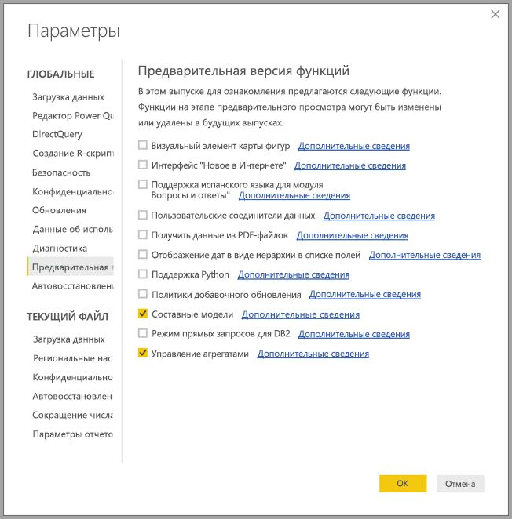

Чтобы включить эту функцию, нужно перезапустить **Power BI Desktop**.

## Агрегаты, основанные на связях

**Агрегаты**, основанные на связях, обычно используются с многомерными моделями. Наборы данных Power BI, поступающие из хранилищ данных и киосков данных, напоминают схемы типа "звезда" или "снежинка" со связями между таблицами измерений и таблицами фактов.

Рассмотрим следующую модель из одного источника данных. Предположим, все таблицы используют DirectQuery. Таблица фактов **Sales** содержит миллиарды строк. Указание режима хранения **Импорт** для таблицы **Sales** для кэширования существенно повышает затраты на управление и память.

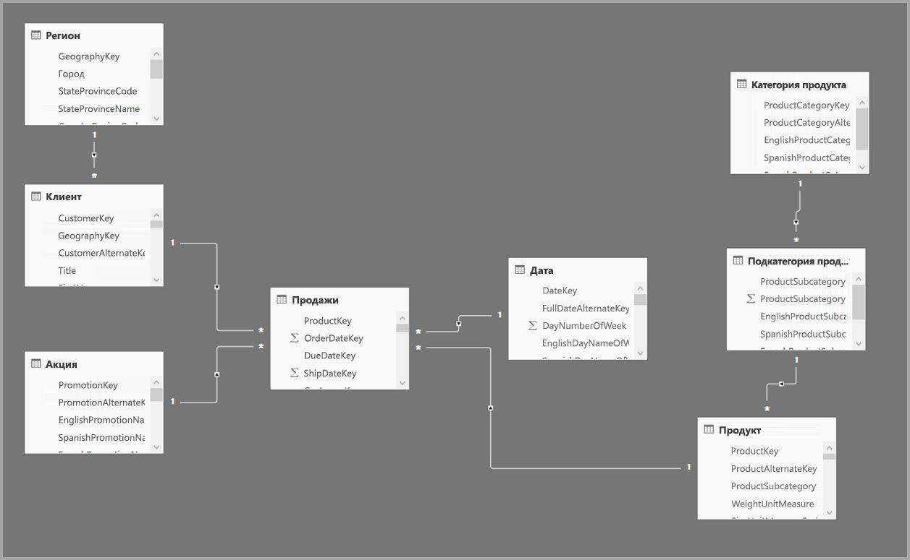

Вместо этого мы создадим таблицу **Sales Agg** в качестве таблицы агрегатной обработки. Для этой таблицы характерна более высокая степень детализации, чем для таблицы **Sales**, и поэтому она будет содержать гораздо меньше строк. Число строк должно быть равно сумме в **SalesAmount**, сгруппированном по **CustomerKey**, **DateKey** и **ProductSubcategoryKey**. Вместо миллиардов в таблице могут быть миллионы строк, что гораздо проще для обработки.

Предположим, следующие таблицы измерений являются наиболее часто используемыми для запросов с высокой ценностью для бизнеса. Это таблицы, которые могут фильтровать **Sales Agg** с помощью связи *один ко многим* (или *многие к одному*).

* География
* Клиент
* Дата
* Подкатегория продукта
* Категория продукта

Эта модель показана на следующем рисунке.

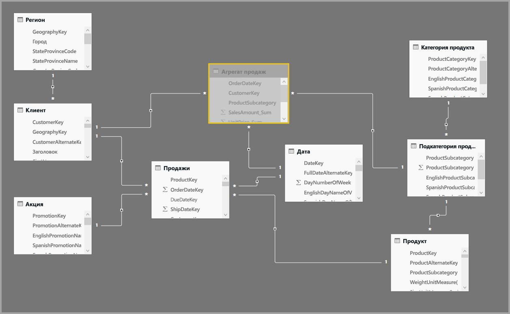

> [!NOTE]
> **Sales Agg** — это просто таблица, а значит, ее можно загружать различными способами. Например, статистическую обработку можно выполнить в базе данных-источнике с помощью процессов ETL/ELT или [M-выражения](https://msdn.microsoft.com/query-bi/m/power-query-m-reference) для таблицы. Можно использовать режим хранения "Импорт" с [добавочным обновлением в Power BI Premium](service-premium-incremental-refresh.md) или без него или режим DirectQuery и оптимизацию для быстрого выполнения запросов с помощью [индексов columnstore](https://docs.microsoft.com/sql/relational-databases/indexes/columnstore-indexes-overview). Такая гибкость обеспечивает сбалансированную архитектуру, которая распределяет нагрузку запросов, чтобы избежать узких мест.

### Режим хранения 
Продолжим рассматривать наш пример. Мы задаем для **Sales Agg** режим хранения **Импорт** для ускорения запросов.

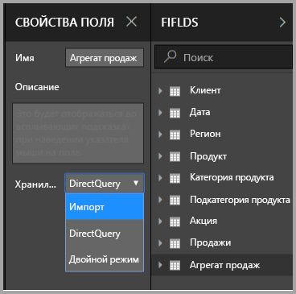

После этого появится следующее диалоговое окно с сообщением о том, что для связанных таблиц измерений может быть задан режим хранения **Двойной**. 

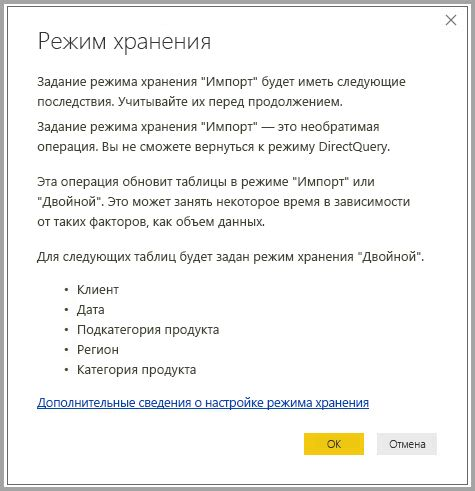

Установка значения **Двойной** позволяет связанным таблицам измерений работать в режиме импорта или DirectQuery в зависимости от вложенного запроса.

* Запросы, которые объединяют метрики из таблицы **Sales Agg**, работающей в режиме импорта, и группируются по атрибутам из связанных двойных таблиц, могут возвращаться из кэша в памяти.
* Запросы, которые объединяют метрики из таблицы **Sales**, работающей в режиме DirectQuery, и группируются по атрибутам из связанных двойных таблиц, могут возвращаться в режиме DirectQuery. Логика запросов, включая группировку по операциям, передается в базу данных-источник.

Дополнительные сведения о **двойном** режиме хранения см. в статье [Режим хранения](desktop-storage-mode.md).

### Сильные и слабые связи
Для обращения к агрегату, зависящего от связей, требуются сильные связи.

Сильные связи включают следующие сочетания, где обе таблицы принадлежат к *единому источнику*.

| Таблица на стороне *многих | Таблица на стороне *одного* |
| ------------- |----------------------| 
| Двойной режим          | Двойной режим                 | 
| Импорт        | Импорт или двойной режим       | 
| DirectQuery   | DirectQuery или двойной режим  | 

Единственный случай, когда связь *между источниками* считается сильной, — когда обе таблицы представляют таблицы импорта. Связи "многие ко многим" всегда считаются слабыми.

Сведения об обращении к агрегатам *между источниками*, которые не зависят от связей, см. в приведенном ниже разделе об агрегатах на основе столбцов группировки.

### Таблица агрегирования скрыта
Таблица **Sales Agg** скрыта. Таблицы агрегирования всегда должны быть скрыты от потребителей набора данных. Потребители и запросы ссылаются на таблицы сведений, а не на таблицу агрегирования; им даже не нужно знать, что таблица агрегирования существует.

### Диалоговое окно "Управление агрегатами"
Далее мы определим агрегаты. Выберите контекстное меню **Управление агрегатами** для таблицы **Sales Agg**, щелкнув таблицу правой кнопкой мыши.

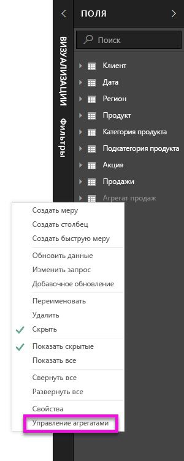

Откроется диалоговое окно **Управление агрегатами**. В нем отображаются строки для каждого столбца в таблице **Sales Agg**, где можно указать поведение агрегирования. Запросы, отправленные в набор данных Power BI, который ссылается на таблицу **Sales**, внутренним образом перенаправляются в таблицу **Sales Agg**. Потребителям набора данных не требуется даже знать о том, что таблица **Sales Agg** существует.

В следующей таблице показаны агрегаты для таблицы **Sales Agg**.

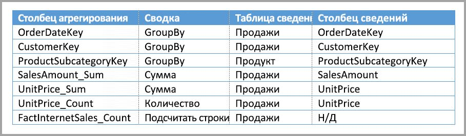

#### Функция формирования сводных данных

В раскрывающемся меню "Сводные данные" содержатся значения для выбора.
* Количество
* GroupBy
* Макс.
* Мин.
* Сумма
* Подсчитать строки таблицы

#### Проверки

В диалоговом окне применяются следующие важные проверки:

* Выбранный столбец сведений должен иметь тот же тип данных, что и столбец агрегата, за исключением функций формирования сводных данных "Число" и "Подсчитать строки таблицы". Функции "Число" и "Подсчитать строки таблицы" предлагаются только для агрегирования целых чисел и не требуют соответствующего типа данных.
* Цепочки агрегатов, охватывающие три и более таблиц, использовать запрещено. Например, нельзя настроить агрегаты для **таблицы A**, ссылающейся на **таблицу Б**, включающую агрегаты, ссылающиеся на **таблицу С**.
* Не допускаются повторяющиеся агрегаты, где две записи используют одну и ту же функцию формирования сводных данных и ссылаются на ту же таблицу сведений или столбец.

В этой общедоступной предварительной версии для **агрегатов** также применяются следующие проверки. Мы намерены убрать эти проверки после выпуска общедоступной версии.

* Агрегаты не могут использоваться с безопасностью на уровне строк (RLS). *Ограничения общедоступной предварительной версии.*
* Таблицы сведений должны работать в режиме DirectQuery, не импорта. *Ограничения общедоступной предварительной версии.*

Большинство таких проверок применяется путем отключения значений в раскрывающемся списке и отображения пояснительного текста во всплывающей подсказке, как показано на следующем рисунке.

### Столбцы "группировать по"

В этом примере три записи GroupBy являются необязательными. Они не влияют на поведение агрегирования (за исключением примера запроса DISTINCTCOUNT, показанного на рисунке далее). Они представлены в основном для повышения наглядности. Без этих записей GroupBy агрегаты по-прежнему будут получать обращения на основе связей. Это поведение отличается от использования агрегатов без связей (см. пример больших данных далее в этой статье).

### Определение того, обращаются ли запросы к агрегатам

Дополнительные сведения об определении того, возвращаются ли запросы из кэша в памяти (подсистема хранилища) или из DirectQuery (отправка в источник данных) с помощью SQL Profiler, см. в статье [Режим хранения](desktop-storage-mode.md). Этот процесс также можно использовать для обнаружения обращения к агрегатам.

Кроме того, в SQL Profiler предоставляются следующие расширенные события.

    Query Processing\Aggregate Table Rewrite Query

В следующем фрагменте JSON показан пример выходных данных события при использовании агрегирования.

* **matchingResult** показывает, что агрегат использовался для вложенного запроса.
* **dataRequest** показывает столбцы "группировать по" и агрегированные столбцы, используемые вложенным запросом.
* **mapping** показывает столбцы в таблице агрегирования, с которыми выполнялось сопоставление.

### Примеры запросов
Следующий запрос обращается к агрегату, так как столбцы в таблице *Date* находятся на том уровне детализации, который может обратиться к агрегату. Будет использоваться агрегат **Sum** для **SalesAmount**.

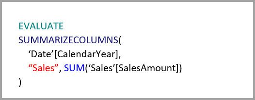

Следующий запрос не достигнет агрегата. Хотя запрос выполняется для получения суммы **SalesAmount**, он выполняет операцию группирования по столбцу в таблице **Product**, но степень ее детализации не позволяет обращаться к агрегату. Если в модели выполняются связи, подкатегория продукта может иметь несколько строк **Product**. При этом запрос не сможет определить, по какому продукту следует выполнять агрегирование. В этом случае запрос возвращается в режим DirectQuery и отправляет запрос SQL в источник данных.

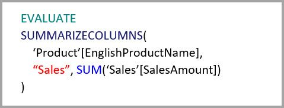

Агрегаты — это не просто вычисления для подсчета суммы. Они могут также быть удобны для сложных вычислений. По существу, сложные вычисления подразделяются на вложенные запросы для каждой функции SUM, MIN, MAX и COUNT, и каждый вложенный запрос вычисляется для определения возможности обращения к агрегату. Эта логика не соблюдается во всех случаях из-за оптимизации плана запроса, но в целом она должна применяться. Следующий пример запроса достигнет агрегата:

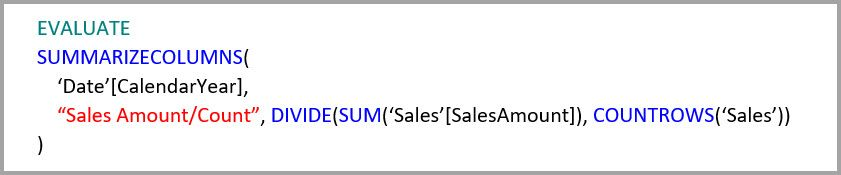

Агрегаты можно использовать для функции COUNTROWS. Следующий запрос достигнет агрегата, так как для таблицы **Sales** определено агрегирование строк таблицы **Count**.

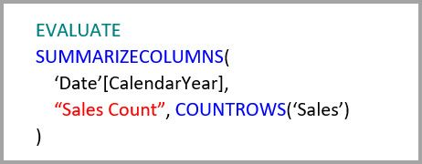

Агрегаты можно использовать для функции AVERAGE. Следующий запрос достигнет агрегата, так как результат AVERAGE внутренним образом рассчитывается как сумма (SUM), деленная на количество (COUNT). Так как столбец **UnitPrice** включает агрегаты, определенные для SUM и COUNT, агрегирование выполняется.

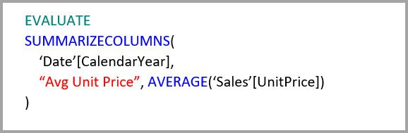

В некоторых случаях агрегаты можно использовать для функции DISTINCTCOUNT. Следующий запрос достигнет агрегата, так как существует запись GroupBy для **CustomerKey**, что обеспечивает различие **CustomerKey** в таблице агрегирования. С этим методом, однако, связано пороговое значение производительности: около 2–5 миллионов уникальных значений могут повлиять на производительность запросов. Тем не менее это может быть удобно в ситуациях, когда в таблице сведений существуют миллиарды строк и 2–5 миллионов уникальных значений в столбце. В этом случае DISTINCTCOUNT может выполняться быстрее, чем проверка таблицы с миллиардами строк, даже если они содержатся в кэше в памяти.

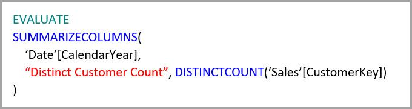

## Агрегаты, основанные на столбцах "группировать по" 

Характеристики моделей больших данных на базе Hadoop отличаются от многомерных моделей. Во избежание объединений между большими таблицами они часто не используют связи. Вместо этого атрибуты измерений, как правило, денормализируются до таблиц фактов. Такие модели больших данных можно разблокировать для интерактивного анализа, используя **агрегаты**, основанные на столбцах "группировать по".

В следующей таблице содержится числовой столбец **Movement** для агрегирования. Все остальные столбцы являются атрибутами для группирования. Он содержит данные Интернета вещей и значительное количество строк. Режимом хранения является DirectQuery. Запросы в источнике данных, выполняющие агрегирование по всему набору данных, выполняются медленно из-за огромного объема.

Чтобы включить интерактивный анализ для этого набора данных, мы добавим таблицу агрегирования, выполняющую группировку по большинству атрибутов, но исключающую атрибуты с высокой кратностью, такие как широта и долгота. Это значительно уменьшает количество строк, и таблица становиться достаточно небольшой для помещения в кэш в памяти. Режим хранения **Driver Activity Agg** — импорт.

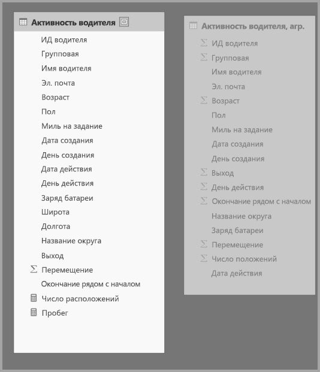

Далее мы определим сопоставления агрегатов в диалоговом окне **Управление агрегатами**. В нем отображаются строки для каждого столбца в таблице **Driver Activity Agg**, где можно указать поведение агрегирования.

В следующей таблице показаны агрегаты для таблицы **Driver Activity Agg**.

### Столбцы "группировать по"

В этом примере записи **GroupBy** **не являются необязательными**: без них не получится обратиться к агрегатам. Это поведение отличается от использования агрегатов на основе связей, которое рассматривается в примере многомерной модели ранее в этой статье.

### Примеры запросов

Следующий запрос достигнет агрегата, так как столбец **Activity Date** охватывается таблицей агрегирования. Строки таблицы Count используются функцией COUNTROWS.

Для моделей, которые содержат атрибуты фильтра в таблицах фактов, особенно рекомендуется использовать агрегаты строк таблицы Count. Power BI может отправлять запросы к набору данных с помощью COUNTROWS в случаях, когда нет явного запроса пользователя. Например, в диалоговом окне фильтра отображается число строк для каждого значения.

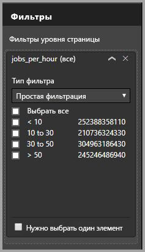

## Приоритет агрегирования

Приоритет агрегирования позволяет учитывать несколько таблиц агрегирования в одном вложенном запросе.

Рассмотрим следующий пример. Это [составная модель](desktop-composite-models.md), содержащая несколько источников DirectQuery.

* Для таблицы импорта **Driver Activity Agg2** характерен высокий уровень детализации, так как она содержит немного атрибутов "группировать по" с низкой кратностью. Количество строк может ограничиваться тысячами, поэтому она легко помещается в кэш в памяти. Эти атрибуты используются важной панелью мониторинга для руководителей, поэтому запросы, ссылающиеся на них, должны выполняться с максимально возможной скоростью.
* Таблица **Driver Activity Agg** — промежуточная таблица агрегирования в режиме DirectQuery. Она содержит более миллиарда строк и оптимизирована в источнике с помощью индексов columnstore.
* Таблица **Driver Activity** — DirectQuery и содержит более триллиона строк данных Интернета вещей, полученных из системы больших данных. Она обслуживает запросы детализации для просмотра отдельных показаний Интернета вещей в управляемом контексте фильтров.

Объем памяти для этой модели относительно небольшой, но она дает доступ к возможностям огромного набора данных. Эта модель представляет сбалансированную архитектуру, так как распределяет нагрузку запросов по нескольким компонентам архитектуры, используя их в зависимости от сильных сторон.

В диалоговом окне **Управление агрегированием** для таблицы **Driver Activity Agg2** показано поле *Precedence* со значением 10. Это значение больше, чем у таблицы **Driver Activity Agg**, а значит, она будет первой рассматриваться запросами, использующими агрегаты. Вложенные запросы, которые находятся не на том уровне детализации, на который может отвечать **Driver Activity Agg2**, будут обращаться к таблице **Driver Activity Agg**. Подробные запросы, на которые нельзя ответить по любой из таблиц агрегирования, будут направляться в таблицу **Driver Activity**.

Таблица, указанная в столбце **Detail Table** — **Driver Activity**, а не **Driver Activity Agg**, так как цепочки агрегатов запрещены (см. раздел [Проверки](#validations) ранее в этой статье).

В следующей таблице показаны агрегаты для таблицы **Driver Activity Agg2**.

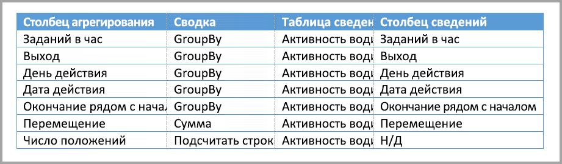

## Агрегаты, основанные на столбцах группирования в сочетании со связями

Можно даже сочетать эти два способа для агрегатов, описанных ранее в этой статье. Для **агрегатов** на основе связей может потребоваться разделить денормализованные таблицы измерений на несколько таблиц. Если это затратно или нецелесообразно для определенных таблиц измерений, необходимые атрибуты можно реплицировать в таблице агрегирования для определенных измерений и связей, используемых для других таблиц.

Следующая модель реплицирует *Month*, *Quarter*, *Semester* и *Year* в таблицу **Sales Agg**. Между таблицами **Sales Agg** и **Date** связи нет. Связи между **Customer** и **Product Subcategory** существуют. Режим хранения **Sales Agg** — импорт.

В следующей таблице показаны записи, заданные в диалоговом окне **Управление агрегированием** для таблицы **Sales Agg**. Записи GroupBy, где **Date** является таблицей сведений, обязательны для обращения к агрегатам для запросов, которые группируются по атрибутам даты. Как показано в предыдущем примере, записи GroupBy для CustomerKey и ProductSubcategoryKey не влияют на обращения к агрегатам из-за наличия связей (опять же за исключением DISTINCTCOUNT).

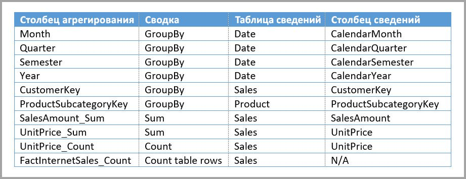

> Примечание. Для этой модели требуется, чтобы таблица **Date** была в режиме DirectQuery для заполнения полей диалогового окна "Управление агрегатами", так как это таблица сведений. Это ограничение предварительной версии, которое мы собираемся устранить при выпуске общедоступной версии.

### Примеры запросов

Следующий запрос достигает агрегата, поскольку CalendarMonth охватывается таблицей агрегирования, а CategoryName доступен через отношения один ко многим. Используется агрегат Sum для **SalesAmount**.

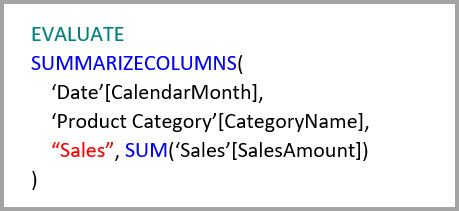

Следующий запрос не достигнет агрегата, так как столбец CalendarDay не охватывается таблицей агрегирования.

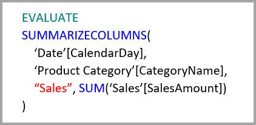

Следующий запрос логики операций со временем не достигнет агрегата, так как функция DATESYTD создает таблицу значений CalendarDay, которая не охватывается таблицей агрегирования.

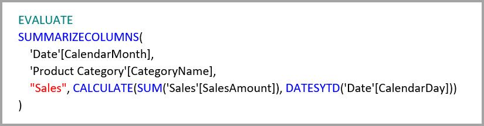

## Кэши должны поддерживаться в синхронизированном состоянии

**Агрегаты**, сочетающие режим хранения DirectQuery и импорта и (или) двойной режим, могут возвращать разные данные, если кэш в памяти не синхронизируется с исходными данными. При выполнении запроса не будет произведена попытка скрыть проблемы с данными, например, фильтрацией результатов DirectQuery для соответствия кэшированным значениям. Это функции оптимизации производительности, они должны использоваться только способами, которые не влияют на возможность достижения бизнес-требований. Ответственность за правильное проектирование и знание потоков данных своей организации лежит на вас. При необходимости можно воспользоваться установленными методами обработки таких проблем на стороне источника.

## Дальнейшие действия

В следующих статьях содержатся дополнительные сведения о составных моделях, а также подробно описан режим DirectQuery:

* [Составные модели в Power BI Desktop (предварительная версия)](desktop-composite-models.md)
* [Связи "многие ко многим" в Power BI Desktop (предварительная версия)](desktop-many-to-many-relationships.md)
* [Режим хранения в Power BI Desktop (предварительная версия)](desktop-storage-mode.md)

Статьи о DirectQuery:

* [Использование DirectQuery в Power BI](desktop-directquery-about.md)
* [Источники данных, поддерживаемые DirectQuery в Power BI](desktop-directquery-data-sources.md)
