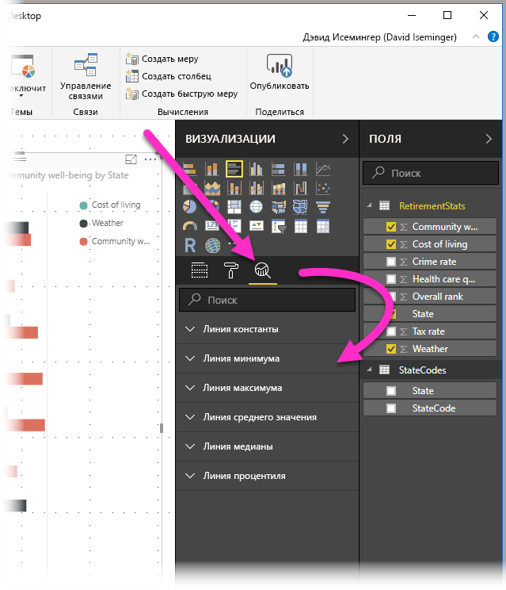
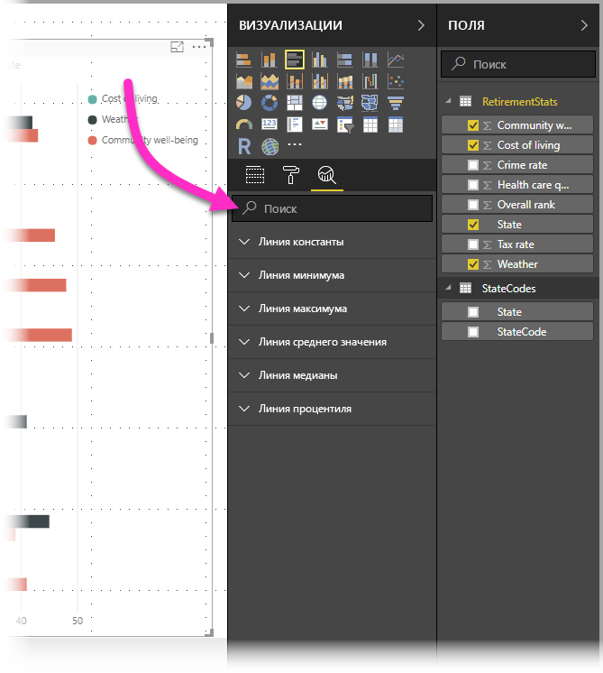
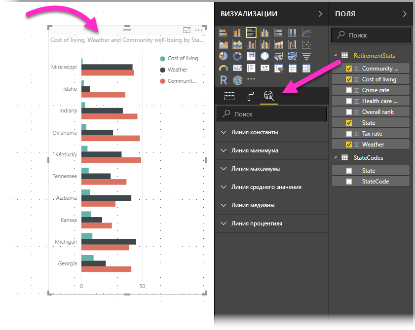
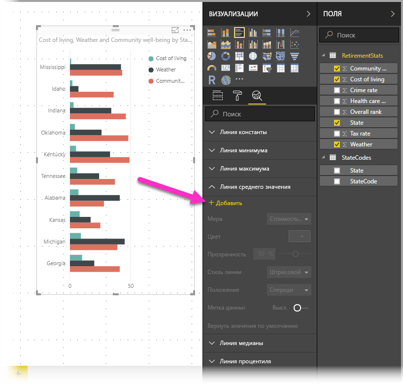
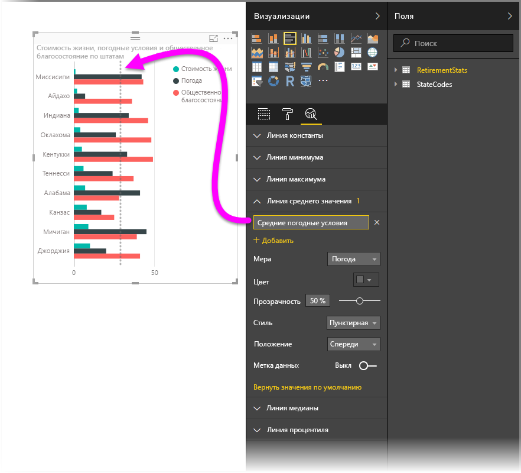
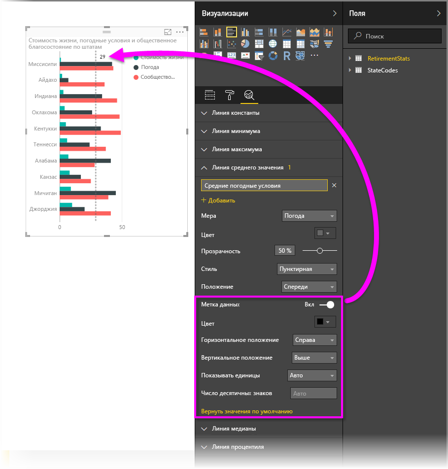
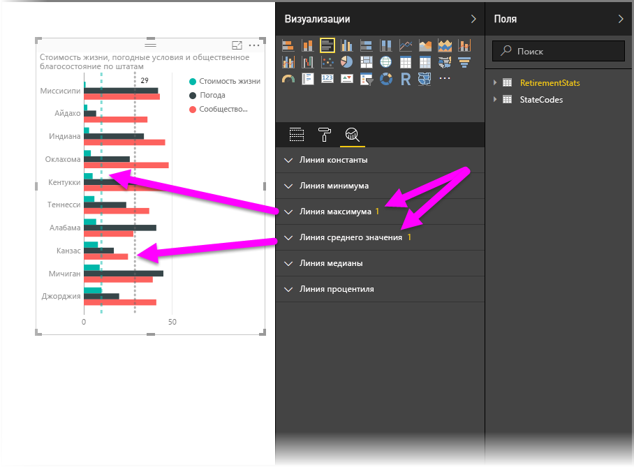
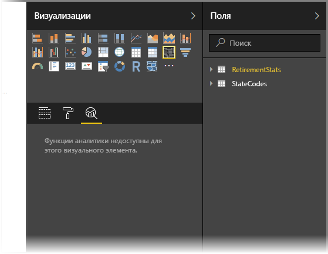
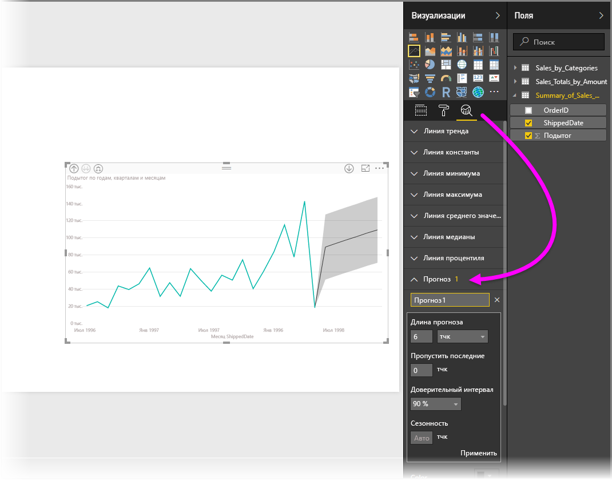

# Использование панели "Аналитика" в Power BI Desktop
Панель **Аналитика** в **Power BI Desktop** позволяет добавлять динамические *строки ссылок* для визуальных элементов, чтобы сосредоточиться на важных трендах и сведениях. Панель **Аналитика** находится в области **Визуализации** Power BI Desktop.

> [!NOTE]
> Панель **Аналитика** отобразится, только если выбрать визуальный элемент на холсте Power BI Desktop.

## Поиск по панели "Аналитика"
Начиная с выпуска **Power BI Desktop** за февраль 2018 г. (2.55.5010.201 или более поздней версии) вы можете выполнять поиск по панели **Аналитика**, которая является подразделом области **Визуализации** . Как показано на рисунке ниже, при выборе панели **Аналитика** отображается поле поиска.

## Использование панели "Аналитика"
Используя панель **Аналитика**, можно создать такие динамические строки ссылок (не все строки доступны для всех типов визуальных элементов):

* линия константы оси X;
* линия константы оси Y;
* линия минимума;
* линия максимума;
* линия среднего значения;
* линия медианы;
* линия процентиля.

В следующих разделах показано, как использовать панель **Аналитика** и динамические строки ссылок в визуализациях.

Чтобы посмотреть доступные динамические строки ссылок для визуального элемента, сделайте следующее:

1. Выберите или создайте визуальный элемент, а затем в разделе **Визуализации** щелкните значок **Аналитика**.
   
   
2. Используя стрелку вниз, выберите тип строки, которую необходимо создать, чтобы развернуть ее параметры. В данном случае выбираем **линию среднего значения**.
   
   
3. Чтобы создать строку, щелкните **+ Добавить**. После этого можно указать имя строки. Для этого дважды щелкните текстовое поле и введите имя.
   
   Для строки можно выбрать разные свойства, например *цвет*, *степень прозрачности*, *стиль* и *позицию* (относительно элементов данных визуального элемента), и параметр добавления метки. И самое главное, используя раскрывающийся список **Мера**, который автоматически заполняется элементами данных из визуального элемента, можно выбрать **меру**, на основе которой будет создана строка. Мы выберем в качестве меры показатель *погоды*, пометим строку как *Средний показатель погоды* и настроим несколько других параметров, как показано ниже.
   
   
4. Если необходимо, чтобы отображалась метка данных, переместите ползунок **Метка данных** в положение "Вкл.". После этого появится набор дополнительных параметров для метки данных, как показано на следующем рисунке.
   
   
5. Обратите внимание на число, которое отображается рядом с элементом **Линия среднего значения** на панели **Аналитика**. Оно указывает на количество динамических строк, созданных для визуального элемента, и их тип. Если добавить **линию максимума** для *стоимости жизни*, на панели **Аналитика** будет показано, что теперь к этому визуальному элементу также применена динамическая строка ссылки типа **Линия максимума**.
   
   

Если к выбранному визуальному элементу не применяются динамические строки ссылок (в данном случае визуальный элемент **Карта**), при выборе панели **Аналитика** вы увидите следующее:

С помощью динамических строк ссылок, создаваемых на панели **Аналитика**, можно визуализировать множество интересных показателей.

Мы планируем добавить больше функций и возможностей, в частотности расширить ряд типов визуальных элементов, к которым можно применить динамические строки ссылок. Так что следите за обновлениями.

## Применение прогнозирования
Чтобы использовать функцию **прогнозирования**, следует выбрать визуальный элемент, а затем развернуть раздел **Прогноз** панели **Аналитика**. Для изменения прогноза можно указать множество входных данных, например *Длина прогноза*, *Доверительный интервал* и т. д. На следующем рисунке показан визуальный элемент базовой строки, к которому применено прогнозирование. Но вы вольны экспериментировать с функцией *прогнозирования*, чтобы понять, как ее можно применять к моделям.

## Ограничения
Возможность использовать динамические строки ссылок зависит от типа используемого визуального элемента. Далее мы рассмотрим, какие динамические строки сейчас доступны для тех или иных визуальных элементов.

Следующие визуальные элементы поддерживают динамические строки без каких-либо ограничений:

* диаграмма с областями;
* график;
* точечная диаграмма;
* гистограмма с группировкой;
* линейчатая диаграмма с группировкой.

Следующие визуальные элементы работают только с *линиями константы* из панели **Аналитика**:

* диаграмма с областями с накоплением;
* линейчатая диаграмма с накоплением;
* гистограмма с накоплением;
* нормированная линейчатая диаграмма;
* нормированная гистограмма.

Со следующими визуальными элементами можно использовать только *линии тренда*:

* график без накопления;
* гистограмма с группировкой.

Наконец, недекартовы визуальные элементы сейчас не поддерживают следующие динамические строки из панели **Аналитика**:

* матрица;
* круговая диаграмма;
* кольцевой график;
* Таблица

Строка процентиля доступна только при использовании импортированных данных в **Power BI Desktop**, а также при динамическом подключении к модели на сервере под управлением **Analysis Services 2016** или более поздней версии, **Azure Analysis Services** или набору данных в службе Power BI. 

## Дальнейшие действия
Power BI Desktop предоставляет широкие возможности. Дополнительные сведения об этих возможностях см. в следующих ресурсах.

* [Новые возможности Power BI Desktop](desktop-latest-update.md)
* [Скачивание Power BI Desktop](desktop-get-the-desktop.md)
* [Что такое Power BI Desktop?](desktop-what-is-desktop.md)
* [Общие сведения о запросах в Power BI Desktop](desktop-query-overview.md)
* [Типы данных в Power BI Desktop](desktop-data-types.md)
* [Формирование и объединение данных в Power BI Desktop](desktop-shape-and-combine-data.md)
* [Общие задачи с запросами в Power BI Desktop](desktop-common-query-tasks.md)    

