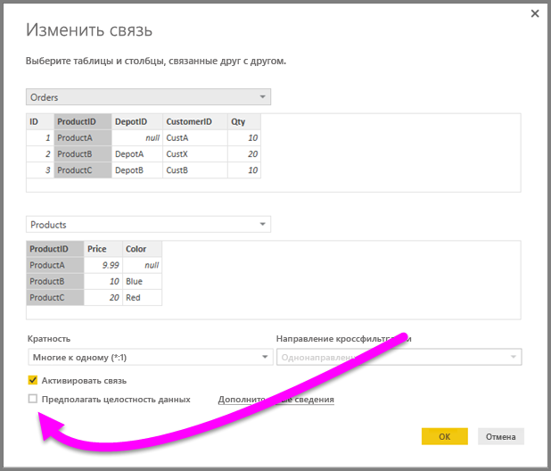
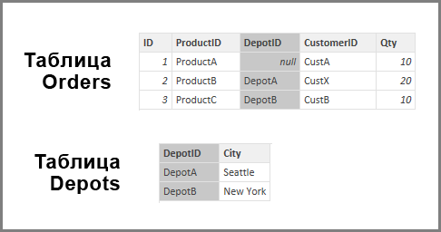

# Функция "Предполагать целостность данных" в Power BI Desktop
При подключении к источнику данных с помощью **DirectQuery** можно установить флажок **Предполагать целостность данных**, что позволит создавать более эффективные запросы к источнику. У этой функции есть некоторые требования к базовым данным, и она доступна только при использовании **DirectQuery**.

Если флажок **Предполагать целостность данных** установлен, в запросах к источнику данных используются инструкции **INNER JOIN**, а не **OUTER JOIN**. Они повышают эффективность запросов.

## Требования для использования функции "Предполагать целостность данных"
Это дополнительная функция. Она доступна только при подключении к данным с помощью **DirectQuery**. Чтобы функция **Предполагать целостность данных** работала правильно, необходимо выполнить следующие условия:

* В настройках связи строки в столбце **Из** не *пустые* и не содержат значение *Null*.
* У каждого значения в столбце **Из** есть соответствующее значение в столбце **В**.

В этом контексте столбец **Из** выступает в роли *многих* в связи типа *один ко многим* или же является столбцом первой таблицы в связи типа *один к одному*.

## Пример использования функции "Предполагать целостность данных"
В примере ниже показано, как работает функция **Предполагать целостность данных**, когда она используется в подключениях к данным. Приложение подключается к источнику данных, который содержит таблицы **Заказы**, **Товары** и **Склады**.

1. На рисунке ниже показаны таблицы **Заказы** и **Товары**. Обратите внимание, что целостность данных существует между столбцами **Заказы[КодТовара]** и **Товары[КодТовара]**. В таблице **Заказы** в столбце **[КодТовара]** нет значений *Null*, и каждое значение из этого столбца повторяется в таблице **Товары**. Таким образом, чтобы получить более эффективные запросы, нужно установить флажок **Предполагать целостность данных** (установка флажка не влияет на значения, отображаемые на визуализациях).
   
   
2. На рисунке ниже целостность данных между столбцами **Заказы[КодСклада]** и **Склады[КодСклада]** не существует, так как в столбце **КодСклада** для некоторых *заказов* указано значение *Null*. Поэтому флажок **Предполагать целостность данных** устанавливать *не* нужно.
   
   
3. На рисунке ниже целостность данных не существует между столбцами **Заказы[КодКлиента]** и **Клиенты[КодКлиента]**: в столбце **КодКлиента** есть значения (в данном случае — *КлиентX*), которых нет в таблице *Клиенты*. Поэтому флажок **Предполагать целостность данных** устанавливать *не* нужно.
   
   

## Установка флажка "Предполагать целостность данных"
Чтобы активировать эту функцию, установите флажок **Предполагать целостность данных**, как показано на рисунке ниже.

Когда флажок установлен, выполняется проверка на отсутствие значений *Null* и несовпадающих строк. *Но* если значений очень много, такая проверка не гарантирует отсутствие проблем с целостностью данных.

Кроме того, проверка выполняется на этапе редактирования связей, и все будущие изменения в данных в ней *не* учитываются.

## Что произойдет, если неправильно установить флажок "Предполагать целостность данных"
Если установить флажок **Предполагать целостность данных**, то при наличии проблем с целостностью ошибки возникать не будут. Однако это приведет к очевидной несогласованности в данных. Например, связь с таблицей **Склады** из примера выше приведет к следующему:

* визуализация общего *количества заказов* будет показывать значение 40;
* визуализация общего *количества заказов по городам со складами* будет показывать значение *30*: КодЗаказа 1 не будет включен в расчет, так как **КодСклада** имеет значение *Null*.

## Дальнейшие действия
Дополнительные сведения о [DirectQuery](desktop-use-directquery.md).

Дополнительные сведения о [связях в Power BI](desktop-create-and-manage-relationships.md).

Дополнительные сведения о [представлении связей в Power BI Desktop](desktop-relationship-view.md).

