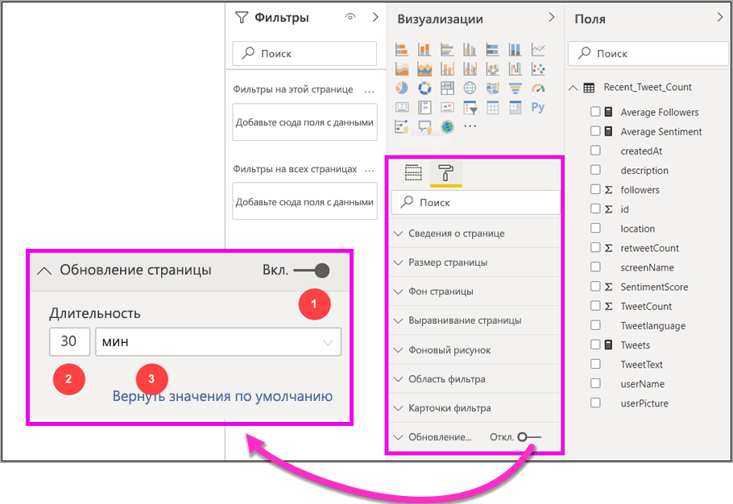
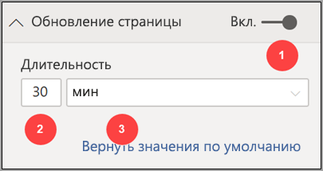

# Автоматическое обновление страниц в Power BI Desktop (предварительная версия)

При мониторинге критических событий важно обновлять данные сразу после обновления исходных данных. Например, в промышленности важно знать, когда компьютер работает со сбоями или близок к этому.

Функция автоматического обновления страниц в Power BI позволяет с заранее определенной периодичностью запрашивать на странице активного отчета новые данные для [источников DirectQuery](https://docs.microsoft.com/power-bi/desktop-directquery-about).

## Использование автоматического обновления страниц

Пока функция автоматического обновления страниц находится в предварительной версии, необходимо включить ее в Power BI Desktop. Последовательно выберите элементы **Файл > Параметры и настройки** > **Параметры**, а затем на панели слева выберите **Предварительная версия функций**. Включите эту функцию, установив флажок рядом с пунктом *Автоматическое обновление страницы*. Автоматическое обновление страницы доступно только для источников данных DirectQuery.

Чтобы использовать автоматическое обновление страницы, выберите страницу отчета, для которой необходимо включить обновление. На панели **Визуализации** выберите значок **Форматирование** (красильный валик) и найдите параметр **Обновление страницы** в нижней части панели. 

На следующем рисунке показана карта **Обновление страницы**. Пояснения для нумерованных элементов описаны в следующих нескольких абзацах.

1.    Ползунок автоматического обновления страницы — включает или отключает обновление страницы.
2.    Значение интервала обновления страницы — числовое значение, устанавливаемое для интервала обновления.
3.    Единица интервала обновления страницы — единица интервала для обновления страницы.

Здесь можно включить обновление страницы и выбрать его длительность. Значение по умолчанию — 30 минут, минимальный интервал обновления — одна секунда. Отчет начнет обновляться с заданным интервалом. 

## Определение интервала обновления страницы

Если автоматическое обновление страницы включено, Power BI Desktop постоянно отправляет запросы в источник DirectQuery. Между отправкой запроса и получением возвращенных данных существует задержка, поэтому для коротких интервалов обновления следует убедиться, что запросы успешно возвращают запрашиваемые данные в течение заданного интервала. Если данные не возвращаются в течение этого интервала, возникают ситуации, когда визуальные элементы обновляются реже, чем настроено.

Рекомендуется, чтобы интервал обновления соответствовал как минимум ожидаемой частоте поступления новых данных:

* Если новые данные поступают в источник каждые 20 минут, интервал обновления не может быть меньше 20 минут. 

* Если новые данные поступают каждую секунду, то интервал должен быть равен одной секунде. 

Для небольших интервалов обновления, таких как одна секунда, следует учитывать тип источника данных прямого запроса, загрузку от запросов, а также расстояние от средства просмотра отчетов до центра обработки данных емкости и т. д. 

Это можно оценить с помощью Анализатора производительности в Power BI Desktop, который позволяет проверить, достаточно ли времени для каждого визуального запроса, чтобы вернуться с результатом из источника, и на что это время потрачено. Учитывая результаты Анализатора производительности, можно настраивать и вносить изменения в источник данных, а также экспериментировать с другими визуальными элементами и мерами в отчете.

На следующем рисунке показаны результаты DirectQuery в Анализаторе производительности:

Давайте рассмотрим некоторые другие характеристики этого источника данных. 

1.    Данные поступают с частотой в две секунды. 
2.    Анализатор производительности показывает максимальное общее время запроса и отображения — примерно 4,9 с (4688 мс). 
3.    Источник данных настроен для обработки приблизительно 1000 одновременных запросов в секунду. 
4.    Предполагается, что примерно 10 пользователей будут одновременно просматривать отчет.

Таким образом, результат будет следующим:

* **5 визуальных элементов x 10 пользователей = приблизительно 50 запросов**

Этот показатель приводит к значительно большей загрузке, чем может поддерживать источник данных. Данные поступают с частотой в две секунды, поэтому это должна быть ваша частота обновления. Однако, так как выполнение запроса занимает около пяти секунд, для частоты обновления необходимо установить более пяти секунд. 

Обратите также внимание, что этот результат может отличаться при публикации отчета в службе, так как в отчете будет использоваться экземпляр Analysis Services, размещенный в облаке. Вы можете настроить частоту обновления соответственно. 

Для учета запросов и времени обновления Power BI будет выполнять следующий запрос на обновление только после завершения всех оставшихся запросов на обновление. Таким образом, даже если интервал обновления короче времени обработки запросов, Power BI будет выполнять следующее обновление только по завершении оставшихся запросов. 

Теперь рассмотрим, как можно обнаружить и диагностировать проблемы с производительностью в качестве администратора емкости. Вы также можете ознакомиться с разделом **часто задаваемых вопросов по автоматическому обновлению страницы** далее в этой статье, чтобы рассмотреть дополнительные вопросы и ответы о производительности и устранении неполадок.

## Автоматическое обновление страницы в службе Power BI

Вы также можете задать интервалы автоматического обновления страниц для отчетов, созданных в Power BI Desktop и опубликованных в службе Power BI. 

Автоматическое обновление страниц для отчетов в службе Power BI настраивается так же, как в Power BI Desktop. При настройке в службе Power BI автоматическое обновление страницы также поддерживает содержимое [Embedded Power BI](developer/embedded/embedding.md). На следующем рисунке показана конфигурация **обновления страниц** для службы Power BI:

1.    Ползунок автоматического обновления страницы — включает или отключает обновление страницы.
2.    Значение интервала обновления страницы — числовое значение, устанавливаемое для интервала обновления; должно быть целым числом.
3.    Единица интервала обновления страницы — единица интервала для обновления страницы.

### Интервалы обновления страницы

Интервалы обновления страницы, разрешенные в службе Power BI, зависят от типа рабочей области отчета. Это относится ко всем следующим ситуациям с отчетами:

* Публикация отчета в рабочей области, для которой включено автоматическое обновление страниц.
* Изменение интервала обновления страницы уже в рабочей области.
* Создание отчета непосредственно в службе.

Power BI Desktop не имеет ограничений для интервала обновления. Можно даже задать обновление раз в секунду. Однако при публикации отчетов в службе Power BI применяются некоторые ограничения, описанные в следующих разделах.

### Ограничения для интервалов обновления

В службе Power BI ограничения автоматического обновления страниц применяются в зависимости от таких факторов, как рабочая область, и от того, используются ли службы уровня "Премиум".

Чтобы понять, как это работает, давайте сначала рассмотрим общие сведения о емкостях и рабочих областях.

**Емкости** — это основная концепция Power BI, представляющая собой набор ресурсов (хранилище, процессор и память), используемых для размещения и доставки содержимого Power BI. Емкости могут быть общими или выделенными. **Общая емкость** используется всеми пользователями Майкрософт, а **выделенная емкость** предназначена только для одного клиента. Выделенные емкости Premium описаны в статье [Управление емкостями Premium](service-premium-capacity-manage.md).

В общей емкости рабочие нагрузки выполняются на вычислительных ресурсах, совместно используемых другими пользователями. Так как емкость должна предоставлять общий доступ к ресурсам, для обеспечения *честной игры* установлены определенные ограничения, например максимальный размер модели (1 ГБ) и максимальная частота ежедневного обновления (восемь раз в день).

**Рабочие области** Power BI находятся в пределах емкости и представляют собой контейнеры безопасности, совместной работы и развертывания. У каждого пользователя Power BI есть личная рабочая область, так называемая **Моя рабочая область**. Для обеспечения совместной работы и выполнения развертывания можно создавать дополнительные **рабочие области**. По умолчанию рабочие области, включая личные рабочие области, создаются в **общей емкости**.

Ниже приведены некоторые сведения о двух сценариях использования рабочей области.

**Общие рабочие области**: для обычных рабочих областей (которые не являются частью емкости Premium) автоматическое обновление страницы имеет минимальный интервал в 30 минут (минимально допустимый интервал).

**Рабочие области Premium**: доступность автоматического обновления страниц в рабочих областях Premium будет зависеть от параметров рабочей нагрузки, настроенных администратором для емкости Power BI Premium. Существует две переменные, которые могут повлиять на возможность настройки автоматического обновления страницы:

 1. *Настройка функции — вкл. или выкл.* : если администратор емкости решил отключить эту функцию, вы не сможете настроить какой-либо тип обновления страницы в опубликованном отчете.

 2. *Минимальный интервал обновления*: при включении функции администратор емкости должен настроить минимальный интервал обновления. Если интервал меньше минимального значения, служба Power BI переопределяет интервал в соответствии с минимальным интервалом, установленным администратором емкости.

В таблице ниже подробно описано, где доступна эта функция, а также указаны ограничения для каждого типа емкости и [режима хранения](service-dataset-modes-understand.md).

| Режим хранения | Выделенная емкость | Общая емкость |
| --- | --- | --- |
| Прямой запрос | **Поддерживается** — да.  **Минимальный интервал обновления** — 1 секунда.  **Администратор емкости переопределяет** — да. | **Поддерживается** — да.  **Минимальный интервал обновления** — 30 минут.  **Администратор емкости переопределяет** — нет. |
| Импорт | **Поддерживается** — нет.  **Минимальный интервал обновления** — н/д.  **Администратор емкости переопределяет** — н/д. | **Поддерживается** — нет.  **Минимальный интервал обновления** — н/д.  **Администратор емкости переопределяет** — н/д. |
| Смешанный режим (DQ и другие) | **Поддерживается** — да.  **Минимальный интервал обновления** — 1 секунда.  **Администратор емкости переопределяет** — да. | **Поддерживается** — да.  **Минимальный интервал обновления** — 30 минут.  **Администратор емкости переопределяет** — нет. |
| Live Connect AS | **Поддерживается** — нет.  **Минимальный интервал обновления** — н/д.  **Администратор емкости переопределяет** — н/д. | **Поддерживается** — нет.  **Минимальный интервал обновления** — н/д.  **Администратор емкости переопределяет** — н/д. |
| Live Connect PBI | **Поддерживается** — нет.  **Минимальный интервал обновления** — н/д.  **Администратор емкости переопределяет** — н/д. | **Поддерживается** — нет.  **Минимальный интервал обновления** — н/д.  **Администратор емкости переопределяет** — н/д. |

> [!NOTE]
> При публикации отчета с включенным автоматическим обновлением страницы из Power BI Desktop в службу необходимо предоставить учетные данные для источника данных DirectQuery в меню параметров набора данных.

## Рекомендации и ограничения

При использовании автоматического обновления страницы в Power BI Desktop или в службе Power BI необходимо учитывать несколько моментов.

* Режимы хранения Import, LiveConnect и Push не поддерживаются для автоматического обновления страниц.  
* Поддерживаются составные модели, имеющие по крайней мере один источник данных DirectQuery.
* Power BI Desktop не имеет ограничений для интервала обновления. Вы даже можете задать обновление раз в секунду. При публикации отчетов в службе Power BI применяются определенные ограничения, описанные выше в этом документе.

### Диагностика производительности

Автоматическое обновление страницы полезно для мониторинга сценариев и изучения быстро меняющихся данных. Однако иногда это может привести к чрезмерной загрузке емкости или источника данных.

Для предотвращения чрезмерной загрузки источников данных в Power BI реализованы следующие меры защиты:

1. Все автоматические запросы на обновление страниц выполняются с **более низким** приоритетом, чтобы интерактивные запросы (например, загрузка страниц и перекрестная фильтрация визуальных элементов) были приоритетными.
2. Если запрос не был завершен до следующего цикла обновления, Power BI не выдает новые запросы на обновление до тех пор, пока не завершится предыдущий запрос. Например, если установлен интервал обновления в одну секунду и запросы в среднем занимают четыре секунды, Power BI фактически выдает запрос каждые четыре секунды.

Существует две области, в которых можно по-прежнему столкнуться со снижением производительности:

1. **Емкость.** Сначала запрос достигает емкости Premium, которая вычисляет и оценивает запрос DAX, сгенерированный из визуализаций отчета, преобразовывая его в запрос источника.
2. **Источник данных прямого запроса.** Преобразованные запросы на предыдущем шаге выполняются в источнике, в частности SQL Server, SAP Hana и т. д.

С помощью [приложения метрик Premium](service-admin-premium-monitor-capacity.md), доступного для администраторов, можно визуализировать, какая часть емкости используется низкоприоритетными запросами.

Низкоприоритетные запросы состоят из автоматических запросов обновления страниц и запросов обновления модели. В настоящее время нет способа отличить загрузку от запросов автоматического обновления страниц и запросов обновления модели.

Если вы заметили, что емкость перегружается низкоприоритетными запросами, можно выполнить несколько действий:

1. Запросите больший SKU Premium.
2. Обратитесь к владельцу отчета и попросите уменьшить интервал обновления.
3. На портале администрирования емкости можно выполнить следующее.
  1. Отключить автоматическое обновление страниц для этой емкости.
  2. Увеличить минимальный интервал обновления, который будет влиять на все отчеты в этой емкости.

### Часто задаваемые вопросы

В этом разделе рассматриваются такие общие вопросы и ответы: 

1. Я автор отчета. Для интервала обновления отчета установлено значение 1 с в Power BI Desktop, но после публикации отчет не обновляется в службе.

    * Убедитесь, что для страницы включено автоматическое обновление. Так как этот параметр задается для каждой страницы, необходимо убедиться, что он включен для каждой страницы в отчете, которую вы хотите обновить.
    * Убедитесь, что вы отправили данные в рабочую область с подключенной емкостью Premium. Если нет, то интервал обновления будет соответствовать 30 минутам.
    * Если отчет находится в рабочей области Premium, обратитесь к администратору, чтобы включить эту функцию для подключенной емкости. Кроме того, убедитесь, что минимальный интервал обновления для емкости меньше или совпадает с интервалом, установленным для отчета.

2. Я являюсь администратором емкости. Параметры интервала автоматического обновления страницы изменены, но они не отражаются. Иными словами, отчеты по-прежнему обновляются с неправильной частотой или не обновляются, хотя эта функция была включена.

    * Изменения параметров автоматического обновления страницы, сделанные в пользовательском интерфейсе администратора емкости, распространяются на отчеты в течение 5 минут.
    * Автоматическое обновление страниц нужно включить не только для емкости, но и для необходимых страниц отчета.

3. Мой отчет работает в смешанном режиме (DQ + Import). Не все визуальные элементы обновляются.

    * Это ожидаемое поведение, если визуальные элементы ссылаются на таблицы Import. Автоматическое обновление страницы не поддерживается для режима Import.
    * См. ответ на вопрос 1 в этом разделе.

4. Отчет успешно обновлялся в службе, а затем внезапно перестал.

    * Попробуйте обновить страницу, чтобы увидеть, устраняется ли проблема самостоятельно.
    * Обратитесь к администратору емкости, так как возможно, он отключил функцию или повысил минимальный интервал обновления (см. вопрос 2).

5. Я автор отчета. Мои визуальные элементы не обновляются с заданной периодичностью. Они обновляются с более низкой частотой.

    * Если выполнение запросов длится дольше, интервал обновления будет отложен. Автоматическое обновление страницы ожидает завершения всех запросов перед выполнением новых.
    * Администратор емкости может установить минимальный интервал обновления, превышающий заданный в отчете. Обратитесь к администратору емкости и попросите его уменьшить интервал.

6. Запросы автоматического обновления страниц выполняются из кэша?

    * Нет, все запросы автоматического обновления страниц обходят все кэшированные данные.

## Дальнейшие действия

Дополнительные сведения см. в следующих статьях:

* [Использование DirectQuery в Power BI](desktop-directquery-about.md)
* [Use Performance Analyzer to examine report element performance](desktop-performance-analyzer.md) (Проверка производительности элементов отчета с помощью Анализатора производительности)
* [Развертывание емкостей Power BI Premium и управление ими](whitepaper-powerbi-premium-deployment.md)
* [Источники данных в Power BI Desktop](desktop-data-sources.md)
* [Формирование и объединение данных в Power BI Desktop](desktop-shape-and-combine-data.md)
* [Подключение к данным Excel в Power BI Desktop](desktop-connect-excel.md)   
* [Ввод данных непосредственно в Power BI Desktop](desktop-enter-data-directly-into-desktop.md)   
