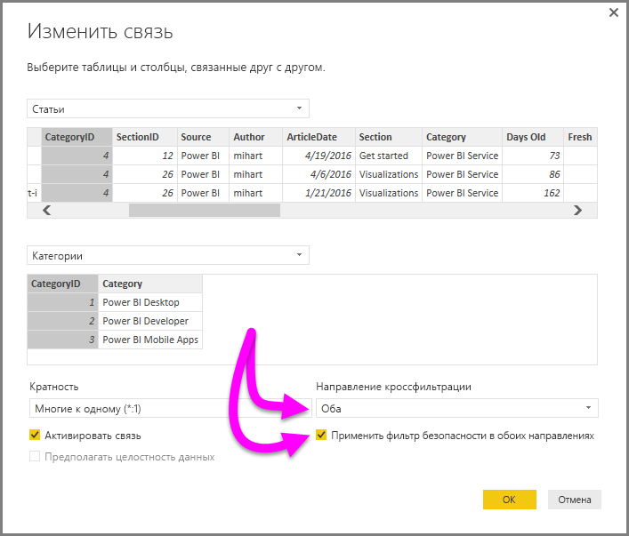

# Включение двунаправленной перекрестной фильтрации при работе с DirectQuery в Power BI Desktop

При фильтрации таблиц для создания соответствующего представления данных создатели отчетов и моделей данных сталкиваются с трудностями, когда необходимо определить способы применения фильтров к отчету. Ранее контекст фильтра таблицы находился на одной стороне связи, но не на другой. Для получения желаемых результатов часто требовалась сложная формула DAX.

Благодаря двунаправленной кросс-фильтрации создатели отчетов и моделей данных теперь могут лучше контролировать применение фильтров при работе со связанными таблицами. Двунаправленная кросс-фильтрация позволяет применять фильтры по *обе* стороны связи таблиц. Вы можете применять фильтры, распространяя контекст фильтра на вторую связанную таблицу на другой стороне связи.

## Включение двунаправленной кросс-фильтрации для DirectQuery

Кросс-фильтрацию можно включить в диалоговом окне **Изменить связь**. Чтобы включить кросс-фильтрацию для связи, необходимо настроить следующие параметры.

* Установите для параметра **Направление кросс-фильтрации** значение **Двунаправленная**.
* Выберите **Применить фильтр безопасности в обоих направлениях**.

  

> [!NOTE]
> При создании формул DAX для кросс-фильтрации в Power BI Desktop используйте *UserPrincipalName*. Это поле часто совпадает с именем входа пользователя, например <em>joe@contoso.com</em>, вместо *UserName*. Поэтому может потребоваться создать связанную таблицу, которая сопоставляет *UserName* или *EmployeeID* с таблицей *UserPrincipalName*.

Дополнительные сведения и примеры работы двунаправленной кросс-фильтрации см. в [техническом документе "Двунаправленная кросс-фильтрация для Power BI Desktop"](https://download.microsoft.com/download/2/7/8/2782DF95-3E0D-40CD-BFC8-749A2882E109/Bidirectional%20cross-filtering%20in%20Analysis%20Services%202016%20and%20Power%20BI.docx).

