# Создание закладок в Power BI Desktop для обмена аналитическими сведениями и создания историй
С помощью *закладок* в Power BI Desktop можно сохранить текущее настроенное представление страницы отчета, включая фильтры и состояние визуальных элементов. Позже вы можете вернуться к этому состоянию, просто выбрав сохраненную закладку. 

Вы также можете создать коллекцию закладок, расположить их в необходимом порядке и позднее переходить к каждой закладке в презентации, чтобы выделить ряд аналитических сведений или привлечь внимание к истории о данных с помощью визуальных элементов и отчетов. 

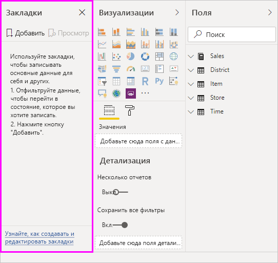

Существует множество вариантов применения закладок. Например, закладки можно использовать, чтобы отслеживать ход создания отчетов (закладки удобно добавлять, удалять и переименовывать). Для создания презентации по типу PowerPoint вы можете создать закладки с возможностью последовательного перехода. 

> [!TIP]
> Сведения об использовании личных закладок в службе Power BI см. в [объявлении о личных закладках в службе Power BI](https://powerbi.microsoft.com/blog/announcing-personal-bookmarks-in-the-power-bi-service/). 

## Использование закладок
Чтобы использовать закладки, откройте вкладку **Вид** на ленте Power BI Desktop и выберите **Панель закладок**. 

Когда создается закладка, вместе с ней сохраняются следующие элементы:

* текущая страница;
* Фильтры
* срезы, в том числе тип среза (например, раскрывающийся список или список) и состояние среза;
* состояние выбора визуального элемента (например, фильтры перекрестного выделения);
* порядок сортировки;
* расположение при детализации;
* видимость объекта, настраиваемая с помощью панели **выбора**;
* режим фокусировки или режим **В центре внимания** для любого видимого объекта.

Настройте вид страницы отчета для отображения в закладке. Когда вы упорядочите страницу отчета и визуальные элементы нужным образом, на панели **Закладки** щелкните **Добавить**, чтобы добавить закладку. 

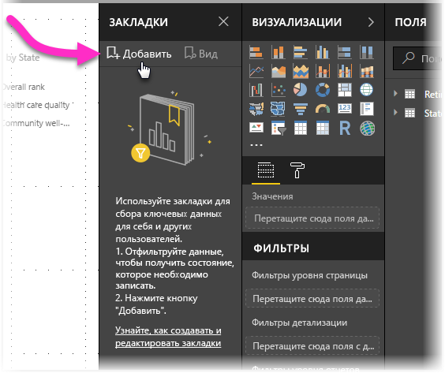

Power BI Desktop создает закладку с универсальным именем. Вы можете легко **Переименовать**, **Удалить** или **Обновить** закладку. Для этого щелкните многоточие рядом с ее именем и выберите действие в отобразившемся меню.

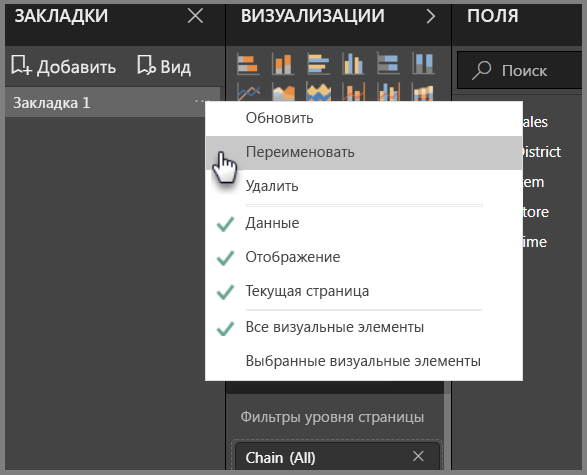

Когда закладка создана, для ее отображения выберите закладку на панели **Закладки**. 

Кроме того, вы можете выбрать, будут ли для каждой закладки применяться такие свойства **данных**, как фильтры и срезы, такие свойства **отображения**, как функция "В центре внимания" и ее видимость, а также изменения **текущей страницы**, которая была открыта в момент добавления закладки. Эти возможности полезны, когда закладки используются для переключения представлений отчета или выбранных визуальных элементов: в этом случае свойства данных лучше отключить, чтобы избежать сброса фильтров. 

Чтобы внести такие изменения, щелкните многоточие рядом с именем закладки, а затем установите или снимите флажки рядом с элементами управления **Данные**, **Отображение** и др. 

## Упорядочивание закладок
По мере создания закладок может оказаться, что они создаются не в том порядке, в котором должны отображаться для аудитории. Это не проблема. Вы можете легко изменить порядок закладок.

- Перетащите закладки на панели **Закладки**, чтобы изменить их порядок. 

   Желтая строка между закладками указывает на расположение перетаскиваемой закладки.

   

Порядок закладок может быть важным, если используется функция закладок **Представление**, описанная в следующем разделе.

## Представление закладок в виде слайд-шоу
Если необходимо показать свою коллекцию закладок в определенном порядке, на панели **Закладки** можно выбрать **Представление**, чтобы начать слайд-шоу.

При использовании режима **Представление** обратите внимание на несколько возможностей.

   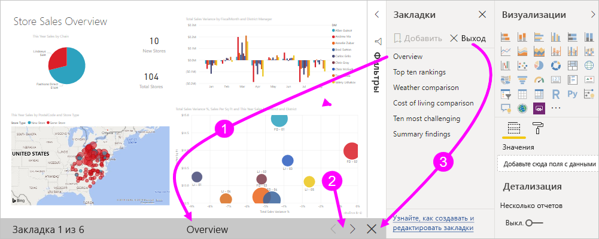

1. Имя закладки отображается в строке заголовка закладки в нижней части холста.

2. В строке заголовка закладки есть кнопки со стрелками для перемещения к следующей или предыдущей закладке.

3. Вы можете выйти из режима **Представление**, нажав кнопку **Выход** на панели **Закладки** или щелкнув **X** в строке заголовка закладки. 

При работе в режиме **Представление** вы можете закрыть панель **Закладки**, щелкнув **X** на этой панели, чтобы предоставить дополнительное пространство для презентации. Также в режиме **Представление** все визуальные элементы являются интерактивными и доступными для перекрестного выделения (как и при взаимодействии с ними напрямую). 

## Видимость: использование панели выбора
Панель **выбора**, связанная с панелью **закладок**, содержит список всех объектов на текущей странице, позволяя выбрать объект и указать, является ли он видимым. 

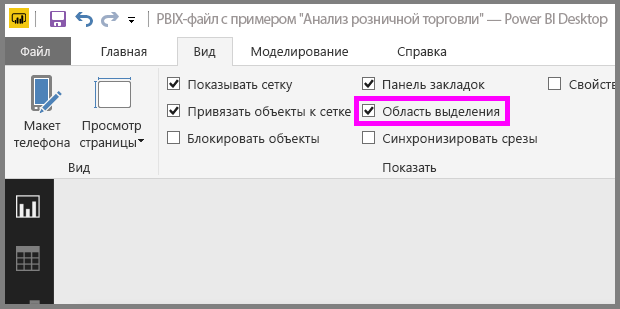

На панели **выбора**можно выбрать объект и определить, является ли он видимым, щелкнув значок в виде глаза справа от объекта. 

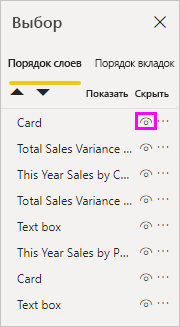

При добавлении закладки также сохраняется состояние видимости каждого объекта на основе его настроек на панели **выбора**. 

Важно помнить, что срезы по-прежнему используются для фильтрации страницы отчета, независимо от того, являются ли они видимыми. Таким образом, вы можете создавать различные закладки с разными настройками срезов и создавать разные представления (отражающие разные аналитические сведения) одной страницы отчета в нескольких закладках.

## Закладки для фигур и изображений
Вы также можете связывать фигуры и изображения с закладками. Если используется эта функция, при выборе объекта отображается связанная с ним закладка. Эта функция может быть особенно полезной при работе с кнопками. Дополнительные сведения см. в статье [Использование кнопок в Power BI](desktop-buttons.md). 

Назначение закладки для объекта 

1. Выберите объект на холсте отчета. Затем в появившейся области **Форматировать фигуру** переключите ползунок **Действие** на значение **Включено**.

2. Разверните раздел **Действие**. В поле **Тип** выберите **Закладка**.

3. В поле **Закладки**  выберите закладку.

   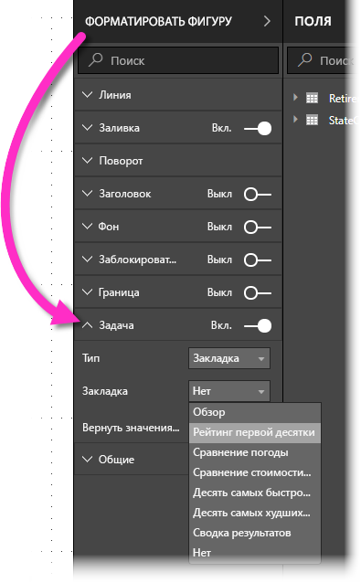

С помощью закладок, связанных с объектами, можно выполнять много разных действий. Можно создать наглядное оглавление на странице отчета или предоставить различные представления (например, шаблоны визуализации) одних и тех же сведений.

Если вы находитесь в режиме редактирования, нажмите клавишу **CTRL** и выберите ссылку, чтобы перейти по ней. Если вы находитесь не в режиме редактирования, выберите объект, чтобы перейти по ссылке. 

## Группы закладок

Начиная с версии за август 2018 г., в Power BI Desktop можно создавать и использовать группы закладок. Группа закладок — это коллекция выбранных вами закладок, которые можно объединять в группы. 

Создание группы закладок 
1. Нажмите клавишу **CTRL** и выберите закладки, которые нужно включить в группу. 

2. Нажмите кнопку с многоточием рядом с выбранными закладками, а затем в появившемся меню выберите **Группировать**.

   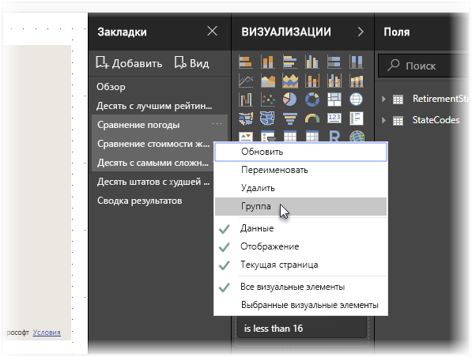

Power BI Desktop автоматически присваивает группе имя *Группа 1*. Можно нажать кнопку с многоточием рядом с этим именем, выбрать **Переименовать** и указать любое подходящее имя.

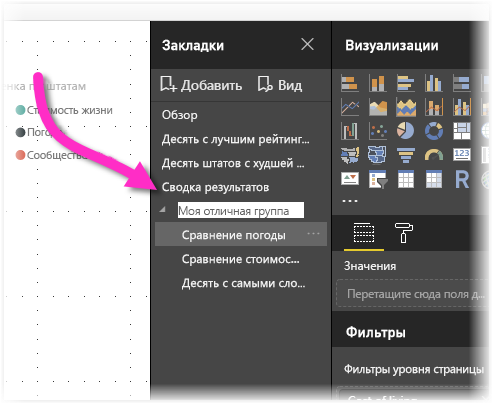

Если развернуть имя группы закладок, группа закладок будет просто свернута или развернута, но сама закладка открыта не будет. 

При использовании функции закладок **Представление** происходит следующее.

* Если выбранная закладка при выборе команды **Показать** находится в группе, в сеансе просмотра будут отображаться только закладки *из этой группы*. 

* Если выбранная закладка не входит в группу или находится на верхнем уровне (например, имя группы закладок), при использовании этой функции воспроизводятся все закладки отчета, включая закладки в любой группе. 

Разгруппировка закладок 
1. Выберите любую закладку в группе и нажмите кнопку с многоточием. 

2. В открывшемся меню выберите пункт **Разгруппировать**.

   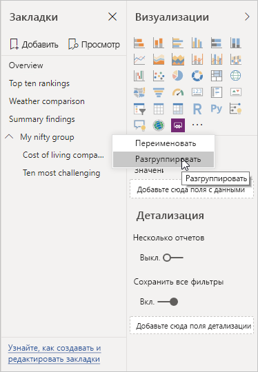

   Применение команды **Разгруппировать** к любой закладке из группы удаляет из нее все закладки (эта команда удаляет группу, но не сами закладки). 

Удаление одной закладки из группы 
1. Выполните команду **Разгруппировать** для любого члена этой группы, что отменяет все группирование. 

2. Выберите нужные члены новой группы, нажав клавишу **CTRL** и выбрав каждую закладку, а затем снова выберите команду **Группировать**. 

## Использование функции "В центре внимания"
Вместе с закладками в выпуске также представлена функция *В центре внимания*. Функция "В центре внимания" позволяет привлечь внимание к определенной диаграмме, например при отображении закладок в режиме **Представление**.

Давайте сравним режим "В центре внимания" с режимом фокусировки, чтобы увидеть, чем они отличаются.

1. В режиме фокусировки можно выбрать значок **Режим фокусировки** визуального элемента, в результате чего визуальный элемент заполняет весь холст.

2. Выбрав пункт **В центре внимания** в меню кнопки с многоточием для визуального элемента, можно выделить один визуальный элемент в его исходном размере, при этом другие визуальные элементы на странице станут почти прозрачными. 

При выборе значка **Режим фокусировки** визуального элемента на предыдущем изображении страница выглядит следующим образом.

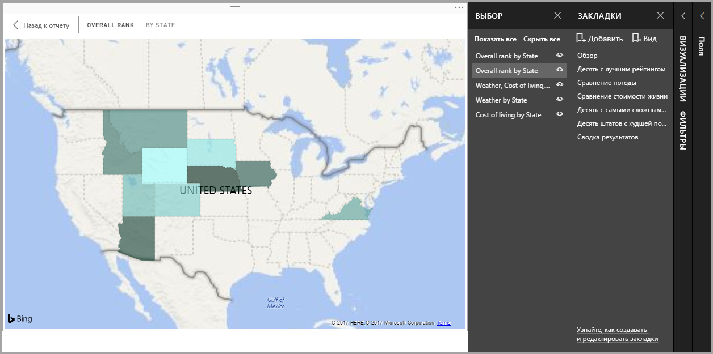

Если в меню, которое открывается при выборе многоточия, для визуального элемента выбрать пункт **В центре внимания**, страница выглядит следующим образом.

Если при добавлении закладки выбран один из режимов (режим фокусировки или "В центре внимания"), он сохранится в закладке.

## Закладки в службе Power BI
Если вы публикуете в службе Power BI отчет хотя бы с одной закладкой, вы сможете просматривать эти закладки и взаимодействовать с ними в службе Power BI. Когда в отчете доступны закладки, панели **выбора** и **закладок** можно отобразить, выбрав **Вид** > **Область выделения** или **Вид** > **Панель закладок**. 

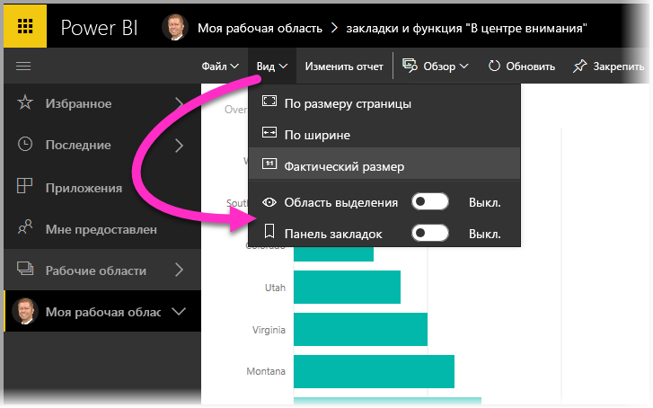

В службе Power BI панель **закладок** работает так же, как в Power BI Desktop, включая возможность выбора **представления** для отображения закладок по порядку в виде слайд-шоу.

Чтобы перемещаться по закладкам, используйте серую строку заголовка закладки вместо черных стрелок. (Черные стрелки позволяют перемещаться по страницам отчета, а не по закладкам.)

## Включение предварительной версии функции закладок (версии, выпущенные до марта 2018 г.)
Начиная с версии Power BI Desktop за март 2018 г., функция закладок становится общедоступной. 

Мы всегда рекомендуем вам обновляться до последней версии. Но если вы используете более раннюю версию Power BI Desktop, то сможете оценить функцию закладок, начиная с выпуска Power BI Desktop за октябрь 2017 г., включая возможность ее применения для отчетов с поддержкой закладок в службе Power BI. 

Включение предварительной версии функции закладок 

1. Выберите **Файл** > **Параметры и настройки** > **Параметры** > **предварительная версия функций** и **Закладки**. 

   

2. Перезапустите Power BI Desktop для включения предварительной версии функции закладок.

## Рекомендации и ограничения
К этому выпуску функций закладок применяется ряд ограничений и рекомендаций.

* Большинство пользовательских визуальных элементов должны нормально работать с использованием закладок. Но если у вас возникли трудности при использовании закладок и пользовательского визуального элемента, то обратитесь к его разработчику с просьбой добавить поддержку закладок в соответствующий визуальный элемент. 
* Если на страницу отчета добавить визуальный элемент после создания закладки, он отображается в состоянии по умолчанию. То есть если добавить срез на страницу с созданными ранее закладками, то он остается в состоянии по умолчанию.
* Перемещение визуального элемента после создания закладки автоматически отражается в закладке. 

## Дальнейшие действия
Дополнительные сведения о похожих функциях или функциях, которые взаимодействуют с закладками, см. в следующих статьях.

* [Использование детализации в Power BI Desktop](desktop-drillthrough.md)
* [Отображение плитки панели мониторинга или визуального элемента отчета в режиме фокусировки](consumer/end-user-focus.md)

