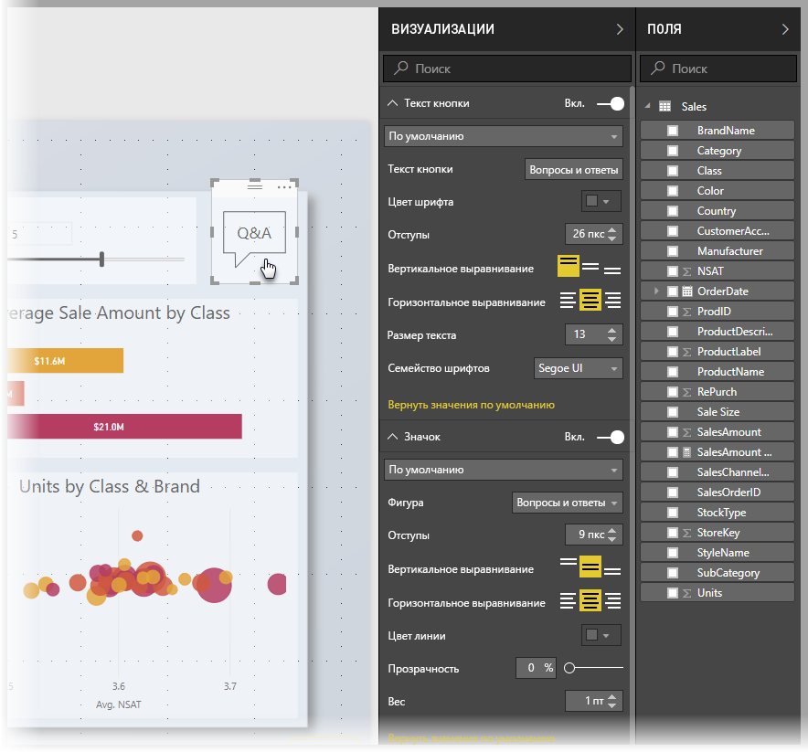
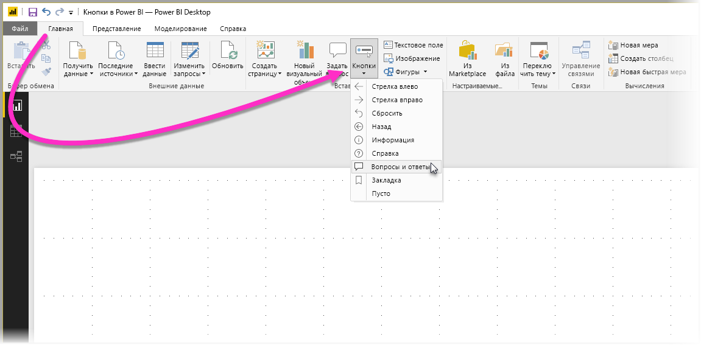
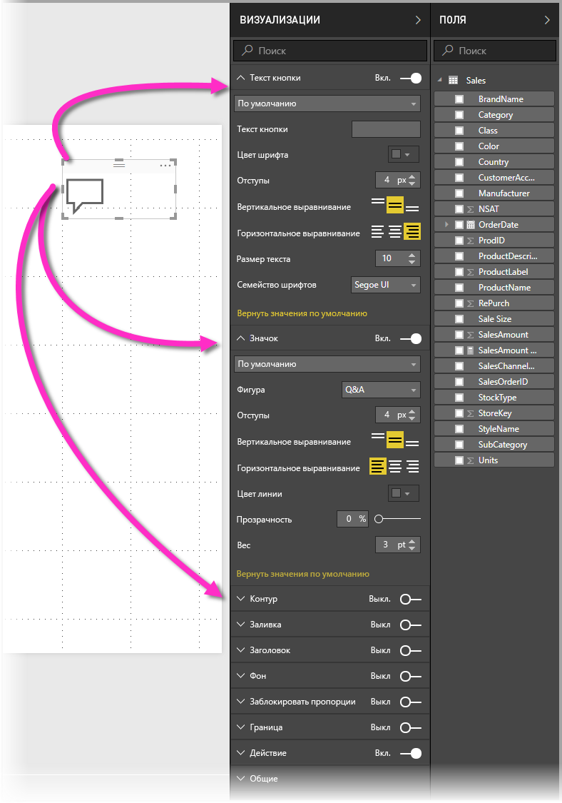
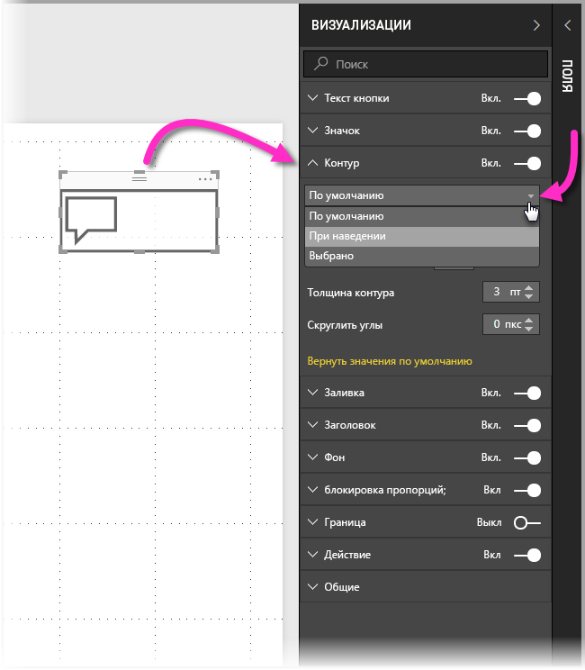
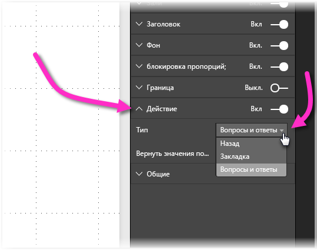

# Использование кнопок в Power BI
**Кнопки** в Power BI позволяют создавать отчеты и панели мониторинга, которые работают как приложения. С их помощью вы можете создать удобную среду, где пользователи могут эффективно взаимодействовать мышью с элементами Power BI. Добавив кнопки в отчеты **Power BI Desktop**, предоставьте к ним общий доступ или опубликуйте их в службе Power BI и создайте панели мониторинга, чтобы пользователи могли работать с отчетами, как с обычными приложениями.

Кнопки, создаваемые в **Power BI Desktop**, могут использоваться в отчетах и панелях мониторинга, публикуемых в **службе Power BI**.

## Создание кнопок в отчетах
Чтобы создать кнопку в отчете **Power BI Desktop**, на ленте **Главная** выберите элемент **Кнопки**. Появится раскрывающееся меню, где вы сможете выбрать нужные кнопки из доступных вариантов, как показано на следующем рисунке. 

Когда вы создаете кнопку и выбираете ее на холсте отчета, в панели **Визуализации** отображаются разнообразные варианты настройки кнопки под ваши нужды. Например, вы можете добавить **Текст кнопки**, переместив ползунок соответствующей карточки в панели **Визуализации**. Вы также можете изменить значок кнопки, ее заливку, заголовок и действие, выполняемое при нажатии на кнопку в отчете или панели мониторинга, а также другие параметры.

## Задание свойств кнопки при бездействии, наведении и выборе

У кнопок в Power BI есть три состояния: по умолчанию (кнопка не выбрана, и на нее не наведен указатель мыши), при наведении указателя мыши и при выборе (при *щелчке* по кнопке мышью). Многие карточки в панели **Визуализации** можно изменять на основе этих трех состояний. Таким образом, вы получаете значительную гибкость для индивидуальной настройки кнопок.

Следующие карточки в панели **Визуализации** позволяют изменять формат и поведение кнопки в зависимости от трех ее состояний.

* Текст кнопки
* Значок
* Контур
* Заливка

Чтобы настроить отображение кнопки для каждого состояния, разверните любую из этих карточек и откройте раскрывающийся список в ее верхней части. На следующем рисунке показана развернутая карточка **Контур** с раскрывающимся списком, содержащим три состояния кнопки.

## Выбор действия для кнопки

Вы можете выбрать действие, которое будет выполнено, когда пользователь нажмет кнопку в Power BI. Возможные действия для кнопки находятся в карточке **Действие** в панели **Визуализации**.

Для кнопок доступны следующие действия.

* Назад
* Закладка
* Вопросы и ответы

Действие **Назад** возвращает пользователя на предыдущую страницу отчета. Это особенно удобно для страниц детализации.

Действие **Закладка** открывает страницу по закладке, заданной для текущего отчета. См. [дополнительные сведения о закладках в Power BI](desktop-bookmarks.md). 

При выборе в раскрывающемся списке действия **Вопросы и ответы** открывается окно **Обозревателя вопросов и ответов**. 

Для определенных кнопок действие по умолчанию выбирается автоматически. Например, для кнопки типа **Вопросы и ответы** как действие по умолчанию автоматически выбирается **Вопросы и ответы**. Дополнительные сведения об **Обозревателе вопросов и ответов** см. в [этой записи блога](https://powerbi.microsoft.com/blog/power-bi-desktop-april-2018-feature-summary/#Q&AExplorer).

Чтобы опробовать созданные для отчета кнопки, нажимайте их, удерживая клавишу *CTRL*. 

## Дальнейшие действия
Дополнительные сведения о похожих функциях и о взаимодействии с кнопками см. в следующих статьях.

* [Использование детализации в Power BI Desktop](desktop-drillthrough.md)
* [Отображение плитки панели мониторинга или визуального элемента отчета в режиме фокусировки](service-focus-mode.md)
* [Использование закладок для обмена аналитическими сведениями и создания историй в Power BI](desktop-bookmarks.md)

