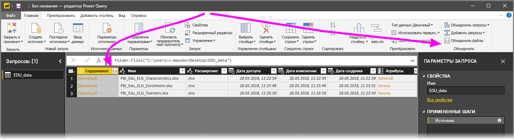
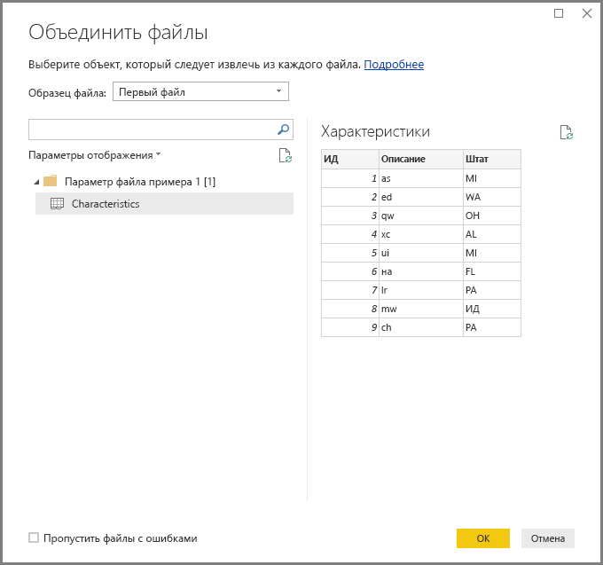
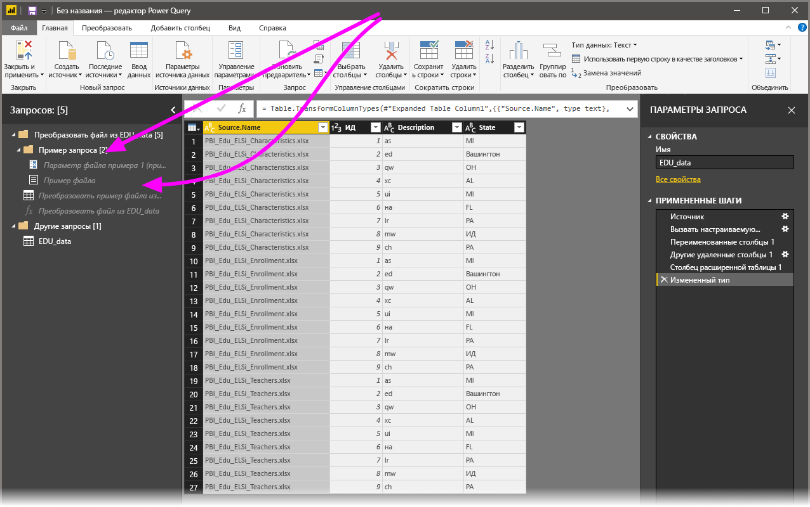

# Объединение файлов (двоичных) в Power BI Desktop
Один из самых эффективных способов импортировать данные в **Power BI Desktop** — это объединить нескольких файлов с одинаковыми схемами в одну логическую таблицу. В выпуске **Power BI Desktop** за ноябрь 2016 г. (и последующих выпусках) этот популярный способ стал еще более удобным и функциональным. В этой статье описывается, как его использовать.

Чтобы запустить объединение файлов из одной и той же папки, последовательно выберите **Получить данные > Файл > Папка**.

## Как объединение файлов (двоичных) выполнялось раньше
До выпуска **Power BI Desktop** за ноябрь 2016 г. эта функция называлась **Объединить двоичные данные**. Можно было объединять определенные типы файлов с помощью преобразования **Объединить двоичные данные**. Но такой подход связан с рядом ограничений.

* Преобразования для каждого отдельного файла не учитывались до объединения файлов в одну таблицу. Следовательно, файлы нужно было часто объединять, а затем отфильтровывать *значения заголовков*, используя фильтрацию строк в процессе редактирования.
* Преобразование **Объединить двоичные данные** использовалось только для *текстовых* файлов и *CSV*-файлов. Его нельзя было применять с другими поддерживаемыми форматами: книгам Excel, JSON-файлам и т. п.

Пользователи просили сделать операцию **объединения двоичных файлов** более понятной, поэтому мы оптимизировали преобразование и назвали ее **объединением файлов**.

## Как объединение файлов выполняется сейчас
**Power BI Desktop** теперь управляет **объединением файлов (двоичных)** более эффективно. Для начала вам нужно выбрать преобразование **Объединить файлы**. Это можно сделать на вкладке **Главная** ленты **редактора запросов** или непосредственно в столбце.

Преобразование **Объединить файлы** теперь выполняется так:

* В ходе **объединения файлов** анализируется каждый входной файл и определяется подходящий для использования формат (например, *текст*, *книга Excel* или файл *JSON*).
* Преобразование позволяет выбрать из первого файла определенный объект для извлечения (например, *книгу Excel*).
  
  
* Далее в процессе **объединения файлов** автоматически выполняются следующие запросы:
  
  * Создается пример запроса, который выполняет все требуемые действия по извлечению в одном файле.
  * Создается *функциональный запрос*, который параметризует входные данные (файл или двоичные данные) в *экземпляр запроса*. Чтобы изменения в экземпляре запроса отражались в функциональном запросе, оба запроса связываются.
  * *Функциональный запрос* применяется к исходному запросу с использованием входных двоичных данных (например, к запросу *папки*). Таким образом этот запрос применяется к входным двоичным данным каждой строки, а затем полученные в результате извлечения данные разворачиваются как столбцы верхнего уровня.
    
    

Новый механизм позволяет легко **объединять файлы** в указанной папке, если они имеют одинаковый тип и структуру (например, одинаковые столбцы).

Кроме того, теперь можно легко применить дополнительные действия преобразования или извлечения, просто изменив автоматически созданный *экземпляр запроса*. Вам не нужно дублировать эти действия в *функциональном запросе*. Все изменения в *экземпляре запроса* автоматически создаются в связанном *функциональном запросе*.

## Дальнейшие действия
В Power BI Desktop можно подключаться к данным самых разных видов. Дополнительные сведения об источниках данных см. в перечисленных ниже статьях.

* [Что такое Power BI Desktop?](desktop-what-is-desktop.md)
* [Источники данных в Power BI Desktop](desktop-data-sources.md)
* [Формирование и объединение данных в Power BI Desktop](desktop-shape-and-combine-data.md)
* [Подключение к CSV-файлам в Power BI Desktop](desktop-connect-csv.md)   
* [Ввод данных непосредственно в Power BI Desktop](desktop-enter-data-directly-into-desktop.md)   

