# Общие задачи с запросами в Power BI Desktop
При работе в окне **Редактор запросов** Power BI Desktop можно воспользоваться рядом стандартных задач. В этом документе показаны эти распространенные задачи и приведены ссылки для получения дополнительных сведений. 

Здесь показываются следующие распространенные задачи:

* Подключение к данным
* Формирование и объединение данных.
* Группирование строк.
* Сводные столбцы.
* Создание настраиваемых столбцов.
* Формулы запросов.

Мы будем использовать несколько подключений к данным для выполнения этих задач. Данные доступны для загрузки или подключения, если вы хотите самостоятельно выполнить эти задачи.

Первое подключение к данным — это книга Excel, которую можно загрузить по [этой ссылке](http://download.microsoft.com/download/5/7/0/5701F78F-C3C2-450C-BCCE-AAB60C31051D/PBI_Edu_ELSi_Enrollment_v2.xlsx). Второе — веб-ресурс (также используемый в другом контенте справки по Power BI Desktop), доступ к которому можно получить здесь:

[*http://www.bankrate.com/finance/retirement/best-places-retire-how-state-ranks.aspx*](http://www.bankrate.com/finance/retirement/best-places-retire-how-state-ranks.aspx)

Распространенные задачи запросов начинаются с шагов, необходимых для подключения к этим источникам данных.

## Подключение к данным
Для подключения к данным в Power BI Desktop нажмите кнопку **Получить данные** на вкладке ленты **Главная**. В Power BI Desktop откроется меню с наиболее распространенными источниками данных. Чтобы открыть полный список источников данных, к которым может подключаться Power BI Desktop, нажмите кнопку **Еще...** внизу меню. Дополнительные сведения см. в разделе [Источники данных в Power BI Desktop](https://docs.microsoft.com/power-bi/desktop-data-sources).

Для начала выберите **Excel** и перейдите к рабочей книге, затем выберите ее. Запрос изучает книгу и представляет найденные данные в окне **Навигатор** .

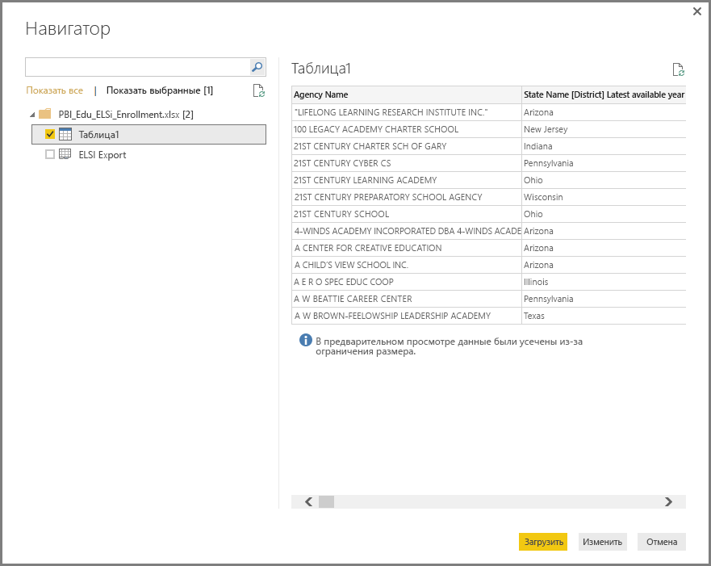

Можно щелкнуть **Изменить** , чтобы скорректировать или *сформировать* данные перед загрузкой в Power BI Desktop. Редактирование запроса перед загрузкой особенно полезно при работе с большими наборами данных, которые требуется сократить перед загрузкой. Поскольку нам это и нужно, мы выбираем **Изменить**.

Подключение к другим типам данных выполняется так же просто. Нам также нужно подключиться к веб-ресурсу. Выберите **Получить данные \> Еще…** и щелкните **Другие \> Интернет**.

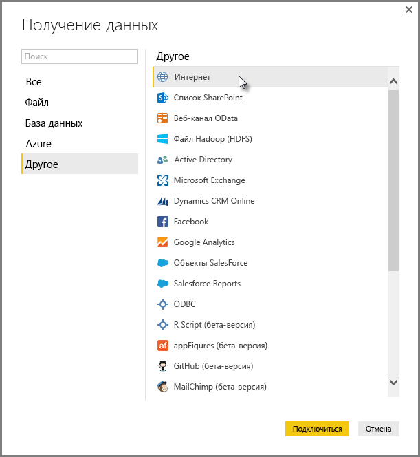

Отобразится окно **Из Интернета** , где можно ввести URL-адрес веб-страницы.

Нажмите кнопку **ОК**и, как и прежде, Power BI Desktop изучает книгу и представляет найденные данные в окне **Навигатор** .

Другие подключения к данным выполняются аналогично. Если для подключения к данным требуется аутентификация, в Power BI Desktop отобразится запрос на ввод соответствующих учетных данных.

Пошаговую демонстрацию подключения к данным в Power BI Desktop см. в разделе [Подключение к данным в Power BI Desktop](https://docs.microsoft.com/power-bi/desktop-connect-to-data).

## Формирование и объединение данных.
С помощью редактора запросов легко формировать и комбинировать данные. В этом разделе приводится несколько примеров формирования данных. Полную демонстрацию формирования и объединения данных с помощью Power BI Desktop см. в статье **[Формирование и объединение данных с Power BI Desktop](https://docs.microsoft.com/power-bi/desktop-shape-and-combine-data)**.

В предыдущем разделе мы подключались к двум наборам данных: книге Excel и веб-ресурсу. После загрузки данных в редакторе запросов отображаются следующие сведения с выбранным на веб-странице запросом (из доступных запросов, перечисленных в области **Запросы** в левой части окна "Редактор запросов").

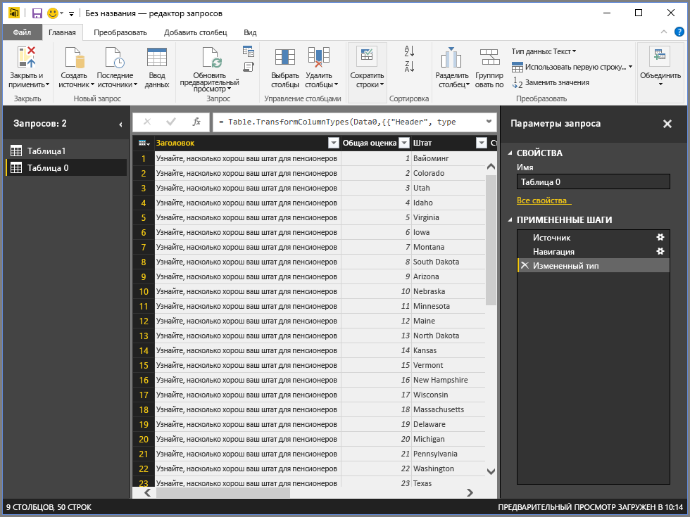

При формировании данных источник данных преобразуется в нужные форму и формат. В этом случае первый столбец под названием *Заголовок*не требуется, поэтому его нужно удалить.

В представлении **Редактор запросов**на ленте и в контекстном меню, которое открывается щелчком правой кнопки мыши, можно найти множество команд. Например, если щелкнуть правой кнопкой мыши столбец *Заголовок*, в отобразившемся меню можно удалить этот столбец. Вы также можете выбрать столбец, а затем нажать кнопку **Удалить столбцы** на ленте.

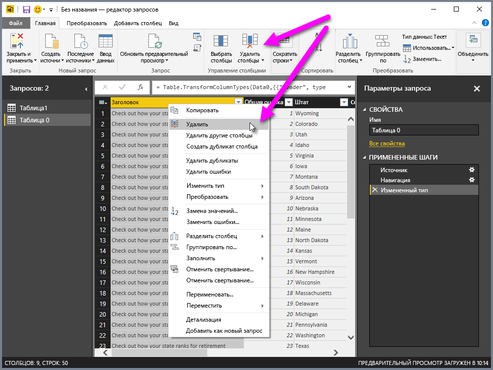

Существует множество других способов форматировать данные в этом запросе: можно удалить любое количество строк сверху или снизу, можно добавлять столбцы, разделять столбцы, заменять значения и выполнять другие задачи формирования, чтобы с помощью редактора запросов получить требуемые данные.

## Группирование строк.
В редакторе запросов можно группировать значения из нескольких строк в одно значение. Это полезно при суммировании количества продуктов, общего объема продаж или количества учащихся.

В этом примере мы группируем строки в набор данных по численности обучающихся в образовательных учреждениях. Данные получены из книги Excel и сформированы в редакторе запросов, чтобы извлечь только нужные столбцы, переименовать таблицу и выполнить несколько других преобразований.

Давайте выясним, сколько учреждений (в том числе школьных округов и других образовательных учреждений, таких как региональные службы и т. д.) имеется в каждом штате. Выберите столбец *State Abbr* (Сокращение для названия штата), затем нажмите кнопку **Группировать по** на вкладке **Преобразование** или **Главная** на ленте (кнопка **Группировать по** имеется на обеих вкладках).

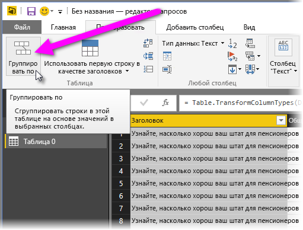

Откроется окно **Группировать по**. . Когда редактор запросов группирует строки, он создает новый столбец, в который помещаются результаты выполнения команды **Группировать по** . Скорректировать операцию **Группировать по** можно следующими способами.

1. *Группировать по* — это столбец, по которому требуется выполнить группирование. Редактор запросов выбирает выделенный столбец, но его можно изменить в этом окне на любой столбец в таблице.
2. *Имя нового столбца* — редактор запросов автоматически предлагает имя для нового столбца с учетом операции, которая применяется к группируемому столбцу, однако этому новому столбцу можно присвоить любое имя.
3. *Операция* — здесь можно указать операцию, которую применяет редактор запросов.
4. *Добавление группирования* и *Добавление агрегирования* — эти параметры отображаются, если выбран параметр **Дополнительно**. Можно выполнять операции группирования (действия **Группировать по**) с несколькими столбцами, а также выполнять несколько операций агрегирования — и все это можно делать в окне **Группировать по** в рамках одной операции. Редактор запросов создает новый столбец (с учетом выбранных в этом окне значений), который работает с несколькими столбцами. 

Нажмите кнопку **Добавление группирования** или **Добавление агрегирования**, чтобы добавить группирования или агрегаты в операцию **Группировать по**. Можно удалить группирование или агрегат, щелкнув **...** (многоточие) и выбрав пункт **Удалить**. Попробуйте сделать это сейчас, чтобы увидеть, что произойдет.
   
   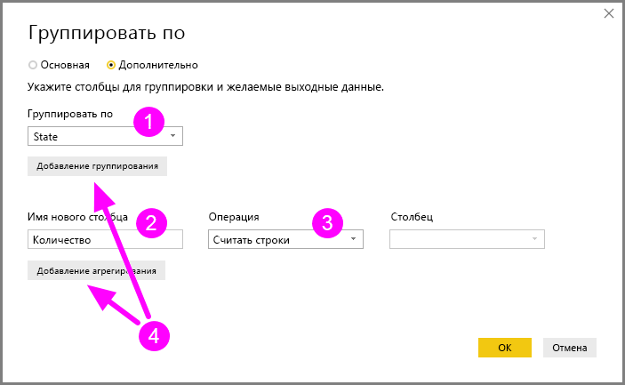

Когда мы нажимаем кнопку **ОК**, запрос выполняет операцию **Группировать по** и возвращает результаты. Итак, взглянем: сейчас в штатах Огайо, Техас, Иллинойс и Калифорния более тысячи образовательных учреждений в каждом!

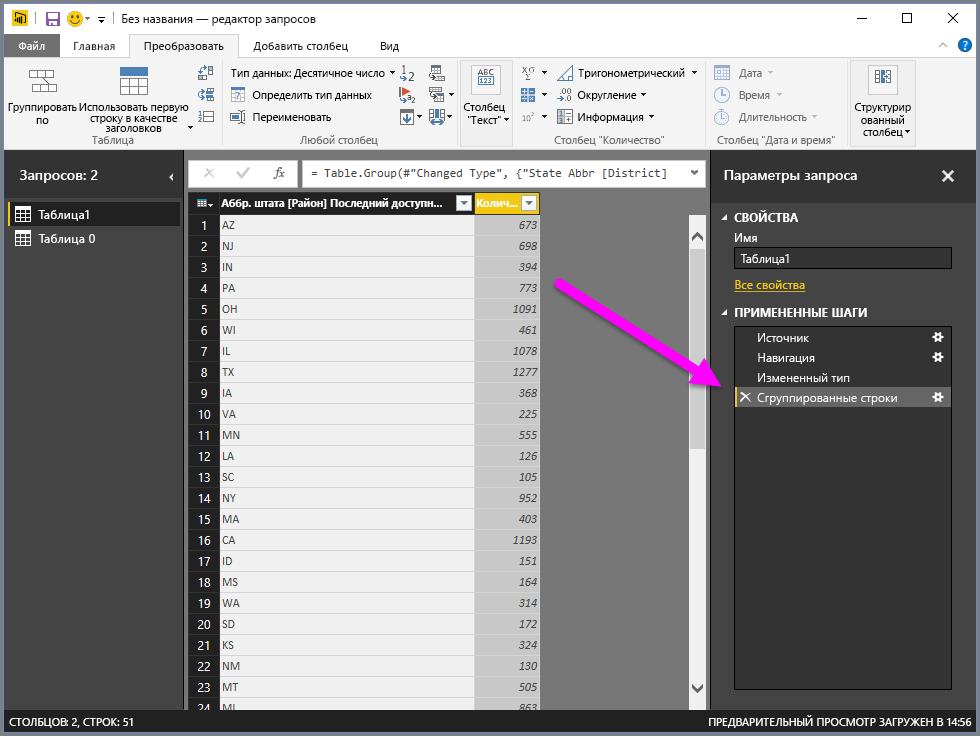

C помощью редактора запросов всегда можно удалить последнюю операцию формирования, щелкнув **X** рядом с только что завершенным действием. Поэтому действуйте! Экспериментируйте, повторяйте этот шаг до тех пор, пока редактор запросов не сформирует данные так, как нужно вам.

## Сводные столбцы.
С помощью Power BI Desktop можно сводить столбцы и создавать таблицу, которая содержит агрегированные значения для каждого уникального значения в столбце. Например, если нужно знать, сколько разных продуктов в каждой категории продуктов, можно быстро создать таблицу, которая позволяет решить именно эту задачу.

Рассмотрим следующий пример. Таблица **Продукты** сформирована так, что в ней отображаются только уникальные продукты (по имени) и указано, к какой категории продуктов они относятся. Чтобы создать новую таблицу, которая показывает количество продуктов в каждой категории (на основе столбца *CategoryName* ), выберите столбец, а затем щелкните **Сводный столбец** на вкладке **Преобразование** на ленте.

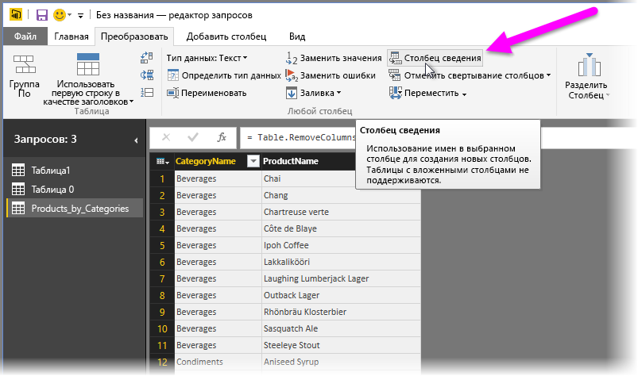

Отобразится окно **Столбец сведения**, в котором можно узнать, какие значения столбца будут использованы для создания новых столбцов (1). Если развернуть раздел **Дополнительные параметры** (2), можно выбрать функцию, которая будет применяться к агрегированным значениям (3).

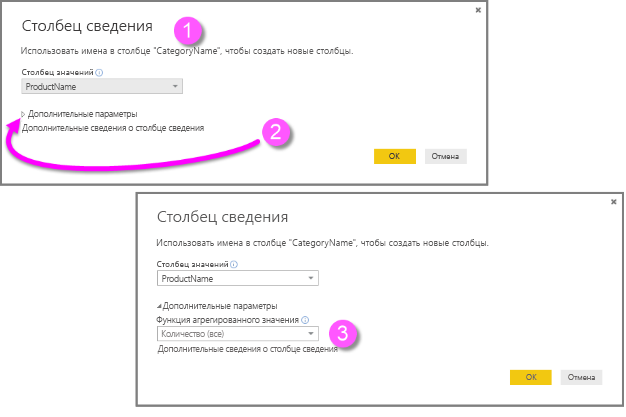

При нажатии кнопки **ОК**запрос отображает таблицу в соответствии с инструкциями преобразования, предоставленными в окне **Сводный столбец** .

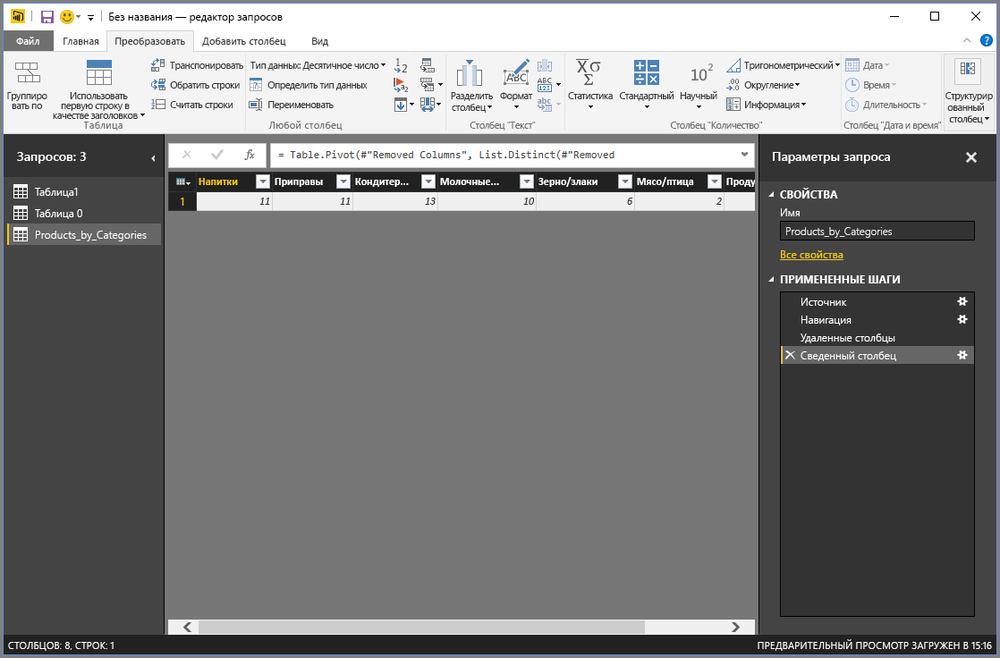

## Создание настраиваемых столбцов.
В редакторе запросов можно создавать настраиваемые формулы, которые работают в нескольких столбцах таблицы, а затем поместить результаты этих формул в новый (настраиваемый) столбец. Редактор запросов упрощает создание настраиваемых столбцов.

В редакторе запросов выберите **Настраиваемый столбец** на вкладке ленты **Добавление столбца**.

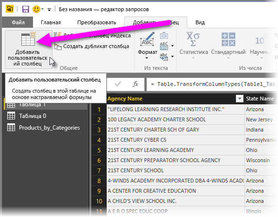

Появляется следующее окно. В следующем примере создается настраиваемый столбец с именем *Процент ИАЯ* , который вычисляет процент всех студентов, изучающих английский язык.

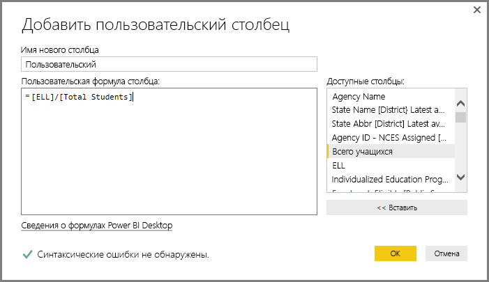

Как и любое другое действие, выполненное в редакторе запросов, если новый настраиваемый столбец не предоставляет нужных данных, можно просто удалить выполненное действие в разделе **Примененные действия** области **Параметры запроса** щелкнув **X** рядом с действием **Добавлен настраиваемый столбец** .

## Формулы запросов.
Можно изменять создаваемые редактором запросов действия и создавать пользовательские формулы, чтобы точно контролировать подключение к данным и формирование данных. Всякий раз когда редактор запросов выполняет то или иное действие с данными, формула, связанная с этим действием, отображается в элементе **Строка формул**. Для просмотра элемента **Строка формул**установите флажок рядом с элементом **Строка формул** на вкладке ленты **Вид** .

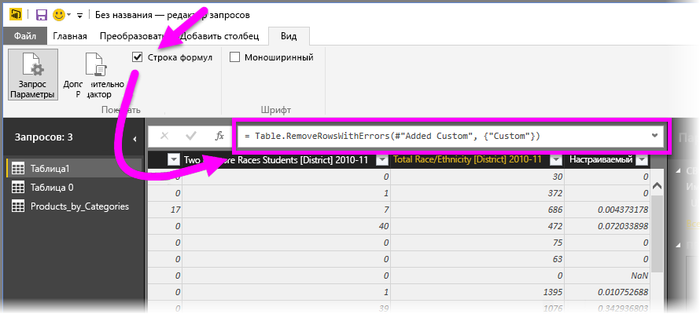

Редактор запросов сохраняет все примененные действия по каждому запросу как текст, который можно просмотреть или изменить. С помощью средства **Расширенный редактор**, которое отображается при выборе элемента **Расширенный редактор** на вкладке ленты **Вид** , можно посматривать или изменять текст любого запроса.

Здесь представлен **Расширенный редактор** с действиями запроса, связанными с отображаемым запросом **USA\_StudentEnrollment**. Эти действия создаются на языке формул Power Query, который часто называют **M**. Дополнительные сведения см. в разделе [Сведения о формулах Power Query](https://support.office.com/article/Learn-about-Power-Query-formulas-6bc50988-022b-4799-a709-f8aafdee2b2f?ui=en-US&rs=en-US&ad=US). См. дополнительные сведения о [спецификации языка формул Microsoft Power Query для Excel](http://go.microsoft.com/fwlink/?linkid=320633).

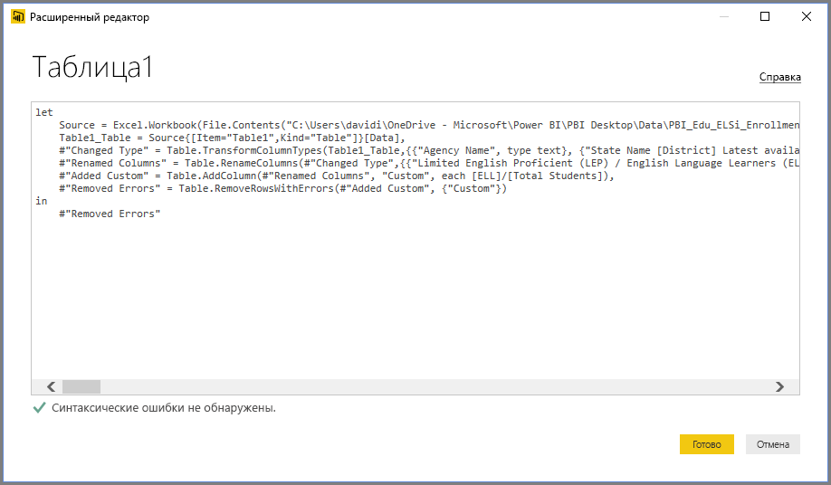

Power BI Desktop предоставляет широкий набор категорий формул. Дополнительные сведения и полный перечень всех формул редактора запросов см. в статье [Категории формул Power Query](https://support.office.com/en-in/article/Power-Query-formula-categories-125024ec-873c-47b9-bdfd-b437f8716819).

Ниже перечислены категории формул для редактора запросов.

* Числовые
  * Константы
  * Информационные
  * Преобразование и форматирование
  * Формат
  * Округление
  * Операции
  * Случайные
  * Тригонометрические
  * Байтовые
* Текстовые
  * Информационные
  * Текстовые сравнения
  * Извлечение
  * Изменение
  * Членство
  * Преобразования
* Логические
* Даты
* Времени
* DateTime
* DateTimeZone
* Длительность
* Записей
  * Информационные
  * Преобразования
  * Выбор
  * Сериализация
* Список
  * Информационные
  * Выбор
  * Преобразование
  * Членство
  * Операции Set
  * Упорядочение
  * Средние значения
  * Добавление
  * Числовые значения
  * Генераторы
* Табличные
  * Конструирование таблиц
  * Преобразования
  * Информационные
  * Операции со строками
  * Операции со столбцами
  * Членство
* Значения
* Арифметические операции
* Типы параметров
* Метаданные
* Доступ к данным
* URI
* Двоичные форматы
  * Чтение чисел
* Двоичные
* Строковые
* Выражение
* Функция
* Ошибка
* Функции сравнения
* Функции разделения
* Функции объединения
* Функции замены
* Тип

## Дальнейшие действия
Power BI Desktop предоставляет широкие возможности. Дополнительные сведения об этих возможностях см. в следующих ресурсах.

* [Что такое Power BI Desktop?](desktop-what-is-desktop.md)
* [Общие сведения о запросах в Power BI Desktop](desktop-query-overview.md)
* [Источники данных в Power BI Desktop](desktop-data-sources.md)
* [Подключение к данным в Power BI Desktop](desktop-connect-to-data.md)
* [Формирование и объединение данных в Power BI Desktop](desktop-shape-and-combine-data.md)

