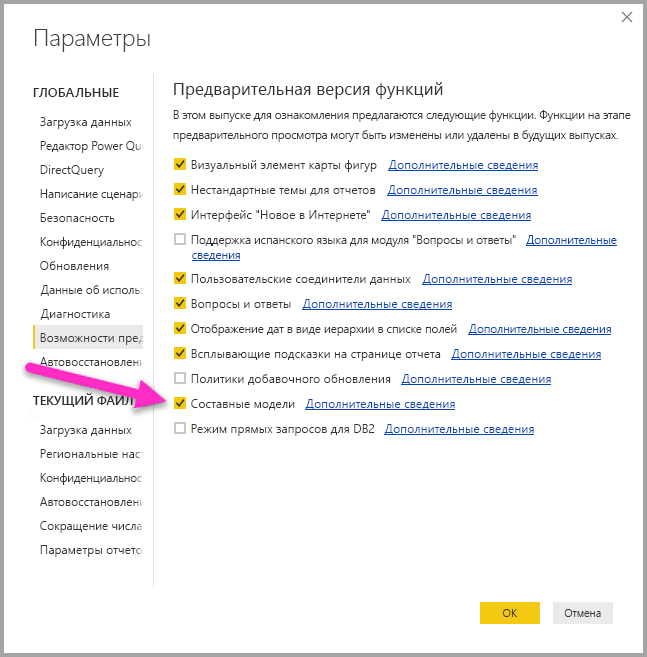

# Составные модели в Power BI Desktop (предварительная версия)

Ранее в **Power BI Desktop** при использовании DirectQuery в отчете не допускались никакие другие подключения к данным в этом отчете, будь то DirectQuery или импорт. Благодаря **составным моделям** это ограничение устранено. В отчет теперь можно беспрепятственно включать подключения к данным из нескольких DirectQuery или импортировать подключения к данным в любой выбранной комбинации.

Возможность создания **составных моделей** в **Power BI Desktop** сопряжена с использованием трех основных компонентов:

* **Составные модели** — позволяют включить в отчет несколько подключений к данным, в том числе подключения DirectQuery или импорт, в любой комбинации.
* **Связи "многие ко многим"** — с **составными моделями** можно устанавливать между таблицами **связи "многие ко многим"**. Эта устраняет требования уникальных значений в таблицах и необходимость в прежних обходных решениях, таких как введение новых таблиц только для установления связей. 
* **Режим хранения** — теперь можно указать, какие визуальные элементы требуют запроса к внутренним источникам данных. Визуальные элементы, которым запрос не требуется, импортируются, даже если они основаны на DirectQuery. Это позволяет повысить производительность и снизить нагрузку на серверную часть решения. Ранее даже простые визуальные элементы, например срезы, инициировали запросы к серверным источникам. 

Все три связанные функции этой коллекции для **составных моделей** описаны в отдельных статьях:

* **Составные модели** подробно описаны в этой статье.
* **Связи "многие ко многим"** описаны в отдельной статье [Связи "многие ко многим" в Power BI Desktop (предварительная версия)](desktop-many-to-many-relationships.md).
* **Режим хранения** описан в отдельной статье [Режим хранения в Power BI Desktop (предварительная версия)](desktop-storage-mode.md).

## Включение предварительной версии функции составных моделей

Функция **составных моделей** находится в режиме предварительной версии, поэтому ее необходимо сначала включить в **Power BI Desktop**. Чтобы включить **составные модели**, последовательно выберите **Файл > Параметры и настройки > Параметры > Предварительная версия функций** и установите флажок **Составные модели**. 

Чтобы включить эту функцию, нужно перезапустить **Power BI Desktop**.

## Использование составных моделей

С помощью **составных моделей** при использовании **Power BI Desktop** или **службы Power BI** можно подключаться к различным типам источников данных разными способами. Можно импортировать данные в Power BI, что является наиболее распространенным способом получения данных, или же подключиться непосредственно к данным в исходном репозитории источника, где используется DirectQuery. Подробные сведения о DirectQuery см. в статье об [использовании DirectQuery в Power BI](desktop-directquery-about.md).

При использовании DirectQuery с **составными моделями** можно создать модель Power BI (например, одиночный PBIX-файл Power BI Desktop), предназначенную для выполнения одной из следующих задач или их обеих:

* объединение данных из одного или нескольких источников DirectQuery;
* объединение данных из источников DirectQuery и импортированных данных.

Например, с помощью **составных моделей** можно создать модель, которая объединяет данные о продажах из хранилища данных предприятия с данными о целях продаж, содержащимися в базе данных отдела под управлением SQL Server, а также с некоторыми данными, импортированными из электронной таблицы. Модель, которая объединяет данные из нескольких источников DirectQuery или объединяет DirectQuery с импортированными данными, называется *составной моделью*.

> [!NOTE]
> Начиная с выпуска **Power BI Desktop** за октябрь 2018 г., вы *можете* публиковать составные модели в службе Power BI. При запланированном обновлении и обновлении плиток панели мониторинга составные модели в службе Power BI ведут себя так же, как и модели импорта. 

Можно создавать связи между таблицами привычным способом, даже если эти таблицы поступают из различных источников, со следующим ограничением: любые связи между различными источниками должны быть определены с кратностью **многие ко многим** независимо от их фактической кратности. Поведение таких связей такое же, как у обычных связей **многие ко многим**. Это описано в статье о [связях "многие ко многим" в Power BI Desktop (предварительная версия)](desktop-many-to-many-relationships.md). Обратите внимание, что в контексте составных моделей все импортированные таблицы по сути представляют собой единый источник независимо от фактического базового источника данных, из которого они были импортированы.   

## Пример использования составных моделей

В качестве примера **составной модели** рассмотрим отчет, который был подключен к корпоративному хранилищу данных (в SQL Server) с помощью DirectQuery. В хранилище содержатся данные о продажах по странам (*Sales by Country*), кварталах (*Quarter*) и велосипедной продукции (*Bike (Product)*), как показано на следующем рисунке.

На этом этапе можно создать простые визуальные элементы с использованием полей из указанного источника. Например, в следующем визуальном элементе отображаются сведения об общем объеме продаж по наименованиям продукции (*ProductName*) для выбранного квартала. 

А теперь предположим, что у вас есть определенные сведения о менеджере по продуктам, назначенном для каждого продукта, а также о маркетинговом приоритете, и эти данные хранятся в таблице Excel. Возможно, вам понадобится просматривать *объем продаж* по *менеджерам по продуктам*. Добавить эти локальные данные в корпоративное хранилище либо невозможно, либо в лучшем случае это займет месяцы. В принципе, такие данные о продажах можно импортировать из хранилища данных (вместо использования DirectQuery) и объединить с данными, импортированными из электронной таблицы. Но такой подход нецелесообразен, так как приводит к активному использованию DirectQuery — например, для применения комбинации правил безопасности к базовому источнику, доступа к новейшим данным и полного масштабирования этих данных. 

Здесь и помогают **составные модели**. Составные модели позволяют подключиться к источнику данных с помощью DirectQuery, а затем использовать функцию GetData для дополнительных источников. В этом случае мы устанавливаем подключение DirectQuery к корпоративному хранилищу данных, применяем GetData, выбираем Excel и переходим к электронной таблице с локальными данными. Затем можно импортировать лист с наименованиями продукции (*ProductNames*), назначенными менеджерами по продажам (*SalesManager*) и приоритетами (*Priority*).  

Теперь в списке **Поля** мы увидим исходную таблицу *Bike* (с сервера SQL Server) и новую таблицу *Product Managers* с данными, импортированными из Excel. 

В **представлении связей** в **Power BI Desktop** теперь также отображается дополнительная таблица *Product Managers*. 

Теперь необходимо связать эти таблицы с другими таблицами в модели.Для этого мы, как обычно, создаем связи между таблицей *Bike* (в SQL Server) и таблицей *Product Managers* (которая импортируется), например между *Bike[ProductName]* и *ProductManagers[ProductName]*. Как уже говорилось ранее в этой статье, все связи между разными источниками должны иметь кратность **многие ко многим**, поэтому такая кратность выбрана по умолчанию. 

После создания этой связи она отображается в **представлении связей** в **Power BI Desktop**, как и ожидалось.

Установив связи между таблицами, мы можем создать визуальные элементы с использованием любых полей из списка **Поля**, беспрепятственно смешивая данные из нескольких источников. Например, в показанном ниже визуальном элементе отображается общий *объем продаж* для каждого *менеджера по продуктам*. 

В этом примере демонстрируется распространенный случай, когда таблица *измерения* (например, *Product* или *Customer*) расширяется дополнительными данными, импортированными из другого расположения. Также можно использовать в таблицах DirectQuery с подключением к разным источникам. Таким образом, чтобы расширить наш пример, представим, что данные о целях продаж (*SalesTargets*) по странам (*Country*) и периодам (*Period*) хранятся в отдельной базе данных отдела. Можно подключиться к этим данным обычным способом с помощью функции **GetData**, как показано на приведенном ниже рисунке. 

Затем, как и ранее в этом примере, мы можем создать связи между новой таблицей и другими таблицами в модели, а также создать визуальные элементы, объединяющие данные таблиц. Давайте вернемся к **представлению связей**, где мы установили новые связи в нашем расширенном примере сценария.

Как показано на представленном ниже рисунке, основанном на только что созданных новых данных и связях, в визуальном элементе в нижнем левом углу отображается общий объем продаж (*Sales Amount*) относительно целей (*Target*), с расчетом отклонения, отображающим разность, где *Sales Amount* и *Target* поступают из двух разных баз данных SQL Server. 

## Установка режима хранилища

У каждой таблицы в **составной модели** есть **режим хранения**, указывающий, на чем основана таблица: на DirectQuery или импорте. **Режим хранения** можно просмотреть и изменить в области **Свойства**. Для этого выберите **Свойства** в контекстном меню, щелкнув правой кнопкой мыши в списке **Поля**. На приведенном ниже рисунке показан **режим хранения** (сокращен как **Storage...**  (Режим...) на рисунке из-за ширины области).

Также **режим хранения** можно увидеть в подсказке для каждой таблицы.

Для любого файла **Power BI Desktop** (с расширением .pbix), который содержит таблицы из DirectQuery и импортированные таблицы, в строке состояния **режима хранения** отображается значение **Смешанный**. Можно щелкнуть этот термин в строке состояния и легко переключить все таблицы на импорт.

Подробные сведения о **режиме хранения** описаны в статье [storage mode in Power BI Desktop (Preview)](desktop-storage-mode.md) (Режим хранения в Power BI Desktop (предварительная версия)).  

## Вычисляемые таблицы

Вычисляемые таблицы можно добавить в модель, которая использует DirectQuery. При этом DAX с определением вычисляемой таблицы может ссылаться на импортированные таблицы, таблицы DirectQuery или сочетание тех и других. 

Вычисляемые таблицы всегда импортируются, а данные в них обновляются при обновлении таблицы. Таким образом, если вычисляемая таблица ссылается на таблицу DirectQuery, то в визуальных элементах, ссылающихся на таблицу DirectQuery, всегда отображаются последние значения из базового источника. Но в визуальных элементах, ссылающихся на вычисляемую таблицу, отображаются значения на момент последнего обновления вычисляемой таблицы.

## Последствия для безопасности 

Использование составных моделей связано с некоторыми последствиями для безопасности. Запрос, отправленный к одному источнику данных, может включать значения данных, которые были извлечены из другого источника. Для примера, описанного ранее в этой статье, после создания визуального элемента с отображением объема продаж (*Sales Amount*) по менеджерам по продуктам (*Product Manager*) отправляется SQL-запрос к реляционной базе данных о продажах (**Sales**). Этот запрос может содержать имена *менеджеров по продуктам* и названия связанных с ними *продуктов*. 

По этой причине сведения, хранящиеся в электронной таблице, теперь включаются в запрос, отправляемый в реляционную базу данных. Если эти сведения конфиденциальны, необходимо рассмотреть последствия такого сценария для безопасности. В особенности нужно учитывать такие последствия:

* Любой администратор базы данных, который может просматривать трассировки или журналы аудита, сможет увидеть эту информацию, даже если не имеет разрешений на доступ к данным в исходном источнике (в данном случае разрешений на доступ к файлу Excel).

* Следует рассмотреть настройки шифрования каждого источника, чтобы избежать ситуации, когда данные, полученные из одного источника по зашифрованному соединению, затем непреднамеренно включаются в запрос, отправляемый к другому источнику по соединению без шифрования. 

Чтобы вы могли подтвердить, что все последствия для безопасности приняты во внимание, в **Power BI Desktop** отображается предупреждение, когда выполняется определенное действие для создания составной модели.  

По тем же причинам нужно соблюдать осторожность при открытии файла **Power BI Desktop**, отправленного из ненадежного источника. Если в этом файле содержатся составные модели, это значит, что сведения, полученные из одного источника (с использованием учетных данных пользователя, открывающего файл), будут отправляться в другой источник данных как часть запроса (где их может просмотреть злоумышленник, создавший файл Power BI Desktop). Таким образом, при первом открытии файла Power BI Desktop, содержащего несколько источников, отображается предупреждение. Это предупреждение аналогично отображающемуся при открытии файла с собственными запросами SQL.  

## Влияние на производительность  

При использовании DirectQuery обязательно следует учитывать воздействие на производительность. Прежде всего убедитесь, что источник серверной части обладает достаточными ресурсами для обеспечения эффективной работы пользователей. Эффективная работа означает, что визуальные элементы должны обновляться в течение 5 секунд или быстрее. Также следует придерживаться советов по производительности из статьи об [использовании DirectQuery в Power BI](desktop-directquery-about.md). При использовании составных моделей руководствуйтесь дополнительными рекомендациями по производительности, так как один визуальный элемент может вызвать отправку запросов к нескольким источникам и результаты одного запроса часто передаются во второй источник. Это может привести к следующим формам выполнения:

* **SQL-запрос, содержащий большое количество литеральных значений**, — например, визуальный элемент с запросом на *общий объем продаж* (из базы данных SQL) для группы выбранных *менеджеров по продуктам* (из связанной таблицы, которая была импортирована из электронной таблицы) должен сначала определить, какими *продуктами* управляли соответствующие менеджеры, прежде чем отправлять SQL-запрос со всеми кодами этих продуктов в предложении *WHERE*.

* **SQL-запрос на более низком уровне детализации, с локально агрегируемыми данными** — при использовании того же примера, что и в предыдущем пункте, количество *продуктов*, соответствующих фильтру  *менеджеров по продуктам*, становится слишком большим. Поэтому на определенном этапе включать их все в предложение *WHERE* будет нецелесообразно или невозможно. Вместо этого необходимо запросить реляционный источник на более низком уровне *продукта*, а затем локально агрегировать результаты. Если кратность *продуктов* превышает ограничение в 1 млн, запрос завершится ошибкой.

* **Несколько SQL-запросов, по одному на значение GROUP BY** — если при агрегировании используется отличительное количество (**DistinctCount**), сгруппированное по некоторому столбцу из другого источника и если внешний источник не поддерживает эффективную передачу множества литеральных значений, определяющих группирование, необходимо отправить по одному SQL-запросу на каждое значение GROUP BY. Например, визуальный элемент, запрашивающий отличительное количество *CustomerAccountNumber* (из таблицы SQL Server) по менеджерам по продуктам (*Product Manager*) (из связанной таблицы, которая была импортирована из электронной таблицы), должен будет передать сведения из таблицы *Product Managers* в запросе, отправляемом к SQL Server. Для других источников, например Redshift, это невыполнимо. Вместо этого будет отправлено по одному SQL-запросу на каждого менеджера по продажам (*Sales Manager*) (до некоторого практического предела, при превышении которого запрос завершится ошибкой). 

Каждый из этих случаев особым образом влияет на производительность. Конкретные последствия зависят от источника данных. Универсальное правило указывает, что пока кратность столбцов, используемых в связи, объединяющей два источника, остается небольшой (несколько тысяч), это не должно оказывать существенного влияния на производительность. По мере роста кратности следует уделить больше внимания влиянию на итоговую производительность. 

Кроме того, использование связей **многие ко многим** означает, что отдельные запросы должны отправляться к базовому источнику для каждого итогового или промежуточного уровня вместо локального агрегирования детальных значений. Таким образом, простой табличный визуальный элемент с итоговой суммой отправит два SQL-запроса, а не один. 

## Рекомендации и ограничения

В этом выпуске **составных моделей** есть несколько ограничений.

Следующие (многомерные источники) Live Connect нельзя использовать с **составными моделями**:

* SAP HANA
* SAP Business Warehouse
* Службы SQL Server Analysis Services
* Наборы данных Power BI
* Azure Analysis Services

При подключении к этим многомерным источникам с помощью DirectQuery нельзя также подключиться к другому источнику DirectQuery или сочетать их с импортированными данными.

Существующие ограничения для использования DirectQuery по-прежнему применяются при применении **составных моделей**. Многие из этих ограничений теперь относятся к таблице в зависимости от **режима хранения** этой таблицы. Например, вычисляемый столбец в импортированной таблице может ссылаться на другие таблицы, но вычисляемый столбец в таблице DirectQuery по-прежнему ограничен ссылками только на столбцы той же таблицы. Другие ограничения применяются к модели в целом, если все таблицы в пределах модели являются таблицами DirectQuery. Например, функции **Краткая аналитика** и **Вопросы и ответы** недоступны в модели, если какая-либо из таблиц в ней используется в **режиме хранения** DirectQuery. 

## Дальнейшие действия

В следующих статьях содержатся дополнительные сведения о составных моделях, а также подробно описан режим DirectQuery:

* [Связи "многие ко многим" в Power BI Desktop (предварительная версия)](desktop-many-to-many-relationships.md)
* [Режим хранения в Power BI Desktop (предварительная версия)](desktop-storage-mode.md)

Статьи о DirectQuery:

* [Использование DirectQuery в Power BI](desktop-directquery-about.md)
* [Источники данных, поддерживаемые DirectQuery в Power BI](desktop-directquery-data-sources.md)

