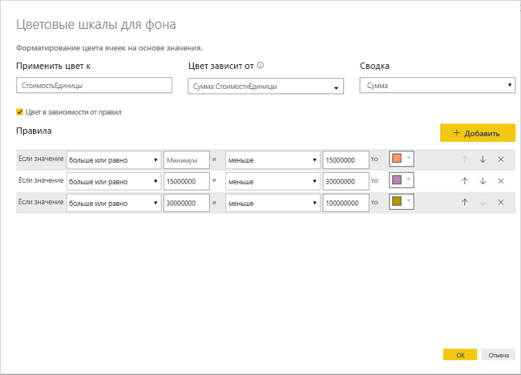

# Условное форматирование в таблицах 
С помощью условного форматирования в таблицах можно задать настраиваемые цвета ячеек на основе значений ячеек либо на основе других значений или полей, в том числе использовать градиент цветов. Значения ячеек также могут отображаться с гистограммами. 

Чтобы получить доступ к условному форматированию, в Power BI Desktop на панели **Визуализации** в разделе **Поля** в области **Значения** щелкните стрелку вниз рядом со значением, которое нужно отформатировать (или щелкните поле правой кнопкой мыши). Условное форматирование можно изменять только для полей из области **Значения** в разделе **Поля**.

В следующих разделах описывается каждый из этих параметров условного форматирования. К одному столбцу таблицы могут применяться один или несколько параметров.

> [!NOTE]
> При применении к таблице условное форматирование переопределяет любые пользовательские стили таблиц, примененные к ячейкам с условным форматированием.

Чтобы удалить условное форматирование из визуализации, повторно щелкните правой кнопкой мыши поле, выберите пункт **Удалить условное форматирование**, а затем выберите тип удаляемого форматирования.

## Цветовые шкалы для фона

Если выбрать **Условное форматирование**, а затем — **Цветовые шкалы для фона**, появляется представленное ниже диалоговое окно.

Чтобы выбрать в модели данных поле, от которого будут зависеть цвета, задайте его в качестве значения поля **Цвет зависит от**. Кроме того, можно указать тип агрегирования для выбранного поля с помощью значения **Обобщение**. Окрашиваемое поле указывается в поле **Применить цвет к**. Условное форматирование можно применять к текстовым полям и полям дат, если в качестве основы выбрано числовое значение.

Чтобы использовать отдельные значения цвета для заданных диапазонов значений, установите флажок **Цвет в зависимости от правил**. Чтобы использовать цветовой спектр, оставьте флажок **Цвет в зависимости от правил** снятым. 

### Цвет в зависимости от правил

Если установлен флажок **Цвет в зависимости от правил**, можно ввести один или несколько диапазонов значений, для каждого из которых задан цвет.  Каждый диапазон значений начинается с условия *Если значение*. Кроме того, для него задаются условие *и* и цвет.

Ячейки таблицы, содержащие значения из определенного диапазона, окрашиваются заданным цветом. На приведенном ниже рисунке определены три правила.

Пример таблицы теперь выглядит так:

### Минимальное и максимальное значения

Вы можете настроить значения *Минимум* и *Максимум* и соответствующие цвета. Установив флажок **Расхождение**, дополнительно можно настроить *центральное* значение.

Пример таблицы теперь выглядит так:

## Цветовые шкалы для шрифтов

Если выбрать **Условное форматирование**, а затем — **Цветовые шкалы для шрифтов**, появляется представленное ниже диалоговое окно. Оно похоже на диалоговое окно **Цветовые шкалы для фона**, но в нем меняется цвет шрифта, а не цвет фона ячейки.

Пример таблицы теперь выглядит так:

## Гистограммы

Если выбрать **Условное форматирование**, а затем — **Гистограммы**, появляется представленное ниже диалоговое окно. 

По умолчанию флажок **Показывать только столбец** снят, поэтому в ячейке таблицы отображаются как столбец, так и фактическое значение.

Если флажок **Показывать только столбец** установлен, в ячейке таблицы отображается только столбец.

## Форматирование цветом по значению поля

Вы можете использовать измерение или столбец, указывающий цвет с помощью текстового значения или шестнадцатеричного кода, чтобы задать этот цвет в качестве цвета фона или шрифта визуального элемента таблицы или матрицы. Можно также создать пользовательскую логику для заданного поля и применить к этой логике подходящие цвета шрифта и фона.

Например, в таблице ниже есть цвет, связанный с каждой моделью продукции. 

Чтобы отформатировать ячейку в зависимости от значения поля, перейдите в диалоговое окно **Условное форматирование**, щелкнув правой кнопкой мыши столбец *Цвет* для этого элемента и, в данном случае, выбрав в меню **Цвет фона**. 

В появившемся диалоговом окне выберите **Значение поля** в раскрывающемся списке **Форматировать по**, как показано на следующем рисунке.

Можно повторить эту процедуру для цвета шрифта: к визуальному элементу будет применена заливка столбца **Цвет**, как показано на следующем рисунке.

Кроме того, вы можете создать вычисление DAX, основанное на бизнес-логике, которое будет выводить шестнадцатеричные коды в зависимости от выбранных условий. Обычно это проще, чем создание нескольких правил в диалоговом окне условного форматирования. Возьмем, к примеру, поле *ColorKPI* на следующем рисунке.

Вы можете задать значение поля для **Цвет фона** следующим образом.

После этого вы сможете получить результаты как в приведенной ниже матрице.

Можно создать множество разновидностей, используя лишь воображение с небольшой помощью DAX.

Вы можете использовать любые значения, указанные в спецификации цветов CSS по адресу [https://www.w3.org/TR/css-color-3/](https://www.w3.org/TR/css-color-3/), чтобы раскрасить свои визуальные элементы:
* Шестнадцатеричные коды цифр 3, 6 или 8, например #3E4AFF. В начале кода должен стоять символ #. Значение "3E4AFF" не является допустимым. 
* Значения RGB или RGBA, например RGBA(234, 234, 234, 0.5).
* Значения HSL или HSLA, например HSLA(123, 75%, 75%, 0.5).
* Имена цветов, например Green, SkyBlue, PeachPuff. 

## Рекомендации и ограничения
При работе с условным форматированием таблиц следует помнить о ряде моментов:

* Условное форматирование применяется только к значениям визуального элемента **Матрица** и не применяется к промежуточным или общим итогам. 
* Условное форматирование не применяется к строке **итоговых значений**.
* Любая таблица без группирования отображается в виде одной строки, которая не поддерживает условное форматирование.
* Если вы используете формат градиента с автоматическим вычислением максимального или минимального значения либо форматирование на основе правил с использованием процента, условное форматирование нельзя применить, если данные содержат значения NaN. NaN означает "не является числом", чаще всего вызывается ошибкой деления на ноль. Чтобы избежать таких ошибок, можно использовать функцию [DIVIDE () DAX](https://docs.microsoft.com/dax/divide-function-dax).

## Дальнейшие действия
Дополнительные сведения см. в следующей статье:  

* [Советы и рекомендации по форматированию цветом в Power BI](visuals/service-tips-and-tricks-for-color-formatting.md)  

