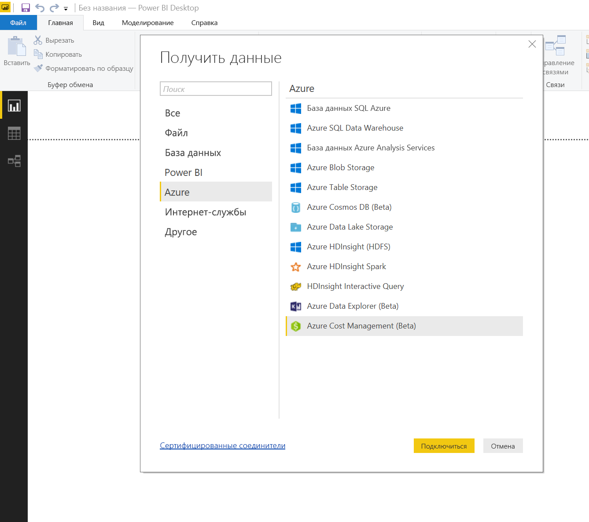
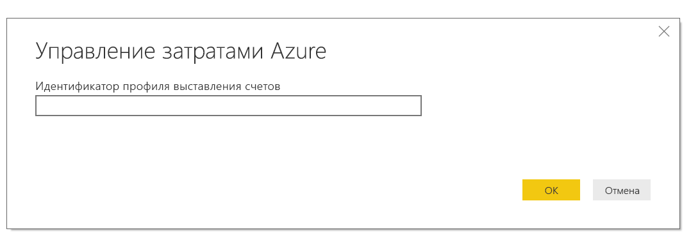
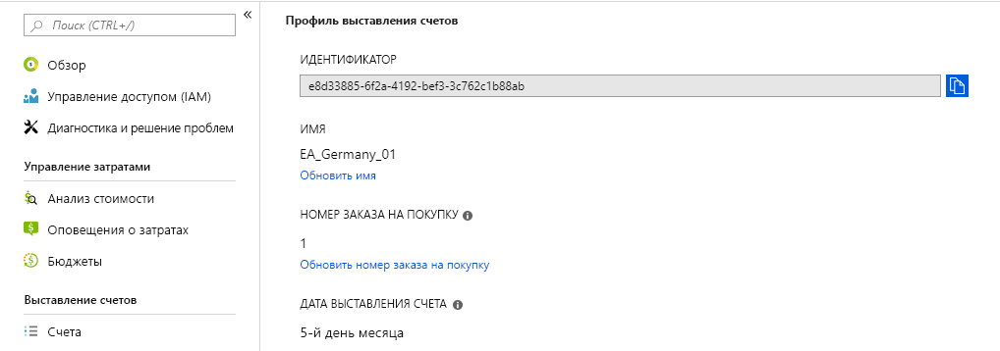
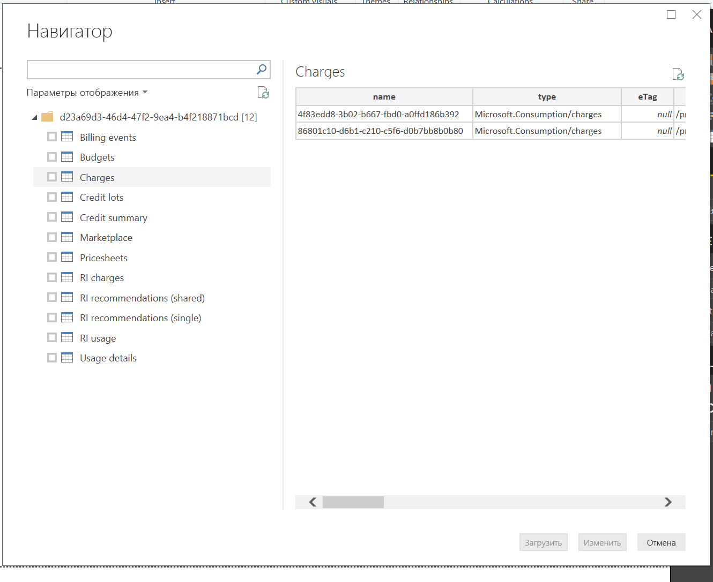
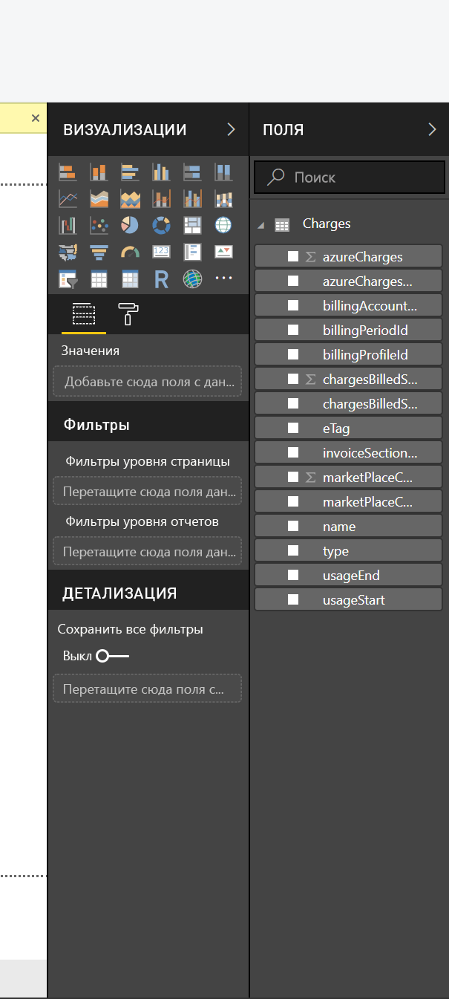

# <a name="analyze-azure-cost-and-usage-data-in-power-bi-desktop"></a>Анализ данных о затратах и использовании Azure в Power BI Desktop

Приложение Power BI Desktop может подключаться к Azure и получать подробные данные об использовании службы Azure в вашей организации. С его помощью можно создавать настраиваемые отчеты и меры, чтобы лучше понимать и анализировать затраты Azure.

Сейчас Power BI поддерживает подключение к учетным записям выставления счетов для Соглашения Enterprise и договора клиента.

* **Соглашение Enterprise** пользователи должны подключаться с **соединитель Azure Consumption Insights**.

* **Соглашение клиента** пользователи должны подключаться с **соединитель Azure Cost Management**.

## <a name="connect-with-azure-consumption-insights"></a>Подключение с помощью Azure Consumption Insights

Azure Consumption Insights позволяет подключиться к учетным записям выставления счетов для Соглашения Azure Enterprise.

В этом разделе вы узнаете, как подключиться и получить необходимые данные, выполнить миграцию из соединителя Azure Enterprise и найти сопоставление *столбцов со сведениями об использовании* в API **ACI** (Azure Consumption Insights).

Чтобы подключиться к Azure с помощью соединителя **Azure Consumption Insights**, нужен доступ к функциям Enterprise на портале Azure.

Чтобы подключиться с помощью соединителя **Azure Consumption Insights**, в **Power BI Desktop** на ленте **Главная** выберите элемент **Получение данных**. Выберите слева категорию **Веб-службы**. В списке справа вы увидите **Microsoft Azure Consumption Insights (бета-версия)** . Нажмите кнопку **Подключиться**.


В открывшемся диалоговом окне укажите свой *номер регистрации*.


* Номер регистрации можно найти на портале [Azure Enterprise Portal](https://ea.azure.com) в расположении, которое показано на следующем рисунке:
  
  
  
  Эта версия соединителя поддерживает только корпоративные регистрации с https://ea.azure.com. Регистрации из Китая сейчас не поддерживаются.

Теперь введите свой *ключ доступа* для подключения.


* Ключ доступа для регистрации можно найти на портале [Azure Enterprise Portal](https://ea.azure.com).
  
  

Когда вы введете *ключ доступа* и нажмете кнопку **Подключиться**, откроется окно **навигатора** с девятью таблицами: 
* **Budgets**: сведения о бюджете для просмотра фактических расходов или данных об использовании относительно существующих целевых бюджетов. 
* **MarketPlace**: сведения о плате за использование Azure Marketplace.
* **PriceSheets**: применимые тарифы для каждой регистрации.
* **RICharges**: сведения о плате за зарезервированные экземпляры за последние 24 месяца.
* **RIRecommendations_Single**: рекомендации по покупкам зарезервированных экземпляров на основе тенденций использования для одной подписки за последние 7, 30 или 60 дней.
* **RIRecommendations_Shared**: рекомендации по покупкам зарезервированных экземпляров на основе тенденций использования для всех подписок за последние 7, 30 или 60 дней.
* **RIUsage**: сведения об использовании существующих зарезервированных экземпляров за последний месяц.
* **Summaries**: ежемесячная сводка по балансам, новым покупкам, расходам на службу Azure Marketplace, корректировкам и плате за превышение использования.
* **UsageDetails**: статистика израсходованных объемов и предполагаемых расходов для каждой регистрации.

Чтобы просмотреть сведения, установите флажок возле соответствующей таблицы. Чтобы выбрать одну или несколько таблиц, установите флажок рядом с именем таблицы, а затем нажмите кнопку **Загрузить**.


> [!NOTE]
> Таблицы *Сводка* и *Прайс-лист* доступны только для уровня регистрации ключа API. По умолчанию таблицы *Использование* и *Прайс-лист* содержат данные за текущий месяц. Данные в таблицах *Сводка* и *MarketPlace* не ограничены текущим месяцем.
> 
> 

После нажатия кнопки **Загрузить** данные загружаются в **Power BI Desktop**.


Когда выбранные данные будут загружены, соответствующие таблицы и поля отобразятся в области **Поля**.


## <a name="using-azure-consumption-insights"></a>Использование Azure Consumption Insights
Чтобы использовать соединитель **Azure Consumption Insights**, нужен доступ к функциям Enterprise на портале Azure.

После загрузки данных с помощью соединителя **Azure Consumption Insights** вы можете создать собственные пользовательские меры и столбцы с помощью **редактора запросов**. Вы также можете создать визуальные элементы, отчеты и панели мониторинга, к которым вы можете предоставлять доступ в **службе Power BI**.

Azure также включает коллекцию примеров пользовательских запросов, которые можно извлечь с помощью пустого запроса. Чтобы сделать это, в **Power BI Desktop** на вкладке **Главная** выберите стрелку раскрывающегося списка **Получение данных**, а затем выберите **Пустой запрос**. Это также можно сделать в **редакторе запросов**: щелкните правой кнопкой мыши область **Запросы** слева и в открывшемся меню выберите элементы **Новый запрос > Пустой запрос**.

В **строке формул** введите следующее:

    = MicrosoftAzureConsumptionInsights.Contents

Открывается коллекция примеров, как показано на следующем рисунке:


При работе с отчетами и создании запросов используйте следующие параметры:

* Чтобы определить число месяцев начиная с текущей даты, используйте параметр *numberOfMonth*.
  * Чтобы указать число месяцев с текущей даты, данные которых требуется импортировать, используйте значение от 1 до 36. Рекомендуем выбирать не более 12 месяцев данных, чтобы не превысить пороговые значения ограничений импорта и допустимого объема данных для запросов в Power BI.
* Чтобы определить число месяцев в окне времени журнала, используйте параметры *startBillingDataWindow* и *endBillingDataWindow*.
* *Не* используйте параметр *numberOfMonth* вместе с параметрами *startBillingDataWindow* и *endBillingDataWindow*.

## <a name="migrating-from-the-azure-enterprise-connector"></a>Миграция из соединителя Azure Enterprise
Некоторые пользователи создавали визуальные элементы с помощью *соединителя Azure Enterprise (бета-версия)* , который рано или поздно перестанет поддерживаться и будет заменен соединителем **Azure Consumption Insights**. Соединитель **Azure Consumption Insights** содержит следующие функции и усовершенствования:

* Дополнительные источники данных для таблиц *Сводка баланса* и *Покупки Marketplace*.
* Новые и расширенные параметры, такие как *startBillingDataWindow* и *endBillingDataWindow*.
* Улучшенные производительность и скорость реагирования.

Ниже приведены инструкции, которые помогут клиентам перейти к использованию нового соединителя **Azure Consumption Insights** и сохранить все данные в пользовательских панелях мониторинга и отчетах.

### <a name="step-1-connect-to-azure-using-the-new-connector"></a>Шаг 1. Подключение к Azure с помощью нового соединителя
Сначала нужно подключиться к Azure с помощью соединителя **Azure Consumption Insights**. Эта процедура подробно описана ранее в этой статье. В **Power BI Desktop** на ленте **Главная** последовательно выберите элементы **Получение данных > Пустой запрос**.

### <a name="step-2-use-the-advanced-editor-to-create-a-query"></a>Шаг 2. Создание запроса с помощью Расширенного редактора
В **редакторе запросов** на ленте **Главная** в разделе **Запрос** выберите **Расширенный редактор**. В открывшемся окне **Расширенный редактор** введите следующий запрос:

    let    
        enrollmentNumber = "100",
        optionalParameters = [ numberOfMonth = 6, dataType="DetailCharges" ],
        data = MicrosoftAzureConsumptionInsights.Contents(enrollmentNumber, optionalParameters)   
    in     
        data


Разумеется, вам нужно заменить значение *enrollmentNumber* собственным номером регистрации, который можно найти на портале [Azure Enterprise Portal](https://ea.azure.com). Параметр *numberOfMonth* — это число месяцев начиная с текущей даты, данные за которые вы хотите просмотреть. Чтобы просмотреть данные за текущий месяц, укажите ноль (0).

Когда вы нажмете кнопку **Готово** в окне **Расширенный редактор**, предварительный просмотр обновится и вы увидите данные за месяцы, которые вы указали в таблице. Выберите **Закрыть и применить**.

### <a name="step-3-move-measures-and-custom-columns-to-the-new-report"></a>Шаг 3. Перемещение мер и настраиваемых столбцов в новый отчет
Теперь необходимо переместить все созданные пользовательские столбцы и меры в новую таблицу со сведениями. Это делается следующим образом.

1. Откройте Блокнот (или другой текстовый редактор).
2. Выберите меру, которую нужно переместить, скопируйте текст из поля *Формула* и вставьте его в Блокнот.
   
   
3. Замените имя *Query1* исходным именем таблицы со сведениями.
4. Создайте новые меры и настраиваемые столбцы в таблице. Для этого щелкните правой кнопкой мыши таблицу и выберите элемент **Новая мера**, затем вырежьте и вставьте все сохраненные меры и столбцы.

### <a name="step-4-re-link-tables-that-had-relationships"></a>Шаг 4. Восстановление ссылок между связанными таблицами
На многих панелях мониторинга есть дополнительные таблицы, которые используются для поиска или фильтрации, например таблицы дат или таблицы, используемые для пользовательских проектов. Восстановление связей между таблицами решает большинство задач. Вот как это сделать.

- В **Power BI Desktop** на вкладке **Моделирование** выберите элемент **Управление связями**, чтобы открыть окно управления связями в модели. При необходимости восстановите связи между таблицами.
   
    

### <a name="step-5-verify-your-visuals-and-adjust-field-formatting-as-needed"></a>Шаг 5. Проверка визуальных элементов и изменение форматирования полей при необходимости
После выполнения описанных выше шагов большая часть исходных визуальных элементов, таблиц и детализаций должна работать правильно. Но, возможно, нужно внести другие небольшие изменения, чтобы полностью завершить настройку. Просмотрите все свои панели мониторинга и визуальные элементы, чтобы убедиться, что они выглядят, как вы хотите.

## <a name="using-the-azure-consumption-and-insights-aci-api-to-get-consumption-data"></a>Использование API Azure Consumption Insights (ACI) для получения данных потребления
В Azure также доступен [**API Azure Consumption Insights (ACI)** ](https://azure.microsoft.com/blog/announcing-general-availability-of-consumption-and-charge-apis-for-enterprise-azure-customers/). Вы можете создавать собственные пользовательские решения для сбора, создания отчетов и визуализации сведений об использовании служб Azure с помощью ACI.

### <a name="mapping-names-and-usage-details-between-the-portal-the-connector-and-the-api"></a>Сопоставление имен и сведений об использовании между порталом, соединителем и API
Столбцы и имена сведений на портале Azure похожи на столбцы и имена в API и соединителе, но они не всегда совпадают. Чтобы вы могли увидеть разницу, см. следующую таблицу. Она содержит сопоставления между API, соединителем и столбцы, отображаемые на портале Azure. Также в таблице указано, является ли столбец устаревшим. Дополнительные сведения и определения этих терминов см. в статье [API-интерфейсы отчетов для корпоративных клиентов: сведения об использовании](https://docs.microsoft.com/azure/billing/billing-enterprise-api-usage-detail).

| Соединитель ACI/Имя столбца пакета содержимого | Имя столбца API ACI | Имя столбца EA | Устаревший/представлен для обеспечения обратной совместимости |
| --- | --- | --- | --- |
| AccountName |accountName |Имя учетной записи |Нет |
| AccountId |accountId | |Да |
| AcccountOwnerId |accountOwnerEmail |AccountOwnerId |Нет |
| AdditionalInfo |additionalInfo |AdditionalInfo |Нет |
| AdditionalInfold | | |Да |
| Consumed Quantity |consumedQuantity |Consumed Quantity |Нет |
| Consumed Service |consumedService |Consumed Service |Нет |
| ConsumedServiceId |consumedServiceId | |Да |
| Затраты |cost |Расширенные затраты |Нет |
| Cost Center |costCenter |Cost Center |Нет |
| Дата |дата |Дата |Нет |
| День | |День |Нет |
| DepartmentName |departmentName |Название отдела |Нет |
| DepartmentID |departmentId | |Да |
| Instance ID | | |Да |
| InstanceId |instanceId |Instance ID |Нет |
| Расположение | | |Да |
| Meter Category |meterCategory |Meter Category |Нет |
| Meter ID | | |Да |
| Название индикатора |meterName |Название индикатора |Нет |
| Meter Region |meterRegion |Meter Region |Нет |
| Meter Sub-Category |meterSubCategory |Meter Sub-Category |Нет |
| MeterId |meterId |Meter ID |Нет |
| Месяц | |Месяц |Нет |
| Продукт |product |Продукт |Нет |
| ProductId |productId | |Да |
| Группа ресурсов |resourceGroup |Группа ресурсов |Нет |
| Resource Location |resourceLocation |Resource Location |Нет |
| ResourceGroupId | | |Да |
| ResourceLocationId |resourceLocationId | |Да |
| ResourceRate |resourceRate |ResourceRate |Нет |
| ServiceAdministratorId |serviceAdministratorId |ServiceAdministratorId |Нет |
| ServiceInfo1 |serviceInfo1 |ServiceInfo1 |Нет |
| ServiceInfo1Id | | |Да |
| ServiceInfo2 |serviceInfo2 |ServiceInfo2 |Нет |
| ServiceInfo2Id | | |Да |
| Store Service Identifier |storeServiceIdentifier |Store Service Identifier |Нет |
| StoreServiceIdentifierId | | |Да |
| Название подписки |subscriptionName |Название подписки |Нет |
| Теги |теги |Теги |Нет |
| TagsId | | |Да |
| Unit Of Measure |unitOfMeasure |Unit Of Measure |Нет |
| Год | |Год |Нет |
| SubscriptionId |subscriptionId |SubscriptionId |Да |
| SubscriptionGuid |subscriptionGuid |SubscriptionGuid |Нет |

## <a name="connect-with-azure-cost-management"></a>Подключение с помощью Управления затратами Azure

В этом разделе вы узнаете, как подключиться к учетной записи выставления счетов для договора клиента.

> [!NOTE]
> Соединитель управление затратами Azure в настоящее время поддерживает клиенты на **соглашении клиента**.  **Соглашение Enterprise** клиентам следует использовать соединитель Microsoft Azure Consumption Insights.
> 
> 

Чтобы подключиться с помощью соединителя **Управление затратами Azure**, в **Power BI Desktop** на ленте **Главная** выберите элемент **Получить данные**.  Слева выберите категорию **Azure**, чтобы появился пункт **Управление затратами Azure (бета-версия)** . Нажмите кнопку **Подключиться**.



В появившемся диалоговом окне введите свой *идентификатор профиля выставления счетов*.



Этот идентификатор можно получить на [портале Azure](https://portal.azure.com).  Перейдите в раздел **Управление затратами Azure и выставление счетов**, выберите учетную запись выставления счетов и элемент **Biling profiles** (Профили выставления счетов) на боковой панели.  Выберите профиль выставления счетов и элемент **Свойства** на боковой панели.  Скопируйте свой идентификатор профиля выставления счетов.



Вам будет предложено войти в систему с помощью адреса электронной почты и пароля Azure.  После проверки подлинности отображается окно **Навигатор**, где вам доступно 12 таблиц:

* **Billing events** (События выставления счетов): журнал событий для новых счетов-фактур, внесения денег на счет и многого другого.
* **Budgets**: сведения о бюджете для просмотра фактических расходов или данных об использовании относительно существующих целевых бюджетов. 
* **Charges** (Платежи): месячная сводка по использованию Azure, платежам Marketplace и платежам, счета по которым выставляются отдельно.
* **Credit lots** (Лоты денег на счете): сведения о покупке лотов денег на счете в Azure для указанного профиля выставления счетов.
* **Credit summary** (Сводка по деньгам на счете): сводка по деньгам на счете для указанного профиля выставления счетов.
* **Marketplace**: сведения о плате за использование Azure Marketplace.
* **Pricesheets** (Прейскуранты): применимые тарифы для указанного профиля выставления счетов.
* **RI charges** (Платежи RI): сведения о плате за зарезервированные экземпляры за последние 24 месяца.
* **RI recommendations (single)** (Отдельные рекомендации RI): рекомендации по покупкам зарезервированных экземпляров на основе тенденций использования для одной подписки за последние 7, 30 или 60 дней.
* **RI recommendations (shared)** (Общие рекомендации RI): рекомендации по покупкам зарезервированных экземпляров на основе тенденций использования для всех подписок за последние 7, 30 или 60 дней.
* **RI usage** (Использование RI): сведения об использовании существующих зарезервированных экземпляров за последний месяц.
* **Сведения об использовании**: статистика израсходованных объемов и предполагаемых расходов для указанного идентификатора профиля выставления счетов.

Чтобы просмотреть сведения, установите флажок рядом с соответствующей таблицей.  Чтобы выбрать одну или несколько таблиц, установите флажок рядом с именами таблиц и нажмите кнопку **Загрузить**.



После нажатия кнопки **Загрузить** данные загружаются в **Power BI Desktop**.


Когда выбранные данные будут загружены, соответствующие таблицы и поля отобразятся в области **Поля**.



## <a name="writing-custom-queries"></a>Создание пользовательских запросов

Если вы хотите настроить число месяцев, изменить версию API или применить более сложную логику к возвращаемым данным, можно создать пользовательский запрос M.

В **Power BI Desktop** на вкладке **Главная** выберите раскрывающийся список **Получить данные**, а затем выберите **Пустой запрос**.  Это также можно сделать в **редакторе запросов**: щелкните правой кнопкой мыши область **Запросы** слева и в открывшемся меню выберите элементы **Новый запрос > Blank Menu** (Пустое меню).

В **строке формул** введите следующую команду, заменив `billingProfileId` фактическим идентификатором, а "charges" любым допустимым именем таблицы (список выше).

```
let
    Source = AzureCostManagement.Tables(billingProfileId, [ numberOfMonths = 3 ]),
    charges = Source{[Key="charges"]}[Data]
in
    charges
```

Кроме изменения `numberOfMonths` на любое значение от 1 до 36, можно также указать следующее:

* `apiVersion`, чтобы настроить, какую версию API будет вызывать запрос.
* `lookbackWindow` для рекомендаций RI (отдельных или общих), чтобы изменить период, за который создаются рекомендации (допустимые значения: 7, 30 или 60 дней)


## <a name="next-steps"></a>Дальнейшие действия
В Power BI Desktop можно подключаться к данным самых разных видов. Дополнительные сведения об источниках данных см. в перечисленных ниже статьях.

* [Что такое Power BI Desktop?](desktop-what-is-desktop.md)
* [Источники данных в Power BI Desktop](desktop-data-sources.md)
* [Формирование и объединение данных в Power BI Desktop](desktop-shape-and-combine-data.md)
* [Подключение к данным Excel в Power BI Desktop](desktop-connect-excel.md)   
* [Ввод данных непосредственно в Power BI Desktop](desktop-enter-data-directly-into-desktop.md)   

