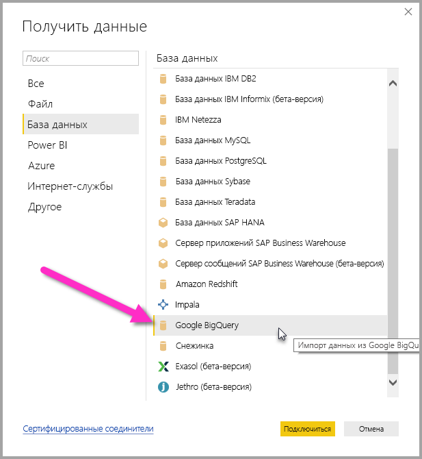

# <a name="connect-to-a-google-bigquery-database-in-power-bi-desktop"></a>Подключение к базе данных Google BigQuery в Power BI Desktop
В Power BI Desktop вы можете подключиться к базе данных **Google BigQuery** и использовать ее так же, как и любой другой источник данных в Power BI Desktop.

## <a name="connect-to-google-bigquery"></a>Подключение к Google BigQuery
Для подключения к базе данных Google **BigQuery** на вкладке **Главная** на ленте в Power BI Desktop выберите **Получение данных**. В области слева выберите категорию **База данных**. Отобразится пункт **Google BigQuery**.



В появившемся окне **Google BigQuery** войдите в свою учетную запись Google BigQuery и выберите команду **Подключиться**.


После входа вы увидите следующее окно, означающее, что вход выполнен успешно. 


После успешного подключения откроется окно **Навигатор**, содержащее данные, доступные на сервере. Из них вы можете выбрать один или несколько элементов для импорта и использования в **Power BI Desktop**.


## <a name="considerations-and-limitations"></a>Рекомендации и ограничения
Существуют определенные ограничения и рекомендации, которые следует учитывать в соединителе Google **BigQuery**.

* Соединитель Google BigQuery доступен в Power BI Desktop и в службе Power BI. В службе Power BI доступ к соединителю может осуществляться с помощью подключения типа "облако к облаку" из Power BI в Google BigQuery.

Power BI можно использовать совместно с **Проектом выставления счетов** Google BigQuery. По умолчанию Power BI использует первый проект из списка, возвращаемого пользователю. Для настройки работы "Проекта выставления счетов" при его использовании совместно с Power BI выполните следующие действия.

 * Указав следующий параметр в базовой M на шаге источника, который можно настраивать, используя **Редактор Power Query** в Power BI Desktop.

    ```Source = GoogleBigQuery.Database([BillingProject="Include-Billing-Project-Id-Here"])```

## <a name="next-steps"></a>Дальнейшие действия
В Power BI Desktop можно подключаться к данным самых разных видов. Дополнительные сведения об источниках данных см. в перечисленных ниже статьях.

* [Что такое Power BI Desktop?](desktop-what-is-desktop.md)
* [Источники данных в Power BI Desktop](desktop-data-sources.md)
* [Формирование и объединение данных в Power BI Desktop](desktop-shape-and-combine-data.md)
* [Подключение к данным Excel в Power BI Desktop](desktop-connect-excel.md)   
* [Ввод данных непосредственно в Power BI Desktop](desktop-enter-data-directly-into-desktop.md)   

