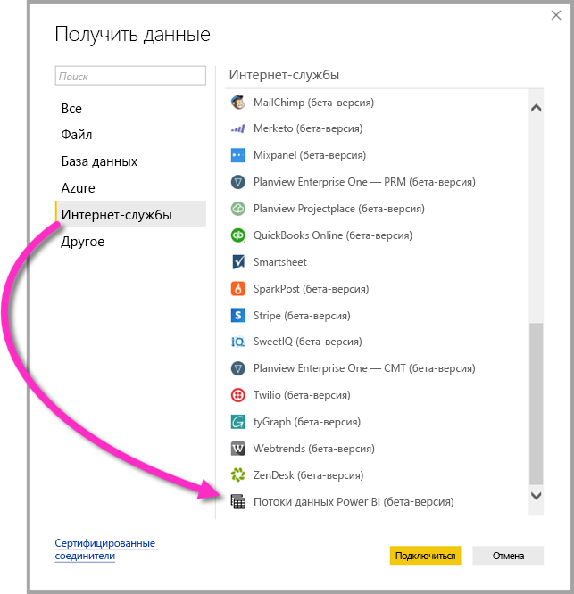

# Подключение к данным, созданным потоками данных Power BI в Power BI Desktop (бета-версия)
С помощью **Power BI Desktop** вы можете подключаться к данным, созданным **потоками данных Power BI** и использовать их так же, как и любой другой источник данных в Power BI Desktop.

Соединитель **потоков данных Power BI (бета-версия)** позволяет подключаться к сущностям, создаваемым потоками данных в службе Power BI. 

## Рекомендации и ограничения

Для запуска этой бета-версии **соединителя потоков данных Power BI** необходимо использовать последнюю версию **Power BI Desktop**. Вы всегда можете [скачать Power BI Desktop](desktop-get-the-desktop.md) и установить его на ваш компьютер, чтобы использовать самую последнюю версию приложения.  

> [!NOTE]
> Для предыдущей версии соединителя потоков данных Power BI нужно было скачать MEZ-файл и поместить его в папку. Текущая версия **Power BI Desktop** включает соединитель для потоков данных Power BI, поэтому тот файл больше не нужен и, более того, может конфликтовать с включенной версией соединителя. Если вы ранее вручную помещали MEZ-файл в папку, *обязательно* удалите этот скачанный MEZ-файл из папки **Документы > Power BI Desktop > Настраиваемые соединители**, чтобы избежать конфликтов. 

## Производительность версии Power BI Desktop
Приложение **Power BI Desktop** выполняется локально на компьютере, на котором оно установлено. Производительность приема потоков данных определяется несколькими факторами. К ним относятся размер данных, ресурсы ЦП и памяти компьютера, пропускная способность сети, расстояние до центра обработки данных и т. д.

Вы можете повысить производительность приема данных для потоков данных. Например, если размер принимаемых данных слишком большой и **Power BI Desktop** не может справиться с ними на локальном компьютере, примените в потоках данных связанные и вычисляемые сущности для статистической обработки данных (прямо в этих потоках данных) и получайте из них уже подготовленные и агрегированные данные. Благодаря такому подходу обработка больших объемов данных выполняется в облачных потоках данных, а не на локально запущенном экземпляре с **Power BI Desktop**. Power BI Desktop будет принимать меньше данных и сохранит хорошую скорость и отзывчивость интерфейса взаимодействия с потоками данных.

## Дальнейшие действия
С помощью потоков данных Power BI можно выполнять много интересных действий. Дополнительные сведения см. на следующих страницах.

* [Self-service data prep in Power BI (Preview)](service-dataflows-overview.md) (Самостоятельная подготовка данных в Power BI (предварительная версия))
* [Creating and using dataflows in Power BI (Preview)](service-dataflows-create-use.md) (Создание и использование потоков данных в Power BI (предварительная версия))
* [Использование вычисляемых сущностей в Power BI Premium (предварительная версия)](service-dataflows-computed-entities-premium.md)
* [Использование потоков данных с локальными источниками данных (предварительная версия)](service-dataflows-on-premises-gateways.md)
* [Ресурсы для разработчиков потоков данных Power BI (предварительная версия)](service-dataflows-developer-resources.md)

Также вам могут оказаться полезны статьи о **Power BI Desktop**.

* [Источники данных в Power BI Desktop](desktop-data-sources.md)
* [Формирование и объединение данных в Power BI Desktop](desktop-shape-and-combine-data.md)
* [Ввод данных непосредственно в Power BI Desktop](desktop-enter-data-directly-into-desktop.md)   

