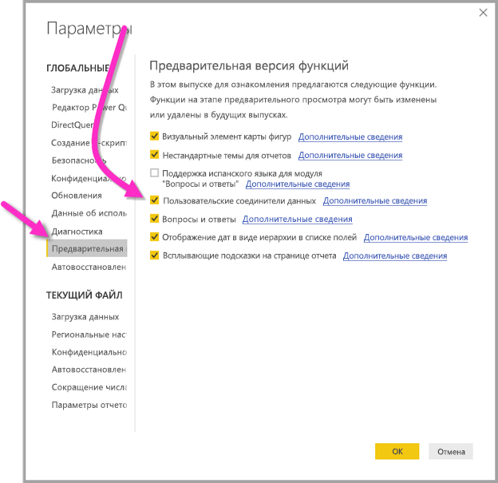

# Подключение к данным, созданным потоками данных Power BI в Power BI Desktop (предварительная версия)
С помощью **Power BI Desktop** вы можете подключаться к данным, созданным **потоками данных Power BI** и использовать их так же, как и любой другой источник данных в Power BI Desktop.

Соединитель **потоков данных Power BI (предварительная версия)** позволяет подключаться к сущностям, создаваемым потоками данных в службе Power BI. Поскольку функция потоков данных находится в предварительной версии, существует несколько шагов, которые необходимо выполнить для использования соединителя потоков данных в вашей системе. 

## Загрузка и включение соединителя потоков данных Power BI (предварительная версия)

Необходимо загрузить копию соединителя **потоков данных Power BI** и скопировать ее в определенное место на компьютере. В предстоящем обновлении Power BI Desktop соединитель будет автоматически включен в список соединителей данных, после чего эти действия больше не нужно будет выполнять вручную.

Вы можете скачать **соединитель потоков данных Power BI** здесь: [Соединитель потоков данных Power BI](https://visuals.azureedge.net/cds-analytics/PublicPreview/CDSA.mez)

Выполните следующие действия, чтобы сделать соединитель **потоков данных Power BI** (предварительная версия) доступным для вашего компьютера.

1. Скачайте копию MEZ-файла (файл соединителя данных). Пользователи закрытой предварительной версии будут получать сведения о загрузке MEZ-файла непосредственно от корпорации Майкрософт.

2. Поместите загруженный файл соединителя данных в следующую папку на компьютере: **Документы > Power BI Desktop > папка настраиваемых соединителей**

3. Последовательно выберите пункты **Файл > Параметры и настройки > Параметры** в Power BI Desktop, а затем на панели слева выберите **Функции предварительной версии**.

    

4. Выберите поле **Настраиваемые соединители данных**, если оно не выбрано. 

5. Перезапустите **Power BI Desktop** для отображения соединителя.

## Использование соединителя потоков данных Power BI (предварительная версия)
После первого запуска **Power BI Desktop** соединитель будет показываться как доступный источник данных. Чтобы подключиться к пулу данных, выберите **Получить данные > Веб-службы > Потоки данных Power BI (бета-версия)**, как показано на следующем рисунке:

## Рекомендации и ограничения

Для запуска этой предварительной версии **соединителя потоков данных Power BI** необходимо использовать самую последнюю версию **Power BI Desktop**. Вы всегда можете [скачать Power BI Desktop](desktop-get-the-desktop.md) и установить его на ваш компьютер, чтобы использовать самую последнюю версию приложения.  

Примечание. Когда соединитель потоков данных Power BI появится в предстоящих ежемесячных обновлениях **Power BI Desktop**, вам будет *необходимо* удалить загруженный MEZ-файл из папки **Документы > Power BI Desktop > Настраиваемые соединители** во избежание конфликтов. 

## Дальнейшие действия
Здесь представлены другие интересные функции, которые вы можете использовать с помощью подключений данных Power BI, а также статьи о **Power BI Desktop**, которые могут показаться вам полезными:

* [Источники данных в Power BI Desktop](desktop-data-sources.md)
* [Формирование и объединение данных в Power BI Desktop](desktop-shape-and-combine-data.md)
* [Ввод данных непосредственно в Power BI Desktop](desktop-enter-data-directly-into-desktop.md)   

