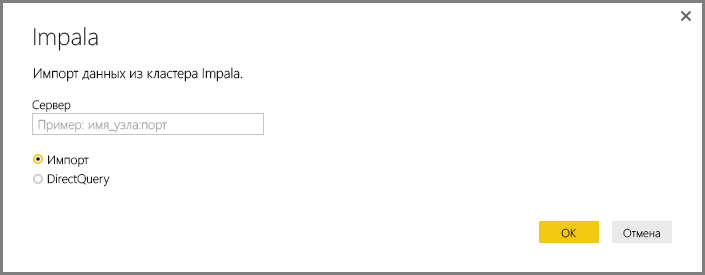
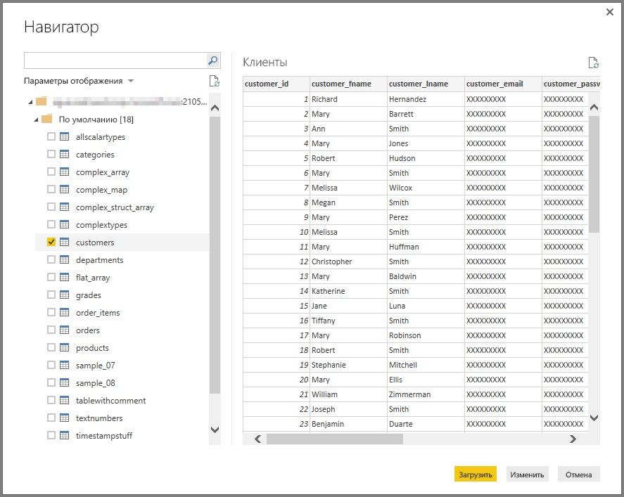

# Подключение к базе данных Impala в Power BI Desktop
В Power BI Desktop вы можете подключиться к базе данных **Impala** и использовать ее так же, как и любой другой источник данных в Power BI Desktop.

## Подключение к базе данных Impala
Для подключения к базе данных **Impala** на вкладке **Главная** на ленте в Power BI Desktop выберите **Получение данных**. В области слева выберите категорию **База данных**. Отобразится пункт **Impala**.

В появившемся окне **Impala** введите или вставьте в поле имя сервера Impala и нажмите кнопку **ОК**. Обратите внимание, что можно **импортировать** данные непосредственно в Power BI или использовать **DirectQuery**. Вы можете ознакомиться с дополнительными сведениями об [использовании DirectQuery](desktop-use-directquery.md).

При появлении запроса введите учетные данные или подключитесь анонимно. Соединитель Impala поддерживает анонимную проверку подлинности, базовую проверку подлинности (имя пользователя + пароль) и проверку подлинности Windows.

> [!NOTE]
> Если указаны имя пользователя и пароль для определенного сервера **Impala**, Power BI Desktop использует те же учетные данные при последующих попытках подключения. Эти учетные данные можно изменить, последовательно выбрав элементы **Файл > Параметры и настройки > Параметры источника данных**.
> 
> 

После успешного подключения откроется окно **Навигатор**, содержащее данные, доступные на сервере. Из них вы можете выбрать один или несколько элементов для импорта и использования в **Power BI Desktop**.

## Рекомендации и ограничения
Существуют определенные ограничения и рекомендации, которые следует учитывать в соединителе **Impala**.

* Соединитель Impala поддерживается в локальном шлюзе данных с помощью любого из трех механизмов проверки подлинности.

## Дальнейшие действия
В Power BI Desktop можно подключаться к данным самых разных видов. Дополнительные сведения об источниках данных см. в перечисленных ниже статьях.

* [Начало работы с Power BI Desktop](desktop-getting-started.md)
* [Источники данных в Power BI Desktop](desktop-data-sources.md)
* [Формирование и объединение данных в Power BI Desktop](desktop-shape-and-combine-data.md)
* [Подключение к данным Excel в Power BI Desktop](desktop-connect-excel.md)   
* [Ввод данных непосредственно в Power BI Desktop](desktop-enter-data-directly-into-desktop.md)   

