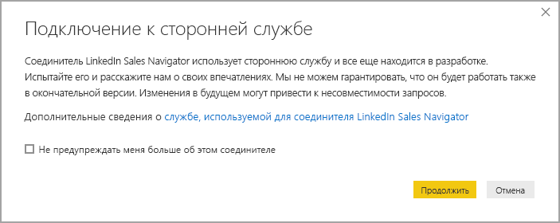
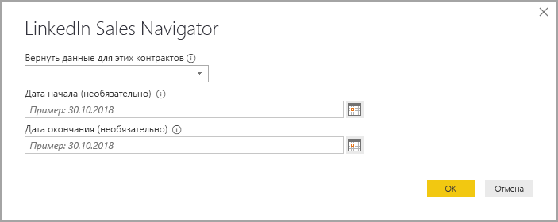
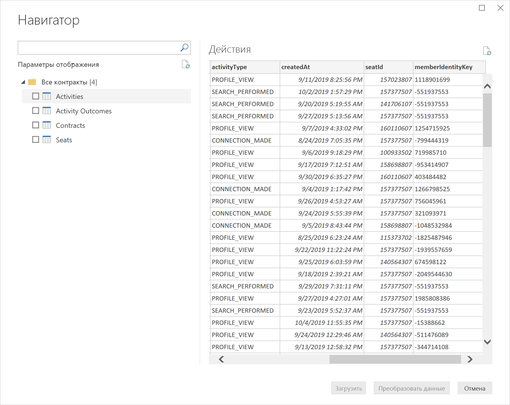
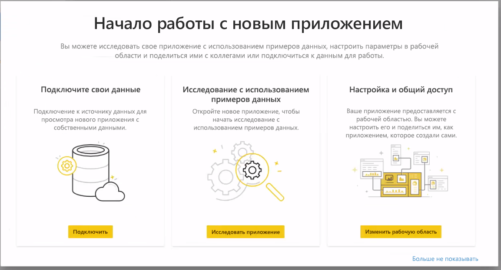
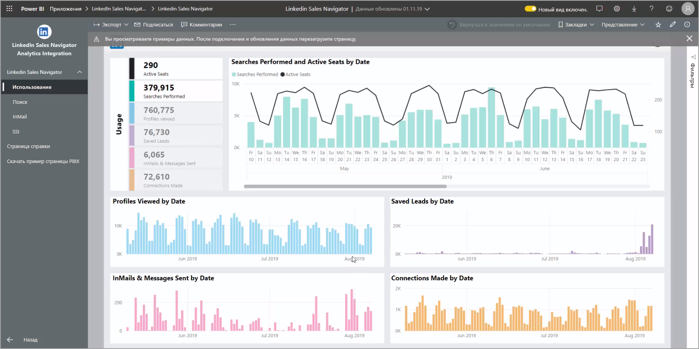
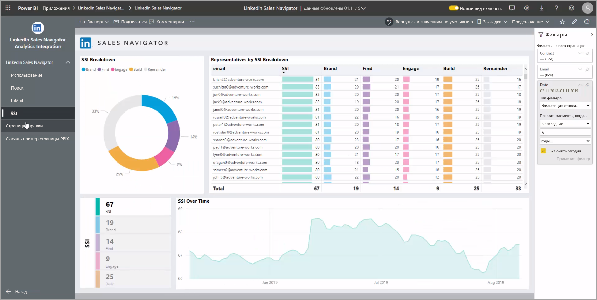
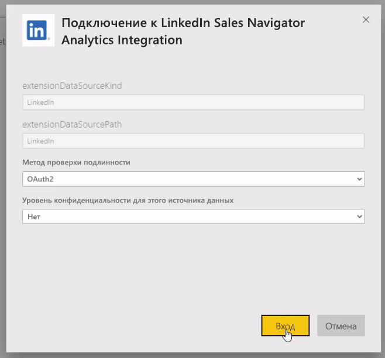

# Подключение к LinkedIn Sales Navigator в Power BI Desktop

В **Power BI Desktop** можно подключиться к **LinkedIn Sales Navigator**, чтобы находить и создавать связи так же, как любой другой источник данных в Power BI Desktop, а также создавать готовые отчеты о ходе выполнения.

Чтобы подключиться к данным LinkedIn с помощью **LinkedIn Sales Navigator**, необходимо иметь план LinkedIn Sales Navigator Enterprise, а также быть администратором или пользователем отчетности с контрактом Sales Navigator.

В следующем видео представлен краткий обзор и учебник по использованию приложения шаблона **LinkedIn Sales Navigator**, которое подробно описано [далее в этой статье](#using-the-linkedin-sales-navigator-template-app). 

> [!VIDEO https://www.youtube.com/embed/ZqhmaiORLw0]

## Подключение к LinkedIn Sales Navigator

Чтобы подключиться к данным **LinkedIn Sales Navigator**, выберите **Get Data** (Получить данные) на ленте **Home** (Главная) в Power BI Desktop. Выберите **Online Services** (Веб-службы) среди категорий слева, а затем прокрутите экран до **LinkedIn Sales Navigator (Beta)** .

Вам будет предложено подключиться к сторонним соединителям, которые все еще разрабатываются. 

Нажав кнопку **Continue** (Далее), укажите нужные данные.

В появившемся окне **LinkedIn Sales Navigator** в первом раскрывающемся списке выберите данные, которые требуется вернуть: *All contacts* (Все контакты) или *Selected contacts* (Выбранные контакты). Затем можно указать начальную и окончательную даты, чтобы ограничить количество получаемых данных определенным временным окном.

После того, как данные предоставлены, Power BI Desktop подключается к данным, связанным с контрактом LinkedIn Sales Navigator. Используйте тот же адрес электронной почты, который используется для входа в LinkedIn Sales Navigator на веб-сайте. 

При успешном подключении вам будет предложено выбрать данные из контракта LinkedIn Sales Navigator в окне **Navigator**.

Вы можете создавать любые отчеты с данными из LinkedIn Sales Navigator. Чтобы упростить эту задачу, также можно использовать загружаемый PBIX-файл LinkedIn Sales Navigator с уже предоставленными демонстрационными данными, чтобы вы могли ознакомиться с данными и отчетами без необходимости начинать с нуля.

PBIX-файл можно загрузить по следующему адресу:
* [PBIX-файл для LinkedIn Sales Navigator](service-template-apps-samples.md)

Помимо PBIX-файла, в LinkedIn Sales Navigator также имеется шаблонное приложение, которое можно загрузить и использовать. Подробно шаблонное приложение описывается в следующем разделе.

## Использование шаблонного приложения LinkedIn Sales Navigator

Чтобы упростить использование **LinkedIn Sales Navigator**, можно использовать [шаблонное приложение](service-template-apps-overview.md), которое автоматически создает готовый отчет из данных LinkedIn Sales Navigator.

После загрузки приложения можно выбрать, следует ли подключаться к данным или изучать приложение с помощью демонстрационных данных. После изучения образца данных вы всегда можете вернуться и подключиться к собственным данным LinkedIn Sales Navigator. 

Вы можете получить шаблонное приложение **LinkedIn Sales Navigator** по следующей ссылке:
* [Шаблонное приложение LinkedIn Sales Navigator](https://appsource.microsoft.com/product/power-bi/pbi-contentpacks.linkedin_navigator-preview?flightCodes=17ad4c68-fbc5-4925-a351-139fd384ec33)

Шаблонное приложение содержит четыре вкладки для анализа и совместного использования информации:

* Использование
* Поиск
* InMail
* SSI

На вкладке **Usage** (Использование) отображаются общие данные LinkedIn Sales Navigator.

Вкладка **Search** (Поиск) позволяет углубленно анализировать результаты поиска:

На вкладке **InMail** предоставлены аналитические сведения об использовании сообщений InMail, в том числе о количестве отправленных сообщений InMail, количестве принятых и другие полезные сведения:

На вкладке **SSI** содержатся дополнительные сведения об индексе социального сбыта (SSI):

Чтобы перейти от образца данных к собственным данным, выберите команду **edit app** (Изменить приложение) в правом верхнем углу (значок карандаша), а затем на появившемся экране выберите команду **Connect your data** (Подключить свои данные).

Здесь можно подключить собственные данные, выбрав количество дней для загрузки данных. Данные можно загрузить не более чем за 365 дней. Вам потребуется выполнить вход, используя тот же адрес электронной почты, который используется для входа в LinkedIn Sales Navigator через веб-сайт. 

Затем шаблонное приложение обновляет данные в приложении вашими данными. Кроме этого, вы можете настроить обновление по расписанию, чтобы в приложение с указанной частотой обновления попадали текущие данные. 

После обновления данных можно увидеть, как приложение заполняется вашими собственными данными.

## Получение справки

Если при подключении к данным возникают проблемы, вы можете обратиться в службу поддержки LinkedIn Sales Navigator по адресу https://www.linkedin.com/help/sales-navigator. 

## Дальнейшие действия
В Power BI Desktop можно подключаться к данным самых разных видов. Дополнительные сведения об источниках данных см. в перечисленных ниже статьях.

* [Что такое Power BI Desktop?](desktop-what-is-desktop.md)
* [Источники данных в Power BI Desktop](desktop-data-sources.md)
* [Формирование и объединение данных с Power BI Desktop](desktop-shape-and-combine-data.md)
* [Подключение к данным Excel в Power BI Desktop](desktop-connect-excel.md)   
* [Ввод данных непосредственно в Power BI Desktop](desktop-enter-data-directly-into-desktop.md)   

