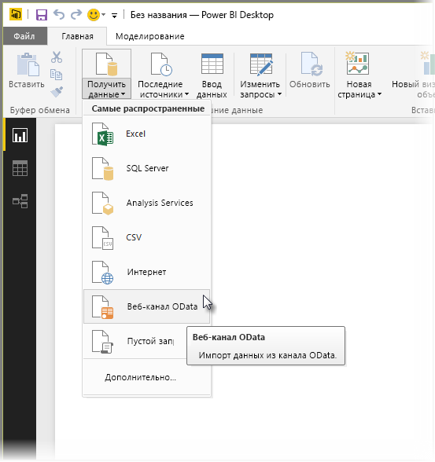
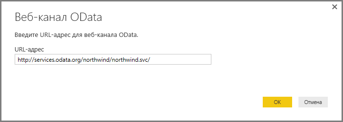

# Подключение к веб-каналу OData в Power BI Desktop
В Power BI Desktop вы можете подключиться к **веб-каналу OData** и использовать его так же, как и любой другой источник данных в Power BI Desktop.

Чтобы подключиться к веб-каналу OData, выберите **Получение данных > Канал OData** на ленте **Главная** в Power BI Desktop.

В появившемся окне **Канал OData** введите или вставьте в поле URL-адрес канала и нажмите кнопку **ОК**.

Power BI Desktop подключится к веб-каналу OData и выведет доступные каналы и другие элементы данных в окне **Навигатор**. При выборе элемента в правой области окна **Навигатор** появляются соответствующие данные для предварительного просмотра. Вы можете выбрать для импорта любое количество таблиц. В окне **Навигатор** отображается в режиме предварительного просмотра таблица, выбранная в данный момент.

Вы можете нажать кнопку **Изменить**, чтобы запустить **редактор запросов**, позволяющий отформатировать и преобразовать данные из канала OData, прежде чем импортировать их в Power BI Desktop. Если нажать кнопку **Загрузить**, все элементы данных, выбранные в левой области, будут импортированы в приложение.

При нажатии на кнопку **Загрузить** Power BI Desktop импортирует выбранные элементы и выводит окно **Загрузка**, в котором показан ход импорта.

После завершения процесса Power BI Desktop добавляет выбранные таблицы и другие элементы данных в область **Поля** в правой части представления *Отчеты* в Power BI Desktop.

Вот и все!

Теперь вы можете работать с импортированной из канала OData информацией в приложении Power BI Desktop: создавать визуальные элементы и отчеты, а также подключать и импортировать прочие сведения, например книги Excel, базы и любые другие источники данных.

## Дальнейшие действия
В Power BI Desktop можно подключаться к данным самых разных видов. Дополнительные сведения об источниках данных см. в перечисленных ниже статьях.

* [Что такое Power BI Desktop?](desktop-what-is-desktop.md)
* [Источники данных в Power BI Desktop](desktop-data-sources.md)
* [Формирование и объединение данных в Power BI Desktop](desktop-shape-and-combine-data.md)
* [Подключение к данным Excel в Power BI Desktop](desktop-connect-excel.md)   
* [Ввод данных непосредственно в Power BI Desktop](desktop-enter-data-directly-into-desktop.md)   

