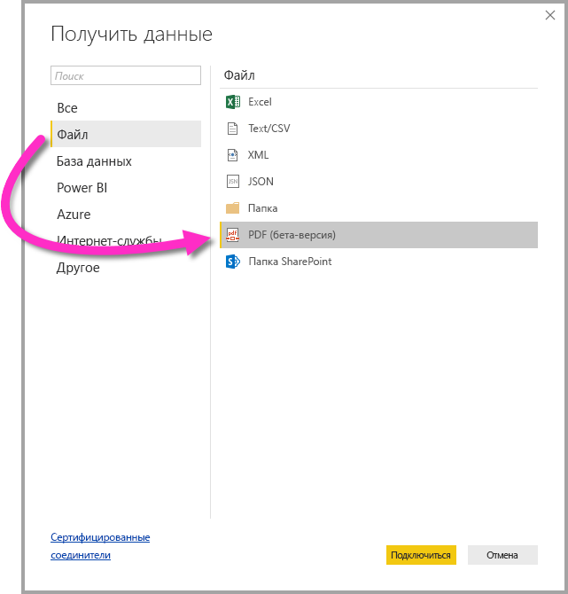

# Подключение к PDF-файлу в Power BI Desktop (предварительная версия)
С помощью Power BI Desktop вы можете подключиться к **PDF-файлу** и использовать данные из него аналогично любому другому источнику данных в Power BI Desktop.

В следующих разделах рассматривается процесс подключения к **PDF-файлу**, выбора данных и переноса этих данных в **Power BI Desktop**.

## Включение соединителя PDF
Соединитель PDF доступен в предварительной версии для **Power BI Desktop** и должен быть включен. Чтобы включить соединитель PDF, выберите **Файл > Параметры и настройки > Параметры > Функции предварительной версии** и установите флажок рядом с пунктом **Получение данных из PDF-файлов**. 

После этого изменения приложение **Power BI Desktop** необходимо перезапустить.

При первом запуске соединителя **PDF (бета-версия)** вы будете предупреждены, что соединитель PDF находится на стадии разработки и может быть изменен в будущем. Выберите **Продолжить**, чтобы использовать соединитель.

Мы всегда рекомендуем выполнять обновление до последней версии **Power BI Desktop**. Это можно сделать с помощью ссылки [Получить Power BI Desktop](desktop-get-the-desktop.md). 

## Подключение к PDF-файлу
Для подключения к **PDF-файлу** в ленте **Главная** в Power BI Desktop выберите **Получить данные**. В области слева выберите **Файл**. Отобразится пункт **PDF (бета-версия)**.

Вам будет предложено указать расположение файла PDF-файла, который вы хотите использовать. После предоставления информации о расположении файла и его загрузки откроется окно **Навигатор**, содержащее данные из файла. В этом окне вы можете выбрать один или несколько элементов для импорта и использования в **Power BI Desktop**.

После установки флажка напротив обнаруженных в PDF-файле элементов они будут показаны в области справа. Когда вы будете готовы их импортировать, выберите кнопку **Загрузить**, чтобы перенести данные в **Power BI Desktop**.

## Дальнейшие действия
В Power BI Desktop можно подключаться к данным самых разных видов. Дополнительные сведения об источниках данных см. в перечисленных ниже статьях.

* [Что такое Power BI Desktop?](desktop-what-is-desktop.md)
* [Источники данных в Power BI Desktop](desktop-data-sources.md)
* [Формирование и объединение данных в Power BI Desktop](desktop-shape-and-combine-data.md)
* [Подключение к данным Excel в Power BI Desktop](desktop-connect-excel.md)   
* [Ввод данных непосредственно в Power BI Desktop](desktop-enter-data-directly-into-desktop.md)   

