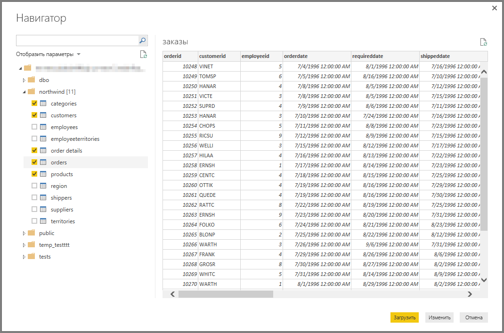

# Подключение к Amazon Redshift в Power BI Desktop
В **Power BI Desktop** вы можете подключиться к базе данных **Amazon Redshift** и использовать ее так же, как и любой другой источник данных в Power BI Desktop.

## Подключение к базе данных Amazon Redshift
Для подключения к базе данных **Amazon Redshift** на вкладке **Главная** на ленте в Power BI Desktop выберите **Получение данных**. Слева выберите категорию **База данных**. Отобразится пункт **Amazon Redshift**.

В открывшемся окне **Amazon Redshift** введите или вставьте имя сервера и базы данных **Amazon Redshift** в соответствующие поля. В качестве части поля *Сервер* пользователи могут указать порт в следующем формате: *URL-адреса_сервера:порт*.

При появлении запроса укажите имя пользователя и пароль. Во избежание ошибок следует использовать имя сервера, которое в точности соответствует SSL-сертификату. 

После успешного подключения откроется окно **Навигатор**, содержащее данные, доступные на сервере. Из них вы можете выбрать один или несколько элементов для импорта и использования в **Power BI Desktop**.

Выбрав необходимые элементы в окне **Навигатор**, вы можете либо **загрузить**, либо **изменить** данные.

* Если вы решили **загрузить** данные, для этого вам будет предложено использовать режим *импорта* или *DirectQuery*. Для получения дополнительной информации ознакомьтесь с этой [статьей, в которой объясняется, что такое режим DirectQuery](desktop-use-directquery.md).
* Если вы решили **изменить** данные, отобразится **редактор запросов**, с помощью которого можно выполнять любые преобразования данных и применять к ним любые фильтры, многие из которых используются с основной базой данных **Amazon Redshift** (если такая возможность поддерживается).

## Дальнейшие действия
В Power BI Desktop можно подключаться к данным самых разных видов. Дополнительные сведения об источниках данных см. в перечисленных ниже статьях.

* [Начало работы с Power BI Desktop](desktop-getting-started.md)
* [Источники данных в Power BI Desktop](desktop-data-sources.md)
* [Формирование и объединение данных в Power BI Desktop](desktop-shape-and-combine-data.md)
* [Подключение к данным Excel в Power BI Desktop](desktop-connect-excel.md)   
* [Ввод данных непосредственно в Power BI Desktop](desktop-enter-data-directly-into-desktop.md)   

