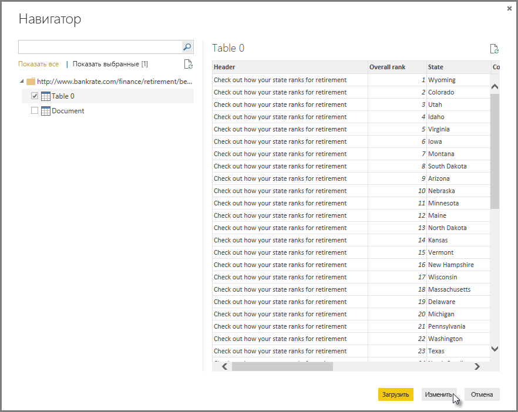
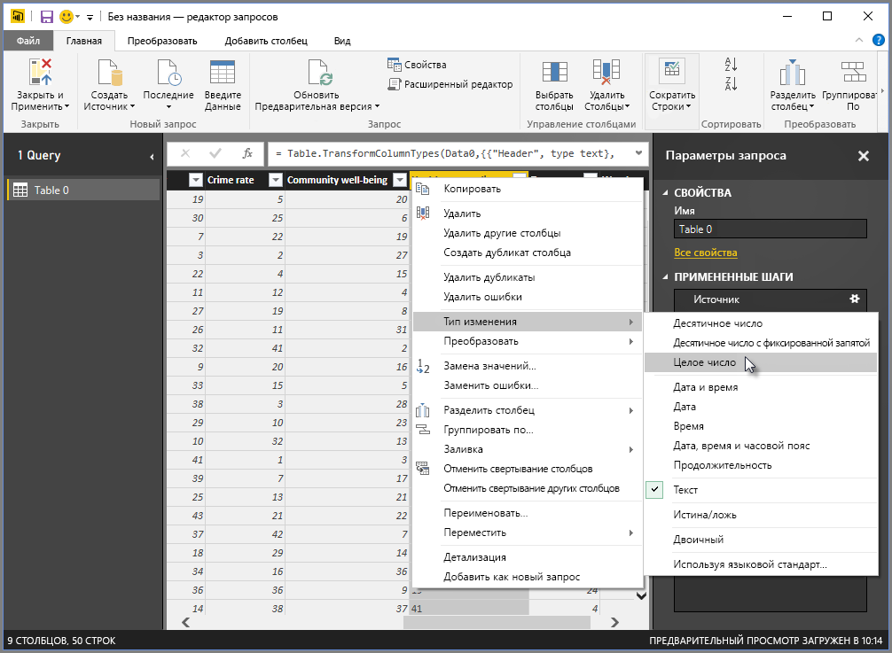
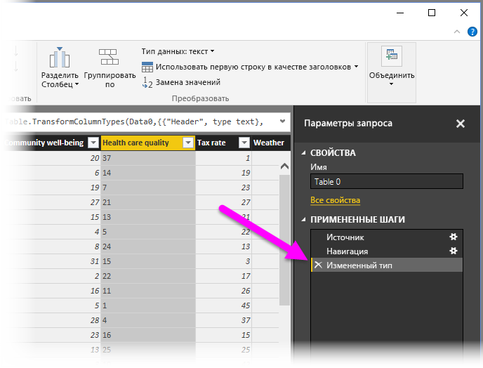
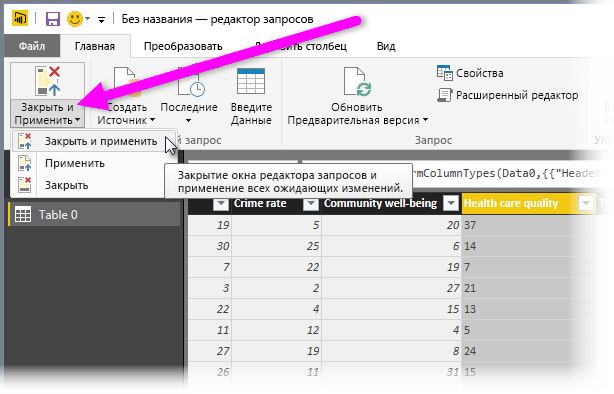
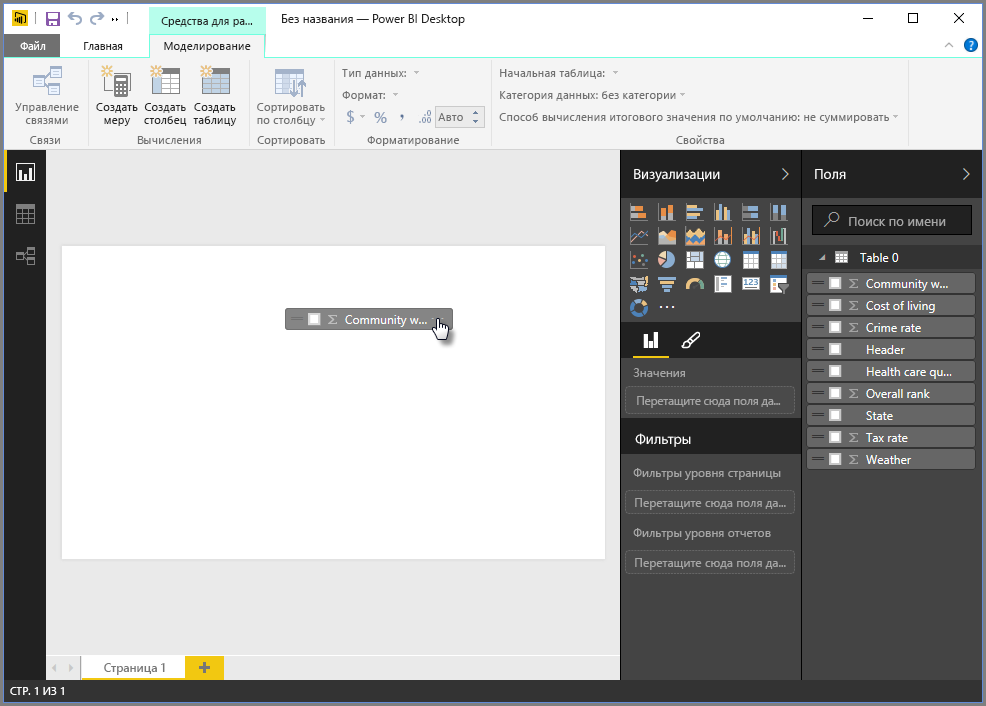
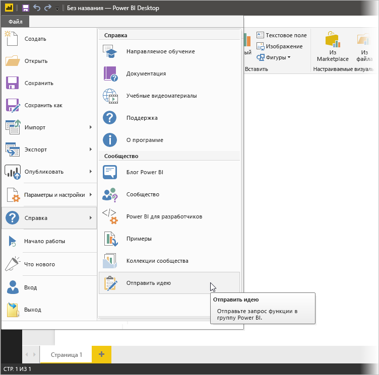

# Подключение к данным в Power BI Desktop
Power BI Desktop позволяет легко подключаться к постоянно растущему миру данных. Если у вас нет Power BI Desktop, его можно загрузить и установить [отсюда](http://go.microsoft.com/fwlink/?LinkID=521662).

В Power BI Desktop доступны *все виды* источников данных. На следующем рисунке показано, как подключиться к данным, выбрав на ленте пункт **Файл**, а затем последовательно выбрав **Получить данные \> Дополнительно**.

## Пример подключения к данным
В этом примере мы будем подключаться к источнику данных **в Интернете** .

Предположим, вы уходите на пенсию и хотите жить там, где много солнца, мягкие налоги и хорошее здравоохранение. или Возможно, вы аналитик данных и хотите получить сведения для помощи клиентам, например помочь своему клиенту, производящему дождевики, организовать целевые продажи в местах, где *часто* идут дожди.

В любом случае интересующие вас данные в этих и многих других областях имеются на следующем веб-ресурсе:

[*http://www.bankrate.com/finance/retirement/best-places-retire-how-state-ranks.aspx*](http://www.bankrate.com/finance/retirement/best-places-retire-how-state-ranks.aspx)

Выберите **Получить данные \> Интернет** и введите адрес.

Когда вы нажмете кнопку **ОК**, начнет работу функциональность **Запрос** Power BI Desktop. Power BI Desktop обращается к веб-ресурсу, и в окне **навигатора** отображается то, что он найдет на этой веб-странице. В данном случае найдена таблица (Таблица 0) и общей веб-документ. Нас интересует эта таблица, поэтому мы выбираем ее из списка. В окне **Навигатор** доступен предварительный просмотр содержимого.

На этом этапе можно изменить запрос перед загрузкой таблицы, нажав кнопку **Изменить** внизу окна, или загрузить эту таблицу.

При нажатии кнопки **Изменить**загрузится таблица и запустится редактор запросов. Появляется область **Параметры запроса** (если эта область не отображается, щелкните на ленте вкладку **Вид**, а затем последовательно выберите **Показать \> Параметры запроса**, чтобы вывести на экран область **Параметры запроса**). Вот как это выглядит.

Все эти рейтинги представлены текстом, а не числами, а нам они нужны в виде чисел. Чтобы внести нужные изменения, достаточно щелкнуть правой кнопкой мыши заголовок столбца и выбрать **Изменить тип \> Целое число**. Чтобы выбрать несколько столбцов, сначала выделите столбец, нажмите и удерживайте клавишу **SHIFT**, одновременно выделите смежные столбцы, а затем щелкните правой кнопкой мыши заголовок столбца, чтобы изменить все выделенные столбцы. Чтобы выбрать столбцы, которые не являются смежными, используйте клавишу **CTRL** .

В области **Параметры запроса**в разделе **примененных действий** будут отражаться все сделанные изменения. По мере внесения в данные дополнительных изменений редактор запросов будет записывать эти изменения в раздел **примененных действий** , где вы можете настраивать действия, повторно переходить в действия, изменять их порядок или удалять их при необходимости.

После загрузки таблицы все еще можно вносить дополнительные изменения, но сейчас мы будем создавать отчеты. Закончив, выберем пункт **Закрыть и применить** на ленте **Главная**, и Power BI Desktop применит все изменения и закроет редактор запросов.

Загрузив модель данных, в представлении **Отчет** в Power BI Desktop можно создать визуализацию, перетащив поля на холст.

Конечно это простая модель с единственным подключением к данным; большинство отчетов Power BI Desktop будет иметь подключения к различным источникам данных, сформированным для удовлетворения ваших потребностей, со связями, которые образуют сложную модель данных. 

## Дальнейшие действия
Power BI Desktop предоставляет широкие возможности. Дополнительные сведения об этих возможностях см. в следующих ресурсах.

* [Что такое Power BI Desktop?](desktop-what-is-desktop.md)
* [Общие сведения о запросах в Power BI Desktop](desktop-query-overview.md)
* [Источники данных в Power BI Desktop](desktop-data-sources.md)
* [Формирование и объединение данных в Power BI Desktop](desktop-shape-and-combine-data.md)
* [Общие задачи с запросами в Power BI Desktop](desktop-common-query-tasks.md)   

Хотите оставить отзыв? Прекрасно! Используйте пункт меню **Отправить идею** в Power BI Desktop или посетите раздел [Отзывы сообщества](http://community.powerbi.com/t5/Community-Feedback/bd-p/community-feedback). Мы будем рады вашим отзывам.

