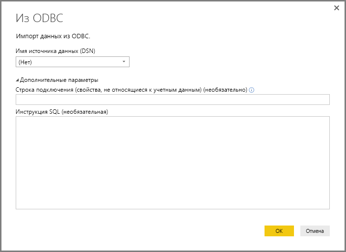
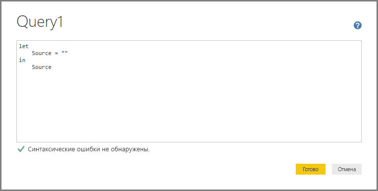

# Подключение к данным через универсальные интерфейсы Power BI Desktop 

В **Power BI Desktop** можно подключаться к множеству различных источников данных, используя встроенные соединители, которые отображаются в окне **Получение данных**, — от **баз данных Access** до ресурсов **Zendesk**. Вы также можете подключаться к *другим* источникам данных различных типов с помощью универсальных интерфейсов (например, **ODBC** или **REST API**), встроенных в **Power BI Desktop**. Это дополнительно расширяет возможности подключения.

## Интерфейсы данных в Power BI Desktop
Средство **Power BI Desktop** включает постоянно расширяющуюся коллекцию соединителей данных, созданных для подключения к определенному источнику данных. Например, в соединителе данных **Список SharePoint** в процессе подключения отображаются специальные поля и вспомогательные сведения, предназначенные для **списков SharePoint**. Точно так же происходит и с другими источниками данных, перечисленных в окне, которое появляется при выборе элементов **Получить данные > Дополнительные сведения...** (см. рисунок выше).

Кроме того, **Power BI Desktop** позволяет подключаться к источникам данных, не указанным в списках в окне **Получение данных**, с помощью одного из следующих универсальных интерфейсов данных:

* **ODBC**;
* **OLE DB**;
* **OData**;
* **REST API**;
* **R-скрипты**.

Указывая соответствующие параметры в окнах подключения этих универсальных интерфейсов, вы можете открывать и использовать в **Power BI Desktop** значительно больше источников данных, чем когда-либо раньше.

В следующих разделах вы найдете списки источников данных, к которым можно получить доступ с помощью этих универсальных интерфейсов.

Не удалось найти источник данных, который вы хотели использовать в **Power BI Desktop**? Отправьте свою идею в [список идей и запросов](https://ideas.powerbi.com/) для группы Power BI.

## Источники данных, доступные через ODBC
Соединитель **ODBC** в **Power BI Desktop** позволяет импортировать данные из любого стороннего драйвера ODBC, просто указав **имя источника данных (DSN)** или *строку подключения*. В качестве альтернативного варианта можно также указать инструкцию SQL, которую следует применить к драйверу ODBC.

В списке ниже приведено несколько примеров источников данных, к которым можно подключиться из **Power BI Desktop** с помощью универсального интерфейса **ODBC**.

| Универсальный соединитель Power BI Desktop | Внешний источник данных | Ссылка на дополнительные сведения |
| --- | --- | --- |
| ODBC |Cassandra |[Драйвер ODBC для Cassandra](https://www.simba.com/drivers/cassandra-odbc-jdbc/) |
| ODBC |База данных Couchbase |[Couchbase и Power BI](https://powerbi.microsoft.com/blog/visualizing-data-from-couchbase-server-v4-using-power-bi/) |
| ODBC |DynamoDB |[Драйвер ODBC для DynamoDB](https://www.simba.com/drivers/dynamodb-odbc-jdbc/) |
| ODBC |Google BigQuery |[Драйвер ODBC для BigQuery](https://www.simba.com/drivers/bigquery-odbc-jdbc/) |
| ODBC |HBase |[Драйвер ODBC для HBase](https://www.simba.com/drivers/hbase-odbc-jdbc/) |
| ODBC |Hive |[Драйвер ODBC для Hive](https://www.simba.com/drivers/hive-odbc-jdbc/) |
| ODBC |IBM Netezza |[Сведения об IBM Netezza](https://www.ibm.com/support/knowledgecenter/SSULQD_7.2.1/com.ibm.nz.datacon.doc/c_datacon_plg_overview.html) |
| ODBC |Presto |[Драйвер ODBC для Presto](https://www.simba.com/drivers/presto-odbc-jdbc/) |
| ODBC |Project Online |[Статья, посвященная Project Online](desktop-project-online-connect-to-data.md) |
| ODBC |Progress OpenEdge |[Запись в блоге, посвященная драйверу ODBC Progress OpenEdge](https://www.progress.com/blogs/connect-microsoft-power-bi-to-openedge-via-odbc-driver) |

## Источники данных, доступные через OLE DB
Соединитель **OLE DB** в **Power BI Desktop** позволяет импортировать данные из любого стороннего драйвера OLE DB, просто указав *строку подключения*. В качестве альтернативного варианта можно также указать инструкцию SQL, которую следует применить к драйверу OLE DB.

В списке ниже приведено несколько примеров источников данных, к которым можно подключиться из **Power BI Desktop** с помощью универсального интерфейса **OLE DB**.

| Универсальный соединитель Power BI Desktop | Внешний источник данных | Ссылка на дополнительные сведения |
| --- | --- | --- |
| OLE DB |SAS OLE DB |[Поставщик SAS для OLE DB](https://support.sas.com/downloads/package.htm?pid=648) |
| OLE DB |Sybase OLE DB |[Поставщик Sybase для OLE DB](http://infocenter.sybase.com/help/index.jsp?topic=/com.sybase.infocenter.dc35888.1550/doc/html/jon1256941734395.html) |

## Источники данных, доступные через OData
Соединитель **OData** в **Power BI Desktop** позволяет импортировать данные с любых URL-адресов **OData**. Для этого достаточно ввести или вставить URL-адрес **OData**. Вы можете добавлять различные части URL-адреса, вводя или вставляя соответствующие ссылки в текстовые поля в окне **Канал OData**.

В списке ниже приведено несколько примеров источников данных, к которым можно подключиться из **Power BI Desktop** с помощью универсального интерфейса **OData**.

| Универсальный соединитель Power BI Desktop | Внешний источник данных | Ссылка на дополнительные сведения |
| --- | --- | --- |
| OData |Скоро выйдет |Проверьте наличие источников данных OData через некоторое время |

## Источники данных, доступные через REST API
Вы можете подключаться к источникам данных с помощью **интерфейсов REST API** и таким образом использовать данные из всех типов источников данных, поддерживающих **REST**.

В списке ниже приведено несколько примеров источников данных, к которым можно подключиться из **Power BI Desktop** с помощью универсального интерфейса **REST API**.

| Универсальный соединитель Power BI Desktop | Внешний источник данных | Ссылка на дополнительные сведения |
| --- | --- | --- |
| REST API |База данных Couchbase |[Сведения о REST API для Couchbase](https://powerbi.microsoft.com/blog/visualizing-data-from-couchbase-server-v4-using-power-bi/) |

## Источники данных, доступные через R-скрипт
Вы можете подключаться к источникам данных с помощью **R-скриптов** и использовать эти данные в **Power BI Desktop**.

В списке ниже приведено несколько примеров источников данных, к которым можно подключиться из **Power BI Desktop** с помощью универсального интерфейса **R-скриптов**.

| Универсальный соединитель Power BI Desktop | Внешний источник данных | Ссылка на дополнительные сведения |
| --- | --- | --- |
| Сценарий R |SAS-файлы |[Руководство по R-скриптам для CRAN](https://cran.r-project.org/doc/manuals/R-data.html) |
| Сценарий R |SPSS-файлы |[Руководство по R-скриптам для CRAN](https://cran.r-project.org/doc/manuals/R-data.html) |
| Сценарий R |Статистические файлы R |[Руководство по R-скриптам для CRAN](https://cran.r-project.org/doc/manuals/R-data.html) |

## Дальнейшие действия
В **Power BI Desktop** можно подключаться к источникам данных самых разных видов. Дополнительные сведения об источниках данных см. в перечисленных ниже статьях.

* [Что такое Power BI Desktop?](desktop-what-is-desktop.md)
* [Источники данных в Power BI Desktop](desktop-data-sources.md)
* [Формирование и объединение данных в Power BI Desktop](desktop-shape-and-combine-data.md)
* [Подключение к данным Excel в Power BI Desktop](desktop-connect-excel.md)   
* [Ввод данных непосредственно в Power BI Desktop](desktop-enter-data-directly-into-desktop.md)   

