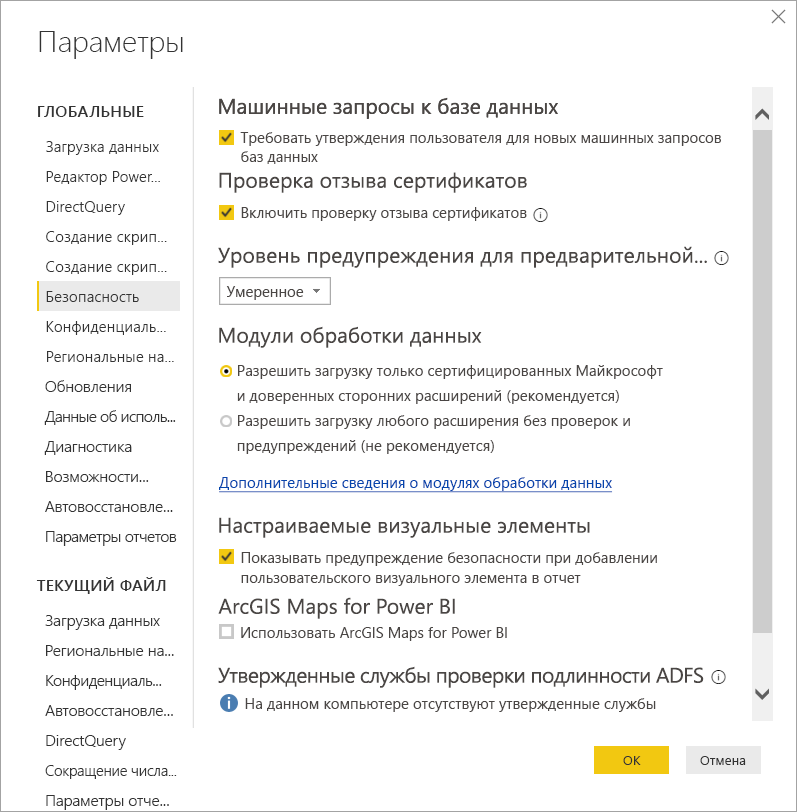

# Расширение соединителей в Power BI

Power BI может подключаться к данным с помощью существующих соединителей и универсальных источников данных, таких как ODBC, OData, OLE DB, Web, CSV, XML и JSON. Также разработчики могут включить новые источники данных с настраиваемыми расширениями данных, которые называются *настраиваемыми соединителями*. Некоторые настраиваемые соединители сертифицированы и распространяются корпорацией Майкрософт как *сертифицированные соединители*.

Чтобы использовать несертифицированные настраиваемые соединители, разработанные вами или сторонними разработчиками, необходимо настроить параметры безопасности Power BI Desktop, чтобы расширения могли загружаться без проверки или отображения предупреждения. Этот параметр безопасности следует использовать только в том случае, если вы полностью доверяете своим настраиваемым соединителям, поскольку код в них может обрабатывать учетные данные, в том числе передавать их по протоколу HTTP, и игнорировать уровни конфиденциальности.

Кроме того, разработчик может подписать соединитель сертификатом и предоставить сведения, необходимые для его использования без изменения параметров безопасности. Дополнительные сведения см. в разделе [Сведения о доверенных соединителях сторонних поставщиков](desktop-trusted-third-party-connectors.md).

## Настраиваемые соединители

Несертифицированные настраиваемые соединители могут предоставлять целый ряд возможностей — от небольших API-интерфейсов, которые важны для малого бизнеса, до крупных отраслевых служб, соединители для которых еще не выпущены в Майкрософт. Многие соединители распространяются поставщиками. Если вам требуется определенный соединитель данных, обратитесь к поставщику. 

Чтобы использовать несертифицированный настраиваемый соединитель, поместите файл соединителя с расширением *PQ*, *PQX*, *M* или *MEZ* в папку *\[Documents]\\Power BI Desktop\\Custom Connectors*. Если папка не существует, создайте ее.

Настройте параметры безопасности модуля обработки данных следующим образом.

В Power BI Desktop последовательно выберите **Файл**  >  **Параметры и настройки**  >  **Параметры**  >  **Безопасность**.

В разделе **Расширения данных** выберите **Разрешить загрузку любого расширения без проверок и предупреждений (не рекомендуется)** . Нажмите **ОК** и перезапустите Power BI Desktop. 

Параметр безопасности модуля обработки данных Power BI Desktop по умолчанию — **Разрешить загрузку только сертифицированных Майкрософт и доверенных сторонних расширений (рекомендуется)** . Если включен этот параметр, при наличии в системе несертифицированных настраиваемых соединителей при запуске Power BI Desktop появится диалоговое окно **Несертифицированные соединители**, в котором перечислены соединители, которые невозможно безопасно загрузить.

Чтобы устранить эту ошибку, можно либо изменить параметры безопасности в разделе **Расширения данных**, либо удалить несертифицированные соединители из папки *Custom Connectors*.

## Сертифицированные соединители

*Сертифицированными* считаются разрешения из ограниченного набора расширений данных. Корпорация Майкрософт распространяет такие соединители, однако мы не несем ответственности за их производительность или непрерывную работу. Ответственность за поддержку и обслуживание сторонних соединителей несут их разработчики. 

В Power BI Desktop сертифицированные сторонние соединители указаны в списке в диалоговом окне **Получение данных** вместе с универсальными и общими соединителями. Вам не нужно менять параметры безопасности для использования сертифицированных соединителей.

Если требуется сертифицировать настраиваемый соединитель, попросите своего поставщика обратиться по следующему адресу: dataconnectors@microsoft.com.
