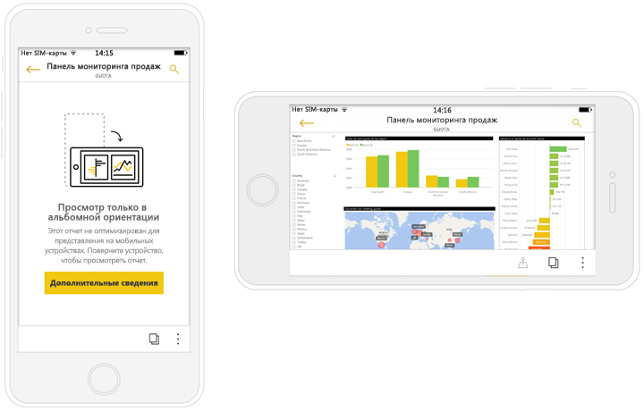

# Оптимизируйте отчеты для мобильных приложений Power BI
Можно улучшить работу с просмотра отчетов в мобильных приложениях путем создания макета книжной ориентации. В Power BI Desktop и службе Power BI вы измените расположение и размер визуальных элементов отчетов, для оптимальной работы в книжной ориентации.  

Ищете сведения о просмотре отчетов на мобильном устройстве, вместо этого? Попробуйте в этом кратком руководстве [и изучите панели мониторинга и отчеты в мобильных приложениях Power BI](consumer/mobile/mobile-apps-quickstart-view-dashboard-report.md).

А также можно создать [ *быстрые* визуальных элементов](#optimize-a-visual-for-any-size) и [адаптивные срезы](#enhance-slicers-to-work-well-in-phone-reports) , изменение размера хорошо в любом месте. Если добавить фильтры к отчету, они отображаются автоматически в оптимизированный отчет.

## Создание версии страницы отчета в книжной ориентации

Создав отчет, вы можете оптимизировать его для использования на телефонах и планшетах.

1. В представлении отчетов в Power BI Desktop на вкладке **Представление** выберите **Макет для телефона**.  
   
    
   
    В службе Power BI выберите **Изменить отчет** > **Макет для мобильных приложений**.

    Отобразится пустой холст в форме экрана телефона. Все визуальные элементы на исходной странице отчета перечислены на панели "Визуализации" справа.

3. Чтобы добавить визуальный элемент на макет телефона, перетащите его с панели "Визуализации" на холст телефона.
   
    В мобильных отчетах используется макет сетки. При перетаскивании визуальных элементов на холст телефона они прикрепляются к этой сетке.
   
    
   
    Вы можете добавить визуальные элементы с главной страницы отчета (все или некоторые) на страницу мобильного отчета. Один визуальный элемент можно добавить только один раз. Не нужно включать все визуальные элементы.

4. Вы можете изменять размер визуальных элементов в сетке точно так же, как вы изменяете размеры плиток на панелях мониторинга и мобильных панелях мониторинга.
   
   Сетка отчета для мобильного телефона масштабируется на телефонах разных размеров. Отчет выглядит одинаково хорошо на телефонах и с маленькими, и с большими экранами.
   
   

## Оптимизация визуальных элементов для любого размера
Вы можете задать *адаптивность* для визуальных элементов на панели мониторинга или в отчете. Они будут динамически изменяться, отображая как можно больше данных независимо от размера экрана. 

При изменении размера визуального элемента Power BI определяет приоритеты в представлении данных. Например, Power BI может автоматически удалять отступы и перемещать условные обозначения наверх, чтобы даже при уменьшении визуальный элемент оставался информативным.

Вы можете выбрать, следует ли включать адаптивность для каждого визуального элемента. Узнайте подробнее об [оптимизации визуальных элементов](visuals/desktop-create-responsive-visuals.md).

## Рекомендации по созданию макетов для мобильных отчетов
* Если нужно оптимизировать отчет на нескольких страницах, вы можете оптимизировать все страницы или только некоторые из них. 
* Если вы определили цвет фона для страницы отчета, цвет фона в мобильном отчете будет таким же.
* Невозможно изменить параметры форматирования только для телефона. Для главного макета и макета для мобильных устройств предусмотрено одинаковое форматирование. Например, размер шрифта совпадает.
* Чтобы изменить визуальный элемент, например его форматирование, набор данных, фильтры и другие атрибуты, вернитесь в обычный режим создания отчетов.
* Power BI указывает заголовки и названия страниц мобильных отчетов, используемые по умолчанию в мобильном приложении. Если вы создаете текстовые визуальные элементы для заголовков и названий страниц в отчете, не добавляйте их в мобильные отчеты.     

## Удаление визуального элемента из макета для мобильных устройств
* Чтобы удалить визуальный элемент, щелкните значок X в правом верхнем углу визуального элемента на холсте телефона или выберите элемент и нажмите кнопку **Delete** (Удалить).
  
   Таким образом визуальный элемент можно удалить только с холста макета для телефона. Это не повлияет на сам визуальный элемент и исходный отчет.
  
   

## Улучшение срезов для оптимизации мобильных отчетов
Срезы помогают фильтровать данные отчета на холсте. Когда вы создаете срезы в обычном режиме создания отчетов, вы можете изменить некоторые параметры среза, чтобы сделать его более удобным для использования в мобильных отчетах.

* Вы можете указать количество элементов, которые могут выбирать читатели отчета.
* Вы можете поместить срез в поле, чтобы отчет было удобнее проверять.
* Вы можете сделать срез горизонтальным, вертикальным или *адаптивным*. 

Если вы сделали срез адаптивным, в зависимости от его размеров и фигуры отображается разное количество параметров. Он может быть высоким, коротким, широким или узким. Если сделать его очень маленьким, он станет просто значком фильтра на странице отчета. 

Дополнительные сведения о [создании адаптивных срезов](power-bi-slicer-filter-responsive.md).

## Публикация мобильного отчета
* Чтобы опубликовать мобильную версию отчета, [опубликуйте главный отчет из приложения Power BI Desktop в службу Power BI](desktop-upload-desktop-files.md) — одновременно будет опубликована мобильная версия.
  
    См. дополнительные сведения об [общем доступе и разрешениях в Power BI](service-how-to-collaborate-distribute-dashboards-reports.md).

## Просмотр оптимизированных и неоптимизированных отчетов на телефоне или планшете
Power BI автоматически обнаруживает в мобильных приложениях на телефонах оптимизированные и неоптимизированные для просмотра на телефоне отчеты. Найдя оптимизированный для просмотра на телефоне отчет, приложение Power BI автоматически откроет его в режиме просмотра мобильных отчетов.

Если найденный отчет не оптимизирован для телефона, он открывается в неоптимизированном представлении в альбомной ориентации.  

Если при просмотре мобильного отчета изменить ориентацию телефона на альбомную, откроется исходный макет в неоптимизированном представлении независимо от того, оптимизирован отчет или нет.

Если вы оптимизируете только некоторые страницы, читатели увидят сообщение в книжной ориентации, которое уведомляет, что отчет доступен в альбомной.

Чтобы просмотреть страницу в альбомной ориентации, читателю достаточно повернуть экран своего телефона или планшета. См. дополнительные сведения о [взаимодействии с отчетами Power BI, оптимизированными для просмотра в книжной ориентации](consumer/mobile/mobile-apps-view-phone-report.md).

## Дальнейшие действия
* [Создание представления панели мониторинга для телефонов в Power BI](service-create-dashboard-mobile-phone-view.md)
* [Просмотр отчетов Power BI, оптимизированных для телефона](consumer/mobile/mobile-apps-view-phone-report.md)
* [Оптимизация визуальных элементов для любого размера](visuals/desktop-create-responsive-visuals.md)
* Появились дополнительные вопросы? [Попробуйте задать вопрос в сообществе Power BI.](http://community.powerbi.com/)

