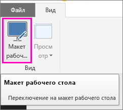
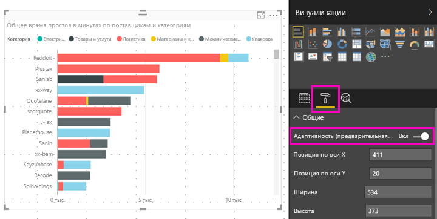

# Оптимизация визуальных элементов Power BI для любого размера
На панели мониторинга или в отчете можно настроить *адаптивность* визуальных элементов, чтобы они динамически изменялись, отображая как можно больше данных независимо от размера экрана.

При изменении размера визуального элемента Power BI определяет приоритеты в представлении данных — например, автоматически удаляет отступы и перемещает условные обозначения наверх, чтобы даже при уменьшении визуальный элемент оставался информативным. Адаптивность особенно важна для визуальных элементов, используемых в мобильном приложении Power BI на телефонах.

Вы можете включить адаптивность для любого визуального элемента с осями X и Y или срезами.

## Включение адаптивности в Power BI Desktop
1. В Power BI Desktop на вкладке **Представление** выберите **Макет рабочего стола**.
   
    
2. Выберите визуальный элемент, а затем в области **Визуализации** выберите раздел **Формат**.
3. Разверните раздел **Общие** и установите переключатель **Адаптивность (предварительная версия)** в положение **Вкл.**
   
    
   
     Теперь, когда вы добавите этот визуальный элемент в [отчет, оптимизированный для телефона](desktop-create-phone-report.md), его размер будет плавно изменяться.

## Включение адаптивности в службе Power BI
Включите адаптивность для визуального элемента отчета в службе Power BI. Для этого необходимо иметь права на изменение отчета.

1. В отчете в службе Power BI ([https://powerbi.com](https://powerbi.com)) выберите **Изменить отчет**.
2. Выберите визуальный элемент, а затем в области **Визуализации** выберите раздел **Формат**.
3. Разверните раздел **Общие** и установите переключатель **Адаптивность (предварительная версия)** в положение **Вкл.**
   
    
   
     Теперь, когда вы добавите этот визуальный элемент в [представление для телефона на панели мониторинга](service-create-dashboard-mobile-phone-view.md), его размер будет плавно изменяться.

## Дальнейшие действия
* [Создание отчетов, оптимизированных для мобильных приложений Power BI](desktop-create-phone-report.md)
* [Создание представления панели мониторинга для телефонов в Power BI](service-create-dashboard-mobile-phone-view.md)
* [Просмотр отчетов Power BI, оптимизированных для телефона](mobile-apps-view-phone-report.md)
* Появились дополнительные вопросы? [Попробуйте задать вопрос в сообществе Power BI.](http://community.powerbi.com/)

