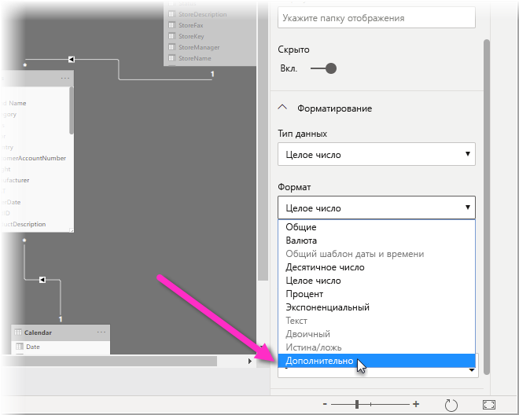
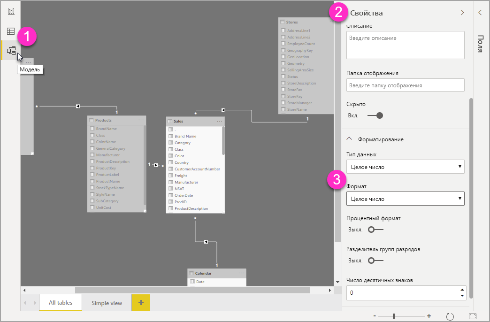

# Использование настраиваемых строк форматирования в Power BI Desktop

С помощью настраиваемых строк форматирования в **Power BI Desktop** вы можете настроить внешний вид полей в визуальных элементах и убедиться, что отчеты выглядят именно так, как вы хотите.

## Как использовать настраиваемые строки форматирования

Чтобы создать настраиваемые строки форматирования, выберите поле в представлении **Моделирование** и щелкните **Формат** на панели **Свойства**.

После того как вы выбрали вариант **Настраиваемое** в раскрывающемся списке **Формат**, вы можете выбрать из списка часто используемых строк форматирования. 

## Поддерживаемый синтаксис настраиваемого форматирования

Настраиваемые строки форматирования соответствуют стилю синтаксиса VBA, который является распространенным для Excel и других продуктов от Майкрософт, но не поддерживают все типы синтаксиса, используемого в других продуктах. 

В следующих таблицах представлен синтаксис, который поддерживается в Power BI.

В следующей таблице содержатся поддерживаемые **символы даты**:

| **Символ** | **Диапазон** |
| --- | --- |
| _d_ | 1–31 (день месяца без ноля в начале) |
| _dd_ | 01–31 (день месяца с нолем в начале) |
| _m_ | 1–12 (месяц года без ноля в начале, начиная с января = 1) |
| _mm_ | 01–12 (месяц года с нолем в начале, начиная с января =01) |
| _mmm_ | Отображаются сокращенные названия месяцев (названия месяцев исламского календаря не сокращаются) |
| _mmmm_ | Отображаются полные названия месяцев |
| _y_ | 1–366 (день года) |
| _yy_ | 00-99 (последние две цифры года) |
| _yyyy_ | 100–9999 (три или четыре цифры года) |

В следующей таблице содержатся поддерживаемые **символы времени**:

| **Символ** | **Диапазон** |
| --- | --- |
| _h_ | 0–23 (1–12 с добавлением &quot;AM&quot; или &quot;PM&quot;) (час дня без ноля в начале) |
| _hh_ | 00–23 (01–12 с добавлением &quot;AM&quot; или &quot;PM&quot;) (час дня с нолем в начале) |
| _n_ | 0–59 (минуты без ноля в начале) |
| _nn_ | 00–59 (минуты с нолем в начале) |
| _m_ | 0–59 (минуты без ноля в начале). Только если этому числу будет предшествовать _h_ или _hh_ |
| _mm_ | 00–59 (минуты с нолем в начале). Только если этому числу будет предшествовать _h_ или _hh_ |
| _s_ | 0–59 (секунды без ноля в начале) |
| _ss_ | 00–59 (секунды с нолем в начале) |

Вы можете увидеть [пример](https://docs.microsoft.com/office/vba/language/reference/user-interface-help/format-function-visual-basic-for-applications#example) форматирования строк пользовательских значений.

Пользовательское выражение формата для чисел может содержать от одного до трех разделов, разделенных точкой с запятой. Если вы добавите точки с запятыми, между которыми ничего нет, отсутствующий раздел не будет отображен (будет показано &quot;&quot;). Если точка с запятой не указана, будет использоваться положительный формат.

Ниже приведены примеры различных форматов для различных строк значений.

|   | **Строки форматирования** |   |   |   |
| --- | --- | --- | --- | --- |
| **Значения** | **0,00;–0,0;&quot;Ноль&quot;** | **0,00;;** | **0,00;–0,0;** | **0,00;** |
| **−1,234** | −1,2 | &quot;&quot; | −1,2 | &quot;&quot; |
| **0** | &quot;Ноль&quot; | &quot;&quot; | &quot;&quot; | 0,00 |
| **1,234** | 1,23 | 1,23 | 1,23 | 1,23 |

В следующей таблице приведены предопределенные **именованные форматы даты и времени**.

| **Имя формата** | **Описание** |
| --- | --- |
| **Общий формат даты** | Отображает дату и/или время (например, 4/3/93 05:34 PM). Если дробная часть отсутствует, отобразится только дата (например, 4/3/93). Если целая часть отсутствует, отобразится только время (например, 05:34 PM). Отображение даты определяется установленными параметрами системы. |
| **Полный формат даты** | Отображает дату в соответствии с полным форматом даты в системе. |
| **Краткий формат даты** | Отображает дату с использованием краткого формата даты в системе. |
| **Длинный формат времени** | Отображает время с использованием длинного формата времени в системе (включает часы, минуты, секунды). |
| **Краткий формат времени** | Отображает время, используя 24-часовой формат (например, 17:45). |

Именованные числовые форматы

В следующей таблице указаны предопределенные **именованные числовые форматы**.

| **Имя формата** | **Описание** |
| --- | --- |
| **Общий формат чисел** | Отображает число без разделителя групп разрядов. |
| **Денежный формат** | Отображает число с разделителем групп разрядов при необходимости. Отображает две цифры справа от десятичного разделителя. Выходные данные основываются на параметрах языкового стандарта системы. |
| **Фиксированный формат** | Отображает не менее одной цифры слева и двух цифр справа от десятичного разделителя. |
| **Стандартный формат** | Отображает число с разделителем групп разрядов. Не менее одной цифры слева и двух цифр справа от десятичного разделителя. |
| **Процентный формат** | Отображает число, умноженное на 100, со знаком процента ( **%** ), добавленным справа. Всегда отображает две цифры справа десятичного разделителя. |
| **Экспоненциальный формат** | Использует стандартное экспоненциальное представление чисел. |

В следующей таблице указаны символы, которые можно использовать для создания **пользовательских форматов даты/времени**.

| **Символ** | **Описание** |
| --- | --- |
| ( **:** ) | Разделитель времени. В некоторых языковых стандартах для представления разделителя времени могут использоваться другие символы. Разделитель времени разделяет часы, минуты и секунды при форматировании значений времени. Фактический символ, используемый в качестве разделителя времени в форматированных выходных данных, определяется установленными параметрами системы. |
| ( **/** ) | Разделитель даты. В некоторых языковых стандартах для представления разделителя даты могут использоваться другие символы. Разделитель даты разделяет день, месяц и год при форматировании значений времени. Фактический символ, используемый в качестве разделителя даты в форматированных выходных данных, определяется установленными параметрами системы. |
| d | Отображает день месяца в виде числа без ноля в начале (1–31). |
| dd | Отображает день месяца в виде числа с нолем в начале (01–31). |
| ddd | Отображает сокращенное название дня недели (вс–сб). Локализовано. |
| dddd | Отображает полное название дня недели (воскресенье–суббота). Локализовано. |
| М | Отображает месяц в виде числа без ноля в начале (1–12). Если m следует сразу после h или hh, отображаются минуты, а не месяц. |
| mm | Отображает месяц в виде числа с нолем в начале (01–12). Если m следует сразу после h или hh, отображаются минуты, а не месяц. |
| mmm | Отображает сокращенное название месяца (янв–дек). Локализовано. |
| mmmm | Отображает полное название месяца (январь–декабрь). Локализовано. |
| y | Отображает число дня года (1–366). |
| yy | Отображает 2-значное число года (00–99). |
| yyyy | Отображает 4-значное число года (100–9999). |
| h | Отображает время в виде числа без ноля в начале (0–23). |
| hh | Отображает время в виде числа с нолем в начале (00–23). |
| n | Отображает минуты в виде числа без ноля в начале (0–59). |
| nn | Отображает минуты в виде числа с нолем в начале (00–59). |
| с | Отображает секунды в виде числа без ноля в начале (0–59). |
| ss | Отображает секунды в виде числа с нолем в начале (00–59). |
| AM/PM | Используется 12-часовой формат времени. С любым значением времени до полудня отображаются прописные буквы AM, а с любым значением времени между полуднем и 23:59 (11:59) — прописные буквы PM. |

В следующей таблице указаны символы, которые можно использовать для создания **пользовательских числовых форматов**.

| **Символ** | **Описание** |
| --- | --- |
| Нет | Отображает число без форматирования. |
| (**0**) | Заполнитель цифр. Отображает цифру или ноль. Если выражение имеет цифру в позиции, где в строке форматирования указано значение 0, она отобразится. В противном случае в этой позиции отобразится ноль. Если число имеет меньше цифр, чем нолей (по обе стороны от десятичного разделителя) в выражении формата, отобразятся ноли в начале или конце. Если число имеет больше цифр справа от десятичного разделителя, чем нолей справа от десятичного разделителя в выражении формата, округлите число до такого количества знаков после запятой, которое равно количеству нолей. Если число имеет больше цифр слева от десятичного разделителя, чем нолей слева от десятичного разделителя в выражении формата, отобразите дополнительные цифры без изменений. |
| ( **#** ) | Заполнитель цифр. Отображает цифру или ничего. Если выражение имеет цифру в позиции, где знак # указан в строке форматирования, она отобразится. В противном случае в этой позиции ничего не отобразится. Этот символ аналогичен заполнителю цифры 0, за исключением того, что ноли в начале и конце не отображаются, если число имеет такое же или меньшее количество цифр, чем число символов # по обе стороны от десятичного разделителя в выражении формата. |
| ( **.** ) | Заполнитель десятичных чисел. В некоторых языковых стандартах в качестве десятичного разделителя используется запятая. Десятичный заполнитель определяет, сколько цифр отображается слева и справа от десятичного разделителя. Если выражение формата содержит только символы решетки слева от этого символа, числа меньше 1 начинаются с десятичного разделителя. Чтобы в начале дробных чисел отобразить ноль, используйте 0 в качестве заполнителя первой цифры слева от десятичного разделителя. Фактический символ, используемый в качестве десятичного заполнителя в форматированных выходных данных, зависит от числового формата, распознаваемого системой. |
| ( **%)** | Заполнитель процентов. Выражение умножается на 100. Символ процента ( **%** ) вставляется в позицию, где он отображается в строке форматирования. |
| ( **,** ) | Разделитель групп разрядов. В некоторых языковых стандартах в качестве разделителя групп разрядов используется запятая. Разделитель групп разрядов отделяет тысячи от сотен в числе, состоящем из четырех или более знаков слева от десятичного разделителя. Стандартное использование разделителя групп разрядов указывается, если формат содержит разделитель групп разрядов, окруженный заполнителями цифр (**0** или **#** ). Два смежных разделителя групп разрядов или один разделитель групп разрядов непосредственно слева от десятичного разделителя (независимо от того, указан ли десятичный знак) означают, что &quot;число необходимо масштабировать, разделив его на 1000, а затем при необходимости округлив.&quot; Например, вы можете использовать строку форматирования &quot;##0,,&quot;, чтобы представить 100 миллионов как 100. Числа меньше одного миллиона отображаются как 0. Два смежных разделителя групп разрядов в любой позиции, кроме непосредственно места слева от десятичного разделителя, рассматриваются просто как указание на использование разделителя групп разрядов. Фактический символ, используемый в качестве разделителя групп разрядов в форматированных выходных данных, зависит от числового формата, распознаваемого системой. |
| ( **:** ) | Разделитель времени. В некоторых языковых стандартах для представления разделителя времени могут использоваться другие символы. Разделитель времени разделяет часы, минуты и секунды при форматировании значений времени. Фактический символ, используемый в качестве разделителя времени в форматированных выходных данных, определяется установленными параметрами системы. |
| ( **/** ) | Разделитель даты. В некоторых языковых стандартах для представления разделителя даты могут использоваться другие символы. Разделитель даты разделяет день, месяц и год при форматировании значений времени. Фактический символ, используемый в качестве разделителя даты в форматированных выходных данных, определяется установленными параметрами системы. |
| (**E- E+ e- e+** ) | Экспоненциальный формат. Если выражение формата содержит хотя бы один заполнитель цифр (**0** или **#** ) справа от E-, E+, e- или e+, число отображается в экспоненциальном формате и E или e вставляется между числом и его показателем степени. Число заполнителей цифр справа определяет количество цифр в показателе степени. Используйте E- или e-, чтобы поместить знак "минус" рядом с отрицательными показателями степени. Используйте E+ или e+, чтобы поместить знак "минус" рядом с отрицательными показателями степени, а знак "плюс" рядом с положительными показателями. |
| **- + $** () | Отображает литеральный символ. Чтобы отобразить символ, который отличается от указанного в списке, поставьте перед ним обратную косую черту (\) или заключите его в двойные кавычки (&quot; &quot;). |
| (* *\** ) | Отображает следующий символ в строке форматирования. Чтобы отобразить символ, который имеет специальное значение в виде литерального символа, поставьте перед ним обратную косую черту (\). Сама по себе обратная косая черта не отображается. Использование обратной косой черты аналогично заключению следующего символа в двойные кавычки. Чтобы отобразить обратную косую черту, используйте две обратные косые черты (\\). Примерами символов, которые нельзя отобразить в виде литеральных символов, являются символы форматирования даты и времени (a, c, d, h, m, n, p, q, s, t, w, y, / и :), символы форматирования чисел (#, 0, %, E, e, запятая и точка) и символы форматирования строк (@, &amp;, \&lt;, \&gt; и !). |
| (&quot;ABC&quot;) | Отображает строку, заключенную в двойные кавычки (&quot; &quot;). |

## Дальнейшие действия
Рекомендуем также ознакомиться со следующими материалами:

* [Format function](https://docs.microsoft.com/office/vba/language/reference/user-interface-help/format-function-visual-basic-for-applications#example) (Функция форматирования)
* [Меры в Power BI Desktop](desktop-measures.md)
* [Типы данных в Power BI Desktop](desktop-data-types.md)
* [Условное форматирование в таблицах](desktop-conditional-table-formatting.md)

