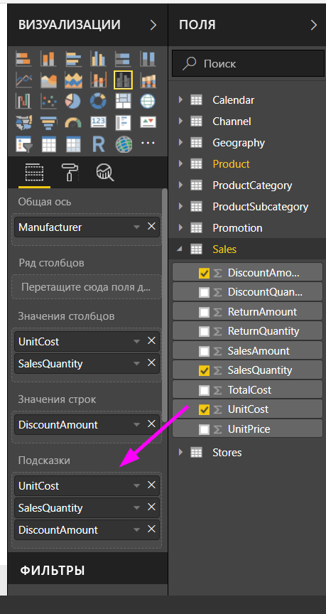
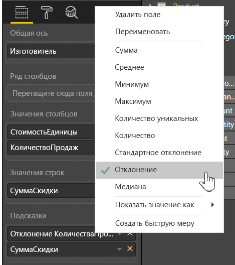

# Настройка подсказок в Power BI Desktop
Подсказки позволяют изящно показать дополнительную контекстную информацию и сведения о точках данных на визуальном элементе. На следующем рисунке показана подсказка на диаграмме в Power BI Desktop.

При создании визуализации подсказка по умолчанию отображает значение и категорию точки данных. Возможность настроить подсказку будет полезной во многих случаях, ведь так можно предоставить дополнительный контекст и информацию для пользователей, просматривающих визуальный элемент. С помощью настраиваемых подсказок можно указать дополнительные точки данных, отображаемые в подсказке.

## Как настроить подсказки
Чтобы создать настраиваемую подсказку, в разделе **Поля** области **Визуализации** просто перетащите поле в контейнер **Подсказки**, как показано на следующем рисунке. На приведенном ниже рисунке два поля были помещены в контейнер **Подсказки**.

Если после добавления подсказок в область полей навести указатель мыши на точку на визуализации, значения этих полей отобразятся в подсказке.

## Настройка подсказок со статистической функцией или быстрыми вычислениями
Можно выполнить дальнейшую настройку подсказки, выбрав статистическую функцию или *быстрое вычисление*. Для этого щелкните стрелку рядом с полем в контейнере **Подсказки** и выберите один из доступных параметров.

Существует много способов настроить **подсказки** с помощью любого поля, доступного в наборе данных, чтобы передать краткую информацию и аналитику пользователям, просматривающим информационные панели и отчеты.

