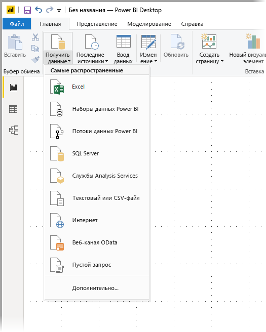
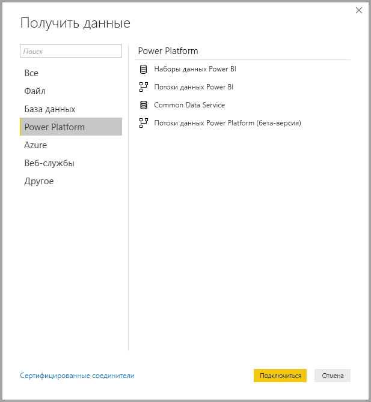
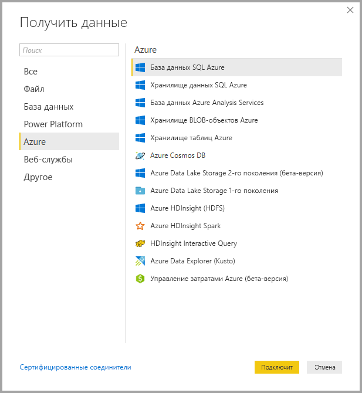
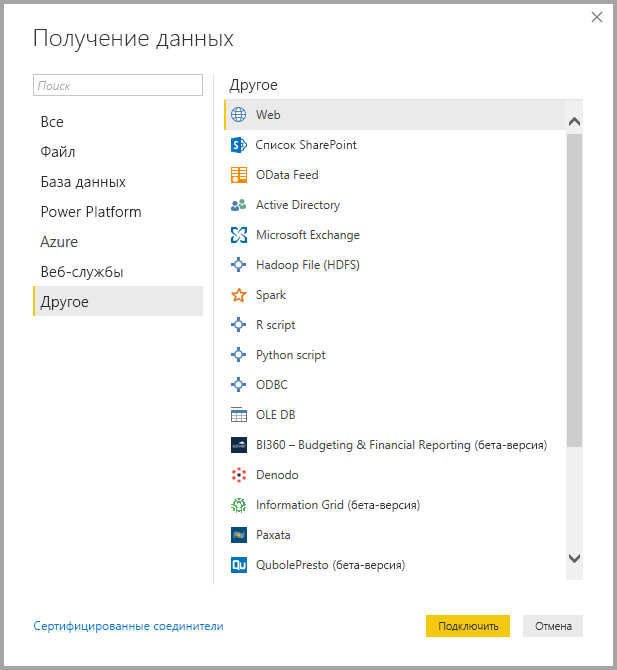
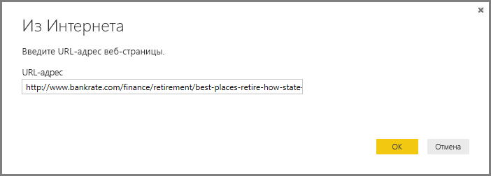
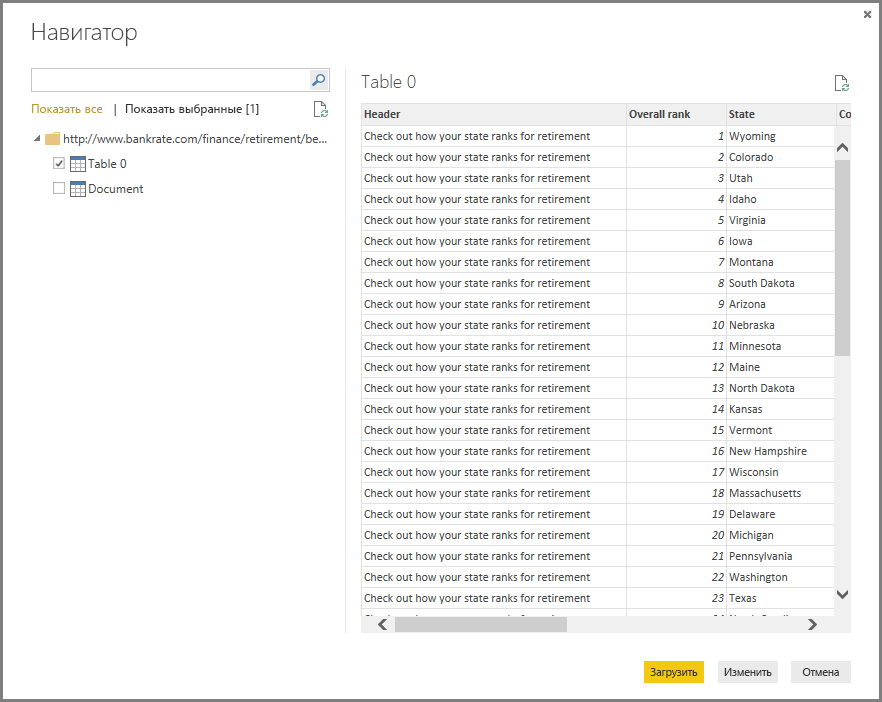

# <a name="data-sources-in-power-bi-desktop"></a>Источники данных в Power BI Desktop

Power BI Desktop позволяет подключаться к данным из многих разных источников. Полный список доступных источников данных см. в статье [Источники данных Power BI](power-bi-data-sources.md).

Для подключения к данным выберите **Получить данные** на ленте **Главная** . Если щелкнуть стрелку вниз или текст **Получить данные** на кнопке, откроется меню **Наиболее распространенные** с типами данных, как показано на следующем рисунке:



Если щелкнуть **Еще...** в меню **Наиболее распространенные**, отобразится окно **Получить данные**. Чтобы открыть окно **Получить данные** (в обход меню **Наиболее распространенные** ), можно сразу щелкнуть **кнопку со значком** **Получить данные** .


> [!NOTE]
> Команда разработчиков Power BI постоянно расширяет список источников данных, доступных для приложения **Power BI Desktop** и **службы Power BI**. Поэтому вы часто будете видеть ранние версии источников данных в процессе разработки с пометкой *Бета-версия* или *Предварительная версия*. Все источники данных с пометкой *Бета-версия* или *Предварительная версия* имеют ограниченную поддержку и функциональные возможности и не должны использоваться в рабочих средах. 

> Кроме того, любой источник данных, помеченный как *бета-версия* или *предварительная версия* для **Power BI Desktop**, может быть недоступен для использования в **службе Power BI** или других службах Майкрософт, пока не станет общедоступным (GA).

## <a name="data-sources"></a>Источники данных
Типы данных разделены на следующие категории:

* Все
* Файл
* База данных
* Power BI
* Azure
* Интернет-службы
* Другие

Категория **Все** включает все типы подключений данных из всех категорий.

Категория **Файл** предоставляет следующие подключения к данным:

* Excel
* Text/CSV.
* XML
* JSON
* Папка
* PDF
* Папка SharePoint

На следующем рисунке показано окно **Получить данные** для категории **Файл**.


Категория **База данных** предоставляет следующие подключения к данным:

* База данных SQL Server
* База данных Access
* База данных SQL Server Analysis Services
* База данных Oracle
* База данных IBM DB2
* База данных IBM Informix (бета-версия)
* IBM Netezza
* База данных MySQL
* База данных PostgreSQL
* База данных Sybase
* Teradata
* База данных SAP HANA
* Сервер приложений SAP Business Warehouse
* Сервер сообщений SAP Business Warehouse
* Amazon Redshift
* Impala
* Google BigQuery
* Vertica
* Снежинка
* Essbase
* Кубы AtScale (бета-версия)
* Соединитель BI
* Dremio
* Exasol
* Indexima (бета-версия)
* InterSystems IRIS (бета-версия)
* Jethro (бета-версия)
* Kyligence Enterprise (бета-версия)
* MarkLogic (бета-версия)

> [!NOTE]
> Некоторые соединители базы данных необходимо включить: выберите **Файл > Параметры и настройки > Параметры**, затем щелкните **Предварительная версия функций** и включите соединитель. Если некоторые из указанных выше соединителей не отображаются, а вы хотите их использовать, проверьте настройки параметра **Предварительная версия функций**. Также обратите внимание, что все источники данных с пометкой *Бета-версия* или *Предварительная версия* имеют ограниченную поддержку и функциональные возможности и не должны использоваться в рабочих средах.

На следующем рисунке показано окно **Получить данные** для категории **База данных**.


Категория **Power Platform** предоставляет следующие подключения к данным:

* Наборы данных Power BI
* Потоки данных Power BI
* Common Data Service
* Потоки данных Power Platform (бета-версия)

На следующем рисунке показано окно **Получение данных** для **Power Platform**.



Категория **Azure** предоставляет следующие подключения к данным:

* База данных SQL Azure
* Хранилище данных SQL Azure
* База данных Azure Analysis Services
* Хранилище BLOB-объектов Azure
* Хранилище таблиц Azure
* Azure Cosmos DB
* Azure Data Lake Storage 2-го поколения (бета-версия)
* Azure Data Lake Storage 1-го поколения
* Azure HDInsight (HDFS)
* Azure HDInsight Spark
* HDInsight Interactive Query
* Azure Data Explorer (Kusto)
* Управление затратами Azure (бета-версия)

На следующем рисунке показано окно **Получить данные** для категории **Azure**.



Категория **Интернет-службы** предоставляет следующие подключения к данным:

* Список SharePoint Online
* Microsoft Exchange Online
* Dynamics 365 (в сети)
* Dynamics NAV
* Dynamics 365 Business Central
* Dynamics 365 Business Central (локальный)
* Microsoft Azure Consumption Insights (бета-версия)
* Azure DevOps (бета-версия)
* Azure DevOps Server (бета-версия)
* Объекты SalesForce
* Отчеты SalesForce
* Google Analytics
* Adobe Analytics
* appFigures (бета-версия)
* Data.World — получение набора данных (бета-версия)
* Facebook
* GitHub (бета-версия)
* MailChimp (бета-версия)
* Merketo (бета-версия)
* Mixpanel (бета-версия)
* Planview Enterprise One — PRM (бета-версия)
* Planview Projectplace (бета-версия)
* QuickBooks Online (бета-версия)
* Smartsheet (бета-версия)
* SparkPost (бета-версия)
* Stripe (бета-версия)
* SweetIQ (бета-версия)
* Planview Enterprise One — CMT (бета-версия)
* Twilio (бета-версия)
* tyGraph (бета-версия)
* Webtrends (бета-версия)
* ZenDesk (бета-версия)
* Dynamics 365 Customer Insights (бета-версия)
* Источник данных Emigo (бета-версия)
* Entersoft Business Suite (бета-версия)
* Industrial App Store
* Хранилище данных Intune (бета-версия)
* Microsoft Graph Security (бета-версия)
* Quick Base
* TeamDesk (бета-версия)


На следующем рисунке показано окно **Получение данных** для категории **Интернет-службы**.


Категория **Другие** предоставляет следующие подключения к данным:

* Веб-приложение
* Список SharePoint
* Веб-канал OData
* Active Directory
* Microsoft Exchange
* Файл Hadoop (HDFS)
* Spark
* Сценарий R
* Скрипт Python
* ODBC
* OLE DB
* BI360 — отчеты по бюджетам и финансам (бета-версия)
* Denodo
* Information Grid (бета-версия)
* Paxata 
* QubolePresto (бета-версия)
* Roamler (бета-версия)
* SurveyMonkey (бета-версия)
* Tenforce (Smart)List (бета-версия)
* Workforce Dimensions (бета-версия)
* Пустой запрос

На следующем рисунке показано окно **Получение данных** для категории **Другие**.



> [!NOTE]
> Подключение к пользовательским источникам данных, полученным с помощью Azure Active Directory, сейчас не работает.

## <a name="connecting-to-a-data-source"></a>Подключение к источнику данных
Чтобы подключиться к источнику данных, выберите его в окне **Получение данных** и нажмите кнопку **Подключить**. На следующем рисунке выбран источник **Интернет** из категории подключения к данным **Другие** .


Отображается окно подключения, зависящее от типа подключения к данным. Если необходимы учетные данные, вам будет предложено ввести их. На следующем рисунке показан ввод URL-адреса для подключения к интернет-источнику данных.



После ввода URL-адреса или сведений о подключении ресурса нажмите кнопку **ОК**. Power BI Desktop устанавливает подключение к источнику данных и представляет доступные источники данных в области **Навигатор**.



Для загрузки данных можно нажать кнопку **Загрузить** внизу области **Навигатор** или редактировать запрос перед загрузкой данных, нажав кнопку **Изменить** .

Это вся информация о подключении к источникам данных в Power BI Desktop. Попробуйте подключиться к данным из нашего растущего списка источников данных и следите за новостями — список постоянно пополняется.

## <a name="using-pbids-files-to-get-data"></a>Использование файлов PBIDS для получения данных

Файлы PBIDS — это файлы Power BI Desktop с определенной структурой и расширением PBIDS, позволяющим определить их как файлы источника данных Power BI.

Вы можете создать PBIDS-файл, чтобы упростить **получение данных** для создателей отчетов в вашей организации. Рекомендуется, чтобы администраторы создавали эти файлы для часто используемых соединений. Это позволит упростить использование PBIDS-файлов для новых авторов отчетов. 

Когда автор открывает PBIDS-файл, Power BI Desktop открывает и запрашивает у пользователя учетные данные для проверки подлинности и подключения к источнику данных, указанному в файле. После этого откроется диалоговое окно навигации, где пользователь должен выбрать таблицы из этого источника данных для загрузки в модель. Пользователям также может потребоваться выбрать базы данных, если они не были указаны в PBIDS-файле. 

С этого момента пользователь может начать создавать визуализации или вернуться к *Недавним источникам*, чтобы загрузить новый набор таблиц в модель. 

В настоящее время PBIDS-файлы поддерживают только один источник данных в одном файле. При указании нескольких источников данных возникает ошибка. 

Чтобы создать PBIDS-файл, администраторы должны указать необходимые входные данные для одного подключения и могут указать режим подключения, например **DirectQuery** или **Import**. Если в файле отсутствует **режим** или он имеет значение null, то пользователю, открывающему файл в Power BI Desktop, предлагается выбрать DirectQuery или Import. 

### <a name="pbids-file-examples"></a>Примеры PBIDS-файлов

В этом разделе приводится несколько примеров из часто используемых источников данных. Тип PBIDS-файла поддерживает только подключения к данным, которые также поддерживаются в Power BI Desktop, с двумя исключениями: Live Connect и пустой запрос. 

PBIDS-файл *не* содержит информацию об аутентификации, таблицах и схемах.  

Ниже приведены несколько общих примеров PBIDS-файла, которые не являются полными или исчерпывающими. Информацию о протоколе и адресе для других источников данных см. в [разделе о формате ссылки на источник данных (DSR)](https://docs.microsoft.com/azure/data-catalog/data-catalog-dsr#data-source-reference-specification).

Эти примеры предназначены только для удобства. Они не являются исчерпывающими и не включают все поддерживаемые соединители в формате DSR. Используя эти примеры в качестве руководств, администраторы или организации могут создавать собственные источники данных, из которых они могут создавать и поддерживать собственные файлы источников данных. 


**Azure AS**
```
{ 
    "version": "0.1", 
    "connections": [ 
    { 
        "details": { 
        "protocol": "analysis-services", 
        "address": { 
            "server": "server-here" 
        }, 
        } 
    } 
    ] 
}
```


 

**Папка**
```
{ 
  "version": "0.1", 
  "connections": [ 
    { 
      "details": { 
        "protocol": "folder", 
        "address": { 
            "path": "folder-path-here" 
        } 
      } 
    } 
  ] 
} 
```

**OData**;
```
{ 
  "version": "0.1", 
  "connections": [ 
    { 
      "details": { 
        "protocol": "odata", 
        "address": { 
            "url": "URL-here" 
        } 
      } 
    } 
  ] 
} 
```
 
**SAP BW**
```
{ 
  "version": "0.1", 
  "connections": [ 
    { 
      "details": { 
        "protocol": "sap-bw-olap", 
        "address": { 
          "server": "server-name-here", 
          "systemNumber": "system-number-here", 
          "clientId": "client-id-here" 
        }, 
      } 
    } 
  ] 
} 
```
 
**SAP Hana**
```
{ 
  "version": "0.1", 
  "connections": [ 
    { 
      "details": { 
        "protocol": "sap-hana-sql", 
        "address": { 
          "server": "server-name-here:port-here" 
        }, 
      } 
    } 
  ] 
} 
```

**Список SharePoint**

URL-адрес должен указывать на сам сайт SharePoint, а не на список на сайте. Пользователи получают навигатор, позволяющий выбрать с этого сайта один или несколько списков, каждый из которых станет таблицей в модели. 
```
{ 
  "version": "0.1", 
  "connections": [ 
    { 
      "details": { 
        "protocol": "sharepoint-list", 
        "address": { 
          "url": "URL-here" 
        }, 
       } 
    } 
  ] 
} 
```
 
 
**SQL Server**
```
{ 
  "version": "0.1", 
  "connections": [ 
    { 
      "details": { 
        "protocol": "tds", 
        "address": { 
          "server": "server-name-here", 
          "database": "db-name-here (optional) "
        } 
      }, 
      "options": {}, 
      "mode": "DirectQuery" 
    } 
  ] 
} 
```
 

**Текстовый файл**
```
{ 
  "version": "0.1", 
  "connections": [ 
    { 
      "details": { 
        "protocol": "file", 
        "address": { 
            "path": "path-here" 
        } 
      } 
    } 
  ] 
} 
```
 

**Интернет**
```
{ 
  "version": "0.1", 
  "connections": [ 
    { 
      "details": { 
        "protocol": "http", 
        "address": { 
            "url": "URL-here" 
        } 
      } 
    } 
  ] 
} 
```
 

**Поток данных**
```
{
  "version": "0.1",
  "connections": [
    {
      "details": {
        "protocol": "powerbi-dataflows",
        "address": {
          "workspace":"workspace id (Guid)",
          "dataflow":"optional dataflow id (Guid)",
          "entity":"optional entity name"
        }
       }
    }
  ]
}
```


## <a name="next-steps"></a>Дальнейшие действия
Power BI Desktop предоставляет широкие возможности. Дополнительные сведения об этих возможностях см. в следующих ресурсах.

* [Что такое Power BI Desktop?](desktop-what-is-desktop.md)
* [Общие сведения о запросах в Power BI Desktop](desktop-query-overview.md)
* [Типы данных в Power BI Desktop](desktop-data-types.md)
* [Формирование и объединение данных в Power BI Desktop](desktop-shape-and-combine-data.md)
* [Общие задачи с запросами в Power BI Desktop](desktop-common-query-tasks.md)    
